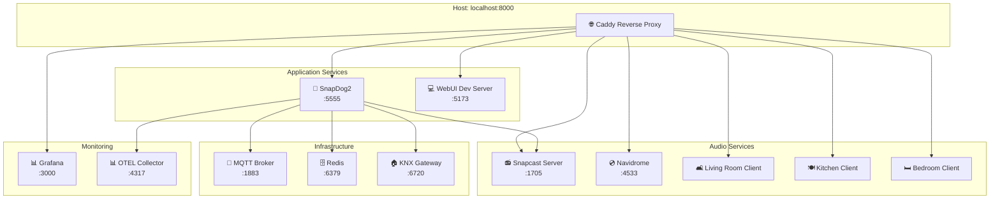
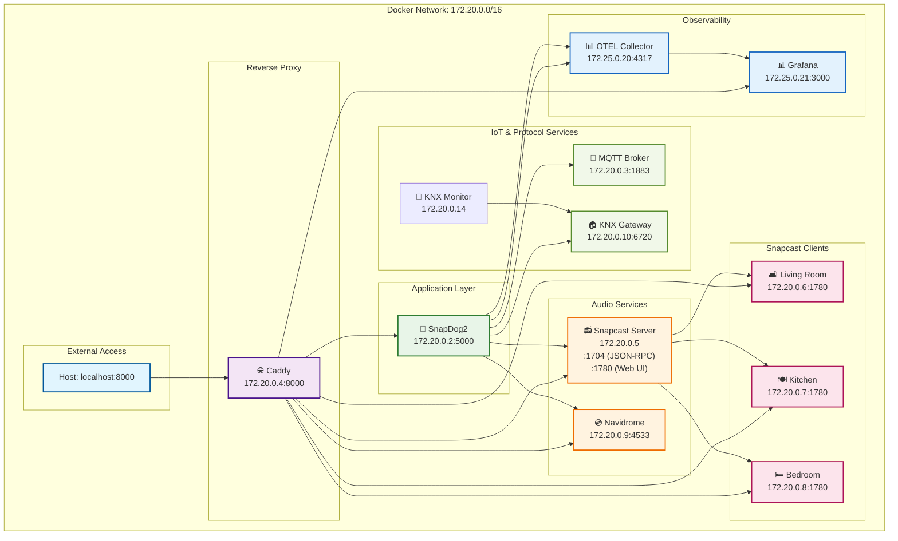

# SnapDog2

## Development Setup
- **Container Development**: Uses dotnet watch - no rebuild needed for code changes
- **Debugging**: `docker compose logs -f app` to watch live logs
- **Testing**: `docker compose up -d` starts full stack with Snapcast clients

## Current Fix Status
- **Zone Grouping Issue**: Fixed Client.ZoneIndex to read from _clientStates instead of static DefaultZone
- **Problem**: Manual client moves were being overridden by ZoneGrouping every 5 seconds
- **Solution**: Client wrapper now returns updated zone from AssignClientToZoneAsync
- **Testing**: Container uses dotnet watch - no rebuild needed for code changes


## Overview

SnapDog2 is an open-source .NET-based smart home automation API and controller platform. It provides endpoints for KNX, MQTT, and Snapcast services, designed with a modular, CQRS-driven architecture. This project is a work in progress; features may be broken or incomplete.

> [!WARNING]
> This is absolutely non-functional work in progress; it's not usable at the moment. Please give me some weeks!

## Development Environment

**Container-first development** with single-port access to all services via beautiful dashboard.

### Quick Start

```bash
# One-time setup
make dev-setup

# Start full development environment
make dev
```

**Access everything at:** <http://localhost:8000> 🎉

### Development Dashboard & Monitoring

The development environment provides a **unified dashboard** through Caddy reverse proxy:

| Service | URL | Purpose |
|---------|-----|---------|
| 🎵 **SnapDog2 WebUI** | <http://localhost:8000/webui> | Main application interface (dev container) |
| 📚 **API Documentation** | <http://localhost:8000/swagger> | Interactive API explorer |
| 🎵 **Snapcast Server** | <http://localhost:8000/server/> | Multi-room audio server |
| 💿 **Navidrome Music** | <http://localhost:8000/music/> | Music library & streaming |
| 🛋️ **Living Room Client** | <http://localhost:8000/clients/living-room/> | Audio client control |
| 🍽️ **Kitchen Client** | <http://localhost:8000/clients/kitchen/> | Audio client control |
| 🛏️ **Bedroom Client** | <http://localhost:8000/clients/bedroom/> | Audio client control |
| 📊 **Grafana Dashboards** | <http://localhost:8000/grafana/> | Metrics & monitoring |

> **Note**: In development mode, the WebUI runs in a separate container with Vite dev server and is served at `/webui`. In production, the WebUI will be embedded in the main app and served from root `/`.

### Direct Service Access (Development)

For debugging and direct access:

| Service | Port | Internal URL |
|---------|------|--------------|
| SnapDog2 API | 5555 | <http://localhost:5555> |
| Grafana | 3301 | <http://localhost:3301> |
| MQTT Broker | 1883 | `mqtt://localhost:1883` |
| Snapcast Server | 1705 | `tcp://localhost:1705` |

### Container Architecture



> **Development Architecture**: WebUI runs in separate container with Vite dev server at `/webui`. In production, WebUI will be embedded in the main app container and served from root `/`.

### Development Workflow

#### Daily Development
```bash
# Start everything
./dev.sh start

# Check what's running
./dev.sh status
./dev.sh urls

# Monitor logs (all services)
./dev.sh logs

# Monitor specific service
docker logs snapdog-app-1 -f

# Quick app restart (preserves other services)
./dev.sh restart-app

# Full restart
./dev.sh restart

# Stop everything
./dev.sh stop
```

#### Debugging & Troubleshooting

**Check Service Health:**
```bash
# Overall status
./dev.sh status

# Individual service logs
docker logs snapdog-app-1 -f          # Main app
docker logs snapdog-caddy-1 -f        # Reverse proxy
docker logs snapdog-snapcast-server-1 # Audio server
```

**Common Issues:**
- **502 Bad Gateway**: App container not responding → `./dev.sh restart-app`
- **Port conflicts**: Check if ports 8000/5555 are free → `lsof -i :8000`
- **Build errors**: Clean rebuild → `./dev.sh clean && ./dev.sh start`

**Network Debugging:**
```bash
# Test direct app access
curl http://localhost:5555/health

# Test reverse proxy
curl http://localhost:8000/api/health

# Check container networking
docker network inspect snapdog_default
```

## Code Quality & Git Hooks

This project uses **Husky.Net** for git hooks and **dotnet format** for code formatting.

### Pre-commit Hook
- ✅ **Code Formatting**: Runs `dotnet format` to ensure consistent code style
- ✅ **Build Verification**: Ensures code compiles before commit
- 🔄 **Auto-fix**: Automatically formats code if issues are found (requires re-commit)

### Pre-push Hook  
- ✅ **Test Execution**: Runs all tests before push to prevent broken builds
- ✅ **Build Verification**: Double-checks build before running tests

### Manual Commands

```bash
# Format code manually
dotnet format

# Check formatting without changes
dotnet format --verify-no-changes

# Run specific Husky.Net tasks
dotnet husky run --name format-check
dotnet husky run --name build
dotnet husky run --name test

# Run tasks by group
dotnet husky run --group code-quality
dotnet husky run --group build
```

## Development Commands

### 🏗️ Development

- `./dev.sh start` - Start full development environment
- `./dev.sh stop` - Stop all services
- `./dev.sh restart` - Quick restart
- `./dev.sh restart-app` - Restart only SnapDog2 app (fast code reload)
- `./dev.sh status` - Show status of all services
- `./dev.sh logs` - Show logs from all services

### 🧪 Testing & Building

- `./dev.sh test` - Run tests with services
- `./dev.sh build` - Build the application
- `./dev.sh clean` - Clean containers and volumes

### 🌐 Utilities

- `./dev.sh urls` - Show all service URLs

## Architecture



## Service Access

All services accessible through **single port 8000** via Caddy reverse proxy:

- **🎵 SnapDog2**: <http://localhost:8000>
- **🎵 Snapcast Server**: <http://localhost:8000/server/>
- **💿 Navidrome Music**: <http://localhost:8000/music/>
- **🛋️ Living Room Client**: <http://localhost:8000/clients/living-room/>
- **🍽️ Kitchen Client**: <http://localhost:8000/clients/kitchen/>
- **🛏️ Bedroom Client**: <http://localhost:8000/clients/bedroom/>
- **🔧 KNX Monitor**: Available via `docker compose logs knx-monitor -f` (visual KNX bus debugging)
- **📊 Grafana Observability**: <http://localhost:8000/grafana/> (metrics dashboards and monitoring)

## What's Included

### 🎵 Core Audio Services

- **Snapcast Server** - Multi-room audio streaming server
- **3x Snapcast Clients** - Living room, kitchen, bedroom (with fixed MACs)
- **Navidrome** - Subsonic-compatible music server
- **MQTT Broker** - IoT messaging for smart home integration
- **KNX Gateway** - Building automation protocol simulator

### 📊 Observability

- **Grafana** - Beautiful dashboards for metrics visualization and monitoring
- **OpenTelemetry Collector** - Collects and processes telemetry data (traces, metrics, logs)

### 🌐 Infrastructure

- **Caddy** - Reverse proxy with beautiful dashboard
- **Internal networking** - All services communicate via container network

## Development Features

- ✅ **Hot Reload** - Edit code locally, changes reload automatically in container
- ✅ **Internal Networking** - All services communicate via container network
- ✅ **Debugging Support** - Attach debugger to containerized application
- ✅ **Single Port Access** - Everything through beautiful dashboard at :8000
- ✅ **Volume Caching** - NuGet packages and source code cached for performance
- ✅ **Minimal Port Forwarding** - Only port 8000 exposed to host
- ✅ **Real Snapcast Clients** - Fixed MAC addresses for realistic testing

## VS Code Integration

### Container Development

1. **Install Extensions:**
   - Dev Containers
   - C# Dev Kit
   - Docker

2. **Debug Container App:**

   ```bash
   make dev
   # Then: Ctrl/Cmd+Shift+P -> "Dev Containers: Attach to Running Container"
   # Select: snapdog-snapdog-1
   # Set breakpoints and debug normally
   ```

## Daily Development Workflow

```bash
# Start everything
./dev.sh start

# View what's running
./dev.sh status
./dev.sh urls

# Monitor logs
./dev.sh logs

# When done
./dev.sh stop
```

### Testing Multi-Room Audio

```bash
# Start services and app
./dev.sh start

# Test with real Snapcast clients
curl http://snapcast-server:1704 -d '{"method":"Server.GetStatus","id":1}'

# Clients available at:
# Living Room: 172.20.0.6 (MAC: 02:42:ac:11:00:10)
# Kitchen:     172.20.0.7 (MAC: 02:42:ac:11:00:11)
# Bedroom:     172.20.0.8 (MAC: 02:42:ac:11:00:12)
```

## Prerequisites

- Docker and Docker Compose
- Make (for convenience commands)
- Git

## Troubleshooting

### Container Issues

```bash
# Check container logs
./dev.sh logs

# Rebuild containers
./dev.sh clean
./dev.sh start
```

## Why This Approach Works

✅ **Professional Setup** - Single port with beautiful dashboard
✅ **Realistic Testing** - Real Snapcast clients with MAC addresses
✅ **Internal Networking** - No localhost configuration needed
✅ **Hot Reload** - Edit code locally, auto-restart in container
✅ **Full Debugging** - VS Code debugger works perfectly
✅ **Isolated** - No system dependencies or port conflicts
✅ **Production-Like** - Same networking as production environment

## Documentation

- **Blueprints & Design**: [docs/blueprint](docs/blueprint/)
- **Implementation Details**: [docs/implementation](docs/implementation/)

## License

This project is licensed under the GNU LGPL v3.0. See [LICENSE](LICENSE) for details.
# Test commit for Husky.Net setup
