# SnapDog2


## Overview

SnapDog2 is an open-source .NET-based smart home automation API and controller platform. It provides endpoints for KNX, MQTT, and Snapcast services, designed with a modular, CQRS-driven architecture. This project is a work in progress; features may be broken or incomplete.

> [!WARNING]
> This is absolutely non-functional work in progress; it's not usable at the moment. Please give me some weeks!

## Development Environment

**Container-first development** with single-port access to all services via beautiful dashboard.

### Quick Start

```bash
# One-time setup
make dev-setup

# Start full development environment
make dev
```

**Access everything at:** <http://localhost:8000> 🎉

## Development Commands

### 🏗️ Development

- `./dev.sh start` - Start full development environment
- `./dev.sh stop` - Stop all services
- `./dev.sh restart` - Quick restart
- `./dev.sh status` - Show status of all services
- `./dev.sh logs` - Show logs from all services

### 🧪 Testing & Building

- `./dev.sh test` - Run tests with services
- `./dev.sh build` - Build the application
- `./dev.sh clean` - Clean containers and volumes

### 🌐 Utilities

- `./dev.sh urls` - Show all service URLs

## Architecture

```mermaid
graph TB
    subgraph "Docker Network: 172.20.0.0/16"
        subgraph "External Access"
            HOST[Host: localhost:8000]
        end
        
        subgraph "Reverse Proxy"
            CADDY["🌐 Caddy<br/>172.20.0.4:8000"]
        end
        
        subgraph "Application Layer"
            APP["🎵 SnapDog2<br/>172.20.0.2:5000"]
        end
        
        subgraph "Audio Services"
            SNAPSERVER["📻 Snapcast Server<br/>172.20.0.5<br/>:1704 (JSON-RPC)<br/>:1780 (Web UI)"]
            NAVIDROME["💿 Navidrome<br/>172.20.0.9:4533"]
        end
        
        subgraph "Snapcast Clients"
            LIVING["🛋️ Living Room<br/>172.20.0.6:1780"]
            KITCHEN["🍽️ Kitchen<br/>172.20.0.7:1780"]
            BEDROOM["🛏️ Bedroom<br/>172.20.0.8:1780"]
        end
        
        subgraph "IoT & Protocol Services"
            MQTT["📡 MQTT Broker<br/>172.20.0.3:1883"]
            KNX["🏠 KNX Gateway<br/>172.20.0.10:6720"]
            KNXMON["🔧 KNX Monitor<br/>172.20.0.14"]
        end
        
        subgraph "Observability"
            GRAFANA["📊 Grafana<br/>172.25.0.21:3000"]
            OTELCOL["📊 OTEL Collector<br/>172.25.0.20:4317"]
        end
    end
    
    %% External connections
    HOST --> CADDY
    
    %% Caddy reverse proxy routes
    CADDY --> APP
    CADDY --> SNAPSERVER
    CADDY --> NAVIDROME
    CADDY --> LIVING
    CADDY --> KITCHEN
    CADDY --> BEDROOM
    CADDY --> GRAFANA
    
    %% Application connections
    APP --> SNAPSERVER
    APP --> MQTT
    APP --> NAVIDROME
    APP --> KNX
    APP --> OTELCOL
    
    %% KNX Monitor connection
    KNXMON --> KNX
    
    %% Audio streaming
    SNAPSERVER --> LIVING
    SNAPSERVER --> KITCHEN
    SNAPSERVER --> BEDROOM
    
    %% Observability flows
    APP --> OTELCOL
    OTELCOL --> GRAFANA
    
    %% Styling
    classDef external fill:#e1f5fe,stroke:#01579b,stroke-width:2px
    classDef proxy fill:#f3e5f5,stroke:#4a148c,stroke-width:2px
    classDef app fill:#e8f5e8,stroke:#2e7d32,stroke-width:2px
    classDef audio fill:#fff3e0,stroke:#ef6c00,stroke-width:2px
    classDef client fill:#fce4ec,stroke:#ad1457,stroke-width:2px
    classDef iot fill:#f1f8e9,stroke:#558b2f,stroke-width:2px
    classDef monitoring fill:#e3f2fd,stroke:#1565c0,stroke-width:2px
    
    class HOST external
    class CADDY proxy
    class APP app
    class SNAPSERVER,NAVIDROME audio
    class LIVING,KITCHEN,BEDROOM client
    class MQTT,KNX iot
    class GRAFANA,OTELCOL monitoring
```



## Service Access

All services accessible through **single port 8000** via Caddy reverse proxy:

- **🎵 SnapDog2**: <http://localhost:8000>
- **🎵 Snapcast Server**: <http://localhost:8000/server/>
- **💿 Navidrome Music**: <http://localhost:8000/music/>
- **🛋️ Living Room Client**: <http://localhost:8000/clients/living-room/>
- **🍽️ Kitchen Client**: <http://localhost:8000/clients/kitchen/>
- **🛏️ Bedroom Client**: <http://localhost:8000/clients/bedroom/>
- **🔧 KNX Monitor**: Available via `docker compose logs knx-monitor -f` (visual KNX bus debugging)
- **📊 Grafana Observability**: <http://localhost:8000/grafana/> (metrics dashboards and monitoring)

## What's Included

### 🎵 Core Audio Services

- **Snapcast Server** - Multi-room audio streaming server
- **3x Snapcast Clients** - Living room, kitchen, bedroom (with fixed MACs)
- **Navidrome** - Subsonic-compatible music server
- **MQTT Broker** - IoT messaging for smart home integration
- **KNX Gateway** - Building automation protocol simulator

### 📊 Observability

- **Grafana** - Beautiful dashboards for metrics visualization and monitoring
- **OpenTelemetry Collector** - Collects and processes telemetry data (traces, metrics, logs)

### 🌐 Infrastructure

- **Caddy** - Reverse proxy with beautiful dashboard
- **Internal networking** - All services communicate via container network

## Development Features

- ✅ **Hot Reload** - Edit code locally, changes reload automatically in container
- ✅ **Internal Networking** - All services communicate via container network
- ✅ **Debugging Support** - Attach debugger to containerized application
- ✅ **Single Port Access** - Everything through beautiful dashboard at :8000
- ✅ **Volume Caching** - NuGet packages and source code cached for performance
- ✅ **Minimal Port Forwarding** - Only port 8000 exposed to host
- ✅ **Real Snapcast Clients** - Fixed MAC addresses for realistic testing

## VS Code Integration

### Container Development

1. **Install Extensions:**
   - Dev Containers
   - C# Dev Kit
   - Docker

2. **Debug Container App:**

   ```bash
   make dev
   # Then: Ctrl/Cmd+Shift+P -> "Dev Containers: Attach to Running Container"
   # Select: snapdog-snapdog-1
   # Set breakpoints and debug normally
   ```

## Daily Development Workflow

```bash
# Start everything
./dev.sh start

# View what's running
./dev.sh status
./dev.sh urls

# Monitor logs
./dev.sh logs

# When done
./dev.sh stop
```

### Testing Multi-Room Audio

```bash
# Start services and app
./dev.sh start

# Test with real Snapcast clients
curl http://snapcast-server:1704 -d '{"method":"Server.GetStatus","id":1}'

# Clients available at:
# Living Room: 172.20.0.6 (MAC: 02:42:ac:11:00:10)
# Kitchen:     172.20.0.7 (MAC: 02:42:ac:11:00:11)
# Bedroom:     172.20.0.8 (MAC: 02:42:ac:11:00:12)
```

## Prerequisites

- Docker and Docker Compose
- Make (for convenience commands)
- Git

## Troubleshooting

### Container Issues

```bash
# Check container logs
./dev.sh logs

# Rebuild containers
./dev.sh clean
./dev.sh start
```

## Why This Approach Works

✅ **Professional Setup** - Single port with beautiful dashboard
✅ **Realistic Testing** - Real Snapcast clients with MAC addresses
✅ **Internal Networking** - No localhost configuration needed
✅ **Hot Reload** - Edit code locally, auto-restart in container
✅ **Full Debugging** - VS Code debugger works perfectly
✅ **Isolated** - No system dependencies or port conflicts
✅ **Production-Like** - Same networking as production environment

## Documentation

- **Blueprints & Design**: [docs/blueprint](docs/blueprint/)
- **Implementation Details**: [docs/implementation](docs/implementation/)

## License

This project is licensed under the GNU LGPL v3.0. See [LICENSE](LICENSE) for details.
# Test commit for Husky.Net setup
