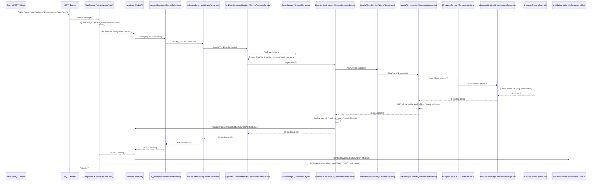
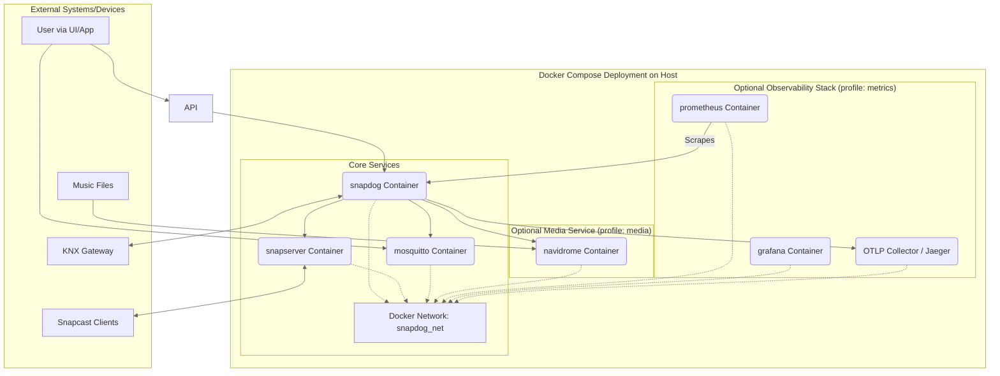

# 1 Introduction

## 1.1 Purpose

SnapDog2 is engineered as a sophisticated and comprehensive **multi-zone audio management system**. Its primary function is to serve as a central control plane within a modern smart home environment, specifically designed to orchestrate audio playback across various physically distinct areas or "zones". It acts as an intelligent bridge connecting diverse audio sources – encompassing popular **music streaming services** (via protocols like Subsonic), **internet radio stations**, and **local media files** – with a **Snapcast server** infrastructure responsible for synchronized, multi-room audio output.

Beyond basic playback management, a core design goal of SnapDog2 is seamless integration into broader smart home ecosystems. This is achieved through robust support for standard automation protocols, primarily **MQTT** for flexible, topic-based messaging and eventing, and **KNX** for direct integration with established building automation systems. This allows SnapDog2's audio functionalities to become integral parts of home automation scenes, routines, and control interfaces.

## 1.2 Core Objectives

The development of SnapDog2 is guided by the following fundamental objectives:

1. **Unified Audio Management**: Establish a single, cohesive system capable of discovering, managing, controlling, and monitoring audio playback across multiple independent or synchronized zones within a home. This includes managing sources, playlists, volume levels (per zone and per client), and playback states (Play, Pause, Stop).
2. **Smart Home Integration**: Provide seamless, bidirectional communication with common home automation platforms and protocols. This involves receiving commands and publishing detailed status updates via **MQTT** topics and **KNX** group addresses, allowing audio control to be integrated into dashboards, automations, and physical switches.
3. **Flexible Media Sources**: Design the system to support a variety of audio sources beyond basic file playback. Initial support targets **Subsonic API compatible servers** (like Navidrome, Airsonic, etc.) for personal media libraries and configurable **internet radio streams**. The architecture should allow for the addition of further source types (e.g., Spotify Connect, UPnP/DLNA) in the future.
4. **Diverse User Control Options**: Enable users and external systems to interact with SnapDog2 through multiple standardized interfaces. This includes control via **MQTT** messages, **KNX** telegrams, a well-defined **RESTful HTTP API**, and potentially future interfaces like voice assistants (requiring separate integration layers).
5. **Reliable & Resilient Operation**: Engineer the application for stability suitable for continuous, **24/7 operation** within a home environment. This necessitates robust error handling (using the Result pattern internally), automatic recovery from transient network or external service failures (using Polly resilience policies), and clear logging for diagnostics.
6. **Extensibility & Maintainability**: Implement a modular software architecture (CQRS with MediatR, clear layering) that simplifies maintenance and allows for future expansion. Adding support for new audio sources, communication protocols, or features should be achievable with minimal disruption to existing functionality. Clean code conventions and comprehensive testing support this goal.

## 1.3 Target Use Cases

SnapDog2 is designed to address several common smart home audio scenarios:

* **Multi-Room Audio Playback**: Enabling users to play the same music perfectly synchronized across multiple rooms (e.g., party mode) or play different audio streams independently in different zones (e.g., news in the kitchen, music in the living room) using Snapcast clients (like Raspberry Pis with DACs connected to amplifiers/speakers).
* **Smart Home Scene Integration**: Integrating audio control directly into home automation routines. Examples include:
  * Automatically playing a "Welcome Home" playlist in specific zones when the user arrives.
  * Including "Pause Audio" actions in "Movie Night" scenes.
  * Gradually increasing volume in the bedroom as part of a "Wake Up" alarm sequence.
  * Muting audio zones automatically when a doorbell or phone call is detected (via MQTT/KNX events).
* **Centralized Entertainment Hub**: Acting as the primary control point for music playback, accessible through various smart home interfaces (wall panels using MQTT/KNX, mobile apps via the REST API, voice assistants via custom integrations).
* **IoT & Programmatic Audio Control**: Allowing other applications or scripts on the local network to control audio playback programmatically using well-defined protocols (MQTT, REST API), enabling custom integrations or advanced automation scenarios beyond typical smart home platforms.

---

# 2 Coding Style & Conventions

## 2.1 Overview

This foundational chapter meticulously defines the mandatory coding standards, style guidelines, and development conventions for the SnapDog2 project. Adherence to these standards is paramount to ensure a high degree of code consistency, maintainability, readability, and overall quality throughout the application's lifecycle. SnapDog2 is built utilizing the **.NET 9.0 framework** and embraces the **latest stable C# language features** where they enhance clarity, performance, and developer productivity.

The application employs a **monolithic server project structure** (`SnapDog2.csproj`). While contained within a single project, a strict logical separation into distinct layers is maintained through the disciplined use of **folders and corresponding namespaces** (`Core`, `Server`, `Infrastructure`, `Api`, `Worker`). This approach promotes modularity and testability while simplifying the solution setup.

Code quality and style consistency are rigorously enforced through a multi-pronged strategy:

* **Static Analysis**: Industry-standard analyzers, specifically **StyleCop Analyzers** and **SonarAnalyzer**, are integrated directly into the build process via NuGet packages referenced in the main project file. These analyzers automatically detect deviations from configured style rules and potential code quality issues, providing immediate feedback to developers within the IDE and failing the build in the CI pipeline if violations occur. Configuration is managed centrally via `stylecop.json` and `.editorconfig`.
* **Documentation**: Comprehensive API documentation is **mandatory**. All public types (classes, interfaces, structs, records, enums, delegates) and public members (methods, properties, events, fields) **must** include well-formed XML documentation comments (`<summary>`, `<param>`, `<returns>`, `<typeparam>`, etc.). This requirement is enforced programmatically by setting the `<GenerateDocumentationFile>true</GenerateDocumentationFile>` property in the `SnapDog2.csproj` file and enabling relevant StyleCop documentation rules (SA1600+). The build process should treat missing documentation warnings as errors unless an explicit suppression with clear justification is provided.
* **Automated Formatting**: A root `.editorconfig` file, located at the solution level, defines and enforces fundamental code formatting rules, including indentation style, line endings, spacing preferences, and more. Developers are required to utilize automated code formatting tools integrated into their IDE (e.g., Visual Studio's Format Document feature, Rider's cleanup profiles) or command-line tools like `dotnet format` to ensure submitted code strictly adheres to these formatting standards.

## 2.2 General Conventions

These overarching principles guide the development process and architectural choices:

* **Framework & Language**: Target **.NET 9.0**. Actively utilize modern and appropriate **C# language features** (currently C# 12/13 features available in the .NET 9 SDK) such as primary constructors, collection expressions, `required` members, file-scoped namespaces, enhanced pattern matching, `record` types, etc., prioritizing clarity, conciseness, and performance benefits.
* **Immutability**: Strongly favor immutable data structures wherever possible. This applies particularly to Data Transfer Objects (DTOs) used in the API layer, configuration models, MediatR messages (Commands, Queries, Notifications), and internal state representations (`ZoneState`, `ClientState`). Use C# `record` types with `init`-only properties as the default mechanism for achieving immutability. Updates to state objects within services must be performed immutably by creating *new* state record instances using `with` expressions, rather than modifying existing objects in place.
* **Asynchronous Programming**: Employ `async`/`await` **mandatorily** for all operations that are potentially I/O-bound, including network communication (HTTP calls, MQTT, KNX, Snapcast control), file system interactions (logging sinks, configuration loading if applicable), and any future database operations. Strictly avoid `async void` methods, with the sole exception being top-level event handlers directly subscribing to external library events where the event signature dictates `void` return (e.g., `SnapcastClient.ClientConnected += MyHandler;`). Even in such cases, the handler body must contain comprehensive `try/catch` blocks to prevent unhandled exceptions from terminating the process. Consistently use `ConfigureAwait(false)` on awaited `Task` and `ValueTask` instances within the `/Infrastructure` and `/Core` layers to prevent deadlocks by avoiding unnecessary capturing and resuming on the original synchronization context. Ensure `CancellationToken` parameters are accepted and passed down through asynchronous call chains wherever feasible to support cooperative cancellation.
* **Error Handling**: Strict adherence to the **Result Pattern** (defined canonically in Section 5.1 using `Result` and `Result<T>`) is **mandatory** for all methods that represent operations which might fail due to predictable operational reasons (e.g., external service unavailable after retries, invalid input not caught by validation, business rule violation, resource not found). Exceptions must **never** be used for normal control flow or to signal expected failure conditions across internal component boundaries (between `Server`, `Infrastructure`, `Api` layers). Use `try/catch` blocks **only** at the lowest level of interaction with external systems or libraries (typically within `/Infrastructure` services) where the external code might throw exceptions. Any caught exception must be immediately logged with relevant context and converted into a `Result.Failure(ex)` object, which is then returned up the call stack for controlled handling by the caller. Unhandled exceptions should only occur in truly exceptional, unrecoverable circumstances (e.g., critical configuration missing at startup, out-of-memory) and should result in application termination after logging.
* **Dependency Injection**: Exclusively utilize .NET's built-in Dependency Injection container (`Microsoft.Extensions.DependencyInjection`). Define abstractions (interfaces) in the `/Core/Abstractions` folder. Implement these interfaces in the appropriate layer (`/Infrastructure` for external service interactions, `/Server` for core application logic services/managers). Register all services with their correct lifetimes (typically `Singleton` for stateless services, state repositories like `SnapcastStateRepository`, and configuration options; `Scoped` if request-specific context is needed, e.g., within API request handling; `Transient` for lightweight, stateless services like MediatR handlers and validators) within dedicated extension methods organized by layer or feature in the `/Worker/DI` folder. These extensions are called from `Program.cs`. Strictly favor **constructor injection** for resolving dependencies. Avoid service locator anti-patterns.
* **Logging**: Implement all application logging using the `Microsoft.Extensions.Logging` abstractions (`ILogger<T>`). **Mandatory** use of the **LoggerMessage Source Generator pattern** (detailed in Section 1.5) for all log messages to ensure maximum performance (by avoiding runtime boxing and formatting) and compile-time checking of log messages and parameters. **Serilog** is the configured concrete logging provider (backend) as detailed in Section 5.2. Logs must be structured and include relevant context, including Trace IDs and Span IDs provided by OpenTelemetry integration (Section 13) for correlation.
* **Disposal**: Correctly implement `IAsyncDisposable` (preferred for async cleanup) or `IDisposable` for any class that manages unmanaged resources (e.g., network connections, file handles, native library contexts like LibVLC) or subscribes to events from external or long-lived objects to prevent memory leaks. Implement the standard dispose pattern robustly. In public methods of disposable classes, check the disposal state at the beginning using `ObjectDisposedException.ThrowIf(this.disposed, this);` to provide immediate feedback on incorrect usage.
* **Null Handling**: Enable nullable reference types project-wide via `<Nullable>enable</Nullable>` in `SnapDog2.csproj`. All code must be null-aware. Eliminate compiler warnings related to nullability by explicitly handling potential `null` values using appropriate checks (`is not null`), pattern matching (`is { }`), null-conditional operators (`?.`), null-coalescing operators (`??`), or parameter/property validation. Use the `required` modifier for non-nullable properties in DTOs and configuration classes where initialization is mandatory. Avoid using the null-forgiving operator (`!`) unless it is absolutely necessary and its safety can be guaranteed and justified with a code comment.
* **Encapsulation**: Design components within logical layers (folders) to be highly cohesive (related responsibilities grouped together) and loosely coupled (interactions through interfaces/messages). Strictly adhere to the dependency rule: code should only depend inwards towards the `/Core` layer. `/Infrastructure` depends on `/Core`. `/Server` depends on `/Core`. `/Api` depends on `/Server` and `/Core`. `/Worker` depends on all other layers for composition. Use the `internal` access modifier for types and members that are not intended to be used outside their defining logical component or layer (assembly in this single-project case) to minimize the public API surface and enforce boundaries.

## 2.3 Formatting and Layout

These rules ensure visual consistency and readability. Primarily enforced by `.editorconfig` and StyleCop Analyzers.

* **Indentation**: Use **4 spaces** per indentation level. **Do not use tabs**. (`.editorconfig`: `indent_style = space`, `indent_size = 4`, `tab_width = 4`).
* **Braces**: Use **Allman style** braces, where the opening and closing braces are placed on their own lines, aligned with the preceding code block statement. Braces are **required** for all control flow blocks (`if`, `else`, `for`, `foreach`, `while`, `do`, `using`, `lock`, `try`, `catch`, `finally`), even if the block contains only a single statement (StyleCop SA1503, SA1519, SA1520).

    ```csharp
    // Correct Allman style with required braces
    if (someCondition)
    {
        ExecuteAction();
    }
    else
    {
        LogWarning("Condition not met.");
    }

    foreach (var item in collection)
    {
        ProcessItem(item);
    }
    ```

* **Line Length**: Target a maximum line length of **120 characters**. Enforced via `.editorconfig` (`max_line_length = 120`). Long lines should be broken after operators or commas, indented appropriately on subsequent lines to maintain readability.
* **Spacing**: Adhere strictly to StyleCop SA10xx rules:
  * Single space after keywords (`if`, `for`, `while`, `switch`, `catch`, etc.) and before opening parenthesis (`if (condition)`).
  * Single space around binary operators (`=`, `+`, `-`, `==`, `=>`, etc.).
  * No space after opening or before closing parentheses/brackets (`Method(arg1, arg2)`, `array[index]`).
  * Single space after commas in argument/parameter lists, array initializers, etc.
  * No space before commas or semicolons.
  * Specific rules apply around unary operators, type casts, generic brackets, etc. (Refer to SA10xx rule documentation).
* **`using` Directives**: Place all `using` directives **inside** the `namespace` declaration (StyleCop SA1200 configured via `stylecop.json`). Order directives as follows: `System.*` namespaces first, then other external library namespaces (e.g., `Microsoft.*`, `Knx.*`, `MediatR.*`), finally own project namespaces (`SnapDog2.*`). Within each group, directives must be sorted alphabetically by namespace (StyleCop SA1208, SA1210). Utilize **global usings** (`/Worker/GlobalUsings.cs`) for extremely common namespaces used throughout the application (e.g., `System`, `System.Collections.Generic`, `System.Linq`, `System.Threading.Tasks`, `SnapDog2.Core.Models`).

    ```csharp
    // Example: /Infrastructure/Knx/KnxService.cs
    namespace SnapDog2.Infrastructure.Knx; // File-scoped namespace

    // Usings INSIDE namespace, System first, then external, then internal, alphabetical within groups
    using System;
    using System.Collections.Concurrent;
    using System.Collections.Generic;
    using System.Linq;
    using System.Net;
    using System.Text.RegularExpressions;
    using System.Threading;
    using System.Threading.Tasks;

    using Knx.Falcon; // External library namespaces
    using Knx.Falcon.Configuration;
    using Knx.Falcon.Discovery;
    using Knx.Falcon.KnxnetIp;
    using Knx.Falcon.Sdk;
    using MediatR;
    using Microsoft.Extensions.Logging;
    using Microsoft.Extensions.Options;
    using Polly;
    using Polly.Retry;

    using SnapDog2.Core.Abstractions; // Own project namespaces
    using SnapDog2.Core.Configuration;
    using SnapDog2.Core.Models;
    using SnapDog2.Infrastructure.Resilience; // If policies are here
    using SnapDog2.Server.Notifications; // Referencing notifications

    /// <summary>
    /// KNX Service Implementation.
    /// </summary>
    public partial class KnxService : IKnxService, IAsyncDisposable
    {
        // ... code ...
    }
    ```

* **File Organization**: Strictly one public type (class, interface, struct, enum, record, delegate) per file (SA1402). The filename must match the public type name exactly, including casing (SA1649). Use **file-scoped namespaces** (`namespace MyNamespace;`) as the default (C# 10+).
* **Blank Lines**: Use single blank lines judiciously to separate logical blocks of code (e.g., between methods, between property definitions, between fields and constructors, within methods to separate complex steps). Avoid multiple consecutive blank lines (SA1516, SA1517). Follow specific StyleCop rules for blank lines around braces and comments (SA1505, SA1508, SA1512, SA1513, etc.).

## 2.4 Naming Conventions

Consistent naming is crucial for readability and understanding code intent.

* **Types** (`class`, `struct`, `record`, `enum`, `delegate`, `interface`): Use `PascalCase`. Interfaces **must** be prefixed with `I` (SA1302).
  * Examples: `ZoneManager`, `PlaybackStatus`, `TrackInfo`, `IZoneService`, `VolumeChangedHandler`.
* **Methods** (Synchronous and Asynchronous), **Properties**, **Events**: Use `PascalCase`. Asynchronous methods (returning `Task` or `ValueTask`) **must** have the `Async` suffix.
  * Examples: `GetZoneStateAsync`, `Volume`, `PlaybackStateChanged`, `ConnectAsync`, `InitializeMediaPlayer`.
* **Public Fields** (Generally discouraged; use Properties), **Public Constants (`public const`)**: Use `PascalCase`.
  * Example: `public const int DefaultTimeoutMilliseconds = 10000;`.
* **Local Variables**, **Method Parameters**: Use `camelCase`. Names should be descriptive. Avoid single-letter variables except in very small scopes (e.g., LINQ lambdas `x => x.Id`, short loops `for(int i=0;...)`).
  * Examples: `int currentVolume`, `string playlistId`, `CancellationToken cancellationToken`.
* **Private/Protected Fields**: Use `_camelCase` (prefix `_`, then camelCase, enforced by SX1309). This clearly distinguishes instance fields.
  * Examples: `private readonly ILogger<MyClass> _logger;`, `private SemaphoreSlim _stateLock;`.
* **Static Readonly Fields**: Use `PascalCase` if they represent logical constants or are publicly accessible (rare). Use `_camelCase` if they are private implementation details (more common).
* **Constants (`private const`, `internal const`)**: Use `PascalCase` (SA1303).
  * Example: `private const string RadioPlaylistId = "radio";`.
* **Type Parameters** (Generics): Use `TPascalCase` (prefix `T`, then descriptive PascalCase name, SA1314).
  * Examples: `Result<TResponse>`, `IRequestHandler<TCommand, TResult>`, `List<TZoneConfig>`.
* **Abbreviations**: Treat common acronyms (2-3 letters) as words unless only two letters. Capitalize only the first letter or keep all caps if standard (like `IO`). Prefer full words over abbreviations where clarity is improved.
  * Correct: `HtmlParser`, `GetZoneId`, `UseApiAuth`, `IoService`.
  * Incorrect: `HTMLParser`, `GetZoneID`, `UseAPIAuth`.
* **Hungarian Notation**: Strictly forbidden for all identifiers (variables, fields, parameters, etc.) (SA1305, SA1309). Do not use prefixes indicating type (e.g., `strName`, `iCount`, `bEnabled`).

## 2.5 Logging (LoggerMessage Source Generator Pattern)

Logging is performed exclusively through the `Microsoft.Extensions.Logging.ILogger<T>` interface, injected via constructor. The **LoggerMessage Source Generator pattern is mandatory** for defining log messages to ensure high performance and compile-time validation.

1. **Declare Class as `partial`:** The class using the logger must be declared `partial`.
2. **Inject `ILogger<T>`:** Inject the logger via the constructor.
3. **Define `partial void` Methods:** For each distinct log message, define a `private partial void` method.
4. **Decorate with `[LoggerMessage]`:** Apply the `LoggerMessage` attribute to the partial method.
    * `EventId`: Assign a unique integer ID within the class/component for structured filtering. Consider a convention (e.g., 1xx for Class A, 2xx for Class B).
    * `Level`: Specify the appropriate `LogLevel` (Trace, Debug, Information, Warning, Error, Critical).
    * `Message`: Define the log message template using curly brace placeholders (`{PlaceHolderName}`). Placeholder names should match method parameter names.
5. **Method Signature:** Define parameters matching the placeholders in the `Message` string, using specific types (e.g., `int`, `string`, `Guid`). Include an `Exception` parameter if the log should capture exception details.
6. **Call Generated Method:** Invoke the defined partial method directly in your code where the log event should occur, passing the required arguments.

```csharp
// Example within /Server/Managers/ClientManager.cs
namespace SnapDog2.Server.Managers;

using System;
using System.Collections.Concurrent;
using System.Threading;
using System.Threading.Tasks;
using MediatR;
using Microsoft.Extensions.Logging;
using SnapDog2.Core.Abstractions;
using SnapDog2.Core.Models;
using SnapDog2.Server.Notifications; // For publishing internal events

/// <summary>
/// Manages Snapcast clients and their relationship to SnapDog2 zones.
/// Must be declared partial for LoggerMessage generation.
/// </summary>
public partial class ClientManager : IClientManager, // Implements Core abstraction
                                     INotificationHandler<SnapcastClientConnectedNotification>, // Handles MediatR notification
                                     IAsyncDisposable
{
    private readonly ISnapcastService _snapcastService;
    private readonly IMediator _mediator;
    private readonly ILogger<ClientManager> _logger;
    private readonly ISnapcastStateRepository _stateRepository; // Read raw state
    // Internal state mapping (example - adjust as needed)
    private readonly ConcurrentDictionary<string, int> _snapcastIdToInternalId = new();
    private readonly ConcurrentDictionary<int, ClientState> _internalClientStates = new();
    private readonly ConcurrentDictionary<string, int> _lastKnownZoneAssignment = new(); // snapcastId -> zoneId
    private readonly SemaphoreSlim _stateLock = new SemaphoreSlim(1, 1);
    private bool _disposed = false;

    // --- LoggerMessage Definitions ---
    [LoggerMessage(EventId = 301, Level = LogLevel.Information, Message = "Initializing ClientManager. Discovering initial clients...")]
    private partial void LogInitializing();

    [LoggerMessage(EventId = 302, Level = LogLevel.Error, Message = "Failed to discover initial Snapcast clients.")]
    private partial void LogDiscoveryError(Exception ex);

    [LoggerMessage(EventId = 303, Level = LogLevel.Information, Message = "Discovered {ClientCount} initial Snapcast clients.")]
    private partial void LogDiscoveryComplete(int clientCount);

    [LoggerMessage(EventId = 304, Level = LogLevel.Information, Message = "Handling SnapcastClientConnected event for SnapcastId {SnapcastId}. Client Name: {ClientName}")]
    private partial void LogHandlingClientConnected(string snapcastId, string clientName);

    [LoggerMessage(EventId = 305, Level = LogLevel.Information, Message = "Handling SnapcastClientDisconnected event for SnapcastId {SnapcastId}.")]
    private partial void LogHandlingClientDisconnected(string snapcastId);

    [LoggerMessage(EventId = 306, Level = LogLevel.Information, Message = "Client {SnapcastId} (Internal ID: {InternalId}) updated/added.")]
    private partial void LogClientUpdated(string snapcastId, int internalId);

    [LoggerMessage(EventId = 307, Level = LogLevel.Warning, Message = "Could not find internal mapping for Snapcast Client {SnapcastId} during update.")]
    private partial void LogMappingNotFoundWarning(string snapcastId);

    [LoggerMessage(EventId = 308, Level = LogLevel.Information, Message = "Assigning Client (Internal ID: {InternalId}, Snapcast ID: {SnapcastId}) to Zone {ZoneId}.")]
    private partial void LogAssigningClientToZone(int internalId, string snapcastId, int zoneId);

    [LoggerMessage(EventId = 309, Level = LogLevel.Error, Message = "Failed to assign Client {InternalId} to Zone {ZoneId}.")]
    private partial void LogAssignClientError(int internalId, int zoneId, Exception? ex = null); // Optional exception


    public ClientManager(
        ISnapcastService snapcastService,
        IMediator mediator,
        ISnapcastStateRepository stateRepository,
        ILogger<ClientManager> logger /*, List<ClientConfig> clientConfigs */)
    {
        _snapcastService = snapcastService;
        _mediator = mediator;
        _stateRepository = stateRepository;
        _logger = logger;
        // Potentially load default zone assignments from ClientConfig here
    }

    public async Task InitializeAsync(CancellationToken cancellationToken)
    {
        LogInitializing();
        try
        {
            // Fetch initial full state to populate repository if SnapcastService doesn't do it
            // Alternatively, rely on SnapcastService populating the State Repository
            var initialClients = _stateRepository.GetAllClients(); // Get initial state
            int count = 0;
            await _stateLock.WaitAsync(cancellationToken).ConfigureAwait(false);
            try
            {
                foreach (var client in initialClients)
                {
                    UpdateInternalClientState(client); // Update internal mappings/state
                    count++;
                }
            }
            finally { _stateLock.Release(); }

            LogDiscoveryComplete(count);
        }
        catch(Exception ex)
        {
            LogDiscoveryError(ex);
            // Decide if this is fatal? Maybe throw?
        }
    }

    // Example Notification Handler
    public async Task Handle(SnapcastClientConnectedNotification notification, CancellationToken cancellationToken)
    {
        ObjectDisposedException.ThrowIf(_disposed, this);
        LogHandlingClientConnected(notification.Client.Id, notification.Client.Config.Name);
        await _stateLock.WaitAsync(cancellationToken).ConfigureAwait(false);
        try
        {
            UpdateInternalClientState(notification.Client); // Update state based on event

            // Re-assign to last known zone if needed (Option B logic)
            if (_lastKnownZoneAssignment.TryGetValue(notification.Client.Id, out int lastZoneId))
            {
                 var currentGroup = _stateRepository.GetAllGroups().FirstOrDefault(g => g.Clients.Any(c => c.Id == notification.Client.Id));
                 if(currentGroup == null) // Only assign if not already in a group
                 {
                      LogAssigningClientToZone( /* Get internal ID */ -1, notification.Client.Id, lastZoneId);
                      // Call AssignClientToZoneAsync (needs internal ID lookup first)
                      // var assignResult = await AssignClientToZoneAsync(internalId, lastZoneId).ConfigureAwait(false);
                      // if(assignResult.IsFailure) LogAssignClientError(...);
                 }
            }
        }
        finally { _stateLock.Release(); }
    }

    // Helper to update internal state and mappings (needs lock externally)
    private void UpdateInternalClientState(Sturd.SnapcastNet.Models.Client snapClient)
    {
         int internalId;
         if(!_snapcastIdToInternalId.TryGetValue(snapClient.Id, out internalId))
         {
              // Assign new internal ID (use Interlocked or ensure lock)
              internalId = _snapcastIdToInternalId.Count + 1; // Simplistic ID generation - NEEDS IMPROVEMENT
              _snapcastIdToInternalId.TryAdd(snapClient.Id, internalId);
         }

         // Create/Update SnapDog2 ClientState record (using mapping logic)
         var clientState = MapSnapClientToClientState(internalId, snapClient);
         _internalClientStates[internalId] = clientState;

         // Update last known zone if client is in a group
          var group = _stateRepository.GetAllGroups().FirstOrDefault(g => g.Clients.Any(c => c.Id == snapClient.Id));
          if(group != null && _zoneManager.TryGetZoneIdByGroupId(group.Id, out int zoneId)) { // Assume ZoneManager has TryGet method
               _lastKnownZoneAssignment[snapClient.Id] = zoneId;
               // Update ZoneId in _internalClientStates record if different
               if(clientState.ZoneId != zoneId) {
                    _internalClientStates[internalId] = clientState with { ZoneId = zoneId };
               }
          } else {
               // Client is not in a known group, remove last known assignment?
               // Or keep it for reconnection logic? Keep it for now.
               // Ensure ZoneId is null in internal state if not in a group
                if(clientState.ZoneId != null) {
                    _internalClientStates[internalId] = clientState with { ZoneId = null };
               }
          }

         LogClientUpdated(snapClient.Id, internalId);
    }

     // Mapping function - needs access to _zoneManager or similar for GroupID->ZoneID mapping
     private ClientState MapSnapClientToClientState(int internalId, Sturd.SnapcastNet.Models.Client snapClient)
     {
          // ... Mapping logic ...
          return new ClientState { Id = internalId, /* map other fields */ ZoneId = null /* Determine ZoneID */};
     }


     // ... other IClientManager methods ...
     // ... DisposeAsync ...
}
```

## 2.6 Disposal Pattern

Use `IAsyncDisposable`/`IDisposable`. Check state using `ObjectDisposedException.ThrowIf`.

```csharp
namespace SnapDog2.Infrastructure.Knx; // File-scoped namespace

using System;
using System.Threading;
using System.Threading.Tasks;
using Microsoft.Extensions.Logging;
using Knx.Falcon.Sdk;

/// <summary>
/// Service for interacting with the KNX bus. Implements IAsyncDisposable for proper cleanup.
/// Must be declared partial to support LoggerMessage source generation.
/// </summary>
public partial class KnxService : IAsyncDisposable // Partial for logging
{
    private bool _disposed = false; // Backing field for disposed state
    private readonly ILogger<KnxService> _logger;
    private KnxBus? _bus; // Example resource to dispose, nullable
    private readonly SemaphoreSlim _connectionLock = new SemaphoreSlim(1, 1);
    private readonly CancellationTokenSource _serviceStoppingCts = new CancellationTokenSource();
    private Timer? _discoveryRetryTimer;

    // Define logger messages using attributes.
    [LoggerMessage(9001, LogLevel.Debug, Message = "Checking disposal state for KnxService.")]
    private partial void LogDisposalCheck();
    [LoggerMessage(9002, LogLevel.Information, Message = "Disposing KnxService resources.")]
    private partial void LogDisposing();
    [LoggerMessage(9003, LogLevel.Error, Message = "Error during KnxService disposal.")]
    private partial void LogDisposeError(Exception ex);

    // ... Constructor ...

    /// <summary>
    /// Example public asynchronous method performing KNX operations.
    /// </summary>
    /// <param name="cancellationToken">Cancellation token.</param>
    /// <returns>A task representing the asynchronous operation.</returns>
    public async Task PublicMethodAsync(CancellationToken cancellationToken)
    {
        // LogDisposalCheck(); // Optional: Log the check if useful for debugging.
        ObjectDisposedException.ThrowIf(_disposed, this); // Check disposed status at method entry.

        // ... method implementation using _bus ...
        await Task.Delay(10, cancellationToken).ConfigureAwait(false); // Example async work
    }

    /// <summary>
    /// Performs application-defined tasks associated with freeing, releasing, or resetting unmanaged resources asynchronously.
    /// </summary>
    /// <returns>A ValueTask representing the disposal operation.</returns>
    public async ValueTask DisposeAsync()
    {
        if (_disposed) return; // Prevent double disposal.
        LogDisposing(); // Log the start of disposal.
        _disposed = true; // Set flag early to prevent race conditions.

        // Signal cancellation to ongoing operations like connection retries
        _serviceStoppingCts.Cancel();

        // Dispose managed resources that implement IDisposable/IAsyncDisposable
        _discoveryRetryTimer?.Dispose();
        _connectionLock.Dispose();
        _serviceStoppingCts.Dispose();

        // Dispose the KnxBus resource asynchronously
        try
        {
            if (_bus != null)
            {
                 // Unhook event handlers carefully to avoid issues if already disconnected/disposed
                 try { _bus.ConnectionStateChanged -= OnConnectionStateChanged; } catch { /* Ignore potential errors during unsubscription */ }
                 try { _bus.GroupMessageReceived -= OnGroupValueReceived; } catch { /* Ignore */ }
                 try { _bus.GroupReadReceived -= OnGroupReadReceived; } catch { /* Ignore */ }

                 // Attempt to gracefully disconnect if possible
                 if (_bus.ConnectionState == BusConnectionState.Connected) {
                     try {
                          // Use a short timeout for disconnection during disposal
                          using var cts = new CancellationTokenSource(TimeSpan.FromSeconds(2));
                          await _bus.DisconnectAsync(cts.Token).ConfigureAwait(false);
                     } catch (Exception disconnectEx) {
                          LogDebug("Exception during KNX bus disconnect on dispose: {Message}", disconnectEx.Message); // Log disconnect issues as debug
                     }
                 }
                 // Dispose the bus itself
                 await _bus.DisposeAsync().ConfigureAwait(false);
            }
        }
        catch (Exception ex)
        {
            LogDisposeError(ex); // Log errors during disposal but do not throw.
        }
        finally
        {
             _bus = null; // Allow garbage collection.
        }

        GC.SuppressFinalize(this); // Suppress finalization if IDisposable pattern is correctly implemented.
    }

    // Placeholder event handlers needed for Dispose cleanup
     private void OnConnectionStateChanged(object? sender, EventArgs e) { }
     private void OnGroupValueReceived(object? sender, Knx.Falcon.GroupEventArgs e) { }
     private void OnGroupReadReceived(object? sender, Knx.Falcon.GroupEventArgs e) { }

     // Example of another log message definition
     [LoggerMessage(9004, LogLevel.Debug, "Exception during KNX bus disconnect on dispose: {Message}")]
     private partial void LogDebug(string message, params object[] args);
}
```

## 2.7 StyleCop Enforcement Summary

Enforced via `stylecop.json` / build: Public API Docs (SA1600+), File Headers (SA1633), Usings inside namespace (SA1200), Member Order (SA1201+), Naming (SA13xx, SX1309), Spacing (SA10xx), Readability (SA11xx, SX1101), Layout/Braces (SA15xx), Maintainability (SA14xx).

## 2.8 StyleCop Configuration (`stylecop.json`)

```json
{
  "$schema": "https://raw.githubusercontent.com/DotNetAnalyzers/StyleCopAnalyzers/master/StyleCop.Analyzers/StyleCop.Analyzers/Settings/stylecop.schema.json",
  "settings": {
    "documentationRules": {
      "companyName": "Fabian Schmieder",
      "copyrightText": "// <copyright file=\"{filename}\" company=\"Fabian Schmieder\">\n// This file is part of SnapDog2.\n//\n// SnapDog2 is free software: you can redistribute it and/or modify\n// it under the terms of the GNU General Public License as published by\n// the Free Software Foundation, either version 3 of the License, or\n// (at your option) any later version.\n//\n// SnapDog2 is distributed in the hope that it will be useful,\n// but WITHOUT ANY WARRANTY; without even the implied warranty of\n// MERCHANTABILITY or FITNESS FOR A PARTICULAR PURPOSE. See the\n// GNU General Public License for more details.\n//\n// You should have received a copy of the GNU General Public License\n// along with SnapDog. If not, see https://www.gnu.org/licenses/.\n// </copyright>",
      "xmlHeader": false,
      "fileNamingConvention": "stylecop",
      "documentInternalElements": false
    },
    "orderingRules": {
      "usingDirectivesPlacement": "insideNamespace",
      "systemUsingDirectivesFirst": true
    },
    "namingRules": {
      "allowedHungarianPrefixes": [],
      "allowCommonHungarianPrefixes": false,
       "includeInferredTupleElementNames": true,
       "tupleElementNameCasing": "PascalCase"
    },
     "readabilityRules": {
       "allowBuiltInTypeAliases": false
     },
    "maintainabilityRules": {
        "topLevelTypes": ["class", "interface", "struct", "enum", "delegate", "record"]
    },
    "layoutRules": {
      "newlineAtEndOfFile": "require",
       "allowConsecutiveUsings": false
    },
     "indentation": {
        "indentationSize": 4,
        "tabSize": 4,
        "useTabs": false
    }
  }
}
```

---

# 3 System Architecture

## 3.1 High-Level Architecture

SnapDog2 employs a **modular, service-oriented architecture** designed for maintainability, testability, and extensibility, contained within a **single .NET project structure** (`SnapDog2.csproj`). Logical separation between concerns is achieved through disciplined use of folders and namespaces (`Core`, `Server`, `Infrastructure`, `Api`, `Worker`). The architecture leverages the **Command Query Responsibility Segregation (CQRS)** pattern, facilitated by the **MediatR** library, to decouple command/query dispatch from handling logic. This approach coordinates the various services and infrastructure adapters required to manage multi-zone audio playback via Snapcast and integrate with external systems like Subsonic, MQTT, and KNX.

The key architectural principles guiding the design are:

* **Modularity & Encapsulation**: Components are organized into logical layers (folders/namespaces). Interactions occur primarily through interfaces defined in the `Core` layer and via MediatR messages (`IRequest`, `INotification`), minimizing direct dependencies between concrete implementations in different layers. Infrastructure adapters (MQTT, KNX, API, Snapcast, Subsonic) are designed to be potentially replaceable or removable with minimal impact on the core server logic.
* **Dependency Rule**: Dependencies flow inwards. `Infrastructure`, `Server`, and `Api` layers depend on `Core`. `Server` depends only on `Core` abstractions, not concrete `Infrastructure` implementations. `Api` depends on `Server` (for MediatR messages) and `Core`. `Worker` (the composition root) depends on all layers for registration.
* **CQRS Pattern**: MediatR is used to separate Commands (actions intended to change state, implementing `IRequest<Result>`) and Queries (requests to retrieve data, implementing `IRequest<Result<T>>`) from their respective Handlers located in the `Server` layer. This simplifies handler logic and promotes separation.
* **Asynchronous Communication**: The system relies heavily on `async`/`await` for I/O operations. MediatR facilitates asynchronous command/query handling. Internal eventing and state propagation between loosely coupled components occur via MediatR `INotification` messages.
* **Clear State Management**: A distinction is made between SnapDog2's internal application state (`ClientState`, `ZoneState` records managed by `/Server` components) and the raw, last-known state received from the Snapcast server (held in the `SnapcastStateRepository` within `/Infrastructure`). See Section 4 for details.

### 3.1.1 Component Diagram (Logical Layers in Single Project)

This diagram illustrates the logical separation and dependencies between the different parts of the application, even though they reside within a single project.

```mermaid
graph TD
    subgraph "External Systems"
        MQTT[MQTT Broker]:::extern
        KNX[KNX Gateway]:::extern
        SUB[Subsonic Server]:::extern
        SNAP[Snapcast Server]:::extern
        AUDIO[Other Audio Sources]:::extern
    end

    subgraph "Entry/Exit Points (Folders: /Api, /Infrastructure)"
        style EntryPoints fill:#FCE5CD,stroke:#333
        API[Api Layer (/Api)]:::entry
        MQTTAdapter[MqttService (/Infrastructure/Mqtt)]:::entry
        KNXAdapter[KnxService (/Infrastructure/Knx)]:::entry
    end

    subgraph "Server Layer (Folder: /Server)"
        style ServerLayer fill:#C9DAF8,stroke:#333
        MBUS[MediatR Bus]:::server
        Pipeline[Pipeline Behaviors (/Server/Behaviors)]:::server
        Handlers[Cmd/Query/Notif Handlers (/Server/Features)]:::server
        CoreManagers[Core Managers (Zone/Client/Playlist) (/Server/Managers)]:::server
    end

     subgraph "Core Layer (Folder: /Core)"
         style CoreLayer fill:#D9EAD3,stroke:#333
         Abstractions[Interfaces (ISnapcastService, etc) (/Core/Abstractions)]:::core
         DomainModels[State Records (ZoneState, etc) (/Core/Models)]:::core
         ResultPattern[Result<T> (/Core/Models)]:::core
         ConfigurationModels[Options Records (KnxOptions, etc) (/Core/Configuration)]:::core
         Enums[Enums (PlaybackStatus, etc) (/Core/Enums)]:::core
     end

    subgraph "Infrastructure Layer (Folder: /Infrastructure)"
        style InfrastructureLayer fill:#FFF2CC,stroke:#333
        InfraServices[Service Implementations (SnapcastService, KnxService, SubsonicService, MediaPlayerService)]:::infra
        StateRepos[State Repositories (SnapcastStateRepository)]:::infra
        ExternalLibs[(Sturd.SnapcastNet, Falcon.KNX, MQTTnet, SubSonicMedia, LibVLCSharp, Polly, Serilog, OTel Libs)]:::infra_lib
        Metrics[Metrics Service Impl]:::infra
        Logging[Logging Sink Config]:::infra
        Resilience[Resilience Policies]:::infra
    end

    %% Flow Definitions
    ExternalSystems -->|Network Protocols| EntryPoints
    EntryPoints -->|Send MediatR Request| MBUS
    MBUS -->|Request Handling Pipeline| Pipeline
    Pipeline -->|Dispatch to Handler| Handlers
    Handlers -->|Use Case Logic| CoreManagers
    Handlers -->|Depends on| Abstractions
    Handlers -->|Read State| StateRepos
    CoreManagers -->|Depends on| Abstractions
    InfraServices -- implements --> Abstractions
    InfraServices -->|Uses Libraries| ExternalLibs
    InfraServices -->|Communicates With| ExternalSystems
    StateRepos -->|Uses Library Models| ExternalLibs
    StateRepos -- updated by --> InfraServices %% SnapcastService updates Repo

    %% Notification Flow Definitions
    CoreManagers -- publishes --> MBUS
    MBUS -->|Dispatch Notification| Handlers %% (Notification Handlers)
    Handlers -->|Call Infrastructure Abstraction| Abstractions
    Abstractions -- implemented by --> InfraServices
    InfraServices -->|Sends External Update| EntryPoints

    %% Metrics Flow
    Pipeline -->|Reports Metrics| Metrics

    classDef core fill:#D9EAD3,stroke:#333
    classDef server fill:#C9DAF8,stroke:#333
    classDef entry fill:#FCE5CD,stroke:#333
    classDef infra fill:#FFF2CC,stroke:#333
    classDef infra_lib fill:#EAD1DC,stroke:#333
    classDef extern fill:#EFEFEF,stroke:#666
```

### 3.1.2 Communication Flow Example (MQTT Play Command)

This sequence illustrates how an external command flows through the layers:



## 3.2 Key Components (Roles within Folders)

### 3.2.1 `/Core` Layer

Contains the foundational, dependency-free elements of the application.

* **Abstractions (`/Core/Abstractions`)**: Defines interfaces (`IZoneManager`, `IClientManager`, `ISnapcastService`, `IMqttService`, `IKnxService`, `ISubsonicService`, `IMediaPlayerService`, `ISnapcastStateRepository`, `IMetricsService`) that decouple the `Server` layer from specific `Infrastructure` implementations.
* **Domain Models (`/Core/Models`)**: Defines immutable `record` types representing the application's view of state (`ZoneState`, `ClientState`), data structures (`TrackInfo`, `PlaylistInfo`), and shared patterns (`Result`, `Result<T>`, `ErrorDetails`).
* **Configuration Models (`/Core/Configuration`)**: Defines strongly-typed `record` or `class` structures (`SnapcastOptions`, `KnxOptions`, `ZoneConfig`, etc.) used to load configuration settings (See Section 10).
* **Enums (`/Core/Enums`)**: Defines application-specific enumerations (e.g., `PlaybackStatus`, `CommandSource`, `KnxConnectionType`).

### 3.2.2 `/Server` Layer

Contains the core application logic, orchestration, and features. Depends only on `/Core`.

* **MediatR Handlers (`/Server/Features/*`)**: Implement `IRequestHandler<TCommand, TResponse>` and `IRequestHandler<TQuery, TResponse>`. Contain the main business logic for executing commands and fulfilling queries. Orchestrate calls to Managers and Infrastructure Abstractions. Organized by feature/domain area (e.g., `/Zones`, `/Clients`). Includes `ZoneService` implementation.
* **Core Managers (`/Server/Managers`)**: Classes like `ZoneManager`, `ClientManager`, `PlaylistManager` encapsulate logic related to managing collections of core entities, handling lifecycle events, maintaining internal mappings (e.g., SnapDog ID <-> Snapcast ID), and coordinating complex operations. They interact with Infrastructure via abstractions.
* **MediatR Messages (`/Server/Features/.../Commands`, `/Server/Features/.../Queries`, `/Server/Notifications`)**: Definitions of the `IRequest` (Commands/Queries) and `INotification` types used for communication via the MediatR bus.
* **Pipeline Behaviors (`/Server/Behaviors`)**: Implement `IPipelineBehavior<,>` for cross-cutting concerns like Logging, Validation, Performance Monitoring applied to MediatR requests.
* **Validation (`/Server/Features/.../Validators`)**: Contains FluentValidation `AbstractValidator<T>` classes for specific MediatR commands or API request DTOs.

### 3.2.3 `/Infrastructure` Layer

Provides concrete implementations for `/Core` abstractions and handles all external interactions. Depends only on `/Core` and external libraries.

* **Service Implementations (`/Infrastructure/{Snapcast|Knx|Mqtt|Subsonic|Media}`)**: Concrete classes implementing interfaces like `ISnapcastService`, `IKnxService`, etc. These classes contain the specific code to interact with external libraries (`Sturd.SnapcastNet`, `Knx.Falcon.Sdk`, `MQTTnet`, `SubSonicMedia`, `LibVLCSharp`) and external systems. They incorporate resilience policies (Polly) and translate external library exceptions/results into the application's `Result` pattern.
* **State Repositories (`/Infrastructure/Snapcast`)**: Holds the last known state from external systems, like `SnapcastStateRepository` holding raw `Sturd.SnapcastNet` models updated via events from `SnapcastService`.
* **Observability (`/Infrastructure/Observability`)**: Implementation of `IMetricsService` using OpenTelemetry `Meter`, configuration extensions for OpenTelemetry setup (`AddSnapDogObservability`).
* **Resilience (`/Infrastructure/Resilience`)**: Definition of common Polly policies (`ResiliencePolicies`).
* **Logging (`/Infrastructure/Logging`)**: Potentially custom Serilog enrichers or sinks if needed (though configuration is usually in `/Worker`).
* **Helpers (`/Infrastructure`)**: Utility classes like `EnvConfigHelper` for configuration loading.

### 3.2.4 `/Api` Layer

Handles HTTP requests and responses. Depends on `/Server` and `/Core`.

* **Controllers (`/Api/Controllers`)**: ASP.NET Core Controllers defining API endpoints. Keep controllers thin: parse requests, create MediatR commands/queries, dispatch via `IMediator`, format `Result` into `ApiResponse<T>`.
* **DTOs (`/Api/Models`)**: Request models specific to API endpoints (if different from MediatR commands) and potentially response DTOs (though often `/Core/Models` are used directly).
* **Authentication (`/Api/Auth`)**: Implementation of `ApiKeyAuthenticationHandler`.
* **Middleware/Filters**: Custom ASP.NET Core middleware or filters if needed (e.g., global exception handling formatting errors as `ApiResponse`).

### 3.2.5 `/Worker` Layer

The application's entry point and composition root. Depends on all other layers for setup.

* **`Program.cs`**: Configures and builds the .NET Generic Host (`WebApplication` or `Host`). Sets up logging (Serilog), configuration sources, dependency injection container. Calls DI registration extensions from other layers. Runs configuration validation. Starts the host.
* **Hosted Services (`/Worker/Services`)**: Implementations of `IHostedService` (e.g., a `MainWorker` derived from `BackgroundService`) that orchestrate the application lifecycle, trigger initialization of Infrastructure services, and potentially run background tasks.
* **DI Extensions (`/Worker/DI`)**: Static classes with extension methods (e.g., `AddCoreServices`, `AddInfrastructureServices`, `AddApiServices`, `AddCommandProcessing`) to organize service registration.
* **`GlobalUsings.cs`**: Defines global using directives for common namespaces.

---

# 4 Core Components & State Management

## 4.1 Core Structure Overview

SnapDog2, while residing within a single primary project (`SnapDog2.csproj`), is architecturally designed with distinct logical layers achieved through disciplined folder and namespace organization (`/Core`, `/Server`, `/Infrastructure`, `/Api`, `/Worker`). The application's execution lifecycle and core service orchestration are managed by the **.NET Generic Host**, configured and launched from `/Worker/Program.cs`.

Key structural components and their roles within the logical layers:

1. **`/Worker` (Composition Root & Host):**
    * **`Program.cs`**: The application entry point. Configures the `WebApplicationBuilder` (or `HostBuilder`), sets up logging (Serilog), registers services via Dependency Injection (DI) using extension methods from other layers, builds the host, performs crucial **Configuration Validation** (Sec 10.3), and finally runs the application (`host.Run()`).
    * **Hosted Service(s) (e.g., `/Worker/SnapDogWorker.cs`)**: Implements `IHostedService` (typically inheriting from `BackgroundService`). Responsible for orchestrating the startup sequence of core infrastructure services (calling their `InitializeAsync` methods in the correct order) and potentially running long-running background tasks (like periodic checks, though none are defined initially). It manages graceful shutdown.
    * **`/Worker/DI/`**: Contains extension methods (`AddCoreServices`, `AddInfrastructureServices`, `AddCommandProcessing`, `AddApiServices`, etc.) used by `Program.cs` to register dependencies with the DI container, promoting modularity in startup configuration.

2. **`/Infrastructure` (External Interactions & Implementation):**
    * **Service Implementations (e.g., `/Infrastructure/Snapcast/SnapcastService.cs`)**: Concrete classes implementing `/Core` abstractions (`ISnapcastService`, `IKnxService`, `IMqttService`, `ISubsonicService`, `IMediaPlayerService`). These classes contain the logic specific to interacting with external libraries (`Sturd.SnapcastNet`, `Knx.Falcon.Sdk`, `MQTTnet`, `SubSonicMedia`, `LibVLCSharp`) and systems. They handle protocol details, resilience (Polly), error translation (to `Result` pattern), and state synchronization (updating `SnapcastStateRepository`, publishing MediatR notifications).
    * **State Repositories (e.g., `/Infrastructure/Snapcast/SnapcastStateRepository.cs`)**: Responsible for holding the latest known *raw* state received from certain external systems, primarily the Snapcast server state using `Sturd.SnapcastNet` models. Ensures thread-safe access to this in-memory representation.
    * **Helpers (e.g., `/Infrastructure/EnvConfigHelper.cs`, `/Infrastructure/Resilience/ResiliencePolicies.cs`)**: Utility classes supporting infrastructure concerns.

3. **`/Server` (Application & Domain Logic):**
    * **MediatR Handlers (`/Server/Features/...`)**: Contain the core application logic triggered by Commands and Queries. They orchestrate interactions between Core Managers/Services and Infrastructure *Abstractions*. Should remain thin and focused on coordinating actions for a specific use case. Organized by feature (e.g., Zones, Clients).
    * **Core Managers (`/Server/Managers/...`)**: Classes like `ZoneManager`, `ClientManager`, `PlaylistManager` that encapsulate the business logic and rules for managing collections or higher-level concepts related to zones, clients, and playlists *within the SnapDog2 context*. They manage the mapping between SnapDog2's view of the world (e.g., internal Zone/Client IDs) and external system identifiers (Snapcast Group/Client IDs). They hold and manage SnapDog2's derived state (`ClientState`, `ZoneState`). They depend on `/Core` abstractions.
    * **Domain Services (e.g., `/Server/Features/Zones/ZoneService.cs`)**: Represents the logic and state management for a single instance of a core domain entity, like an individual audio zone. Holds the `ZoneState` record.
    * **MediatR Messages (`/Server/.../Commands`, `/Server/.../Queries`, `/Server/Notifications`)**: Definitions of the Commands, Queries, and Notifications used for internal communication via the MediatR bus.
    * **Validation (`/Server/.../Validators`)**: FluentValidation classes for MediatR commands.
    * **Behaviors (`/Server/Behaviors`)**: MediatR pipeline behaviors (Logging, Validation, Performance).

4. **`/Core` (Foundation):**
    * **Abstractions (`/Core/Abstractions`)**: Interface definitions (`IZoneManager`, `ISnapcastService`, `ISnapcastStateRepository`, etc.) defining the contracts implemented by `/Infrastructure` or `/Server` layers.
    * **Models (`/Core/Models`)**: Immutable `record` definitions for SnapDog2's domain state (`ZoneState`, `ClientState`), DTOs (if distinct from state models), shared patterns (`Result`, `ErrorDetails`), and configuration models (`SnapcastOptions`, etc.).
    * **Enums (`/Core/Enums`)**: Common enumerations like `PlaybackStatus`, `KnxConnectionType`.

5. **`/Api` (Presentation):**
    * **Controllers (`/Api/Controllers`)**: ASP.NET Core controllers handling HTTP requests. Translate requests into MediatR commands/queries. Format responses using `/Core/Models` or API-specific DTOs and the standard `ApiResponse<T>`.
    * **Authentication (`/Api/Auth`)**: Handlers for API Key authentication.
    * **DTOs (`/Api/Models`)**: Request models and potentially response models if they differ significantly from Core models.

This layered structure, maintained through disciplined folder organization and namespace usage within the single project, facilitates separation of concerns, testability, and maintainability.

## 4.2 State Management

SnapDog2 employs a robust state management strategy centered around immutability and clear ownership, distinguishing between the raw state received from external systems and the application's internal, potentially derived state.

### 4.2.1 Immutable State Objects (Canonical Definitions)

All state representations, whether raw external state models or SnapDog2's internal models, should ideally be immutable. C# `record` types with `init`-only properties are the preferred mechanism.

```csharp
// Defined in /Core/Models folder
namespace SnapDog2.Core.Models;

using System;
using System.Collections.Generic;

// --- SnapDog2 Domain State Records ---

/// <summary>
/// Represents the immutable state of a Snapcast client as tracked by SnapDog2.
/// </summary>
public record ClientState { /* ... Properties as defined in Section 4.2.1 ... */ }

/// <summary>
/// Represents the immutable state of an audio zone managed by SnapDog2.
/// </summary>
public record ZoneState { /* ... Properties as defined in Section 4.2.1 ... */ }

// --- Supporting Records & Enums ---
public record TrackInfo(/* ... */);
public record PlaylistInfo(/* ... */);
public enum PlaybackStatus { Stopped, Playing, Paused, Buffering }
public record ErrorDetails(/* ... */);
public record SerializableExceptionInfo(/* ... */);
public record VersionDetails(/* ... */);
public record ServerStats(/* ... */);

// --- Note: Raw external models (like Sturd.SnapcastNet.Models.Client)
// --- are used within the Infrastructure layer (e.g., SnapcastStateRepository)
// --- but are mapped to the Core Models (ClientState, ZoneState) before
// --- being exposed to or managed by the Server layer.
```Updates to state held within services (like `ZoneService._currentState`) are achieved by creating a *new* record instance using a `with` expression, ensuring the state object itself is never mutated.

### 4.2.2 Thread Synchronization

State modifications must be thread-safe.

*   **In-Memory Repositories (`SnapcastStateRepository`):** Must use thread-safe collections like `System.Collections.Concurrent.ConcurrentDictionary<TKey, TValue>` for storing collections of raw external state objects (Clients, Groups). Access to individual complex structs stored within (like `ServerInfo`) might require simple `lock` statements if updates aren't atomic.
*   **Managers/Services (`ClientManager`, `ZoneService`):** When updating internal state variables (like `ZoneService._currentState` or internal mappings in `ClientManager`), access must be synchronized using `System.Threading.SemaphoreSlim(1, 1)`. Acquire the lock (`await _stateLock.WaitAsync().ConfigureAwait(false)`), perform the read-modify-write operation (creating a *new* immutable state record), update the reference, and release the lock (`_stateLock.Release()`) in a `finally` block.

```csharp
// Example within /Server/Features/Zones/ZoneService.cs - Updating internal state
private async Task Internal_UpdatePlaybackStatus(PlaybackStatus newStatus)
{
    await _stateLock.WaitAsync().ConfigureAwait(false);
    try
    {
        if (_currentState.Status == newStatus) return; // No change

        var previousStatus = _currentState.Status;
        // Create new state record
        _currentState = _currentState with { Status = newStatus };
        _logger.LogInformation("Zone {ZoneId} playback state changed from {OldStatus} to {NewStatus}", Id, previousStatus, newStatus);

        // Publish notification AFTER updating internal state
        await _mediator.Publish(new StatusChangedNotification("PLAYBACK_STATE", $"zone_{Id}", newStatus), CancellationToken.None).ConfigureAwait(false);
    }
    finally
    {
        _stateLock.Release();
    }
}
```

### 4.2.3 State Types Managed & Ownership

1. **Raw External State (e.g., Snapcast Server State):**
    * **Representation:** Uses models directly from the external library (e.g., `Sturd.SnapcastNet.Models.Client`, `Group`, `Stream`).
    * **Storage:** Held in dedicated, thread-safe, in-memory repositories within the `/Infrastructure` layer (e.g., `SnapcastStateRepository`).
    * **Updates:** Updated *only* by the corresponding Infrastructure service (e.g., `SnapcastService`) based on events received from the external system or periodic polling/status fetches.
    * **Access:** Primarily read by `/Server` layer components (Managers, Query Handlers) via repository abstractions (`ISnapcastStateRepository`) to get the latest known raw state.

2. **SnapDog2 Domain State (`ClientState`, `ZoneState`):**
    * **Representation:** Uses immutable `record` types defined in `/Core/Models`. This state represents SnapDog2's *view* of the system, potentially mapping, enriching, or differing slightly from the raw external state. Includes SnapDog2-specific concepts like internal IDs, playlist state, etc.
    * **Storage:** Held as instance variables within relevant `/Server` layer components (e.g., `ZoneService` holds its `_currentState: ZoneState`; `ClientManager` holds mappings and potentially derived `ClientState` info).
    * **Updates:** Updated by `/Server` components (Managers, Services) typically in response to MediatR commands or notifications originating from Infrastructure services. Updates use the immutable pattern (`with` expressions) protected by `SemaphoreSlim`.
    * **Access:** Read via MediatR queries which retrieve this derived state from Managers/Services.

This separation ensures that Infrastructure deals with raw external data, while the Server layer works with SnapDog2's consistent domain model. Mapping occurs at the boundary, often within Managers or Query Handlers.

### 4.2.4 State Change Flow

The flow maintains unidirectional data updates and clear responsibility:

1. **External Event Occurs:** (e.g., Snapcast client connects).
2. **Infrastructure Service Listener:** `SnapcastService` receives the event from `Sturd.SnapcastNet`.
3. **Update Raw State Repository:** `SnapcastService` updates the `SnapcastStateRepository` with the new raw `Client` model data.
4. **Publish Internal Notification:** `SnapcastService` publishes a MediatR `SnapcastClientConnectedNotification` (containing the raw `Client` model).
5. **Server Layer Handler:** `ClientManager` (as `INotificationHandler`) receives the notification.
6. **Update SnapDog2 Domain State:** `ClientManager` acquires its lock, finds/creates the internal mapping for the client, updates its internal `ClientState` record (mapping fields from the raw model and adding SnapDog2 context like ZoneId), and releases the lock.
7. **Publish Domain Status Notification:** `ClientManager` (or the handler) publishes a domain-level MediatR `StatusChangedNotification("CLIENT_CONNECTED", $"client_{internalId}", true)`.
8. **External Notification Handlers:** `MqttStatusNotifier`, `KnxStatusNotifier` receive the `StatusChangedNotification` and publish the update to MQTT/KNX.

This ensures changes flow from external -> infrastructure repo -> internal notification -> server state -> external notification -> external systems.

## 4.3 Event-Driven Architecture

Internal communication relies heavily on MediatR notifications (`INotification`).

* **Events Published By:** Primarily by `/Infrastructure` services upon detecting changes from external systems (e.g., `SnapcastClientVolumeChangedNotification`) and potentially by `/Server` Managers/Services after successfully processing a command that results in a state change (though often the external event notification is sufficient).
* **Events Handled By:** `/Server` layer components (Managers, other Services) to update their internal state based on external changes, and by `/Infrastructure` Notification Handlers (`MqttStatusNotifier`, `KnxStatusNotifier`) to propagate SnapDog2 state changes outwards.
* **Benefits:** Decouples components, allowing different parts of the system to react to events without direct dependencies.

## 4.4 Startup Sequence

Managed by `/Worker/Program.cs` and the main `IHostedService`.

1. Load Configuration (`IConfigurationBuilder`, Env Vars).
2. Setup Logging (Serilog).
3. Register Dependencies (DI Extensions for Core, Server, Infra, Api, MediatR, OTel, etc.).
4. Build `IServiceProvider`.
5. **Run Configuration Validation** (`ConfigurationValidator.Validate`). Abort on critical failure.
6. Start Host (`host.Run()`).
7. Main `IHostedService.StartAsync`:
    * Await `InitializeAsync` for critical infrastructure services sequentially:
        * `SnapcastService.InitializeAsync` (Connects, populates State Repo).
        * `MqttService.InitializeAsync` (Connects, subscribes).
        * `KnxService.InitializeAsync` (Connects/Discovers).
    * Await `InitializeAsync` for Server managers:
        * `ClientManager.InitializeAsync` (Reads initial state from repo, performs initial assignments).
        * `ZoneManager.InitializeAsync` (Syncs groups, creates ZoneService instances).
        * `PlaylistManager.InitializeAsync` (Loads radio playlist).
    * Publish initial state to MQTT (retain=true) / KNX status GAs.
8. `IHostedService.ExecuteAsync` runs (e.g., `await Task.Delay(Timeout.Infinite, stoppingToken)`).

## 4.5 Error Handling Strategy

Relies on:

1. **Result Pattern**: Universal signaling of success/failure (Sec 5.1).
2. **Structured Logging**: Contextual error details (Sec 1.5, Sec 5.2).
3. **Resilience Policies**: Polly for external calls (Sec 7).
4. **Graceful Degradation**: Attempt to function if optional services fail. Log critical failures robustly.
5. **Error Notifications**: `ERROR_STATUS` via MediatR/MQTT for critical system issues (Sec 9.2).

---

# 5 Cross-Cutting Concerns

This chapter details essential concepts and patterns that permeate multiple layers and components of the SnapDog2 application. These cross-cutting concerns ensure consistency, reliability, and maintainability throughout the codebase. They include the standardized approach to error handling, the logging strategy, integration with observability tools, and input validation mechanisms.

## 5.1 Error Handling Strategy

SnapDog2 employs a strict and consistent error handling strategy centered around the **Result Pattern**. This pattern is **mandatory** for all operations within the `/Server` and `/Infrastructure` layers that can encounter predictable failures (e.g., business rule violations, external service unavailability after retries, resource not found).

**Core Principles:**

1. **Avoid Exceptions for Control Flow:** Exceptions are reserved *only* for truly unexpected, unrecoverable, or programmer errors (e.g., `ArgumentNullException`, `NullReferenceException` indicating bugs, `OutOfMemoryException`, critical startup failures). They must **never** be used to signal expected operational failures like "Zone Not Found" or "Snapcast Connection Unavailable".
2. **Result Pattern Encapsulation:** Operations that can fail gracefully must return either `SnapDog2.Core.Models.Result` (for void operations) or `SnapDog2.Core.Models.Result<T>` (for operations returning a value `T`). These objects encapsulate the success/failure status, an optional error message, and an optional originating `Exception` object (only populated if the failure was due to an *unexpected* exception caught at the infrastructure boundary).
3. **Boundary Exception Handling:** `try/catch` blocks should primarily exist within the `/Infrastructure` layer, specifically around calls to external libraries (`Sturd.SnapcastNet`, `Knx.Falcon.Sdk`, `MQTTnet`, `HttpClient`, etc.) or system resources that might throw exceptions. When an exception is caught here (and potentially *after* resilience policies like Polly have failed), it **must** be logged with context and immediately converted into a `Result.Failure(ex)` object before being returned to the calling layer (`/Server`).
4. **Propagation & Handling:** Callers (e.g., MediatR handlers in `/Server`, other services) **must** check the `IsSuccess` or `IsFailure` property of the returned `Result` object. If `IsFailure` is true, the caller should handle the failure appropriately (e.g., log a warning/error, return the failure `Result` further up the stack, potentially publish an `ErrorNotification`). The `Value` property of `Result<T>` should only be accessed if `IsSuccess` is true.
5. **API Layer Exception Handling:** The `/Api` layer translates `Result.Failure` outcomes received from MediatR handlers into appropriate HTTP error responses (e.g., 400 Bad Request, 404 Not Found, 500 Internal Server Error) using the standard `ApiResponse` structure (Section 11.4.1). Unhandled exceptions bubbling up to the API layer should be caught by global exception handling middleware, logged critically, and result in a generic 500 Internal Server Error response.

### 5.1.1 Result Pattern Implementation (Canonical Definition)

These records provide the standard way to represent operation outcomes throughout the application.

```csharp
// Defined in /Core/Models/Result.cs folder
namespace SnapDog2.Core.Models;

using System;
using System.Collections.Generic; // For EqualityComparer
using System.Diagnostics.CodeAnalysis; // For NotNullWhen

/// <summary>
/// Marker interface for Result types, useful for MediatR behaviors and constraints.
/// </summary>
public interface IResult
{
    /// <summary>
    /// Gets a value indicating whether the operation was successful.
    /// </summary>
    bool IsSuccess { get; }

    /// <summary>
    /// Gets a value indicating whether the operation failed.
    /// </summary>
    bool IsFailure { get; }

    /// <summary>
    /// Gets the error message if the operation failed. Returns null if successful.
    /// </summary>
    string? ErrorMessage { get; } // Nullable string

    /// <summary>
    /// Gets the exception that caused the operation to fail, if available. Returns null otherwise.
    /// </summary>
    Exception? Exception { get; } // Nullable exception
}

/// <summary>
/// Represents the outcome of an operation that does not return a value.
/// Use static factory methods Success() and Failure() to create instances.
/// </summary>
public class Result : IResult
{
    /// <inheritdoc />
    public bool IsSuccess { get; }

    /// <inheritdoc />
    public bool IsFailure => !IsSuccess;

    /// <inheritdoc />
    public string? ErrorMessage { get; }

    /// <inheritdoc />
    public Exception? Exception { get; }

    /// <summary>
    /// Protected constructor to enforce usage of factory methods.
    /// </summary>
    protected internal Result(bool isSuccess, string? errorMessage, Exception? exception)
    {
        // Validate consistency: Success implies no error, Failure requires an error.
        if (isSuccess && (!string.IsNullOrEmpty(errorMessage) || exception != null))
            throw new InvalidOperationException("Assertion failed: A successful result cannot have an error message or exception.");
        if (!isSuccess && string.IsNullOrEmpty(errorMessage) && exception == null)
            throw new InvalidOperationException("Assertion failed: A failed result requires an error message or an exception.");

        IsSuccess = isSuccess;
        ErrorMessage = errorMessage;
        Exception = exception;
    }

    /// <summary>
    /// Creates a successful result.
    /// </summary>
    /// <returns>A successful Result instance.</returns>
    public static Result Success() => new(true, null, null);

    /// <summary>
    /// Creates a failed result with the specified error message.
    /// </summary>
    /// <param name="errorMessage">The error message describing the failure.</param>
    /// <returns>A failed Result instance.</returns>
    public static Result Failure(string errorMessage)
    {
        ArgumentException.ThrowIfNullOrWhiteSpace(errorMessage);
        return new(false, errorMessage, null);
    }

    /// <summary>
    /// Creates a failed result from the specified exception.
    /// The exception message is used as the ErrorMessage.
    /// </summary>
    /// <param name="exception">The exception that caused the failure.</param>
    /// <returns>A failed Result instance.</returns>
    public static Result Failure(Exception exception)
    {
        ArgumentNullException.ThrowIfNull(exception);
        return new(false, exception.Message, exception);
    }

    // Optional: Implicit conversion for convenience, although explicit checks are often clearer.
    // public static implicit operator Result(Result<object> result) { ... }
}

/// <summary>
/// Represents the result of an operation that returns a value.
/// Use static factory methods Success(T value) and Failure() to create instances.
/// </summary>
/// <typeparam name="T">The type of the value returned by the operation.</typeparam>
public class Result<T> : Result // Inherits properties from non-generic Result
{
    private readonly T? _value; // Store value, allow default for failure case

    /// <summary>
    /// Gets the value returned by the operation if successful.
    /// Accessing this property on a failed result will throw an InvalidOperationException.
    /// </summary>
    /// <exception cref="InvalidOperationException">Thrown if accessed when IsFailure is true.</exception>
    [MaybeNull] // Can be null if T is a reference type or nullable value type
    public T Value
    {
        get
        {
            if (IsFailure)
            {
                throw new InvalidOperationException("Cannot access the value of a failed result.");
            }
            return _value!; // Null-forgiving operator used intentionally after IsFailure check
        }
    }

    /// <summary>
    /// Protected constructor to enforce usage of factory methods.
    /// </summary>
    protected internal Result(bool isSuccess, T? value, string? errorMessage, Exception? exception)
        : base(isSuccess, errorMessage, exception)
    {
        _value = value; // Assign value even on failure path (will be default(T))
    }

    /// <summary>
    /// Creates a successful result with the specified value.
    /// </summary>
    /// <param name="value">The value returned by the operation.</param>
    /// <returns>A successful Result instance containing the value.</returns>
    public static Result<T> Success(T value) => new(true, value, null, null);

    /// <summary>
    /// Creates a failed result with the specified error message.
    /// The Value property will return the default value for type T.
    /// </summary>
    /// <param name="errorMessage">The error message describing the failure.</param>
    /// <returns>A failed Result instance.</returns>
    public new static Result<T> Failure(string errorMessage) // 'new' hides base method
    {
        ArgumentException.ThrowIfNullOrWhiteSpace(errorMessage);
        return new(false, default, errorMessage, null);
    }

    /// <summary>
    /// Creates a failed result from the specified exception.
    /// The exception message is used as the ErrorMessage.
    /// The Value property will return the default value for type T.
    /// </summary>
    /// <param name="exception">The exception that caused the failure.</param>
    /// <returns>A failed Result instance.</returns>
    public new static Result<T> Failure(Exception exception) // 'new' hides base method
    {
        ArgumentNullException.ThrowIfNull(exception);
        return new(false, default, exception.Message, exception);
    }
}
```

### 5.1.2 Usage in Services

All service methods in `/Server` and `/Infrastructure` that perform operations which might fail operationally (network calls, business logic checks, finding resources) must return `Task<Result>` or `Task<Result<T>>`.

```csharp
// Example in IZoneManager (/Core/Abstractions)
public interface IZoneManager
{
    Task<Result<IZoneService>> GetZoneAsync(int zoneId); // Can fail if zone doesn't exist
    Task<Result> SomeZoneActionAsync(int zoneId, string parameter); // Can fail based on rules
    // ... other methods
}

// Example usage in a MediatR handler (/Server/Features/...)
public async Task<Result> Handle(SomeZoneCommand request, CancellationToken cancellationToken)
{
    var zoneResult = await _zoneManager.GetZoneAsync(request.ZoneId).ConfigureAwait(false);
    if (zoneResult.IsFailure)
    {
        // Log failure reason (e.g., zone not found)
        _logger.LogWarning("Zone lookup failed for Zone {ZoneId}: {Error}", request.ZoneId, zoneResult.ErrorMessage);
        return zoneResult; // Propagate the failure Result
    }

    // Access Value only after checking IsSuccess (or IsFailure)
    var zoneService = zoneResult.Value;
    var actionResult = await zoneService.PerformActionAsync(request.Data).ConfigureAwait(false); // Returns Result

    if(actionResult.IsFailure) {
        _logger.LogError(actionResult.Exception, "Action failed for Zone {ZoneId}: {Error}", request.ZoneId, actionResult.ErrorMessage);
    } else {
         _logger.LogInformation("Action succeeded for Zone {ZoneId}", request.ZoneId);
    }

    return actionResult; // Return the result of the action
}
```

## 5.2 Logging Strategy

Logging uses the `Microsoft.Extensions.Logging.ILogger<T>` abstraction throughout the application. The concrete implementation is provided by **Serilog**, configured during application startup (`/Worker/Program.cs`).

* **Mandatory Pattern:** Use **LoggerMessage Source Generators** (Section 1.5) for all log messages to ensure optimal performance and compile-time checks.
* **Structured Logging:** Always log data using named placeholders in the message template (`_logger.LogInformation("Processing User {UserId} for Zone {ZoneId}", userId, zoneId);`). Avoid string interpolation directly in log messages (`$"..."`).
* **Log Levels:** Use appropriate `LogLevel` values (Trace, Debug, Information, Warning, Error, Critical) as defined in Section 1.5.1.3. Default minimum level configured via environment variables (Section 10).
* **Context Enrichment:** Logs are automatically enriched with Trace ID and Span ID via OpenTelemetry integration (Section 13) when using `ILogger`. Use logging scopes (`_logger.BeginScope(...)`) to add contextual information (like ZoneId, RequestId) to a series of related log messages.
* **Exception Logging:** When logging exceptions, **always** pass the `Exception` object as the first argument to the logging method (`_logger.LogError(ex, "Message template {Data}", data);`).

```csharp
// Example Serilog setup in /Worker/Program.cs
using Serilog;
using Serilog.Events;

Log.Logger = new LoggerConfiguration()
    // Read configuration from appsettings.json / environment variables
    // .ReadFrom.Configuration(builder.Configuration) // Recommended approach
    // Manual configuration example:
    .MinimumLevel.Information()
    .MinimumLevel.Override("Microsoft", LogEventLevel.Warning)
    .MinimumLevel.Override("System", LogEventLevel.Warning)
    .Enrich.FromLogContext() // Essential for scopes and Trace/Span ID
    .Enrich.WithMachineName()
    .Enrich.WithThreadId()
    .Enrich.WithEnvironmentName()
    .WriteTo.Console(
        outputTemplate: "[{Timestamp:HH:mm:ss} {Level:u3}] [{SourceContext}] Trace={TraceId} Span={SpanId} {Message:lj}{NewLine}{Exception}"
    )
    .WriteTo.File(
        path: "logs/snapdog-.txt", // Configure path via settings
        rollingInterval: RollingInterval.Day,
        outputTemplate: "{Timestamp:yyyy-MM-dd HH:mm:ss.fff zzz} [{Level:u3}] TraceId={TraceId} SpanId={SpanId} [{SourceContext}] {Message:lj}{NewLine}{Exception}",
        retainedFileCountLimit: 31,
        fileSizeLimitBytes: 100 * 1024 * 1024
    )
    // Optionally add Seq sink:
    // .WriteTo.Seq(Environment.GetEnvironmentVariable("SEQ_URL") ?? "http://localhost:5341")
    .CreateLogger();

// Register Serilog with the host
// builder.Host.UseSerilog();
```

## 5.3 Instrumentation and Metrics

Observability is achieved using **OpenTelemetry**.

* **Tracing:** Uses `.NET`'s built-in `System.Diagnostics.ActivitySource` for creating distributed traces. Instrumentation for ASP.NET Core and HttpClient is automatic. Manual activities (`_activitySource.StartActivity(...)`) are added for MediatR handlers and key infrastructure operations. Traces are exported via **OTLP** (Section 13).
* **Metrics:** Uses `.NET`'s built-in `System.Diagnostics.Metrics.Meter` for defining and recording application metrics. Instrumentation for ASP.NET Core, HttpClient, and Runtime is automatic. Custom metrics (request counts, durations, error rates) are defined and recorded via `IMetricsService`. Metrics are exposed via a **Prometheus scraping endpoint** (Section 13).

(See Section 13 for detailed OpenTelemetry setup and usage).

## 5.4 Validation

Input validation is primarily handled using the **FluentValidation** library.

* **Scope:** Validators are defined for MediatR Command objects (`IRequest<Result>`) and potentially for API Request DTOs.
* **Implementation:** Create validator classes inheriting from `AbstractValidator<TCommand>` in the `/Server/Features/.../Validators` folder structure. Define rules using FluentValidation's fluent API.
* **Execution:**
  * For MediatR commands, validation is executed automatically by the `ValidationBehavior` pipeline behavior (Section 6.4.2) registered in DI.
  * For API DTOs, validation can be integrated into the ASP.NET Core model binding pipeline (`builder.Services.AddFluentValidationAutoValidation();`).
* **Failure Handling:** If validation fails, the `ValidationBehavior` throws a `FluentValidation.ValidationException`. This exception should be caught by global exception handling middleware (in `/Api` or `/Worker`) and translated into a user-friendly error response (e.g., HTTP 400 Bad Request or 422 Unprocessable Entity with validation failure details) using the standard `ApiResponse` format.

```csharp
// Example Validator in /Server/Features/Zones/Commands/Validators/SetZoneVolumeCommandValidator.cs
namespace SnapDog2.Server.Features.Zones.Commands.Validators;

using FluentValidation;

/// <summary>
/// Validator for the SetZoneVolumeCommand.
/// </summary>
public class SetZoneVolumeCommandValidator : AbstractValidator<SetZoneVolumeCommand>
{
    /// <summary>
    /// Initializes a new instance of the <see cref="SetZoneVolumeCommandValidator"/> class.
    /// </summary>
    public SetZoneVolumeCommandValidator()
    {
        RuleFor(command => command.ZoneId)
            .GreaterThan(0)
            .WithMessage("Zone ID must be a positive integer.");

        RuleFor(command => command.Volume)
            .InclusiveBetween(0, 100)
            .WithMessage("Volume must be between 0 and 100 (inclusive).");
    }
}
```

## 5.5 Interplay

These cross-cutting concerns interact seamlessly:

* **Resilience (Sec 7) & Result (Sec 5.1):** Polly policies wrap calls in `/Infrastructure`. If all retries/attempts within a policy fail, the originating exception is caught and returned as `Result.Failure(ex)`.
* **Validation (Sec 5.4) & Result (Sec 5.1):** `ValidationBehavior` runs early in the MediatR pipeline. If validation fails, it throws `ValidationException`, preventing the command handler from executing. This exception does *not* typically result in a `Result.Failure` directly from the handler but is handled by higher-level middleware to produce an appropriate error response.
* **Logging (Sec 5.2) & Telemetry (Sec 13):** Logs are automatically enriched with `TraceId` and `SpanId` from the current OpenTelemetry `Activity`. Events like resilience retries, validation failures, command handling start/end, and `Result` failures are logged with structured context.
* **Metrics (Sec 13) & Handlers/Behaviors:** The `PerformanceBehavior` (Sec 6.4.3) uses `IMetricsService` to record durations and success/failure counts of MediatR requests. Other specific metrics can be recorded directly where relevant actions occur.

---

# 6 MediatR Implementation (Server Layer)

This chapter details the implementation of the Mediator pattern within SnapDog2's `/Server` layer, utilizing the **MediatR** library. This pattern is central to the application's architecture, enabling a clean separation of concerns, facilitating the Command Query Responsibility Segregation (CQRS) pattern, reducing coupling between components, and providing a robust mechanism for handling cross-cutting concerns via pipeline behaviors.

## 6.1 MediatR Integration and Configuration

MediatR is integrated into the application's Dependency Injection (DI) container during startup. This involves registering the MediatR services, discovering and registering all command, query, and notification handlers, and configuring the pipeline behaviors in the desired order of execution.

This registration typically occurs within a dedicated DI extension method in the `/Worker/DI` folder, called from `Program.cs`.

```csharp
// Example: /Worker/DI/MediatRConfiguration.cs
namespace SnapDog2.Worker.DI;

using System.Reflection;
using FluentValidation; // Required for AddValidatorsFromAssembly
using MediatR;
using Microsoft.Extensions.DependencyInjection;
using SnapDog2.Server.Behaviors; // Location of pipeline behavior implementations

/// <summary>
/// Extension methods for configuring MediatR services.
/// </summary>
public static class MediatRConfiguration
{
    /// <summary>
    /// Adds MediatR and related services (handlers, validators, behaviors) to the service collection.
    /// </summary>
    /// <param name="services">The service collection.</param>
    /// <returns>The service collection for chaining.</returns>
    public static IServiceCollection AddCommandProcessing(this IServiceCollection services)
    {
        // Determine the assembly containing the MediatR handlers, validators, etc.
        // Assumes these primarily reside in the assembly where Server layer code exists.
        var serverAssembly = typeof(SnapDog2.Server.Behaviors.LoggingBehavior<,>).Assembly; // Get reference to Server assembly

        services.AddMediatR(cfg =>
        {
            // Automatically register all IRequestHandler<,>, IRequestHandler<>, INotificationHandler<>
            // implementations found in the specified assembly.
            cfg.RegisterServicesFromAssembly(serverAssembly);

            // Register pipeline behaviors. Order is important and defines execution sequence.
            // Example Order: Logging -> Performance -> Validation -> Handler
            // Logging starts first, Performance wraps Validation+Handler, Validation runs before Handler.
            cfg.AddBehavior(typeof(IPipelineBehavior<,>), typeof(LoggingBehavior<,>));
            cfg.AddBehavior(typeof(IPipelineBehavior<,>), typeof(PerformanceBehavior<,>));
            cfg.AddBehavior(typeof(IPipelineBehavior<,>), typeof(ValidationBehavior<,>));
            // Add other custom behaviors (e.g., CachingBehavior, TransactionBehavior) here if needed.
        });

        // Automatically register all FluentValidation AbstractValidator<> implementations
        // found in the specified assembly. These are used by the ValidationBehavior.
        services.AddValidatorsFromAssembly(serverAssembly, ServiceLifetime.Transient); // Register validators

        return services;
    }
}
```

## 6.2 Command, Query, and Notification Structure

SnapDog2 strictly follows the CQRS pattern facilitated by MediatR:

* **Commands:** Represent requests to change the system's state. They should be named imperatively (e.g., `SetVolumeCommand`, `AssignClientToZoneCommand`). They implement `IRequest<Result>` or `IRequest<Result<T>>` if they need to return data on success. They do not return queryable data directly.
* **Queries:** Represent requests to retrieve data without modifying state. They should be named descriptively based on the data requested (e.g., `GetZoneStateQuery`, `GetAllClientsQuery`). They implement `IRequest<Result<TResponse>>` where `TResponse` is the type of data being returned (typically a Core Model or a dedicated read model/DTO).
* **Notifications:** Represent events that have already occurred within the system (e.g., `PlaybackStateChangedNotification`, `SnapcastClientConnectedNotification`). They implement `INotification`. They are published using `IMediator.Publish()` and can have multiple independent handlers (`INotificationHandler<TNotification>`) that react to the event.

All MediatR message types (Commands, Queries, Notifications) are typically defined as immutable `record` types within the `/Server` layer, often organized by feature or domain area (e.g., `/Server/Features/Zones/Commands`, `/Server/Features/Clients/Queries`, `/Server/Notifications`).

### 6.2.1 Command Example

```csharp
// Defined in /Server/Features/Zones/Commands/SetZoneVolumeCommand.cs
namespace SnapDog2.Server.Features.Zones.Commands;

using MediatR;
using SnapDog2.Core.Models; // For Result
using SnapDog2.Core.Enums; // For CommandSource if defined in Core

/// <summary>
/// Command to set the volume for a specific zone.
/// </summary>
public record SetZoneVolumeCommand : IRequest<Result> // Returns non-generic Result (success/failure)
{
    /// <summary>
    /// Gets the ID of the target zone.
    /// </summary>
    public required int ZoneId { get; init; }

    /// <summary>
    /// Gets the desired volume level (0-100).
    /// </summary>
    public required int Volume { get; init; }

    /// <summary>
    /// Gets the source that initiated the command.
    /// </summary>
    public CommandSource Source { get; init; } = CommandSource.Internal; // Default source
}

// Defined in /Server/Features/Zones/Commands/SetZoneVolumeCommandHandler.cs
namespace SnapDog2.Server.Features.Zones.Commands;

using System.Threading;
using System.Threading.Tasks;
using MediatR;
using Microsoft.Extensions.Logging;
using SnapDog2.Core.Abstractions; // For IZoneManager
using SnapDog2.Core.Models;

/// <summary>
/// Handles the SetZoneVolumeCommand.
/// </summary>
public partial class SetZoneVolumeCommandHandler : IRequestHandler<SetZoneVolumeCommand, Result> // Partial for logging
{
    private readonly IZoneManager _zoneManager; // Inject Core Abstraction
    private readonly ILogger<SetZoneVolumeCommandHandler> _logger;

    // Logger Messages
    [LoggerMessage(101, LogLevel.Information, "Handling SetZoneVolumeCommand for Zone {ZoneId} to {Volume} from {Source}")]
    private partial void LogHandling(int zoneId, int volume, CommandSource source);

    [LoggerMessage(102, LogLevel.Warning, "Zone {ZoneId} not found for SetZoneVolumeCommand.")]
    private partial void LogZoneNotFound(int zoneId);

    /// <summary>
    /// Initializes a new instance of the <see cref="SetZoneVolumeCommandHandler"/> class.
    /// </summary>
    public SetZoneVolumeCommandHandler(IZoneManager zoneManager, ILogger<SetZoneVolumeCommandHandler> logger)
    {
        _zoneManager = zoneManager;
        _logger = logger;
    }

    /// <inheritdoc/>
    public async Task<Result> Handle(SetZoneVolumeCommand request, CancellationToken cancellationToken)
    {
        LogHandling(request.ZoneId, request.Volume, request.Source);

        // 1. Retrieve the target domain entity/service via Manager/Repository
        var zoneResult = await _zoneManager.GetZoneAsync(request.ZoneId).ConfigureAwait(false);
        if (zoneResult.IsFailure)
        {
            LogZoneNotFound(request.ZoneId);
            return zoneResult; // Propagate failure Result
        }
        var zone = zoneResult.Value;

        // 2. Delegate the action to the domain entity/service
        // The ZoneService itself handles state update logic, external calls, and notification publishing
        var setResult = await zone.SetVolumeAsync(request.Volume).ConfigureAwait(false);

        // 3. Return the Result from the domain operation
        return setResult;
    }
}
```

### 6.2.2 Query Example

```csharp
// Defined in /Server/Features/Clients/Queries/GetAllClientsQuery.cs
namespace SnapDog2.Server.Features.Clients.Queries;

using System.Collections.Generic;
using MediatR;
using SnapDog2.Core.Models; // For Result<T> and ClientState

/// <summary>
/// Query to retrieve the state of all known clients.
/// </summary>
public record GetAllClientsQuery : IRequest<Result<List<ClientState>>>; // Response is list of Core models

// Defined in /Server/Features/Clients/Queries/GetAllClientsQueryHandler.cs
namespace SnapDog2.Server.Features.Clients.Queries;

using System.Collections.Generic;
using System.Linq;
using System.Threading;
using System.Threading.Tasks;
using AutoMapper; // Optional: For mapping
using MediatR;
using Microsoft.Extensions.Logging;
using SnapDog2.Core.Abstractions; // For ISnapcastStateRepository, IClientManager
using SnapDog2.Core.Models;      // For ClientState
using Sturd.SnapcastNet.Models; // For raw Snapcast Client model

/// <summary>
/// Handles the GetAllClientsQuery.
/// </summary>
public partial class GetAllClientsQueryHandler : IRequestHandler<GetAllClientsQuery, Result<List<ClientState>>>
{
    private readonly ISnapcastStateRepository _snapcastStateRepo;
    private readonly IClientManager _clientManager; // For mapping internal ID/Zone Name
    private readonly IMapper _mapper; // Example if using AutoMapper
    private readonly ILogger<GetAllClientsQueryHandler> _logger;

    // Logger Messages
    [LoggerMessage(201, LogLevel.Information,"Handling GetAllClientsQuery.")] partial void LogHandling();
    [LoggerMessage(202, LogLevel.Error,"Error retrieving client states from repository.")] partial void LogError(Exception ex);
    [LoggerMessage(203, LogLevel.Warning,"Mapping info not found in ClientManager for Snapcast ID {SnapcastId}.")] partial void LogMappingInfoNotFound(string snapcastId);


    /// <summary>
    /// Initializes a new instance of the <see cref="GetAllClientsQueryHandler"/> class.
    /// </summary>
    public GetAllClientsQueryHandler(
        ISnapcastStateRepository snapcastStateRepo,
        IClientManager clientManager,
        IMapper mapper,
        ILogger<GetAllClientsQueryHandler> logger)
    {
        _snapcastStateRepo = snapcastStateRepo;
        _clientManager = clientManager;
        _mapper = mapper;
        _logger = logger;
    }

    /// <inheritdoc/>
    public Task<Result<List<ClientState>>> Handle(GetAllClientsQuery request, CancellationToken cancellationToken)
    {
        LogHandling();
        try
        {
            // 1. Get raw data from the state repository (Infrastructure)
            var snapClients = _snapcastStateRepo.GetAllClients();

            // 2. Map raw data to Core domain models, potentially enriching with data from Managers
            var clientStates = snapClients
                .Select(snapClient => MapSnapClientToClientState(snapClient)) // Use helper/mapper
                .ToList();

            // 3. Return success Result with mapped data
            return Task.FromResult(Result<List<ClientState>>.Success(clientStates));
        }
        catch (Exception ex)
        {
             LogError(ex);
             // Convert exception to Failure Result
             return Task.FromResult(Result<List<ClientState>>.Failure(ex));
        }
    }

    // Example Mapping Logic (may use AutoMapper profiles in practice)
    private ClientState MapSnapClientToClientState(Client snapClient)
    {
        var snapDogInfo = _clientManager.GetClientInfoBySnapcastId(snapClient.Id);
        if(snapDogInfo == null) LogMappingInfoNotFound(snapClient.Id);

        // Use AutoMapper or manual mapping
        return _mapper.Map<ClientState>(snapClient, opts => {
             opts.Items["InternalId"] = snapDogInfo?.InternalId ?? -1;
             opts.Items["SnapDogName"] = snapDogInfo?.ConfiguredName;
             opts.Items["CurrentZoneId"] = snapDogInfo?.CurrentZoneId;
        }); // Example using AutoMapper context items
    }
}
```

### 6.2.3 Notification Example

```csharp
// Defined in /Server/Notifications/StatusChangedNotification.cs
namespace SnapDog2.Server.Notifications;

using System;
using MediatR;

/// <summary>
/// Notification published when a tracked status changes within the system.
/// </summary>
/// <param name="StatusType">Identifier for the type of status that changed (e.g., "VOLUME_STATUS", "PLAYBACK_STATE"). Matches Command Framework Status IDs.</param>
/// <param name="TargetId">Identifier for the entity whose status changed (e.g., "zone_1", "client_5", "system").</param>
/// <param name="Value">The new value of the status.</param>
public record StatusChangedNotification(
    string StatusType,
    string TargetId,
    object Value
) : INotification
{
    /// <summary>
    /// Gets the UTC timestamp when the notification was created.
    /// </summary>
    public DateTime TimestampUtc { get; } = DateTime.UtcNow;
}

// Handler Example (e.g., in /Infrastructure/Mqtt/MqttStatusNotifier.cs)
namespace SnapDog2.Infrastructure.Mqtt; // Example location for handler

using System.Threading;
using System.Threading.Tasks;
using MediatR;
using Microsoft.Extensions.Logging;
using SnapDog2.Core.Abstractions; // For IMqttService
using SnapDog2.Server.Notifications; // Reference notification definition

/// <summary>
/// Handles StatusChangedNotification to publish updates via MQTT.
/// </summary>
public partial class MqttStatusNotifier : INotificationHandler<StatusChangedNotification> // Partial for logging
{
    private readonly IMqttService _mqttService;
    private readonly ILogger<MqttStatusNotifier> _logger;

    // Logger Messages
    [LoggerMessage(501, LogLevel.Debug,"Handling StatusChangedNotification for {TargetId} ({StatusType}). Publishing to MQTT.")]
    private partial void LogHandlingNotification(string targetId, string statusType);
    [LoggerMessage(502, LogLevel.Error,"Error publishing MQTT status for {TargetId} ({StatusType}).")]
    private partial void LogPublishError(string targetId, string statusType, Exception ex);

    public MqttStatusNotifier(IMqttService mqttService, ILogger<MqttStatusNotifier> logger)
    {
        _mqttService = mqttService;
        _logger = logger;
    }

    /// <inheritdoc/>
    public async Task Handle(StatusChangedNotification notification, CancellationToken cancellationToken)
    {
        LogHandlingNotification(notification.TargetId, notification.StatusType);
        try
        {
            // Determine topic and payload based on notification content
            // This requires mapping logic from the notification details to the MQTT structure defined in Section 9
            string topic = MapNotificationToMqttTopic(notification); // Implement helper
            string payload = SerializeMqttPayload(notification.Value); // Implement helper
            bool retain = ShouldRetainMqttMessage(notification.StatusType); // Implement helper

            if (!string.IsNullOrEmpty(topic))
            {
                // Publish using the infrastructure service abstraction
                var result = await _mqttService.PublishAsync(topic, payload, retain).ConfigureAwait(false);
                if(result.IsFailure) {
                    // Log failure from MQTT service publish attempt
                     LogWarning("MQTT Publish failed for {Topic}: {Error}", topic, result.ErrorMessage);
                }
            }
        }
        catch (Exception ex)
        {
            LogPublishError(notification.TargetId, notification.StatusType, ex);
        }
    }

    // --- Helper methods for mapping/serialization ---
    private string MapNotificationToMqttTopic(StatusChangedNotification notification) {/* ... logic based on Sec 9 ... */ return string.Empty;}
    private string SerializeMqttPayload(object value) {/* ... logic (e.g., Json, simple string) ... */ return value?.ToString() ?? string.Empty;}
    private bool ShouldRetainMqttMessage(string statusType) {/* ... logic based on Sec 9 ... */ return true; } // Default to retain status

     // Example Warning Log Method (if needed)
    [LoggerMessage(503, LogLevel.Warning, "{WarningMessage}")]
    private partial void LogWarning(string warningMessage, params object[] args);
}
```

## 6.3 Command Validation with FluentValidation

Validation logic for commands is encapsulated in `AbstractValidator<TCommand>` classes, typically located alongside the command definition (`/Server/Features/.../Commands/XyzCommandValidator.cs`). These validators are automatically executed by the `ValidationBehavior` pipeline stage.

```csharp
namespace SnapDog2.Server.Features.Zones.Commands.Validators; // Example location

using FluentValidation;
using SnapDog2.Core.Models; // Might need enums or constants

/// <summary>
/// Validator for the SetZoneVolumeCommand.
/// </summary>
public class SetZoneVolumeCommandValidator : AbstractValidator<SetZoneVolumeCommand>
{
    public SetZoneVolumeCommandValidator()
    {
        RuleFor(x => x.ZoneId)
            .GreaterThan(0).WithMessage("Zone ID must be a positive integer.");

        RuleFor(x => x.Volume)
            .InclusiveBetween(0, 100).WithMessage("Volume must be between 0 and 100.");

        RuleFor(x => x.Source)
            .IsInEnum().WithMessage("Invalid command source specified.");
    }
}
```

## 6.4 Pipeline Behaviors (`/Server/Behaviors`)

Implement `IPipelineBehavior<TRequest, TResponse>` to add cross-cutting concerns executed around command/query handlers.

### 6.4.1 Logging Behavior

Logs request handling details, duration, and success/failure status using the `IResult` interface. Creates OpenTelemetry Activities for tracing.

```csharp
// Located in /Server/Behaviors/LoggingBehavior.cs
namespace SnapDog2.Server.Behaviors;
// ... usings (MediatR, Logging, Diagnostics, Core Models) ...

public partial class LoggingBehavior<TRequest, TResponse> : IPipelineBehavior<TRequest, TResponse>
    where TRequest : IRequest<TResponse>
    where TResponse : IResult // Constrain to ensure response has IsSuccess etc.
{
    private readonly ILogger<LoggingBehavior<TRequest, TResponse>> _logger;
    private static readonly ActivitySource ActivitySource = new("SnapDog2.MediatR");

    // ... LoggerMessage definitions (LogHandling, LogSuccess, LogFailure, LogException) ...

    public LoggingBehavior(ILogger<LoggingBehavior<TRequest, TResponse>> logger) => _logger = logger;

    public async Task<TResponse> Handle(
        TRequest request,
        RequestHandlerDelegate<TResponse> next,
        CancellationToken cancellationToken)
    {
        var requestName = typeof(TRequest).Name;
        var requestType = requestName.Contains("Query") ? "Query" : "Command";
        var stopwatch = Stopwatch.StartNew();

        using var activity = ActivitySource.StartActivity($"{requestType}:{requestName}", ActivityKind.Internal);
        // ... Set activity tags ...

        LogHandling(requestType, requestName); // Use generated logger
        TResponse response;
        try {
             response = await next().ConfigureAwait(false); // Call next item in pipeline
             stopwatch.Stop();
             // Log outcome based on IResult
             if (response.IsSuccess) { LogSuccess(requestType, requestName, stopwatch.ElapsedMilliseconds); activity?.SetStatus(ActivityStatusCode.Ok); }
             else { LogFailure(requestType, requestName, stopwatch.ElapsedMilliseconds, response.ErrorMessage); /* Set Activity Error Status */ }
        } catch (Exception ex) {
             stopwatch.Stop(); LogException(ex, requestType, requestName, stopwatch.ElapsedMilliseconds); /* Set Activity Error Status */ throw;
        }
        return response;
    }
    // Logger definitions here...
    [LoggerMessage(/*...*/)] private partial void LogHandling(string requestType, string requestName);
    [LoggerMessage(/*...*/)] private partial void LogSuccess(string requestType, string requestName, long elapsedMilliseconds);
    [LoggerMessage(/*...*/)] private partial void LogFailure(string requestType, string requestName, long elapsedMilliseconds, string errorMessage);
    [LoggerMessage(/*...*/)] private partial void LogException(Exception ex, string requestType, string requestName, long elapsedMilliseconds);
}
```

### 6.4.2 Validation Behavior

Executes registered FluentValidation validators for the incoming `TRequest`. **Throws `ValidationException`** if validation fails, which is expected to be caught by global exception handling middleware (e.g., in the API layer) to return appropriate error responses (e.g., 400 Bad Request or 422 Unprocessable Entity).

```csharp
// Located in /Server/Behaviors/ValidationBehavior.cs
namespace SnapDog2.Server.Behaviors;
// ... usings (MediatR, Logging, Diagnostics, FluentValidation) ...

public partial class ValidationBehavior<TRequest, TResponse> : IPipelineBehavior<TRequest, TResponse>
    where TRequest : IRequest<TResponse>
    // No IResult constraint here, validation happens before handler execution
{
    private readonly IEnumerable<IValidator<TRequest>> _validators;
    private readonly ILogger<ValidationBehavior<TRequest, TResponse>> _logger;
    private static readonly ActivitySource ActivitySource = new("SnapDog2.Validation");

    // Logger Messages
    [LoggerMessage(2001, LogLevel.Warning, "Validation failed for {RequestName}. Errors: {ValidationErrors}")]
    private partial void LogValidationFailure(string requestName, string validationErrors);
    [LoggerMessage(2002, LogLevel.Debug, "No validators found for {RequestName}. Skipping validation.")]
    private partial void LogNoValidators(string requestName);
    [LoggerMessage(2003, LogLevel.Debug, "Validation passed for {RequestName}.")]
    private partial void LogValidationPassed(string requestName);

    public ValidationBehavior(IEnumerable<IValidator<TRequest>> validators, ILogger<ValidationBehavior<TRequest, TResponse>> logger)
    {
        _validators = validators;
        _logger = logger;
    }

    public async Task<TResponse> Handle(
        TRequest request,
        RequestHandlerDelegate<TResponse> next,
        CancellationToken cancellationToken)
    {
        var requestName = typeof(TRequest).Name;
         using var activity = ActivitySource.StartActivity($"Validate:{requestName}", ActivityKind.Internal);

        if (!_validators.Any())
        {
            LogNoValidators(requestName);
            activity?.SetTag("validation.skipped", true);
            return await next().ConfigureAwait(false);
        }

        var context = new ValidationContext<TRequest>(request);
        var validationResults = await Task.WhenAll(
            _validators.Select(v => v.ValidateAsync(context, cancellationToken))).ConfigureAwait(false);

        var failures = validationResults
            .SelectMany(r => r.Errors)
            .Where(f => f != null)
            .ToList();

        if (failures.Any())
        {
            var errorMessages = string.Join("; ", failures.Select(f => $"'{f.PropertyName}': {f.ErrorMessage}"));
            LogValidationFailure(requestName, errorMessages);
            activity?.SetStatus(ActivityStatusCode.Error, "Validation Failed");
            activity?.SetTag("validation.errors", errorMessages);
            // Throw exception - expect middleware to handle this
            throw new ValidationException(failures);
        }

        LogValidationPassed(requestName);
         activity?.SetStatus(ActivityStatusCode.Ok);
        return await next().ConfigureAwait(false);
    }
}
```

### 6.4.3 Performance Behavior

Measures execution time of the subsequent pipeline stages (Validation + Handler). Reports metrics via `IMetricsService` and logs warnings for slow operations.

```csharp
// Located in /Server/Behaviors/PerformanceBehavior.cs
namespace SnapDog2.Server.Behaviors;
// ... usings (MediatR, Logging, Diagnostics, Core Abstractions/Models) ...
using System.Diagnostics;

public partial class PerformanceBehavior<TRequest, TResponse> : IPipelineBehavior<TRequest, TResponse>
    where TRequest : IRequest<TResponse>
{
    private readonly ILogger<PerformanceBehavior<TRequest, TResponse>> _logger;
    private readonly IMetricsService _metricsService; // Core Abstraction for metrics

    // Logger Messages
    [LoggerMessage(3001, LogLevel.Warning, "{RequestType} {RequestName} processing took {ElapsedMilliseconds}ms (Threshold: {ThresholdMs}ms)")]
    private partial void LogLongRunningRequest(string requestType, string requestName, long elapsedMilliseconds, int thresholdMs);

    // Configurable threshold
    private const int LongRunningThresholdMilliseconds = 500; // TODO: Make configurable

    public PerformanceBehavior(ILogger<PerformanceBehavior<TRequest, TResponse>> logger, IMetricsService metricsService)
    {
        _logger = logger;
        _metricsService = metricsService;
    }

    public async Task<TResponse> Handle(
        TRequest request,
        RequestHandlerDelegate<TResponse> next,
        CancellationToken cancellationToken)
    {
        var stopwatch = Stopwatch.StartNew();
        bool success = false;
        try
        {
            var response = await next().ConfigureAwait(false);
            success = !(response is IResult r && r.IsFailure);
            return response;
        }
        catch
        {
            success = false; // Exception means failure for metric recording
            throw;
        }
        finally
        {
            stopwatch.Stop();
            var elapsedMilliseconds = stopwatch.ElapsedMilliseconds;
            var requestName = typeof(TRequest).Name;
            var requestType = requestName.Contains("Query") ? "Query" : "Command";

            // Record metric (Implementation in Infrastructure.Observability)
            _metricsService.RecordMediatrRequestDuration(requestType, requestName, elapsedMilliseconds, success);

            if (elapsedMilliseconds > LongRunningThresholdMilliseconds)
            {
                LogLongRunningRequest(requestType, requestName, elapsedMilliseconds, LongRunningThresholdMilliseconds);
            }
        }
    }
}
```

## 6.5 Communication Layer Integration

Adapters (API Controllers, MQTT Service, KNX Service) convert external inputs into MediatR `IRequest` objects and dispatch them using `IMediator.Send()`.

## 6.6 Status Update Mechanism

Core Managers (`/Server/Managers`) or Services (`/Server/Features`) publish `INotification` objects via `IMediator.Publish()` after successfully changing state. Infrastructure Handlers (`/Infrastructure/*` or `/Server/*`) subscribe to these notifications to push updates externally (MQTT, KNX, SignalR etc.)

---

# 7 Fault Tolerance Implementation (Infrastructure Layer)

## 7.1 Overview

Modern distributed systems and interactions with external services (like Snapcast servers, MQTT brokers, Subsonic APIs, KNX gateways) are inherently prone to transient failures, network issues, or temporary unavailability. SnapDog2 implements a comprehensive fault tolerance strategy to handle these situations gracefully, ensuring application stability and providing a more robust user experience.

The primary tool used for implementing resilience patterns is **Polly**, the standard and highly flexible .NET resilience and transient-fault-handling library. Polly policies are defined centrally and applied strategically within the **Infrastructure Layer** (`/Infrastructure`) services where interactions with external dependencies occur. This ensures that the core application logic (`/Server` layer) remains largely unaware of transient faults, dealing primarily with the final outcomes represented by the **Result Pattern** (Section 5.1).

## 7.2 Polly Integration and Policy Definitions

Polly provides a fluent API to define various resilience strategies. Common policies are defined in a central static class (`/Infrastructure/Resilience/ResiliencePolicies.cs`) for consistency and reuse. These policies incorporate logging (using LoggerMessage source generators) and OpenTelemetry tracing within their `onRetry` or `onBreak` delegates for observability.

```csharp
// Located in /Infrastructure/Resilience/ResiliencePolicies.cs
namespace SnapDog2.Infrastructure.Resilience;

using System;
using System.Net.Http;
using System.Threading.Tasks;
using Microsoft.Extensions.Logging;
using Polly; // Core Polly namespace
using Polly.Contrib.WaitAndRetry; // For advanced backoff strategies
using Polly.Timeout; // For TimeoutRejectedException
using System.Diagnostics; // For ActivitySource
using Polly.Extensions.Http; // For HandleTransientHttpError

/// <summary>
/// Defines standard resilience policies using Polly for the application.
/// </summary>
public static partial class ResiliencePolicies
{
    // Central ActivitySource for resilience-related tracing spans (optional but useful)
    private static readonly ActivitySource ResilienceActivitySource = new("SnapDog2.Resilience");

    // Logger Messages (Defined using partial methods for source generation)
    [LoggerMessage(EventId = 701, Level = LogLevel.Warning, Message = "[Resilience] HTTP Request failed. Delaying {Delay}ms before retry {RetryAttempt}/{MaxRetries}. Uri: {RequestUri}")]
    static partial void LogHttpRetry(ILogger logger, double delay, int retryAttempt, int maxRetries, Uri? requestUri, Exception exception);

    [LoggerMessage(EventId = 702, Level = LogLevel.Error, Message = "[Resilience] Circuit breaker opened for {BreakDelayMs}ms due to failure. Uri: {RequestUri}")]
    static partial void LogCircuitBroken(ILogger logger, double breakDelayMs, Uri? requestUri, Exception exception);

    [LoggerMessage(EventId = 703, Level = LogLevel.Information, Message = "[Resilience] Circuit breaker reset. Uri: {RequestUri}")]
    static partial void LogCircuitReset(ILogger logger, Uri? requestUri);

    [LoggerMessage(EventId = 704, Level = LogLevel.Warning, Message = "[Resilience] Circuit breaker is half-open. Next call is a trial.")]
    static partial void LogCircuitHalfOpen(ILogger logger); // Added Uri for context

    [LoggerMessage(EventId = 705, Level = LogLevel.Warning, Message = "[Resilience] Operation '{OperationKey}' failed. Delaying {Delay}ms before retry {RetryAttempt}/{MaxRetries}.")]
    static partial void LogGeneralRetry(ILogger logger, string operationKey, double delay, int retryAttempt, int maxRetries, Exception exception);

    [LoggerMessage(EventId = 706, Level = LogLevel.Error, Message = "[Resilience] Timeout occurred after {TimeoutMs}ms for operation '{OperationKey}'.")]
    static partial void LogTimeout(ILogger logger, double timeoutMs, string operationKey);


    /// <summary>
    /// Gets a standard HTTP retry policy with exponential backoff and jitter.
    /// Handles transient HTTP errors (5xx, 408) and Polly timeouts.
    /// </summary>
    /// <param name="logger">Logger for retry attempts.</param>
    /// <param name="retryCount">Maximum number of retry attempts.</param>
    /// <returns>An asynchronous Polly policy for HttpResponseMessage.</returns>
    public static IAsyncPolicy<HttpResponseMessage> GetHttpRetryPolicy(ILogger logger, int retryCount = 3)
    {
        // Use decorrelated jitter backoff V2 for better distribution of retries
        var delay = Backoff.DecorrelatedJitterBackoffV2(medianFirstRetryDelay: TimeSpan.FromSeconds(1), retryCount: retryCount);

        return HttpPolicyExtensions
            .HandleTransientHttpError() // Handles 5xx, 408 status codes
            .Or<TimeoutRejectedException>() // Handles timeouts injected by Polly's TimeoutPolicy
            .WaitAndRetryAsync(delay,
                onRetry: (outcome, timespan, retryAttempt, context) =>
                {
                    // Create a tracing activity for the retry attempt
                    using var activity = ResilienceActivitySource.StartActivity("HttpRetryAttempt");
                    activity?.AddTag("http.retry_attempt", retryAttempt);
                    activity?.AddTag("http.request.uri", context.GetHttpRequestMessage()?.RequestUri);
                    if(outcome.Exception != null) activity?.RecordException(outcome.Exception);

                    // Log the retry attempt using the source generated logger
                    LogHttpRetry(logger, timespan.TotalMilliseconds, retryAttempt, retryCount,
                                context.GetHttpRequestMessage()?.RequestUri, outcome.Exception!); // outcome.Exception should not be null here
                });
    }

    /// <summary>
    /// Gets a standard HTTP circuit breaker policy.
    /// Opens the circuit after a configured number of consecutive failures, preventing calls for a specified duration.
    /// </summary>
    /// <param name="logger">Logger for circuit state changes.</param>
    /// <param name="exceptionsAllowedBeforeBreaking">Number of consecutive exceptions allowed before breaking.</param>
    /// <param name="durationOfBreakSeconds">Duration the circuit stays open in seconds.</param>
    /// <returns>An asynchronous Polly policy for HttpResponseMessage.</returns>
    public static IAsyncPolicy<HttpResponseMessage> GetHttpCircuitBreakerPolicy(ILogger logger, int exceptionsAllowedBeforeBreaking = 5, int durationOfBreakSeconds = 30)
    {
        return HttpPolicyExtensions
            .HandleTransientHttpError()
            .Or<TimeoutRejectedException>()
            .CircuitBreakerAsync(
                handledEventsAllowedBeforeBreaking: exceptionsAllowedBeforeBreaking,
                durationOfBreak: TimeSpan.FromSeconds(durationOfBreakSeconds),
                onBreak: (outcome, breakDelay, context) => {
                     using var activity = ResilienceActivitySource.StartActivity("HttpCircuitBroken");
                     activity?.SetTag("http.request.uri", context.GetHttpRequestMessage()?.RequestUri);
                      if(outcome.Exception != null) activity?.RecordException(outcome.Exception);
                      activity?.SetTag("circuitbreaker.break_duration_ms", breakDelay.TotalMilliseconds);
                     LogCircuitBroken(logger, breakDelay.TotalMilliseconds, context.GetHttpRequestMessage()?.RequestUri, outcome.Exception!);
                },
                onReset: (context) => {
                    using var activity = ResilienceActivitySource.StartActivity("HttpCircuitReset");
                    activity?.SetTag("http.request.uri", context.GetHttpRequestMessage()?.RequestUri);
                    LogCircuitReset(logger, context.GetHttpRequestMessage()?.RequestUri);
                },
                onHalfOpen: () => { LogCircuitHalfOpen(logger); } // Log when circuit enters half-open state
            );
    }

    /// <summary>
    /// Gets a general-purpose retry policy for non-HTTP operations (e.g., TCP, library calls).
    /// Uses exponential backoff with jitter and an optional maximum retry count (negative for indefinite).
    /// </summary>
    /// <param name="logger">Logger for retry attempts.</param>
    /// <param name="operationKey">A key identifying the operation for logging/tracing.</param>
    /// <param name="retryCount">Number of retries. Use -1 for indefinite retries.</param>
    /// <param name="maxDelaySeconds">Maximum delay between retries.</param>
    /// <returns>An asynchronous Polly policy.</returns>
    public static IAsyncPolicy GetGeneralRetryPolicy(ILogger logger, string operationKey, int retryCount = 5, int maxDelaySeconds = 60)
    {
         bool retryForever = retryCount < 0;
         // Use a very large number for internal Polly count if forever, as WaitAndRetryForeverAsync needs different lambda signature
         int actualRetryCount = retryForever ? int.MaxValue - 1 : retryCount;
         var delay = Backoff.DecorrelatedJitterBackoffV2(medianFirstRetryDelay: TimeSpan.FromSeconds(2), retryCount: actualRetryCount, maxDelay: TimeSpan.FromSeconds(maxDelaySeconds));

         // Define the action to take on each retry attempt
         Action<Exception, TimeSpan, int, Context> onRetryAction = (exception, timespan, attempt, context) =>
         {
             using var activity = ResilienceActivitySource.StartActivity("GeneralRetryAttempt");
             activity?.AddTag("operation.key", context.OperationKey ?? operationKey);
             activity?.AddTag("retry_attempt", attempt);
             activity?.RecordException(exception);
             // Log using the original requested retryCount (-1 for forever)
             LogGeneralRetry(logger, context.OperationKey ?? operationKey, timespan.TotalMilliseconds, attempt, retryCount, exception);
         };

         if(retryForever) {
             // Use WaitAndRetryForeverAsync for indefinite retries
             return Policy
                .Handle<Exception>(ex => ex is not OperationCanceledException) // Don't retry if cancellation was requested
                .WaitAndRetryForeverAsync(
                    sleepDurationProvider: retryAttempt => TimeSpan.FromSeconds(Math.Min(Math.Pow(2, retryAttempt), maxDelaySeconds)), // Exp backoff capped
                    onRetry: (exception, timespan, context) => { onRetryAction(exception, timespan, -1, context); } // Attempt number isn't available here easily
                );
         } else {
              // Use standard WaitAndRetryAsync for fixed number of retries
              return Policy
                .Handle<Exception>(ex => ex is not OperationCanceledException)
                .WaitAndRetryAsync(delay, onRetry: onRetryAction);
         }
    }

    /// <summary>
    /// Gets a standard timeout policy for individual operations.
    /// Uses Pessimistic strategy to ensure timeout enforcement via dedicated thread.
    /// </summary>
    /// <param name="timeout">The timeout duration.</param>
    /// <returns>An asynchronous Polly timeout policy.</returns>
    public static IAsyncPolicy GetTimeoutPolicy(TimeSpan timeout)
    {
        return Policy.TimeoutAsync(timeout, TimeoutStrategy.Pessimistic, onTimeoutAsync: (context, timespan, task, exception) => {
             // Log the timeout event
             var logger = context.GetLogger(); // Assumes logger is passed in context if possible, otherwise need specific logger instance
             if(logger != null) {
                  LogTimeout(logger, timespan.TotalMilliseconds, context.OperationKey ?? "UnknownOperation");
             }
             // Create a specific TimeoutRejectedException which can be handled by retry/circuit breaker policies
             throw new TimeoutRejectedException($"Operation timed out after {timespan.TotalMilliseconds}ms.");
#pragma warning disable CS1998 // Async method lacks 'await' operators and will run synchronously - Expected for onTimeout delegate
        });
#pragma warning restore CS1998
    }

     // Helper to potentially get logger from context (requires passing it in ExecuteAsync)
     private static ILogger? GetLogger(this Context context) {
          if(context.TryGetValue("Logger", out var loggerObj) && loggerObj is ILogger logger) {
               return logger;
          }
          return null;
     }
}

// Helper to extract HttpRequestMessage from Polly Context for HttpClientFactory integration
namespace Polly.Extensions.Http {
     public static class HttpRequestMessageContextExtensions {
          private const string RequestKey = "HttpRequestMessage";
          public static Context WithHttpRequestMessage(this Context context, HttpRequestMessage request) {
               context[RequestKey] = request; return context;
          }
          public static HttpRequestMessage? GetHttpRequestMessage(this Context context) =>
               context.TryGetValue(RequestKey, out var request) && request is HttpRequestMessage httpRequestMessage ? httpRequestMessage : null;
     }
}
```

## 7.2 Resilience Strategies for Key Components

Specific policies are applied based on the nature of the interaction.

### 7.2.1 Snapcast Service Resilience (`SnapcastService`)

* **Connection (`InitializeAsync`, Reconnects):** Uses `GetGeneralRetryPolicy` configured for **indefinite retries** (`retryCount = -1`) with capped exponential backoff (e.g., max 60s delay). This ensures SnapDog2 persistently tries to reconnect to the essential Snapcast server. The operation key passed is "SnapcastConnect".
* **Operations (`SetClientVolumeAsync`, `AssignClientToGroupAsync`, etc.):** Uses `GetGeneralRetryPolicy` configured for a **limited number of retries** (e.g., `retryCount = 2`) with a shorter backoff period. This prevents hanging indefinitely on simple command failures but handles brief network glitches. The operation key passed reflects the operation name (e.g., "SnapcastSetVolume").
* **Timeout:** A short `GetTimeoutPolicy` (e.g., 5-10 seconds) wraps individual operations to prevent hangs.

### 7.2.2 MQTT Service Resilience (`MqttService`)

* **Connection (`ConnectAsync`):** Uses **Polly `GetGeneralRetryPolicy`** for the *initial* connection attempt (e.g., `retryCount = 5`, `maxDelaySeconds = 30`, key "MqttInitialConnect") to handle cases where the broker isn't ready immediately at startup.
* **Reconnection:** Relies primarily on **MQTTnet v5's built-in auto-reconnect mechanism**, configured via `MqttClientOptionsBuilder` (`WithAutoReconnectDelay`). Polly is *not* used for automatic reconnections triggered by the `DisconnectedAsync` event.
* **Publishing (`PublishAsync`):** Optionally wraps the `_mqttClient.PublishAsync` call with a very short, limited retry policy (`GetGeneralRetryPolicy` with `retryCount = 1` or `2`, short delay, key "MqttPublish") if transient publish errors under load are observed, though often not strictly necessary with QoS 1+.

### 7.2.3 KNX Service Resilience (`KnxService`)

* **Connection (`ConnectInternalAsync` within `InitializeAsync`):** Uses `GetGeneralRetryPolicy` configured for **indefinite retries** (`retryCount = -1`) with capped exponential backoff (e.g., max 30s delay), using operation key "KnxConnect". This handles both direct connection attempts and discovery retries.
* **Operations (`WriteToKnxAsync` called by `SendStatusAsync`):** Uses `GetGeneralRetryPolicy` configured with values from `KnxOptions` (`RetryCount`, `RetryInterval`) using operation key "KnxOperation".
* **Timeout:** A suitable `GetTimeoutPolicy` (e.g., matching `RetryInterval * RetryCount` + buffer) wraps individual KNX write/read operations.

### 7.2.4 HTTP Client Resilience (Subsonic, etc.)

Configured via `HttpClientFactory` extensions (`/Worker/DI/ResilienceExtensions.cs`). A standard pipeline is applied:

1. `GetTimeoutPolicy` (Overall request timeout, e.g., 15-30 seconds).
2. `GetHttpRetryPolicy` (Handles transient errors, e.g., 3 retries).
3. `GetHttpCircuitBreakerPolicy` (Prevents hammering failing service, e.g., 5 failures open for 30s).

```csharp
// In /Worker/DI/ResilienceExtensions.cs
namespace SnapDog2.Worker.DI;

using Microsoft.Extensions.Configuration;
using Microsoft.Extensions.DependencyInjection;
using Microsoft.Extensions.Logging;
using Microsoft.Extensions.Options;
using Polly;
using Polly.Timeout; // Required for TimeoutRejectedException
using SnapDog2.Core.Abstractions; // For ISubsonicService
using SnapDog2.Core.Configuration; // For SubsonicOptions
using SnapDog2.Infrastructure.Resilience; // For ResiliencePolicies
using SnapDog2.Infrastructure.Subsonic; // For SubsonicService implementation
using System;
using System.Net.Http;

public static class ResilienceExtensions
{
    public static IServiceCollection AddSnapDogResilience(this IServiceCollection services, IConfiguration configuration)
    {
        // Configure IOptions<SubsonicOptions> if not done elsewhere
        services.Configure<SubsonicOptions>(configuration.GetSection("Subsonic"));

        // Resolve options to check if Subsonic is enabled
        var subsonicOptions = services.BuildServiceProvider().GetRequiredService<IOptions<SubsonicOptions>>().Value;
        var defaultTimeout = TimeSpan.FromSeconds(15); // Example default overall timeout

        // Register typed HttpClient for SubsonicService with resilience pipeline
        if (subsonicOptions.Enabled)
        {
             services.AddHttpClient<ISubsonicService, SubsonicService>(client =>
             {
                 client.BaseAddress = new Uri(subsonicOptions.Server);
                 client.Timeout = TimeSpan.FromMilliseconds(subsonicOptions.Timeout); // Per-attempt timeout if needed, else use Polly
                 client.DefaultRequestHeaders.Add("User-Agent", "SnapDog2/1.0");
             })
             .SetHandlerLifetime(TimeSpan.FromMinutes(5)) // Rotate HttpMessageHandler periodically
             .AddPolicyHandler((sp, req) => ResiliencePolicies.GetHttpRetryPolicy(sp.GetRequiredService<ILogger<SubsonicService>>()))
             .AddPolicyHandler((sp, req) => ResiliencePolicies.GetHttpCircuitBreakerPolicy(sp.GetRequiredService<ILogger<SubsonicService>>()))
             // Add overall timeout policy *outside* retry/circuit breaker
             .AddPolicyHandler(ResiliencePolicies.GetTimeoutPolicy(defaultTimeout));
        }

         // Configure a general-purpose named HttpClient if needed
         services.AddHttpClient("default")
             .SetHandlerLifetime(TimeSpan.FromMinutes(5))
             .AddPolicyHandler((sp, req) => ResiliencePolicies.GetHttpRetryPolicy(sp.GetRequiredService<ILoggerFactory>().CreateLogger("DefaultHttpClient")))
             .AddPolicyHandler((sp, req) => ResiliencePolicies.GetHttpCircuitBreakerPolicy(sp.GetRequiredService<ILoggerFactory>().CreateLogger("DefaultHttpClient")))
             .AddPolicyHandler(ResiliencePolicies.GetTimeoutPolicy(defaultTimeout));

        return services;
    }
}
```

## 7.3 Resilience Registration in DI Container

Resilience policies are primarily configured during DI setup using `HttpClientFactory` extensions or defined within services that utilize them directly (injecting `ILogger` for the policy's use).

By implementing these patterns, SnapDog2 gains robustness against common transient issues, leading to improved stability and user experience. Failures that persist after resilience attempts are converted to `Result.Failure`, allowing higher-level logic to handle them gracefully.

---

# 8 Security Implementation (API Layer)

## 8.1 Security Philosophy & Threat Model

SnapDog2 is designed primarily for operation within a **trusted private local area network (LAN)**, such as a typical home network. The primary security goal for the exposed REST API (defined in Section 11) is **authentication and basic authorization** to prevent accidental or unauthorized control by other devices or users on the same network, rather than defending against sophisticated external threats common to internet-facing applications.

The threat model assumes the network itself is reasonably secure and focuses on ensuring that only explicitly permitted clients (e.g., home automation hubs, specific user interface applications, authorized scripts) can interact with the SnapDog2 API. Sensitive user data is not directly managed or stored by SnapDog2 beyond credentials for external services like Subsonic, which are handled via configuration (Section 10).

Given this context, a simple but effective **API Key authentication** mechanism is employed as the primary security measure for the API layer (`/Api`).

## 8.2 API Key Authentication

Access to the SnapDog2 REST API is controlled via mandatory API Keys. Any client attempting to communicate with protected API endpoints **must** include a valid, pre-configured API key in the `X-API-Key` HTTP request header.

### 8.2.1 API Key Configuration

API keys are managed securely outside the application code, loaded at startup from environment variables. This allows keys to be easily provisioned, rotated, or revoked without code changes.

* **Enabling:** Authentication is enabled by default but can be explicitly disabled via `SNAPDOG_API_AUTH_ENABLED=false` (See Section 10). If disabled, requests to `[Authorize]` endpoints will likely fail unless the default authorization policy is explicitly changed to allow anonymous access (not recommended for typical deployments).
* **Key Definition:** One or more keys are defined using indexed environment variables:

    ```bash
    # Example Environment Variables
    SNAPDOG_API_AUTH_ENABLED=true
    SNAPDOG_API_APIKEY_1="sd-key-for-homeassistant-integration-alksjdhfgqwer"
    SNAPDOG_API_APIKEY_2="sd-key-for-mobile-app-zxcvbnm12345"
    SNAPDOG_API_APIKEY_3="..."
    # Add as many keys as needed for different clients
    ```

* **Loading:** The `/Core/Configuration/ApiAuthConfiguration.cs` class is responsible for loading these keys from the environment variables into a list used for validation. It should also load the `Enabled` flag.

```csharp
// Example: /Core/Configuration/ApiAuthConfiguration.cs
namespace SnapDog2.Core.Configuration;

using System.Collections.Generic;
using System.Linq;
using SnapDog2.Infrastructure; // For EnvConfigHelper

/// <summary>
/// Configuration for API Authentication.
/// </summary>
public class ApiAuthConfiguration
{
    /// <summary>
    /// Gets a value indicating whether API Key authentication is enabled.
    /// </summary>
    public bool Enabled { get; init; }

    /// <summary>
    /// Gets the list of valid API keys loaded from the environment.
    /// </summary>
    public List<string> ApiKeys { get; init; } = new();

    /// <summary>
    /// Loads API authentication configuration from environment variables.
    /// </summary>
    /// <returns>An instance of ApiAuthConfiguration.</returns>
    public static ApiAuthConfiguration LoadFromEnvironment()
    {
        var enabled = EnvConfigHelper.GetBool("SNAPDOG_API_AUTH_ENABLED", true); // Default to enabled
        var keys = new List<string>();

        if (enabled) // Only load keys if enabled
        {
            int index = 1;
            while (true)
            {
                var key = Environment.GetEnvironmentVariable($"SNAPDOG_API_APIKEY_{index}");
                if (string.IsNullOrWhiteSpace(key))
                {
                    break; // Stop searching when an indexed key is missing
                }
                keys.Add(key);
                index++;
            }
        }

        return new ApiAuthConfiguration { Enabled = enabled, ApiKeys = keys };
    }
}
```

### 8.2.2 API Key Authentication Implementation (ASP.NET Core)

Authentication is handled by a custom `AuthenticationHandler` registered with the ASP.NET Core authentication middleware. This handler intercepts incoming requests, checks for the `X-API-Key` header, and validates the provided key against the loaded configuration.

```csharp
// Located in /Api/Auth/ApiKeyAuthenticationHandler.cs
namespace SnapDog2.Api.Auth; // Example namespace

using System;
using System.Linq;
using System.Security.Claims;
using System.Text.Encodings.Web;
using System.Threading.Tasks;
using Microsoft.AspNetCore.Authentication;
using Microsoft.AspNetCore.Authorization;
using Microsoft.AspNetCore.Http;
using Microsoft.Extensions.Logging;
using Microsoft.Extensions.Options;
using SnapDog2.Core.Configuration; // For ApiAuthConfiguration

/// <summary>
/// Handles API Key authentication for ASP.NET Core.
/// </summary>
public class ApiKeyAuthenticationHandler : AuthenticationHandler<ApiKeyAuthenticationOptions>
{
    private const string ApiKeyHeaderName = "X-API-Key";
    private readonly ApiAuthConfiguration _apiAuthConfig;
    private readonly ISecurityLogger _securityLogger; // Use dedicated logger interface
    private readonly ILogger<ApiKeyAuthenticationHandler> _logger; // General logger

    /// <summary>
    /// Initializes a new instance of the <see cref="ApiKeyAuthenticationHandler"/> class.
    /// </summary>
    public ApiKeyAuthenticationHandler(
        IOptionsMonitor<ApiKeyAuthenticationOptions> options,
        ILoggerFactory loggerFactory, // Inject factory
        UrlEncoder encoder,
        ApiAuthConfiguration apiAuthConfig, // Inject loaded config
        ISecurityLogger securityLogger)     // Inject security logger
        : base(options, loggerFactory, encoder)
    {
        _apiAuthConfig = apiAuthConfig ?? throw new ArgumentNullException(nameof(apiAuthConfig));
        _securityLogger = securityLogger ?? throw new ArgumentNullException(nameof(securityLogger));
        _logger = loggerFactory.CreateLogger<ApiKeyAuthenticationHandler>(); // Create specific logger
    }

    /// <summary>
    /// Handles the authentication process for incoming requests.
    /// </summary>
    /// <returns>The authentication result.</returns>
    protected override Task<AuthenticateResult> HandleAuthenticateAsync()
    {
        // 1. Check if Authentication is enabled globally
        if (!_apiAuthConfig.Enabled)
        {
            _logger.LogTrace("API Key authentication is disabled. Skipping authentication.");
            // If disabled, treat as successful authentication with a system identity
            // to allow [Authorize] attributes to pass without requiring a real key.
            // Alternatively, configure the default policy differently.
             var systemIdentity = new ClaimsIdentity("SystemInternal");
             var systemPrincipal = new ClaimsPrincipal(systemIdentity);
             var systemTicket = new AuthenticationTicket(systemPrincipal, Scheme.Name);
             return Task.FromResult(AuthenticateResult.Success(systemTicket));
        }

        // 2. Check if endpoint allows anonymous access
        var endpoint = Context.GetEndpoint();
        if (endpoint?.Metadata?.GetMetadata<IAllowAnonymous>() != null)
        {
             _logger.LogTrace("Endpoint allows anonymous access. Skipping authentication.");
            return Task.FromResult(AuthenticateResult.NoResult()); // No auth needed
        }

        // 3. Try to extract API Key from header
        if (!Request.Headers.TryGetValue(ApiKeyHeaderName, out var apiKeyHeaderValues))
        {
            var reason = $"Missing API Key header: {ApiKeyHeaderName}";
            _securityLogger.LogApiKeyAuthFailure(GetRemoteIp(), reason); // Log security event
            return Task.FromResult(AuthenticateResult.Fail(reason));
        }

        var providedApiKey = apiKeyHeaderValues.FirstOrDefault();
        if (string.IsNullOrWhiteSpace(providedApiKey))
        {
             var reason = "Provided API Key is empty.";
            _securityLogger.LogApiKeyAuthFailure(GetRemoteIp(), reason);
            return Task.FromResult(AuthenticateResult.Fail(reason));
        }

        // 4. Validate the key against the configured list
        // Note: Use constant-time comparison if protecting against timing attacks,
        // but simple comparison is sufficient for typical LAN environments.
        if (!_apiAuthConfig.ApiKeys.Contains(providedApiKey))
        {
            var reason = "Invalid API Key provided.";
            _securityLogger.LogApiKeyAuthFailure(GetRemoteIp(), reason);
            return Task.FromResult(AuthenticateResult.Fail(reason));
        }

        // 5. Authentication Successful: Create principal and ticket
        _securityLogger.LogApiKeyAuthSuccess(GetRemoteIp());
        var claims = new[] {
            new Claim(ClaimTypes.NameIdentifier, "ApiKeyUser"), // Generic user identifier
            new Claim(ClaimTypes.Name, providedApiKey),         // Include the key itself as a claim (optional)
            new Claim(ClaimTypes.AuthenticationMethod, Scheme.Name)
         };
        var identity = new ClaimsIdentity(claims, Scheme.Name);
        var principal = new ClaimsPrincipal(identity);
        var ticket = new AuthenticationTicket(principal, Scheme.Name);

        return Task.FromResult(AuthenticateResult.Success(ticket));
    }

    /// <summary>
    /// Handles challenge response (typically 401 Unauthorized).
    /// </summary>
    protected override Task HandleChallengeAsync(AuthenticationProperties properties)
    {
        Response.StatusCode = StatusCodes.Status401Unauthorized;
        // Optional: Add WWW-Authenticate header if needed for specific clients, usually not for API keys.
        // Response.Headers.Append("WWW-Authenticate", $"{Scheme.Name} realm=\"SnapDog2 API\"");
        _logger.LogDebug("Responding with 401 Unauthorized for API Key challenge.");
        return Task.CompletedTask;
    }

    /// <summary>
    /// Handles forbidden response (typically 403 Forbidden).
    /// </summary>
    protected override Task HandleForbiddenAsync(AuthenticationProperties properties)
    {
        Response.StatusCode = StatusCodes.Status403Forbidden;
        _logger.LogDebug("Responding with 403 Forbidden for API Key authorization failure.");
        // This is usually triggered by authorization policies, not the authentication handler itself.
        return Task.CompletedTask;
    }

    private string GetRemoteIp() => Context.Connection.RemoteIpAddress?.ToString() ?? "Unknown IP";
}

/// <summary>
/// Options for API Key Authentication Scheme.
/// </summary>
public class ApiKeyAuthenticationOptions : AuthenticationSchemeOptions
{
    /// <summary>
    /// Default scheme name ("ApiKey").
    /// </summary>
    public const string DefaultScheme = "ApiKey";
}
```

### 8.2.3 API Security Registration (ASP.NET Core)

Authentication and Authorization services are configured in `Program.cs` via DI extension methods (`/Worker/DI/ApiAuthExtensions.cs`).

```csharp
// In /Worker/DI/ApiAuthExtensions.cs
namespace SnapDog2.Worker.DI;

using Microsoft.AspNetCore.Authentication;
using Microsoft.AspNetCore.Authorization;
using Microsoft.Extensions.Configuration;
using Microsoft.Extensions.DependencyInjection;
using Microsoft.Extensions.Logging; // For LogInformation/Warning
using SnapDog2.Api.Auth; // Location of handler/options
using SnapDog2.Core.Configuration;

public static class ApiAuthExtensions
{
    public static IServiceCollection AddSnapDogApiKeyAuthentication(this IServiceCollection services, IConfiguration configuration)
    {
        // Load config (assumes already loaded/bound elsewhere, or load here)
        var apiAuthConfig = ApiAuthConfiguration.LoadFromEnvironment();
        services.AddSingleton(apiAuthConfig); // Register for injection into handler

        // Get logger for startup messages
        var serviceProvider = services.BuildServiceProvider(); // Temp provider for logger
        var logger = serviceProvider.GetRequiredService<ILoggerFactory>().CreateLogger("ApiAuthExtensions");

        if (apiAuthConfig.Enabled && apiAuthConfig.ApiKeys.Any())
        {
            logger.LogInformation("API Key Authentication ENABLED with {KeyCount} key(s). Setting up Authentication and Authorization...", apiAuthConfig.ApiKeys.Count);

            services.AddAuthentication(ApiKeyAuthenticationOptions.DefaultScheme)
                .AddScheme<ApiKeyAuthenticationOptions, ApiKeyAuthenticationHandler>(
                    ApiKeyAuthenticationOptions.DefaultScheme, // Scheme name
                    options => { /* No options needed here */ });

            services.AddAuthorization(options =>
            {
                options.AddPolicy("ApiKeyPolicy", policy =>
                {
                    policy.AddAuthenticationSchemes(ApiKeyAuthenticationOptions.DefaultScheme);
                    policy.RequireAuthenticatedUser(); // Core requirement
                    // Example: Require a specific claim if needed later
                    // policy.RequireClaim(ClaimTypes.Name, "SpecificKeyValue");
                });
                // Set the default policy for [Authorize] attributes
                options.DefaultPolicy = options.GetPolicy("ApiKeyPolicy");
                 options.FallbackPolicy = options.GetPolicy("ApiKeyPolicy"); // Require auth by default for all endpoints unless [AllowAnonymous]
            });
        }
        else if(apiAuthConfig.Enabled && !apiAuthConfig.ApiKeys.Any())
        {
             logger.LogWarning("API Key Authentication is ENABLED but NO API keys were configured (SNAPDOG_API_APIKEY_n). API will be inaccessible.");
             // Keep default restrictive policy
              services.AddAuthorization(options => {
                 options.DefaultPolicy = new AuthorizationPolicyBuilder().RequireAuthenticatedUser().Build(); // Requires auth, but no keys means failure
                  options.FallbackPolicy = options.DefaultPolicy;
             });
        }
         else
        {
            logger.LogWarning("API Key Authentication is DISABLED via configuration (SNAPDOG_API_AUTH_ENABLED=false). API endpoints may be unsecured unless other auth is added.");
            // If disabled, configure authorization to allow anonymous by default, otherwise [Authorize] will fail.
            // Or rely on endpoint-specific [AllowAnonymous].
             services.AddAuthorization(options => {
                  options.DefaultPolicy = new AuthorizationPolicyBuilder().RequireAssertion(_ => true).Build(); // Allows all requests globally
                  options.FallbackPolicy = options.DefaultPolicy;
             });
        }

        // Register Security Logger
        services.AddSingleton<ISecurityLogger, SecurityLogger>();

        return services;
    }
}

// In /Worker/Program.cs
// var builder = WebApplication.CreateBuilder(args);
// ...
// builder.Services.AddSnapDogApiKeyAuthentication(builder.Configuration); // Add this call
// ...
// var app = builder.Build();
// ...
// app.UseAuthentication(); // MUST be called before UseAuthorization
// app.UseAuthorization();
// ...
// app.MapControllers().RequireAuthorization(); // Apply policy (can be default or specific)
// ...
```

Controllers requiring protection use the `[Authorize]` attribute.```csharp
// In /Api/Controllers/ZonesController.cs
namespace SnapDog2.Api.Controllers;

using Microsoft.AspNetCore.Authorization; // Required namespace
using Microsoft.AspNetCore.Mvc;
// ... other usings ...

[ApiController]
[Route("api/v1/zones")]
[Authorize] // Apply the default authorization policy (which requires ApiKey if enabled)
public class ZonesController : ControllerBase
{
    // ... Controller methods (GetZone, PlayZone, etc.) ...
}

[ApiController]
[Route("api/v1/system/status")]
[AllowAnonymous] // Example: Allow public access to status endpoint
public class StatusController : ControllerBase
{
     [HttpGet]
     public IActionResult GetStatus() { /*...*/ return Ok(); }
}```

## 8.3 Security Best Practices Applied

In addition to API Key Authentication, SnapDog2 incorporates:

1. **HTTPS Enforcement:** Production deployments **must** be configured to serve the API over HTTPS using a reverse proxy (like Nginx or Traefik) or Kestrel HTTPS configuration with valid certificates. Traffic within the Docker network might be HTTP, but external access must be encrypted.
2. **Input Validation:** All API request models and command payloads are validated using FluentValidation (Section 5.4) to prevent injection attacks, ensure data integrity, and handle malformed requests gracefully.
3. **Rate Limiting:** Implementing rate limiting middleware (e.g., `AspNetCoreRateLimit` NuGet package) is recommended for production deployments to mitigate denial-of-service and brute-force attacks against the API. Configuration should be done in `Program.cs`.
4. **Security Headers:** Standard security headers (`X-Content-Type-Options: nosniff`, `X-Frame-Options: DENY`, `Content-Security-Policy`, `Referrer-Policy`, `Permissions-Policy`, etc.) should be configured in the ASP.NET Core middleware pipeline (`Program.cs`) to enhance browser-level security for potential future web interfaces or direct API interactions.
5. **Secrets Management:** API Keys and any other sensitive credentials (MQTT passwords, Subsonic passwords) are loaded exclusively from environment variables or a secure configuration provider, keeping secrets out of source control (Section 10).
6. **Minimal Exposure:** Only necessary API endpoints are exposed publicly. Internal application services and infrastructure components are not directly accessible from outside the application process.
7. **Dependency Scanning:** The CI/CD pipeline includes automated checks for known vulnerabilities in NuGet dependencies using tools like `dotnet list package --vulnerable` or GitHub Dependabot.
8. **Logging:** Security-relevant events (authentication success/failure, authorization failures) are explicitly logged using the `ISecurityLogger` interface (Section 8.4) for auditing and monitoring purposes.

## 8.4 Security Logging (`ISecurityLogger` / `SecurityLogger`)

Provides dedicated logging for security-related events.

```csharp
// Located in /Core/Abstractions/ISecurityLogger.cs
namespace SnapDog2.Core.Abstractions;

/// <summary>
/// Interface for logging security-relevant events.
/// </summary>
public interface ISecurityLogger
{
    /// <summary> Logs successful API Key authentication. </summary>
    void LogApiKeyAuthSuccess(string remoteIpAddress);
    /// <summary> Logs failed API Key authentication. </summary>
    void LogApiKeyAuthFailure(string remoteIpAddress, string reason);
    /// <summary> Logs authorization failure for an authenticated user. </summary>
    void LogAuthorizationFailure(string? identityName, string resource, string action);
    // Add other specific security event logging methods as needed
}

// Located in /Infrastructure/Logging/SecurityLogger.cs
namespace SnapDog2.Infrastructure.Logging; // Example namespace

using Microsoft.Extensions.Logging;
using SnapDog2.Core.Abstractions;
using System;

/// <summary>
/// Implementation of ISecurityLogger using ILogger.
/// Must be partial for LoggerMessage generation.
/// </summary>
public partial class SecurityLogger : ISecurityLogger
{
    private readonly ILogger<SecurityLogger> _logger;

    // Logger Messages
    [LoggerMessage(EventId = 10, Level = LogLevel.Information, Message = "API Key authentication SUCCEEDED for RemoteIP: {RemoteIpAddress}")]
    private partial void LogAuthSuccess(string remoteIpAddress);

    [LoggerMessage(EventId = 11, Level = LogLevel.Warning, Message = "API Key authentication FAILED for RemoteIP: {RemoteIpAddress}. Reason: {FailureReason}")]
    private partial void LogAuthFailure(string remoteIpAddress, string failureReason);

     [LoggerMessage(EventId = 12, Level = LogLevel.Warning, Message = "Authorization FAILED for User '{IdentityName}' attempting Action '{Action}' on Resource '{Resource}'.")]
    private partial void LogAuthZFailure(string identityName, string action, string resource);


    /// <summary>
    /// Initializes a new instance of the <see cref="SecurityLogger"/> class.
    /// </summary>
    public SecurityLogger(ILogger<SecurityLogger> logger)
    {
        _logger = logger;
    }

    /// <inheritdoc />
    public void LogApiKeyAuthSuccess(string remoteIpAddress)
    {
        LogAuthSuccess(remoteIpAddress ?? "Unknown");
    }

    /// <inheritdoc />
    public void LogApiKeyAuthFailure(string remoteIpAddress, string reason)
    {
        LogAuthFailure(remoteIpAddress ?? "Unknown", reason);
    }

    /// <inheritdoc />
    public void LogAuthorizationFailure(string? identityName, string resource, string action)
    {
         LogAuthZFailure(identityName ?? "Anonymous/Unknown", action, resource);
    }
}
```

Register in DI: `services.AddSingleton<ISecurityLogger, SecurityLogger>();`

This security implementation provides essential API protection suitable for the intended trusted network environment, incorporating standard security practices and allowing for future enhancements if needed.

---

# 9 Command Framework

## 9.1 Overview of Command Structure

The command framework provides a unified approach to controlling SnapDog2 across different communication protocols. It defines the **logical commands (actions) and status information (state)** required by the system, independent of the specific implementation (MQTT, KNX, API, MediatR). This definition serves as the canonical specification for system interactions.

The framework is organized into three levels:

1. **Global Level**: System-wide status updates.
2. **Zone Level**: Commands and status for audio zones (which map 1:1 to Snapcast Groups).
3. **Client Level**: Commands and status for individual Snapcast clients.

For each level, this section defines:

* The conceptual **Functionality**: Listing available Commands and Status updates with their unique IDs, descriptions, essential parameters/payload types, direction (Command/Status), and relevant notes.
* The **MQTT Implementation**: Detailing how the functionality maps to MQTT topics and payloads, including default topic structures and relevant environment variable configuration suffixes.
* The **KNX Implementation**: Detailing how the functionality maps to KNX Group Addresses (GAs) and Datapoint Types (DPTs), including relevant environment variable configuration suffixes.

**Key Conventions within this Framework:**

* **Targeting:** Commands and status related to Zones or Clients logically require a `ZoneId` or `ClientId` to identify the target. This ID is often implicit in specific implementations (e.g., API URL path, method called on an object instance) but is explicitly listed in the Functionality tables as essential information.
* **Indexing:** All **Playlist and Track indices** referenced in external interfaces (MQTT, KNX, API) are **1-based**. Playlist index `1` is reserved for the configured Radio stations (See Section 10.2.2 for Radio Configuration).
* **Internal Mapping:** The internal application logic (e.g., within `/Server` layer components like `PlaylistManager`) is responsible for mapping these 1-based external indices to 0-based internal list indices where necessary.
* **KNX Limits:** For KNX DPT 5.010 (used for Track/Playlist indices), values greater than 255 cannot be represented. In such cases, the corresponding KNX Status GA **must** report `0`.
* **MediatR:** Conceptual commands map to MediatR `IRequest<Result>` or `IRequest<Result<T>>` objects, while status updates often correspond to MediatR `INotification` publications handled by relevant infrastructure adapters. See Section 6 for MediatR implementation details.
* **Configuration:** MQTT Topic structures and KNX Group Addresses are configurable via environment variables detailed in Section 10. The tables below list the default relative topic paths and environment variable *suffixes*.

## 9.2 Global Commands and Status

### 9.2.1 Global Functionality (Status Only)

| Status ID         | Description                 | Essential Information / Type          | Direction        | Notes                           |
| :---------------- | :-------------------------- | :------------------------------------ | :--------------- | :------------------------------ |
| `SYSTEM_STATUS`   | System online/offline status | `IsOnline` (bool)                     | Status (Publish) | `true`=online, `false`=offline  |
| `ERROR_STATUS`    | System error information    | `ErrorDetails` object (`Core.Models`) | Status (Publish) | Published on significant errors |
| `VERSION_INFO`    | Software version information| `VersionDetails` object (`Core.Models`) | Status (Publish) | Contains version, build date etc. |
| `SERVER_STATS`    | Server performance stats    | `ServerStats` object (`Core.Models`)  | Status (Publish) | CPU, Memory, Uptime             |

*(See Section 10.2.1 for detailed C# Record definitions of `ErrorDetails`, `VersionDetails`, `ServerStats`)*

### 9.2.2 Global MQTT Implementation

Base topic: `SNAPDOG_MQTT_BASE_TOPIC` (default: `snapdog`). System topics relative to base, configurable via `SNAPDOG_MQTT_*_TOPIC` vars (Sec 10).

| Status ID         | Default Relative Topic | Retained | Example Payload (JSON - aligned with Records)                         |
| :---------------- | :--------------------- | :------- | :-------------------------------------------------------------------- |
| `SYSTEM_STATUS`   | `status`               | Yes      | `{"status": 1, "timestamp": "2025-04-05T20:00:00Z"}`                  |
| `ERROR_STATUS`    | `error`                | No       | `{"timestampUtc":"...","level":4,"errorCode":"KNX_WRITE_TIMEOUT",...}`  |
| `VERSION_INFO`    | `version`              | Yes      | `{"version":"1.3.0","timestampUtc":"...","buildDateUtc":"..."}`      |
| `SERVER_STATS`    | `stats`                | No       | `{"timestampUtc":"...","cpuUsagePercent":12.5,"memoryUsageMb":128.5,...}`|

### 9.2.3 Global MQTT Last Will and Testament (LWT)

* **Topic:** `{BaseTopic}/{StatusTopic}` (e.g., `snapdog/status`)
* **Payload:** `{"status": 0}`
* **Retained:** `true`
* **QoS:** `1` (AtLeastOnce)

(When online, publishes `{"status": 1}` to the same topic with retain=true).

## 9.3 Zone Commands and Status

### 9.3.1 Zone Functionality

*(Grouped by function)*

**Playback Control**

| Command/Status ID | Description            | Essential Information / Type                       | Direction        | Notes / Comments                  |
| :---------------- | :--------------------- | :------------------------------------------------- | :--------------- | :-------------------------------- |
| `PLAY`            | Start/resume playback  | `ZoneId` (int), Optional `TrackIndex`/`MediaUrl` | Command (Set)    | Action: Tell zone to play         |
| `PAUSE`           | Pause playback         | `ZoneId` (int)                                     | Command (Set)    | Action: Tell zone to pause        |
| `STOP`            | Stop playback          | `ZoneId` (int)                                     | Command (Set)    | Action: Tell zone to stop         |
| `PLAYBACK_STATE`  | Current playback state | `ZoneId` (int), `Status` (`PlaybackStatus` enum)   | Status (Publish) | State: Stopped, Playing, Paused |

**Track Management**

| Command/Status ID     | Description                | Essential Information / Type                   | Direction        | Notes / Comments                        |
| :-------------------- | :------------------------- | :--------------------------------------------- | :--------------- | :-------------------------------------- |
| `TRACK`               | Set specific track         | `ZoneId` (int), `TrackIndex` (int, 1-based)    | Command (Set)    | Action: Play track `N`                |
| `TRACK_INDEX`         | Current track index        | `ZoneId` (int), `TrackIndex` (int, 1-based)    | Status (Publish) | State: Current index is `N`, 0 for KNX if > 255 |
| `TRACK_INFO`          | Detailed track info        | `ZoneId` (int), `TrackInfo` (object/record)    | Status (Publish) | State: Details of track `N`         |
| `TRACK_NEXT`          | Play next track            | `ZoneId` (int)                                 | Command (Set)    | Action: Go to next track            |
| `TRACK_PREVIOUS`      | Play previous track        | `ZoneId` (int)                                 | Command (Set)    | Action: Go to previous track        |
| `TRACK_REPEAT`        | Set track repeat mode      | `ZoneId` (int), `Enabled` (bool)               | Command (Set)    | Action: Turn repeat on/off            |
| `TRACK_REPEAT_TOGGLE` | Toggle track repeat mode   | `ZoneId` (int)                                 | Command (Set)    | Action: Toggle repeat state           |
| `TRACK_REPEAT_STATUS` | Current track repeat state | `ZoneId` (int), `Enabled` (bool)               | Status (Publish) | State: Repeat is on/off               |

**Playlist Management**

| Command/Status ID         | Description                | Essential Information / Type                          | Direction        | Notes / Comments                        |
| :------------------------ | :------------------------- | :---------------------------------------------------- | :--------------- | :-------------------------------------- |
| `PLAYLIST`                | Set specific playlist      | `ZoneId` (int), `PlaylistIndex` (1-based) or `PlaylistId` | Command (Set)    | Action: Change to playlist `P`        |
| `PLAYLIST_INDEX`          | Current playlist index/ID  | `ZoneId` (int), `PlaylistIndex` (1-based) or `PlaylistId` | Status (Publish) | State: Current playlist is `P`, 0 for KNX if > 255 |
| `PLAYLIST_INFO`           | Detailed playlist info     | `ZoneId` (int), `PlaylistInfo` (object/record)        | Status (Publish) | State: Details of playlist `P`        |
| `PLAYLIST_NEXT`           | Play next playlist         | `ZoneId` (int)                                        | Command (Set)    | Action: Go to next playlist           |
| `PLAYLIST_PREVIOUS`       | Play previous playlist     | `ZoneId` (int)                                        | Command (Set)    | Action: Go to previous playlist       |
| `PLAYLIST_SHUFFLE`        | Set playlist shuffle mode  | `ZoneId` (int), `Enabled` (bool)                      | Command (Set)    | Action: Turn shuffle on/off           |
| `PLAYLIST_SHUFFLE_TOGGLE` | Toggle shuffle mode        | `ZoneId` (int)                                        | Command (Set)    | Action: Toggle shuffle state          |
| `PLAYLIST_SHUFFLE_STATUS` | Current shuffle state      | `ZoneId` (int), `Enabled` (bool)                      | Status (Publish) | State: Shuffle is on/off              |
| `PLAYLIST_REPEAT`         | Set playlist repeat mode   | `ZoneId` (int), `Enabled` (bool)                      | Command (Set)    | Action: Turn playlist repeat on/off   |
| `PLAYLIST_REPEAT_TOGGLE`  | Toggle playlist repeat     | `ZoneId` (int)                                        | Command (Set)    | Action: Toggle playlist repeat state  |
| `PLAYLIST_REPEAT_STATUS`  | Current playlist repeat    | `ZoneId` (int), `Enabled` (bool)                      | Status (Publish) | State: Playlist repeat is on/off      |

**Volume & Mute Control**

| Command/Status ID | Description             | Essential Information / Type                       | Direction        | Notes / Comments           |
| :---------------- | :---------------------- | :------------------------------------------------- | :--------------- | :------------------------- |
| `VOLUME`          | Set zone volume         | `ZoneId` (int), `Volume` (int, 0-100)              | Command (Set)    | Action: Set volume to `V`  |
| `VOLUME_STATUS`   | Current zone volume     | `ZoneId` (int), `Volume` (int, 0-100)              | Status (Publish) | State: Current volume is `V` |
| `VOLUME_UP`       | Increase zone volume    | `ZoneId` (int), Optional `Step` (int, default 5)   | Command (Set)    | Action: Increase volume    |
| `VOLUME_DOWN`     | Decrease zone volume    | `ZoneId` (int), Optional `Step` (int, default 5)   | Command (Set)    | Action: Decrease volume    |
| `MUTE`            | Set zone mute           | `ZoneId` (int), `Enabled` (bool)                   | Command (Set)    | Action: Mute/unmute zone |
| `MUTE_TOGGLE`     | Toggle zone mute        | `ZoneId` (int)                                     | Command (Set)    | Action: Toggle mute state  |
| `MUTE_STATUS`     | Current zone mute state | `ZoneId` (int), `Enabled` (bool)                   | Status (Publish) | State: Mute is on/off      |

**General Zone**

| Command/Status ID | Description         | Essential Information / Type                   | Direction        | Notes / Comments              |
| :---------------- | :------------------ | :--------------------------------------------- | :--------------- | :-------------------------- |
| `ZONE_STATE`      | Complete zone state | `ZoneId` (int), `ZoneState` (object/record)    | Status (Publish) | State: Full state incl. modes |

### 9.3.2 Zone MQTT Implementation

Base topic: `SNAPDOG_ZONE_n_MQTT_BASETOPIC` (default: `snapdog/zones/{n}/`). **Indices are 1-based.** Relative topic paths configured via `SNAPDOG_ZONE_{n}_MQTT_{SUFFIX}` variables (Sec 10).

#### 9.3.2.1 Zone Command Topics

**Playback/Mode Control**

| Command ID                | Env Var Suffix           | Default Rel. Topic   | Example Payloads                               | Notes                            |
| :------------------------ | :----------------------- | :--------------------- | :--------------------------------------------- | :------------------------------- |
| `PLAY`/`PAUSE`/`STOP` etc.| `_STATE_TOPIC`     | `state/set`              | `"play"`, `"pause"`, `"next"`, `"shuffle_on"` | **See 9.3.2.3 for full payload list** |

**Track Management**

| Command ID              | Env Var Suffix             | Default Rel. Topic   | Example Payloads                   | Notes                     |
| :---------------------- | :------------------------- | :------------------- | :--------------------------------- | :------------------------ |
| `TRACK`                 | `_TRACK_SET_TOPIC`         | `track/set`          | `<index>`, `"+"` , `"-"`         | **1-based** index       |
| `TRACK_REPEAT`          | `_TRACK_REPEAT_SET_TOPIC`  | `track_repeat/set`   | `"true"`/`"false"`, `"1"`/`"0"`  |                           |
| `TRACK_REPEAT_TOGGLE`   | `_TRACK_REPEAT_SET_TOPIC`  | `track_repeat/set`   | `"toggle"`                         |                           |

**Playlist Management**

| Command ID                | Env Var Suffix                 | Default Rel. Topic   | Example Payloads                   | Notes                     |
| :------------------------ | :----------------------------- | :--------------------- | :--------------------------------- | :------------------------ |
| `PLAYLIST`                | `_PLAYLIST_SET_TOPIC`        | `playlist/set`         | `<id_or_index>`, `"+"` , `"-"`   | **1=Radio**, 2+=Subsonic|
| `PLAYLIST_REPEAT`         | `_PLAYLIST_REPEAT_SET_TOPIC` | `playlist_repeat/set`| `"true"`/`"false"`, `"1"`/`"0"`  |                           |
| `PLAYLIST_REPEAT_TOGGLE`  | `_PLAYLIST_REPEAT_SET_TOPIC` | `playlist_repeat/set`| `"toggle"`                         |                           |
| `PLAYLIST_SHUFFLE`        | `_PLAYLIST_SHUFFLE_SET_TOPIC`| `playlist_shuffle/set` | `"true"`/`"false"`, `"1"`/`"0"`  |                           |
| `PLAYLIST_SHUFFLE_TOGGLE` | `_PLAYLIST_SHUFFLE_SET_TOPIC`| `playlist_shuffle/set` | `"toggle"`                         |                           |

**Volume/Mute Control**

| Command ID            | Env Var Suffix      | Default Rel. Topic | Example Payloads                     |
| :-------------------- | :------------------ | :----------------- | :----------------------------------- |
| `VOLUME`/`UP`/`DOWN`  | `_VOLUME_SET_TOPIC` | `volume/set`       | `0`-`100`, `"+"` / `"-"`, `"+/-<step>"` |
| `MUTE`/`TOGGLE`       | `_MUTE_SET_TOPIC`   | `mute/set`         | `"true"`/`"false"`, `"1"`/`"0"`, `"toggle"` |

#### 9.3.2.2 Zone Status Topics (Read-Only)

**Playback/Mode State**

| Status ID                 | Env Var Suffix         | Default Rel. Topic | Example Payload                      | Retained | Notes                      |
| :------------------------ | :--------------------- | :----------------- | :----------------------------------- | :------- | :------------------------- |
| `PLAYBACK_STATE` + Modes  | `_STATE_TOPIC`       | `state`          | `"play"`, `"track_repeat_on"`, etc. | Yes      | Reports multiple states    |

**Track Management**

| Status ID              | Env Var Suffix         | Default Rel. Topic | Example Payload                  | Retained | Notes                    |
| :--------------------- | :--------------------- | :----------------- | :------------------------------- | :------- | :----------------------- |
| `TRACK_INDEX`          | `_TRACK_TOPIC`         | `track`            | `1`, `3`                         | Yes      | **1-based** index      |
| `TRACK_INFO`           | `_TRACK_INFO_TOPIC`    | `track/info`       | Full JSON `TrackInfo` object     | Yes      | Structure from Core Models |
| `TRACK_REPEAT_STATUS`  | `_TRACK_REPEAT_TOPIC`  | `track_repeat`     | `true` / `false` (`1`/`0`)       | Yes      |                            |

**Playlist Management**

| Status ID                 | Env Var Suffix             | Default Rel. Topic | Example Payload                    | Retained | Notes                      |
| :------------------------ | :------------------------- | :------------------- | :--------------------------------- | :------- | :------------------------- |
| `PLAYLIST_INDEX`          | `_PLAYLIST_TOPIC`        | `playlist`           | `1` (Radio), `2`                 | Yes      | **1-based** index        |
| `PLAYLIST_INFO`           | `_PLAYLIST_INFO_TOPIC`   | `playlist/info`      | Full JSON `PlaylistInfo` object  | Yes      | Structure from Core Models |
| `PLAYLIST_REPEAT_STATUS`  | `_PLAYLIST_REPEAT_TOPIC` | `playlist_repeat`    | `true` / `false` (`1`/`0`)         | Yes      |                            |
| `PLAYLIST_SHUFFLE_STATUS` | `_PLAYLIST_SHUFFLE_TOPIC`| `playlist_shuffle`   | `true` / `false` (`1`/`0`)         | Yes      |                            |

**Volume/Mute Control**

| Status ID          | Env Var Suffix         | Default Rel. Topic | Example Payload              | Retained | Notes                 |
| :----------------- | :--------------------- | :----------------- | :--------------------------- | :------- | :-------------------- |
| `VOLUME_STATUS`    | `_VOLUME_TOPIC`        | `volume`           | `75`                         | Yes      |                       |
| `MUTE_STATUS`      | `_MUTE_TOPIC`          | `mute`             | `true` / `false` (`1`/`0`)   | Yes      | Explicit Mute State   |

**General**

| Status ID         | Env Var Suffix | Default Rel. Topic | Example Payload                  | Retained | Notes                 |
| :---------------- | :------------- | :----------------- | :------------------------------- | :------- | :-------------------- |
| `ZONE_STATE`      | `_STATE_TOPIC` | `state`            | **Full JSON object (see 9.5.1)** | Yes      | Includes all status |

#### 9.3.2.3 Payloads for `{zoneBaseTopic}control/set`

This topic accepts various string payloads to control multiple aspects:

| Command Functionality     | `{zoneBaseTopic}control/set` Payload |
| :------------------------ | :----------------------------------- |
| `PLAY`                    | `play`, `play url <url>`             |
| `PAUSE`                   | `pause`                              |
| `STOP`                    | `stop`                               |
| `TRACK`                   | `track <index>` (1-based)            |
| `TRACK_NEXT`              | `next`, `track_next`, `+`            |
| `TRACK_PREVIOUS`          | `previous`, `track_previous`, `-`    |
| `TRACK_REPEAT`            | `track_repeat_on`, `track_repeat_off`|
| `TRACK_REPEAT_TOGGLE`     | `track_repeat_toggle`                |
| `PLAYLIST`                | `playlist <index_or_id>` (1=Radio)   |
| `PLAYLIST_NEXT`           | `playlist_next`                      |
| `PLAYLIST_PREVIOUS`       | `playlist_previous`                  |
| `PLAYLIST_SHUFFLE`        | `shuffle_on`, `shuffle_off`          |
| `PLAYLIST_SHUFFLE_TOGGLE` | `shuffle_toggle`                     |
| `PLAYLIST_REPEAT`         | `playlist_repeat_on`, `playlist_repeat_off` |
| `PLAYLIST_REPEAT_TOGGLE`  | `playlist_repeat_toggle`             |
| `MUTE`                    | `mute_on`, `mute_off`                |
| `MUTE_TOGGLE`             | `mute_toggle`                        |
| `VOLUME`                  | `volume <level>` (0-100)             |
| `VOLUME_UP`               | `volume_up`, `volume +<step>`        |
| `VOLUME_DOWN`             | `volume_down`, `volume -<step>`      |

#### 9.3.2.4 Status Values for `{zoneBaseTopic}control`

This topic publishes simple string representations for various states:

| Status Functionality    | `{zoneBaseTopic}control` Status Value         |
| :---------------------- | :-------------------------------------------- |
| `PLAYBACK_STATE`        | `play`, `pause`, `stop`                       |
| `TRACK_REPEAT_STATUS`   | `track_repeat_on`, `track_repeat_off`         |
| `PLAYLIST_SHUFFLE_STATUS`| `shuffle_on`, `shuffle_off`                   |
| `PLAYLIST_REPEAT_STATUS`| `playlist_repeat_on`, `playlist_repeat_off`   |
| `MUTE_STATUS`           | `mute_on`, `mute_off`                         |

### 9.3.3 Zone KNX Implementation

Uses `Knx.Falcon.GroupAddress`. GAs configured via `SNAPDOG_ZONE_{n}_KNX_{SUFFIX}` Env Vars (Sec 10). DPT Value Mapping in Appendix 20.3. **Indices 1-based.** Report `0` on Status GA if > 255.

#### 9.3.3.1 KNX Zone Command Group Addresses

**Playback Control**

| Command ID        | DPT     | Env Var Suffix            | Notes                                 |
| :---------------- | :------ | :------------------------ | :------------------------------------ |
| `PLAY` / `PAUSE`  | 1.001   | `_KNX_PLAY`               | Send 1=Play, 0=Pause                  |
| `STOP`            | 1.001   | `_KNX_STOP`               | Send 1=Stop                           |

**Track Management**

| Command ID            | DPT     | Env Var Suffix            | Notes                 |
| :-------------------- | :------ | :------------------------ | :-------------------- |
| `TRACK_NEXT`          | 1.007   | `_KNX_TRACK_NEXT`         | Send 1 to activate    |
| `TRACK_PREVIOUS`      | 1.007   | `_KNX_TRACK_PREVIOUS`     | Send 1 to activate    |
| `TRACK_REPEAT`        | 1.001   | `_KNX_TRACK_REPEAT`       | Send 0=Off, 1=On      |
| `TRACK_REPEAT_TOGGLE` | 1.001   | `_KNX_TRACK_REPEAT_TOGGLE`| Send 1 to toggle      |
| `TRACK`               | 5.010   | `_KNX_TRACK`              | Send 1-based index  |

**Playlist Management**

| Command ID                | DPT     | Env Var Suffix                 | Notes                 |
| :------------------------ | :------ | :----------------------------- | :-------------------- |
| `PLAYLIST`                | 5.010   | `_KNX_PLAYLIST`                | Send 1-based index  |
| `PLAYLIST_NEXT`           | 1.007   | `_KNX_PLAYLIST_NEXT`           | Send 1 to activate    |
| `PLAYLIST_PREVIOUS`       | 1.007   | `_KNX_PLAYLIST_PREVIOUS`       | Send 1 to activate    |
| `PLAYLIST_SHUFFLE`        | 1.001   | `_KNX_PLAYLIST_SHUFFLE`        | Send 0=Off, 1=On      |
| `PLAYLIST_SHUFFLE_TOGGLE` | 1.001   | `_KNX_PLAYLIST_SHUFFLE_TOGGLE` | Send 1 to toggle      |
| `PLAYLIST_REPEAT`         | 1.001   | `_KNX_PLAYLIST_REPEAT`         | Send 0=Off, 1=On      |
| `PLAYLIST_REPEAT_TOGGLE`  | 1.001   | `_KNX_PLAYLIST_REPEAT_TOGGLE`  | Send 1 to toggle      |

**Volume/Mute Control**

| Command ID    | DPT     | Env Var Suffix      | Notes                 |
| :------------ | :------ | :------------------ | :-------------------- |
| `VOLUME`      | 5.001   | `_KNX_VOLUME`       | Send 0-100%           |
| `VOLUME_UP`   | 3.007   | `_KNX_VOLUME_DIM`   | Send Dim Up command   |
| `VOLUME_DOWN` | 3.007   | `_KNX_VOLUME_DIM`   | Send Dim Down command |
| `MUTE`        | 1.001   | `_KNX_MUTE`         | Send 0=Off, 1=On      |
| `MUTE_TOGGLE` | 1.001   | `_KNX_MUTE_TOGGLE`  | Send 1 to toggle      |

#### 9.3.3.2 KNX Zone Status Group Addresses

**Playback Control**

| Status ID        | DPT     | Env Var Suffix         | Notes                  |
| :--------------- | :------ | :--------------------- | :--------------------- |
| `PLAYBACK_STATE` | 1.001   | `_KNX_PLAYBACK_STATUS` | Send 1=Play, 0=Pause/Stop |

**Track Management**

| Status ID             | DPT     | Env Var Suffix             | Notes                  |
| :-------------------- | :------ | :------------------------- | :--------------------- |
| `TRACK_REPEAT_STATUS` | 1.001   | `_KNX_TRACK_REPEAT_STATUS` | Send 0=Off, 1=On       |
| `TRACK_INDEX`         | 5.010   | `_KNX_TRACK_STATUS`        | Send 1-based, 0 if>255 |

**Playlist Management**

| Status ID                 | DPT     | Env Var Suffix                   | Notes                  |
| :------------------------ | :------ | :------------------------------- | :--------------------- |
| `PLAYLIST_INDEX`          | 5.010   | `_KNX_PLAYLIST_STATUS`           | Send 1-based, 0 if>255 |
| `PLAYLIST_SHUFFLE_STATUS` | 1.001   | `_KNX_PLAYLIST_SHUFFLE_STATUS`   | Send 0=Off, 1=On       |
| `PLAYLIST_REPEAT_STATUS`  | 1.001   | `_KNX_PLAYLIST_REPEAT_STATUS`    | Send 0=Off, 1=On       |

**Volume/Mute Control**

| Status ID         | DPT     | Env Var Suffix         | Notes             |
| :---------------- | :------ | :--------------------- | :---------------- |
| `VOLUME_STATUS`   | 5.001   | `_KNX_VOLUME_STATUS`   | Send 0-100%       |
| `MUTE_STATUS`     | 1.001   | `_KNX_MUTE_STATUS`     | Send 0=Off, 1=On  |

## 9.4 Client Commands and Status

### 9.4.1 Client Functionality

**Volume & Mute**

| Command/Status ID    | Description             | Essential Information / Type          | Direction        | Notes                     |
| :------------------- | :---------------------- | :------------------------------------ | :--------------- | :------------------------ |
| `CLIENT_VOLUME`      | Set client volume       | `ClientId` (int), `Volume` (int, 0-100) | Command (Set)    | Sets individual client vol|
| `CLIENT_VOLUME_STATUS`| Current client volume    | `ClientId` (int), `Volume` (int, 0-100) | Status (Publish) |                           |
| `CLIENT_MUTE`        | Set client mute         | `ClientId` (int), `Enabled` (bool)      | Command (Set)    |                           |
| `CLIENT_MUTE_TOGGLE` | Toggle client mute      | `ClientId` (int)                        | Command (Set)    |                           |
| `CLIENT_MUTE_STATUS` | Current client mute state | `ClientId` (int), `Enabled` (bool)      | Status (Publish) |                           |

**Configuration & State**

| Command/Status ID    | Description             | Essential Information / Type          | Direction        | Notes                     |
| :------------------- | :---------------------- | :------------------------------------ | :--------------- | :------------------------ |
| `CLIENT_LATENCY`     | Set client latency      | `ClientId` (int), `LatencyMs` (int)   | Command (Set)    |                           |
| `CLIENT_LATENCY_STATUS`| Current client latency  | `ClientId` (int), `LatencyMs` (int)   | Status (Publish) |                           |
| `CLIENT_ZONE`        | Assign client to zone   | `ClientId` (int), `ZoneId` (int, 1-based)| Command (Set)    | Assigns client to group   |
| `CLIENT_ZONE_STATUS` | Current assigned zone ID| `ClientId` (int), `ZoneId` (int?, 1-based)| Status (Publish) |                           |
| `CLIENT_CONNECTED`   | Client connection status| `ClientId` (int), `IsConnected` (bool)  | Status (Publish) |                           |
| `CLIENT_STATE`       | Complete client state   | `ClientId` (int), `ClientState` object  | Status (Publish) |                           |

### 9.4.2 Client MQTT Implementation

Base topic: `SNAPDOG_CLIENT_m_MQTT_BASETOPIC` (default: `snapdog/clients/{m}/`).

#### 9.4.2.1 Client Command Topics (`/set`)

**Volume/Mute**

| Command ID           | Env Var Suffix         | Default Rel. Topic | Example Payloads              |
| :------------------- | :--------------------- | :--------------------- | :---------------------------- |
| `CLIENT_VOLUME`      | `_VOLUME_SET_TOPIC`    | `volume/set`           | `0`-`100`                     |
| `CLIENT_MUTE`        | `_MUTE_SET_TOPIC`      | `mute/set`             | `true` / `false`, `1` / `0`   |
| `CLIENT_MUTE_TOGGLE` | `_MUTE_SET_TOPIC`      | `mute/set`             | `toggle`                      |

**Config & State**

| Command ID        | Env Var Suffix       | Default Rel. Topic | Example Payloads              |
| :---------------- | :------------------- | :------------------- | :---------------------------- |
| `CLIENT_LATENCY`  | `_LATENCY_SET_TOPIC` | `latency/set`        | `<ms>`                        |
| `CLIENT_ZONE`     | `_ZONE_SET_TOPIC`    | `zone/set`           | `<zone_id>` (1-based)         |

#### 9.4.2.2 Client Status Topics (Read-Only)

**Volume/Mute**

| Status ID              | Env Var Suffix         | Default Rel. Topic | Example Payload           | Retained |
| :--------------------- | :--------------------- | :--------------------- | :------------------------ | :------- |
| `CLIENT_VOLUME_STATUS` | `_VOLUME_TOPIC`        | `volume`               | `80`                      | Yes      |
| `CLIENT_MUTE_STATUS`   | `_MUTE_TOPIC`          | `mute`                 | `true` / `false`          | Yes      |

**Config & State**

| Status ID               | Env Var Suffix         | Default Rel. Topic | Example Payload           | Retained |
| :---------------------- | :--------------------- | :--------------------- | :------------------------ | :------- |
| `CLIENT_CONNECTED`      | `_CONNECTED_TOPIC`     | `connected`            | `true` / `false`, `1` / `0` | Yes      |
| `CLIENT_LATENCY_STATUS` | `_LATENCY_TOPIC`       | `latency`              | `20`                      | Yes      |
| `CLIENT_ZONE_STATUS`    | `_ZONE_TOPIC`          | `zone`                 | `1`                       | Yes      |
| `CLIENT_STATE`          | `_STATE_TOPIC`         | `state`                | Full JSON object (9.5.2)  | Yes      |

### 9.4.3 Client KNX Implementation

Uses `Knx.Falcon.GroupAddress`. GAs configured via `SNAPDOG_CLIENT_{m}_KNX_{SUFFIX}` Env Vars (Sec 10). DPT Value Mapping in Appendix 20.3. **Zone indices 1-based.** Report `0` on Status GA if index > 255.

#### 9.4.3.1 KNX Client Command Group Addresses

**Volume/Mute**

| Command ID           | DPT     | Env Var Suffix       | Notes              |
| :------------------- | :------ | :------------------- | :----------------- |
| `CLIENT_VOLUME`      | 5.001   | `_KNX_VOLUME`        | Send 0-100%        |
| `CLIENT_MUTE`        | 1.001   | `_KNX_MUTE`          | Send 0=Off, 1=On   |
| `CLIENT_MUTE_TOGGLE` | 1.001   | `_KNX_MUTE_TOGGLE`   | Send 1 to toggle   |

**Config & State**

| Command ID        | DPT     | Env Var Suffix   | Notes              |
| :---------------- | :------ | :--------------- | :----------------- |
| `CLIENT_LATENCY`  | 7.001   | `_KNX_LATENCY`   | Send ms            |
| `CLIENT_ZONE`     | 5.010   | `_KNX_ZONE`      | Send 1-based index |

#### 9.4.3.2 KNX Client Status Group Addresses

**Volume/Mute**

| Status ID              | DPT     | Env Var Suffix         | Notes             |
| :--------------------- | :------ | :--------------------- | :---------------- |
| `CLIENT_VOLUME_STATUS` | 5.001   | `_KNX_VOLUME_STATUS`   | Send 0-100%       |
| `CLIENT_MUTE_STATUS`   | 1.001   | `_KNX_MUTE_STATUS`     | Send 0=Off, 1=On  |

**Config & State**

| Status ID               | DPT     | Env Var Suffix         | Notes                 |
| :---------------------- | :------ | :--------------------- | :-------------------- |
| `CLIENT_LATENCY_STATUS` | 7.001   | `_KNX_LATENCY_STATUS`  | Send ms               |
| `CLIENT_ZONE_STATUS`    | 5.010   | `_KNX_ZONE_STATUS`     | Send 1-based, 0 if>255|
| `CLIENT_CONNECTED`      | 1.002   | `_KNX_CONNECTED_STATUS`| Send 0=Off, 1=On      |

## 9.5 Zone and Client State Objects (JSON Examples)

### 9.5.1 Complete Zone State (JSON)

Published to `{zoneBaseTopic}/state`.

```json
{
  "id": 1,
  "name": "Living Room",
  "playback_state": "play", // "play", "pause", "stop"
  "volume": 65,
  "mute": false,
  "track_repeat": false,
  "playlist_repeat": false,
  "playlist_shuffle": true,
  "snapcastGroupId": "group-uuid-1",
  "snapcastStreamId": "stream-fifo-1",
  "isSnapcastGroupMuted": false, // Raw state from Snapcast
  "playlist": {
    "id": "pl.10", // Can be "radio"
    "name": "Jazz Classics", // Can be "Radio Stations"
    "index": 2 // 1-based playlist index (1=Radio, 2=First Subsonic etc.) - Optional
  },
  "track": {
    "index": 1, // 1-based track index within the current playlist
    "id": "track_12345", // or stream URL for radio
    "title": "Take Five",
    "artist": "Dave Brubeck", // or "Radio"
    "album": "Time Out", // or Playlist Name
    "duration_sec": 325, // null for radio/streams
    "position_sec": 142, // Current playback position
    "coverArtUrl": "...",
    "source": "subsonic" // or "radio"
  },
  "clients": [ 1, 2 ], // SnapDog2 Client IDs currently in this zone
  "timestamp": "2025-04-05T21:30:00Z" // Example ISO8601 UTC
}
```

### 9.5.2 Complete Client State (JSON)

Published to `{clientBaseTopic}/state`.

```json
{
  "id": 1, // SnapDog2 internal client ID
  "snapcastId": "00:11:22:AA:BB:CC",
  "name": "Living Room Speaker", // SnapDog2 configured Name
  "mac": "00:11:22:AA:BB:CC",
  "connected": true,
  "volume": 80, // 0-100
  "mute": false,
  "latency_ms": 20,
  "zoneId": 1, // 1-based SnapDog2 Zone ID it's currently assigned to (null if unassigned)
  "configuredSnapcastName": "Snapclient on pi", // Name from Snapcast client config
  "lastSeen": "2025-04-05T21:25:10Z", // Example ISO8601 UTC
  "hostIpAddress": "192.168.1.50",
  "hostName": "livingroom-pi",
  "hostOs": "Raspbian GNU/Linux 11 (bullseye)",
  "hostArch": "aarch64",
  "snapClientVersion": "0.27.0",
  "snapClientProtocolVersion": 2,
  "timestamp": "2025-04-05T21:30:00Z"
}
```

---

# 10 Configuration System

SnapDog2 is designed for flexible deployment, primarily within containerized environments like Docker. Consequently, its configuration is managed predominantly through **environment variables**. This approach aligns well with container orchestration platforms and simplifies setup across different systems.

Configuration values provided via environment variables are loaded at application startup into strongly-typed C# record classes located in the `/Core/Configuration` folder/namespace. This ensures type safety and provides easy access to configuration settings throughout the application via Dependency Injection (typically using the `IOptions<T>` pattern or direct singleton registration).

This section details the environment variables used, the structure of the corresponding configuration classes, the helper methods for loading values, and the mandatory startup validation process.

## 10.1 Environment Variables Overview

Configuration follows a consistent naming convention: `SNAPDOG_{COMPONENT}_{SETTING}`. The following table provides a comprehensive list of all available environment variables, their purpose, and default values used if the variable is not explicitly set. For indexed configurations (Zones and Clients), `{n}` represents the zone number (starting from 1) and `{m}` represents the client number (starting from 1).

**(Table 10.1.1: Comprehensive Environment Variable List)**

| Environment Variable                       | Default Value             | Description                                          | Component / Notes                  |
| :----------------------------------------- | :------------------------ | :----------------------------------------------------- | :--------------------------------- |
| **System Configuration**                   |                           |                                                        | `Worker` / `Core`                  |
| `SNAPDOG_LOG_LEVEL`                        | `Information`             | Logging level (Trace, Debug, Info, Warn, Error, Critical) | Logging                            |
| **Telemetry Configuration**                |                           |                                                        | `Infrastructure.Observability`     |
| `SNAPDOG_TELEMETRY_ENABLED`                | `false`                   | Enable OpenTelemetry integration                       | OTel Setup                         |
| `SNAPDOG_TELEMETRY_SERVICE_NAME`           | `SnapDog2`                | Service name for telemetry                           | OTel Setup                         |
| `SNAPDOG_TELEMETRY_SAMPLING_RATE`          | `1.0`                     | Trace sampling rate (0.0-1.0)                      | OTel Tracing                     |
| `SNAPDOG_TELEMETRY_OTLP_ENDPOINT`          | `http://localhost:4317`   | OTLP Exporter Endpoint (gRPC default)                | OTel OTLP Exporter               |
| `SNAPDOG_TELEMETRY_OTLP_PROTOCOL`          | `grpc`                    | OTLP Protocol (`grpc` or `HttpProtobuf`)           | OTel OTLP Exporter               |
| `SNAPDOG_TELEMETRY_OTLP_HEADERS`           | *N/A (Optional)*          | Optional OTLP headers (e.g., `Auth=...`)             | OTel OTLP Exporter               |
| **Prometheus Configuration**               |                           |                                                        | `Infrastructure.Observability`     |
| `SNAPDOG_PROMETHEUS_ENABLED`               | `false`                   | Enable Prometheus exporter                           | OTel Metrics                     |
| `SNAPDOG_PROMETHEUS_PATH`                  | `/metrics`                | Prometheus scrape endpoint path                      | API Endpoint Mapping             |
| **API Authentication**                     |                           |                                                        | `Api.Auth`                         |
| `SNAPDOG_API_AUTH_ENABLED`                 | `true`                    | Enable API key authentication                        | API Security                     |
| `SNAPDOG_API_APIKEY_{n}`                   | *N/A (Req. if Enabled)* | API key for requests (n = 1, 2...)                     | API Security                     |
| **Snapcast Configuration**                 |                           |                                                        | `Infrastructure.Snapcast`        |
| `SNAPDOG_SNAPCAST_HOST`                    | `localhost`               | Hostname or IP of Snapcast server                      | Snapcast Service                 |
| `SNAPDOG_SNAPCAST_CONTROL_PORT`            | `1705`                    | Snapcast JSON-RPC control port                         | Snapcast Service                 |
| `SNAPDOG_SNAPCAST_STREAM_PORT`             | `1704`                    | Snapcast Stream port (Informational)                 | (Not directly used by Service) |
| `SNAPDOG_SNAPCAST_HTTP_PORT`               | `1780`                    | Snapcast HTTP port (Informational)                   | (Not directly used by Service) |
| **Subsonic Configuration**                 |                           |                                                        | `Infrastructure.Subsonic`        |
| `SNAPDOG_SUBSONIC_ENABLED`                 | `false`                   | Enable Subsonic integration                            | Subsonic Service                 |
| `SNAPDOG_SUBSONIC_SERVER`                  | `http://localhost:4533`   | Subsonic server URL                                      | Subsonic Service                 |
| `SNAPDOG_SUBSONIC_USERNAME`                | `admin`                   | Subsonic username                                        | Subsonic Service                 |
| `SNAPDOG_SUBSONIC_PASSWORD`                | *N/A (Req. if Needed)*    | Subsonic password                                        | Subsonic Service                 |
| `SNAPDOG_SUBSONIC_TIMEOUT`                 | `10000`                   | Subsonic API request timeout (ms)                      | Subsonic Service / HttpClient    |
| **Radio Configuration**                    |                           |                                                        | `Server.Managers.PlaylistManager`|
| `SNAPDOG_RADIO_PLAYLISTNAME`               | `Radio`                   | Display name for the Radio playlist                      | Radio Configuration Loader       |
| `SNAPDOG_RADIO_{n}_NAME`                   | *N/A (Required)*          | Display name for Radio Station `n` (n=1, 2...)           | Radio Configuration Loader       |
| `SNAPDOG_RADIO_{n}_URL`                    | *N/A (Required)*          | **Streaming URL** for Radio Station `n`                  | Radio Configuration Loader       |
| `SNAPDOG_RADIO_{n}_IMAGE_URL`              | *N/A (Optional)*          | Icon/Logo URL for Radio Station `n`                      | Radio Configuration Loader       |
| **MQTT Configuration**                     |                           |                                                        | `Infrastructure.Mqtt`            |
| `SNAPDOG_MQTT_ENABLED`                     | `true`                    | Enable MQTT integration                                | Mqtt Service                     |
| `SNAPDOG_MQTT_SERVER`                      | `localhost`               | MQTT broker hostname or IP                             | Mqtt Service                     |
| `SNAPDOG_MQTT_PORT`                        | `1883`                    | MQTT broker port                                         | Mqtt Service                     |
| `SNAPDOG_MQTT_USERNAME`                    | *N/A (Optional)*          | MQTT broker username                                     | Mqtt Service                     |
| `SNAPDOG_MQTT_PASSWORD`                    | *N/A (Optional)*          | MQTT broker password                                     | Mqtt Service                     |
| `SNAPDOG_MQTT_BASE_TOPIC`                  | `snapdog`                 | Base topic for all MQTT messages                       | Mqtt Service                     |
| `SNAPDOG_MQTT_CLIENT_ID`                   | `snapdog-server`          | Client ID for MQTT connection                          | Mqtt Service                     |
| `SNAPDOG_MQTT_USE_TLS`                     | `false`                   | Use TLS for MQTT connection                            | Mqtt Service                     |
| **System-wide MQTT Topics**                |                           | *(Relative to Base Topic)*                              | `Infrastructure.Mqtt`            |
| `SNAPDOG_MQTT_STATUS_TOPIC`                | `status`                  | System status topic                                      | Mqtt Service                     |
| `SNAPDOG_MQTT_ERROR_TOPIC`                 | `error`                   | System errors topic                                      | Mqtt Service                     |
| `SNAPDOG_MQTT_VERSION_TOPIC`               | `version`                 | System version topic                                     | Mqtt Service                     |
| `SNAPDOG_MQTT_STATS_TOPIC`                 | `stats`                   | System statistics topic                                  | Mqtt Service                     |
| **KNX Configuration**                      |                           |                                                        | `Infrastructure.Knx`             |
| `SNAPDOG_KNX_ENABLED`                      | `false`                   | Enable KNX integration                                 | Knx Service                      |
| `SNAPDOG_KNX_CONNECTION_TYPE`              | `IpRouting`               | KNX connection type (`IpTunneling`, `IpRouting`, `Usb`)  | Knx Service                      |
| `SNAPDOG_KNX_GATEWAY_IP`                   | *N/A (Optional)*          | KNX gateway IP address (for IpTunneling)               | Knx Service                      |
| `SNAPDOG_KNX_PORT`                         | `3671`                    | KNX gateway port (for IpTunneling)                       | Knx Service                      |
| `SNAPDOG_KNX_DEVICE_ADDRESS`               | `15.15.250`               | KNX physical address for SnapDog2                        | Knx Service                      |
| `SNAPDOG_KNX_RETRY_COUNT`                  | `3`                       | Retry attempts for KNX commands                        | Knx Service / Polly            |
| `SNAPDOG_KNX_RETRY_INTERVAL`               | `1000`                    | Interval between KNX retries (ms)                      | Knx Service / Polly            |
| **Zone Configuration (`_n_`)**            |                           |                                                        | `Server.Managers.ZoneManager`      |
| `SNAPDOG_ZONE_{n}_NAME`                    | `Zone {n}`                | Name of zone {n} (n=1, 2...)                             | Zone Config Loader               |
| `SNAPDOG_ZONE_{n}_MQTT_BASETOPIC`          | `snapdog/zones/{n}`       | Base MQTT topic for zone {n}                             | Zone Config Loader               |
| `SNAPDOG_ZONE_{n}_SINK`                    | `/snapsinks/zone{n}`      | Snapcast sink path for zone {n}                          | Zone Config / Media Player       |
| **MQTT Zone Topics (`_n_`)**               |                           | *(Relative to Zone Base Topic)*                       | `Infrastructure.Mqtt`            |
| *(See Table 10.1.1.1)*                  | *(Defaults vary)*         | Zone MQTT command/status topics                      | MqttZoneConfig                   |
| **KNX Zone Configuration (`_n_`)**         |                           | *(Group Addresses)*                                   | `Infrastructure.Knx`             |
| `SNAPDOG_ZONE_{n}_KNX_ENABLED`             | `false`                   | Enable KNX for zone {n}                                  | KnxZoneConfig                    |
| *(See Table 10.1.1.2)*                  | *N/A (Req. if Enabled)*   | Zone KNX Group Addresses                             | KnxZoneConfig                    |
| **Client Configuration (`_m_`)**           |                           |                                                        | `Server.Managers.ClientManager`      |
| `SNAPDOG_CLIENT_{m}_NAME`                  | `Client {m}`              | Name of client {m} (m=1, 2...)                           | Client Config Loader             |
| `SNAPDOG_CLIENT_{m}_MAC`                   | *N/A (Optional)*          | MAC address of client {m}                              | Client Config Loader             |
| `SNAPDOG_CLIENT_{m}_MQTT_BASETOPIC`        | `snapdog/clients/{m}`     | Base MQTT topic for client {m}                         | Client Config Loader             |
| `SNAPDOG_CLIENT_{m}_DEFAULT_ZONE`          | `1`                       | Default zone ID (**1-based**) for client {m}         | Client Config / Client Manager |
| **MQTT Client Topics (`_m_`)**             |                           | *(Relative to Client Base Topic)*                     | `Infrastructure.Mqtt`            |
| *(See Table 10.1.1.3)*                  | *(Defaults vary)*         | Client MQTT command/status topics                    | MqttClientConfig                 |
| **KNX Client Configuration (`_m_`)**       |                           | *(Group Addresses)*                                   | `Infrastructure.Knx`             |
| `SNAPDOG_CLIENT_{m}_KNX_ENABLED`           | `false`                   | Enable KNX for client {m}                              | KnxClientConfig                  |
| *(See Section 9.4.3)*                   | *N/A (Req. if Enabled)*   | Client KNX Group Addresses                           | KnxClientConfig                  |

### 10.1.1 Extracted Topic/GA Variable Tables

#### 10.1.1.1 MQTT Zone Topic Variables

*(Relative to `SNAPDOG_ZONE_{n}_MQTT_BASETOPIC`)*

| Env Var Suffix                             | Default Value          | Maps To Command/Status                  | Direction |
| :----------------------------------------- | :--------------------- | :-------------------------------------- | :-------- |
| **Commands**                               |                        |                                         |           |
| `_STATE_SET_TOPIC`                         | `state/set`            | `PLAY`/`PAUSE`/`STOP`/Modes via payload | Command   |
| `_TRACK_SET_TOPIC`                         | `track/set`            | `TRACK`                                 | Command   |
| `_PLAYLIST_SET_TOPIC`                      | `playlist/set`         | `PLAYLIST`                              | Command   |
| `_TRACK_REPEAT_SET_TOPIC`                  | `track_repeat/set`     | `TRACK_REPEAT`, `TRACK_REPEAT_TOGGLE`   | Command   |
| `_PLAYLIST_REPEAT_SET_TOPIC`               | `playlist_repeat/set`  | `PLAYLIST_REPEAT`, `PLAYLIST_REPEAT_TOGGLE`| Command   |
| `_PLAYLIST_SHUFFLE_SET_TOPIC`              | `playlist_shuffle/set` | `PLAYLIST_SHUFFLE`, `PLAYLIST_SHUFFLE_TOGGLE`| Command |
| `_VOLUME_SET_TOPIC`                        | `volume/set`           | `VOLUME`, `VOLUME_UP`, `VOLUME_DOWN`      | Command   |
| `_MUTE_SET_TOPIC`                          | `mute/set`             | `MUTE`, `MUTE_TOGGLE`                   | Command   |
| **Status**                                 |                        |                                         |           |
| `_STATE_TOPIC`                             | `state`                | `PLAYBACK_STATE`, `TRACK_REPEAT_STATUS`, `PLAYLIST_REPEAT_STATUS`, `PLAYLIST_SHUFFLE_STATUS`, `MUTE_STATUS` | Status    |
| `_VOLUME_TOPIC`                            | `volume`               | `VOLUME_STATUS`                         | Status    |
| `_MUTE_TOPIC`                              | `mute`                 | `MUTE_STATUS` (explicit bool)           | Status    |
| `_TRACK_TOPIC`                             | `track`                | `TRACK_INDEX`                           | Status    |
| `_PLAYLIST_TOPIC`                          | `playlist`             | `PLAYLIST_INDEX`                        | Status    |
| `_STATE_TOPIC`                             | `state`                | `ZONE_STATE` (Full JSON)                | Status    |
| `_TRACK_INFO_TOPIC`                        | `track/info`           | `TRACK_INFO` (JSON)                     | Status    |
| `_PLAYLIST_INFO_TOPIC`                     | `playlist/info`        | `PLAYLIST_INFO` (JSON)                  | Status    |
| `_TRACK_REPEAT_TOPIC`                      | `track_repeat`         | `TRACK_REPEAT_STATUS` (explicit bool)   | Status    |
| `_PLAYLIST_REPEAT_TOPIC`                   | `playlist_repeat`    | `PLAYLIST_REPEAT_STATUS` (explicit bool)| Status    |
| `_PLAYLIST_SHUFFLE_TOPIC`                  | `playlist_shuffle`   | `PLAYLIST_SHUFFLE_STATUS` (explicit bool)| Status    |

#### 10.1.1.2 KNX Zone Group Address Variables

*(Format: `SNAPDOG_ZONE_{n}_KNX_{SUFFIX}`. Value: KNX Group Address `x/y/z`. Required if `SNAPDOG_ZONE_{n}_KNX_ENABLED=true` and functionality needed)*

| Suffix                         | Maps To Command/Status          | Direction | DPT (See Appendix 20.3) |
| :----------------------------- | :------------------------------ | :-------- | :---------------------- |
| **Commands**                   |                                 |           |                         |
| `_PLAY`                        | `PLAY`, `PAUSE`                 | Command   | 1.001                   |
| `_STOP`                        | `STOP`                          | Command   | 1.001                   |
| `_TRACK_NEXT`                  | `TRACK_NEXT`                    | Command   | 1.007                   |
| `_TRACK_PREVIOUS`              | `TRACK_PREVIOUS`                | Command   | 1.007                   |
| `_TRACK_REPEAT`                | `TRACK_REPEAT`                  | Command   | 1.001                   |
| `_TRACK_REPEAT_TOGGLE`         | `TRACK_REPEAT_TOGGLE`           | Command   | 1.001                   |
| `_TRACK`                       | `TRACK`                         | Command   | 5.010                   |
| `_PLAYLIST`                    | `PLAYLIST`                      | Command   | 5.010                   |
| `_PLAYLIST_NEXT`               | `PLAYLIST_NEXT`                 | Command   | 1.007                   |
| `_PLAYLIST_PREVIOUS`           | `PLAYLIST_PREVIOUS`             | Command   | 1.007                   |
| `_PLAYLIST_SHUFFLE`            | `PLAYLIST_SHUFFLE`              | Command   | 1.001                   |
| `_PLAYLIST_SHUFFLE_TOGGLE`     | `PLAYLIST_SHUFFLE_TOGGLE`       | Command   | 1.001                   |
| `_PLAYLIST_REPEAT`             | `PLAYLIST_REPEAT`               | Command   | 1.001                   |
| `_PLAYLIST_REPEAT_TOGGLE`      | `PLAYLIST_REPEAT_TOGGLE`        | Command   | 1.001                   |
| `_KNX_VOLUME`                  | `VOLUME`                        | Command   | 5.001                   |
| `_KNX_VOLUME_DIM`              | `VOLUME_UP`, `VOLUME_DOWN`      | Command   | 3.007                   |
| `_KNX_MUTE`                    | `MUTE`                          | Command   | 1.001                   |
| `_KNX_MUTE_TOGGLE`             | `MUTE_TOGGLE`                   | Command   | 1.001                   |
| **Status**                     |                                 |           |                         |
| `_KNX_PLAYBACK_STATUS`         | `PLAYBACK_STATE`                | Status    | 1.001                   |
| `_KNX_TRACK_REPEAT_STATUS`     | `TRACK_REPEAT_STATUS`           | Status    | 1.001                   |
| `_KNX_TRACK_STATUS`            | `TRACK_INDEX`                   | Status    | 5.010                   |
| `_KNX_PLAYLIST_STATUS`         | `PLAYLIST_INDEX`                | Status    | 5.010                   |
| `_KNX_PLAYLIST_SHUFFLE_STATUS` | `PLAYLIST_SHUFFLE_STATUS`       | Status    | 1.001                   |
| `_KNX_PLAYLIST_REPEAT_STATUS`  | `PLAYLIST_REPEAT_STATUS`        | Status    | 1.001                   |
| `_KNX_VOLUME_STATUS`           | `VOLUME_STATUS`                 | Status    | 5.001                   |
| `_KNX_MUTE_STATUS`             | `MUTE_STATUS`                   | Status    | 1.001                   |

#### 10.1.1.3 MQTT Client Topic Variables

*(Relative to `SNAPDOG_CLIENT_{m}_MQTT_BASETOPIC`)*

| Env Var Suffix             | Default Value | Maps To Command/Status          | Direction |
| :------------------------- | :------------ | :------------------------------ | :-------- |
| **Commands**               |               |                                 |           |
| `_VOLUME_SET_TOPIC`        | `volume/set`  | `CLIENT_VOLUME`                 | Command   |
| `_MUTE_SET_TOPIC`          | `mute/set`    | `CLIENT_MUTE`, `CLIENT_MUTE_TOGGLE` | Command   |
| `_LATENCY_SET_TOPIC`       | `latency/set` | `CLIENT_LATENCY`                | Command   |
| `_ZONE_SET_TOPIC`          | `zone/set`    | `CLIENT_ZONE`                   | Command   |
| **Status**                 |               |                                 |           |
| `_CONNECTED_TOPIC`         | `connected`   | `CLIENT_CONNECTED`              | Status    |
| `_VOLUME_TOPIC`            | `volume`      | `CLIENT_VOLUME_STATUS`          | Status    |
| `_MUTE_TOPIC`              | `mute`        | `CLIENT_MUTE_STATUS`            | Status    |
| `_LATENCY_TOPIC`           | `latency`     | `CLIENT_LATENCY_STATUS`         | Status    |
| `_ZONE_TOPIC`              | `zone`        | `CLIENT_ZONE_STATUS`            | Status    |
| `_STATE_TOPIC`             | `state`       | `CLIENT_STATE`                  | Status    |

## 10.2 Configuration Classes

Load using `/Infrastructure/EnvConfigHelper`. Use `init;`. **Parsing errors handled by Validator.** Use `Knx.Falcon.GroupAddress?`. Define `OtlpProtocol`/`KnxConnectionType` Enums.

### 10.2.1 Base Helper (`EnvConfigHelper`)

```csharp
// Located in /Infrastructure or /Core/Configuration
namespace SnapDog2.Infrastructure;

using System;
using Knx.Falcon; // Use SDK's GroupAddress

/// <summary>
/// Helper methods for retrieving configuration values from environment variables.
/// These methods attempt parsing but defer strict validation.
/// </summary>
public static class EnvConfigHelper
{
    /// <summary> Gets string value or default. </summary>
    public static string GetValue(string name, string defaultValue) =>
        Environment.GetEnvironmentVariable(name) ?? defaultValue;

    /// <summary> Gets specific convertible type or default. Logs warning on conversion failure. </summary>
    public static T GetValue<T>(string name, T defaultValue) where T : IConvertible
    {
        var value = Environment.GetEnvironmentVariable(name);
        if (string.IsNullOrEmpty(value)) return defaultValue;
        try {
            return (T)Convert.ChangeType(value, typeof(T), System.Globalization.CultureInfo.InvariantCulture);
        } catch (Exception ex) {
             // Log warning about conversion failure to console error (real logger not available here)
             Console.Error.WriteLine($"WARN: Config load failed to convert env var '{name}' value '{value}' to type {typeof(T)}. Using default '{defaultValue}'. Ex: {ex.Message}");
            return defaultValue;
        }
    }

    /// <summary> Gets bool, recognizing true/1/yes (case-insensitive). </summary>
    public static bool GetBool(string name, bool defaultValue)
    {
        var value = Environment.GetEnvironmentVariable(name)?.ToLowerInvariant();
        if (string.IsNullOrEmpty(value)) return defaultValue;
        return value == "true" || value == "1" || value == "yes";
    }

    /// <summary> Attempts to parse GroupAddress, returns null if unset or invalid format. </summary>
    public static GroupAddress? TryParseGroupAddress(string name)
    {
        var value = Environment.GetEnvironmentVariable(name);
        if (string.IsNullOrWhiteSpace(value)) return null;
        if (GroupAddress.TryParse(value, out var ga)) return ga;

        Console.Error.WriteLine($"WARN: Config load found invalid KNX Group Address format for env var '{name}': '{value}'. Format should be e.g., '1/2/3'.");
        return null; // Return null, validator MUST check if this GA was required.
    }

    /// <summary> Attempts to parse Enum (case-insensitive), returns default if unset or invalid format. </summary>
    public static TEnum TryParseEnum<TEnum>(string name, TEnum defaultValue) where TEnum : struct, Enum
    {
         var value = Environment.GetEnvironmentVariable(name);
         if (string.IsNullOrWhiteSpace(value)) return defaultValue;
         if(Enum.TryParse<TEnum>(value, ignoreCase: true, out var result)) return result;

         Console.Error.WriteLine($"WARN: Config load found invalid Enum value for env var '{name}': '{value}'. Expected one of {string.Join(", ", Enum.GetNames<TEnum>())}. Using default '{defaultValue}'.");
         return defaultValue; // Return default, validator MUST check if default is acceptable.
    }
}
```

### 10.2.2 Service-Specific Configuration Classes

These classes (`/Core/Configuration`) use the helper methods to load configuration values during application startup.

```csharp
// --- /Core/Configuration/TelemetryOptions.cs ---
namespace SnapDog2.Core.Configuration;
using SnapDog2.Infrastructure;
/// <summary> OTLP Exporter Protocol options. </summary>
public enum OtlpProtocol { Unknown, Grpc, HttpProtobuf }
/// <summary> Telemetry configuration root. </summary>
public class TelemetryOptions {
     public bool Enabled { get; init; } = EnvConfigHelper.GetBool("SNAPDOG_TELEMETRY_ENABLED", false);
     public string ServiceName { get; init; } = EnvConfigHelper.GetValue("SNAPDOG_TELEMETRY_SERVICE_NAME", "SnapDog2");
     public double SamplingRate { get; init; } = EnvConfigHelper.GetValue("SNAPDOG_TELEMETRY_SAMPLING_RATE", 1.0);
     public OtlpExporterOptions OtlpExporter { get; init; } = OtlpExporterOptions.Load();
     public PrometheusOptions Prometheus { get; init; } = PrometheusOptions.Load();
}
/// <summary> OTLP exporter specific options. </summary>
public class OtlpExporterOptions {
     public string Endpoint { get; init; }
     public OtlpProtocol Protocol { get; init; }
     public string? Headers { get; init; }
     public static OtlpExporterOptions Load() => new() {
         Endpoint = EnvConfigHelper.GetValue("SNAPDOG_TELEMETRY_OTLP_ENDPOINT", "http://localhost:4317"),
         Protocol = EnvConfigHelper.TryParseEnum<OtlpProtocol>("SNAPDOG_TELEMETRY_OTLP_PROTOCOL", OtlpProtocol.Grpc),
         Headers = EnvConfigHelper.GetValue("SNAPDOG_TELEMETRY_OTLP_HEADERS", (string?)null)
     };
}
/// <summary> Prometheus exporter specific options. </summary>
public class PrometheusOptions {
     public bool Enabled { get; init; }
     public string Path { get; init; }
     public static PrometheusOptions Load() => new() {
         Enabled = EnvConfigHelper.GetBool("SNAPDOG_PROMETHEUS_ENABLED", false),
         Path = EnvConfigHelper.GetValue("SNAPDOG_PROMETHEUS_PATH", "/metrics")
     };
}

// --- /Core/Configuration/KnxOptions.cs ---
namespace SnapDog2.Core.Configuration;
using SnapDog2.Infrastructure;
using Knx.Falcon; // For GroupAddress type used internally by KnxZone/Client Config
/// <summary> KNX Connection Types. </summary>
public enum KnxConnectionType { Unknown, IpTunneling, IpRouting, Usb }
/// <summary> General KNX configuration. </summary>
public class KnxOptions {
    public bool Enabled { get; init; } = EnvConfigHelper.GetBool("SNAPDOG_KNX_ENABLED", false);
    public KnxConnectionType ConnectionType { get; init; } = EnvConfigHelper.TryParseEnum<KnxConnectionType>("SNAPDOG_KNX_CONNECTION_TYPE", KnxConnectionType.IpRouting);
    public string? GatewayIp { get; init; } = EnvConfigHelper.GetValue("SNAPDOG_KNX_GATEWAY_IP", (string?)null);
    public int Port { get; init; } = EnvConfigHelper.GetValue("SNAPDOG_KNX_PORT", 3671);
    public string DeviceAddress { get; init; } = EnvConfigHelper.GetValue("SNAPDOG_KNX_DEVICE_ADDRESS", "15.15.250");
    public int RetryCount { get; init; } = EnvConfigHelper.GetValue("SNAPDOG_KNX_RETRY_COUNT", 3);
    public int RetryInterval { get; init; } = EnvConfigHelper.GetValue("SNAPDOG_KNX_RETRY_INTERVAL", 1000);
}

// --- /Core/Configuration/KnxZoneConfig.cs ---
namespace SnapDog2.Core.Configuration;
using Knx.Falcon; // Use SDK's GroupAddress
using SnapDog2.Infrastructure;
/// <summary> Holds KNX Group Addresses for a specific Zone. </summary>
public class KnxZoneConfig {
     public int ZoneId { get; init; }
     public bool Enabled { get; init; }
     // Nullable GroupAddress properties loaded using TryParseGroupAddress
     public GroupAddress? PlayAddress { get; init; }
     public GroupAddress? StopAddress { get; init; }
     public GroupAddress? PlaybackStatusAddress { get; init; }
     public GroupAddress? TrackNextAddress { get; init; }
     public GroupAddress? TrackPreviousAddress { get; init; }
     public GroupAddress? TrackRepeatAddress { get; init; }
     public GroupAddress? TrackRepeatToggleAddress { get; init; }
     public GroupAddress? TrackRepeatStatusAddress { get; init; }
     public GroupAddress? TrackAddress { get; init; }
     public GroupAddress? TrackStatusAddress { get; init; }
     public GroupAddress? PlaylistAddress { get; init; }
     public GroupAddress? PlaylistStatusAddress { get; init; }
     public GroupAddress? PlaylistNextAddress { get; init; }
     public GroupAddress? PlaylistPreviousAddress { get; init; }
     public GroupAddress? PlaylistShuffleAddress { get; init; }
     public GroupAddress? PlaylistShuffleToggleAddress { get; init; }
     public GroupAddress? PlaylistShuffleStatusAddress { get; init; }
     public GroupAddress? PlaylistRepeatAddress { get; init; }
     public GroupAddress? PlaylistRepeatToggleAddress { get; init; }
     public GroupAddress? PlaylistRepeatStatusAddress { get; init; }
     public GroupAddress? VolumeAddress { get; init; }
     public GroupAddress? VolumeDimAddress { get; init; } // For Up/Down
     public GroupAddress? VolumeStatusAddress { get; init; }
     public GroupAddress? MuteAddress { get; init; }
     public GroupAddress? MuteToggleAddress { get; init; }
     public GroupAddress? MuteStatusAddress { get; init; }

     // Factory method to load from environment
     public static KnxZoneConfig Load(int zoneId) {
         var config = new KnxZoneConfig { ZoneId = zoneId };
         var prefix = $"SNAPDOG_ZONE_{zoneId}_KNX";
         config = config with { Enabled = EnvConfigHelper.GetBool($"{prefix}_ENABLED", false) };
         if(!config.Enabled) return config;

         // Load all properties using TryParseGroupAddress
         config = config with { PlayAddress = EnvConfigHelper.TryParseGroupAddress($"{prefix}_PLAY") };
         config = config with { StopAddress = EnvConfigHelper.TryParseGroupAddress($"{prefix}_STOP") };
         config = config with { PlaybackStatusAddress = EnvConfigHelper.TryParseGroupAddress($"{prefix}_PLAYBACK_STATUS") };
         config = config with { TrackNextAddress = EnvConfigHelper.TryParseGroupAddress($"{prefix}_TRACK_NEXT") };
         config = config with { TrackPreviousAddress = EnvConfigHelper.TryParseGroupAddress($"{prefix}_TRACK_PREVIOUS") };
         config = config with { TrackRepeatAddress = EnvConfigHelper.TryParseGroupAddress($"{prefix}_TRACK_REPEAT") };
         config = config with { TrackRepeatToggleAddress = EnvConfigHelper.TryParseGroupAddress($"{prefix}_TRACK_REPEAT_TOGGLE") };
         config = config with { TrackRepeatStatusAddress = EnvConfigHelper.TryParseGroupAddress($"{prefix}_TRACK_REPEAT_STATUS") };
         config = config with { TrackAddress = EnvConfigHelper.TryParseGroupAddress($"{prefix}_TRACK") };
         config = config with { TrackStatusAddress = EnvConfigHelper.TryParseGroupAddress($"{prefix}_TRACK_STATUS") };
         config = config with { PlaylistAddress = EnvConfigHelper.TryParseGroupAddress($"{prefix}_PLAYLIST") };
         config = config with { PlaylistStatusAddress = EnvConfigHelper.TryParseGroupAddress($"{prefix}_PLAYLIST_STATUS") };
         config = config with { PlaylistNextAddress = EnvConfigHelper.TryParseGroupAddress($"{prefix}_PLAYLIST_NEXT") };
         config = config with { PlaylistPreviousAddress = EnvConfigHelper.TryParseGroupAddress($"{prefix}_PLAYLIST_PREVIOUS") };
         config = config with { PlaylistShuffleAddress = EnvConfigHelper.TryParseGroupAddress($"{prefix}_PLAYLIST_SHUFFLE") };
         config = config with { PlaylistShuffleToggleAddress = EnvConfigHelper.TryParseGroupAddress($"{prefix}_PLAYLIST_SHUFFLE_TOGGLE") };
         config = config with { PlaylistShuffleStatusAddress = EnvConfigHelper.TryParseGroupAddress($"{prefix}_PLAYLIST_SHUFFLE_STATUS") };
         config = config with { PlaylistRepeatAddress = EnvConfigHelper.TryParseGroupAddress($"{prefix}_PLAYLIST_REPEAT") };
         config = config with { PlaylistRepeatToggleAddress = EnvConfigHelper.TryParseGroupAddress($"{prefix}_PLAYLIST_REPEAT_TOGGLE") };
         config = config with { PlaylistRepeatStatusAddress = EnvConfigHelper.TryParseGroupAddress($"{prefix}_PLAYLIST_REPEAT_STATUS") };
         config = config with { VolumeAddress = EnvConfigHelper.TryParseGroupAddress($"{prefix}_VOLUME") };
         config = config with { VolumeDimAddress = EnvConfigHelper.TryParseGroupAddress($"{prefix}_VOLUME_DIM") };
         config = config with { VolumeStatusAddress = EnvConfigHelper.TryParseGroupAddress($"{prefix}_VOLUME_STATUS") };
         config = config with { MuteAddress = EnvConfigHelper.TryParseGroupAddress($"{prefix}_MUTE") };
         config = config with { MuteToggleAddress = EnvConfigHelper.TryParseGroupAddress($"{prefix}_MUTE_TOGGLE") };
         config = config with { MuteStatusAddress = EnvConfigHelper.TryParseGroupAddress($"{prefix}_MUTE_STATUS") };
         // Add any missing GAs here...
         return config;
     }
}

// --- Other Config classes (ClientConfiguration, MqttZoneConfiguration, etc.) defined similarly ---
```

## 10.3 Configuration Validation (`/Worker/ConfigurationValidator.cs`)

**Mandatory startup step.** Runs after DI build. Retrieves loaded configs (`IOptions<T>`, lists, singletons). **Throws `InvalidOperationException` on critical errors** (missing required vars, invalid required GAs/Enums). Logs warnings.

```csharp
// In /Worker/ConfigurationValidator.cs
namespace SnapDog2.Worker;

using System;
using System.Collections.Generic;
using System.Linq;
using Microsoft.Extensions.DependencyInjection;
using Microsoft.Extensions.Logging;
using Microsoft.Extensions.Options;
using SnapDog2.Core.Configuration;
using Knx.Falcon; // For GroupAddress checks

/// <summary>
/// Performs validation of loaded application configuration at startup.
/// </summary>
public static partial class ConfigurationValidator
{
    // Logger Messages
    [LoggerMessage(1, LogLevel.Critical, "Configuration validation failed: {ErrorMessage}")]
    private static partial void LogValidationErrorCritical(ILogger logger, string errorMessage);
    [LoggerMessage(2, LogLevel.Warning, "Configuration validation warning: {WarningMessage}")]
    private static partial void LogValidationWarning(ILogger logger, string warningMessage);
    [LoggerMessage(3, LogLevel.Information, "Configuration validated successfully.")]
    private static partial void LogValidationSuccess(ILogger logger);

    /// <summary>
    /// Validates the application configuration retrieved from the service provider.
    /// </summary>
    /// <param name="services">The service provider.</param>
    /// <returns>True if configuration is valid, False otherwise.</returns>
    public static bool Validate(IServiceProvider services)
    {
        var logger = services.GetRequiredService<ILoggerFactory>().CreateLogger("ConfigurationValidation");
        var validationErrors = new List<string>();
        var validationWarnings = new List<string>();

        try {
            // Retrieve configurations using GetRequiredService or IOptions
            var knxOptions = services.GetRequiredService<IOptions<KnxOptions>>().Value;
            var zones = services.GetRequiredService<List<ZoneConfig>>();
            var clients = services.GetRequiredService<List<ClientConfig>>();
            var apiAuth = services.GetRequiredService<ApiAuthConfiguration>();
            var mqttOptions = services.GetRequiredService<IOptions<MqttOptions>>().Value;
            var snapcastOptions = services.GetRequiredService<IOptions<SnapcastOptions>>().Value;
            var subsonicOptions = services.GetRequiredService<IOptions<SubsonicOptions>>().Value;
            var telemetryOptions = services.GetRequiredService<IOptions<TelemetryOptions>>().Value;

            // --- Validate KNX Options ---
            if (knxOptions.Enabled) {
                if (knxOptions.ConnectionType == KnxConnectionType.Unknown) {
                    validationErrors.Add($"Invalid or missing 'SNAPDOG_KNX_CONNECTION_TYPE'. Value '{Environment.GetEnvironmentVariable("SNAPDOG_KNX_CONNECTION_TYPE")}' is not valid. Must be one of {string.Join(", ", Enum.GetNames<KnxConnectionType>())}.");
                }
                if (knxOptions.ConnectionType == KnxConnectionType.IpTunneling && string.IsNullOrWhiteSpace(knxOptions.GatewayIp)) {
                     validationWarnings.Add("'SNAPDOG_KNX_CONNECTION_TYPE' is IpTunneling, but 'SNAPDOG_KNX_GATEWAY_IP' not set; relying solely on discovery.");
                }
                 // Validate required GAs within zones/clients IF KNX is enabled for them
                 foreach(var zone in zones.Where(z => z.Knx != null && z.Knx.Enabled)) {
                      ValidateRequiredGa(validationErrors, $"SNAPDOG_ZONE_{zone.Id}_KNX_VOLUME_STATUS", zone.Knx.VolumeStatusAddress);
                      ValidateRequiredGa(validationErrors, $"SNAPDOG_ZONE_{zone.Id}_KNX_PLAYBACK_STATUS", zone.Knx.PlaybackStatusAddress);
                      // Add more ValidateRequiredGa calls for GAs essential for basic function...
                 }
                 foreach(var client in clients.Where(c => c.Knx != null && c.Knx.Enabled)) {
                      ValidateRequiredGa(validationErrors, $"SNAPDOG_CLIENT_{client.Id}_KNX_VOLUME_STATUS", client.Knx.VolumeStatusAddress);
                      // Add more ValidateRequiredGa calls...
                 }
            }

             // --- Validate API Auth ---
             if(apiAuth.Enabled && apiAuth.ApiKeys.Count == 0) {
                  validationErrors.Add("API Authentication is enabled via SNAPDOG_API_AUTH_ENABLED, but no API keys (SNAPDOG_API_APIKEY_n) were configured.");
             }

             // --- Validate Telemetry ---
             if(telemetryOptions.Enabled && telemetryOptions.OtlpExporter.Protocol == OtlpProtocol.Unknown) {
                  validationErrors.Add($"Invalid or missing 'SNAPDOG_TELEMETRY_OTLP_PROTOCOL'. Value '{Environment.GetEnvironmentVariable("SNAPDOG_TELEMETRY_OTLP_PROTOCOL")}' is not valid. Must be one of {string.Join(", ", Enum.GetNames<OtlpProtocol>())}.");
             }

            // --- Validate Zones and Clients ---
            if (!zones.Any()) { validationErrors.Add("No zones configured via 'SNAPDOG_ZONE_{n}_NAME'. At least one zone is required."); }
            if (!clients.Any()) { validationWarnings.Add("No clients configured via 'SNAPDOG_CLIENT_{m}_NAME'. Playback will not be possible."); }
            // Check for duplicate zone sinks
             var duplicateSinks = zones.GroupBy(z => z.SnapcastSink).Where(g => g.Count() > 1).Select(g => g.Key);
             if (duplicateSinks.Any()) {
                  validationErrors.Add($"Duplicate Snapcast sinks configured in SNAPDOG_ZONE_n_SINK: {string.Join(", ", duplicateSinks)}");
             }
             // Check client default zones exist
             var zoneIds = zones.Select(z => z.Id).ToHashSet();
             foreach (var client in clients) {
                 if (!zoneIds.Contains(client.DefaultZoneId)) {
                      validationErrors.Add($"Client '{client.Name}' (ID: {client.Id}) configured with 'SNAPDOG_CLIENT_{client.Id}_DEFAULT_ZONE={client.DefaultZoneId}' references a non-existent zone ID.");
                 }
             }

             // --- Validate MQTT ---
             if (mqttOptions.Enabled) {
                  if (string.IsNullOrWhiteSpace(mqttOptions.Server)) { validationErrors.Add("MQTT is enabled but 'SNAPDOG_MQTT_SERVER' is not set."); }
             }
             // --- Validate Snapcast ---
             if (string.IsNullOrWhiteSpace(snapcastOptions.Host)) { validationErrors.Add("'SNAPDOG_SNAPCAST_HOST' is required."); }
             // --- Validate Subsonic ---
             if (subsonicOptions.Enabled) {
                  if (string.IsNullOrWhiteSpace(subsonicOptions.Server)) { validationErrors.Add("Subsonic is enabled but 'SNAPDOG_SUBSONIC_SERVER' is not set."); }
                  if (string.IsNullOrWhiteSpace(subsonicOptions.Username)) { validationErrors.Add("Subsonic is enabled but 'SNAPDOG_SUBSONIC_USERNAME' is not set."); }
                  // Password might be optional
             }


        } catch (Exception ex) {
             // Catch errors during retrieval from DI (e.g., missing registrations)
             validationErrors.Add($"Critical error retrieving configuration from DI: {ex.Message}");
             LogValidationErrorCritical(logger, validationErrors.Last(), ex);
             return false; // Cannot proceed
        }

        // Log warnings
        foreach(var warning in validationWarnings) LogValidationWarning(logger, warning);

        // Log errors and return validation result
        if (validationErrors.Any()) {
            logger.LogError("Configuration validation failed with {ErrorCount} errors.", validationErrors.Count);
            foreach(var error in validationErrors) LogValidationErrorCritical(logger, error);
            // Throw an aggregate exception to halt startup clearly
            throw new AggregateException("Configuration validation failed. See logs for details.",
                validationErrors.Select(e => new InvalidOperationException(e)));
            // return false; // Or just return false
        }

        LogValidationSuccess(logger);
        return true; // Indicate success
    }

     /// <summary>
     /// Helper for validating required Group Addresses were parsed correctly.
     /// </summary>
     private static void ValidateRequiredGa(List<string> errors, string envVarName, GroupAddress? ga) {
          var envVarValue = Environment.GetEnvironmentVariable(envVarName);
          if(string.IsNullOrWhiteSpace(envVarValue)) {
               // Variable was not set, but it's required
               errors.Add($"Required KNX Group Address environment variable '{envVarName}' is not set.");
          } else if (ga == null) {
               // Variable was set, but EnvConfigHelper failed to parse it (warning already logged)
               errors.Add($"Required KNX Group Address environment variable '{envVarName}' has an invalid format: '{envVarValue}'. Use e.g., '1/2/3'.");
          }
     }
}
```

---

# 11 API Specification

## 11.1 API Design Philosophy

The SnapDog2 Application Programming Interface (API) is designed as a modern, **RESTful HTTP interface** providing comprehensive programmatic control over the audio management system. It serves as a primary integration point for web UIs, mobile applications, third-party services, and custom scripts operating within the local network.

The API structure and functionality directly map to the logical concepts defined in the **Command Framework (Section 9)**, ensuring consistency between different control methods (API, MQTT, KNX). It exposes resources representing the system's global state, individual zones, and connected clients.

Key design principles underpinning the API are:

1. **Command Framework Alignment**: API endpoints and their operations correspond directly to the defined Global, Zone, and Client commands and status updates. Retrieving a zone's state via the API (`GET /api/v1/zones/{zoneId}`) reflects the same information available via the `ZONE_STATE` status. Sending a command (`POST /api/v1/zones/{zoneId}/commands/play`) triggers the equivalent internal `PLAY` command logic.
2. **Resource-Oriented Design**: Follows standard REST conventions. Nouns identify resources (e.g., `/zones`, `/clients`, `/media/playlists`), and standard HTTP verbs dictate actions:
    * `GET`: Retrieve resource state or collections (safe, idempotent).
    * `PUT`: Update resource state or settings entirely (idempotent where applicable, e.g., setting volume, mute state, specific track/playlist).
    * `POST`: Trigger actions/commands that may not be idempotent (e.g., `play`, `pause`, `next_track`) or create new resources (though zone creation is handled via configuration in SnapDog2).
    * `DELETE`: Remove resources (not applicable to zones/clients in SnapDog2 due to static configuration).
3. **Consistent Response Structure**: All API responses, whether successful or indicating an error, adhere to a standardized JSON wrapper structure (`ApiResponse<T>`, defined in Section 11.4.1) containing status flags, data payload, error details, and a request ID for traceability.
4. **Statelessness**: The API is stateless. Each request from a client must contain all the information needed to understand and process the request. The server does not maintain client session state between requests. Authentication is handled per-request via API keys.
5. **Clear Versioning**: Uses URI path versioning (`/api/v1/`) to manage changes and ensure backward compatibility where possible.

## 11.2 Authentication and Authorization

Given SnapDog2's typical deployment within a trusted local network, the primary security mechanism focuses on preventing unauthorized *control* rather than complex user management or data protection.

* **API Key Authentication**: This is the **mandatory and sole implemented authentication method**. Clients **must** include a valid, pre-configured API key in the `X-API-Key` HTTP request header for all endpoints unless an endpoint is explicitly marked with `[AllowAnonymous]` (e.g., potentially `/health` endpoints). API keys are defined via `SNAPDOG_API_APIKEY_{n}` environment variables (See Section 10). The implementation details are found in Section 8 (`ApiKeyAuthenticationHandler`). Failure to provide a valid key results in a `401 Unauthorized` response.
* **Authorization**: Currently basic. Successful authentication grants access to all authorized endpoints. Finer-grained authorization (e.g., specific keys only allowed to control certain zones) is **not implemented** in the current scope but could be a future enhancement. A failed authorization check (if implemented later) would result in a `403 Forbidden` response.
* *(Future Considerations)*: While Bearer Tokens (JWT) or OAuth2 could be added later for more complex scenarios or third-party integrations, they are outside the current MVP scope.

## 11.3 API Structure (`/api/v1/`)

Base path: `/api/v1`. All endpoints below assume this prefix.

### 11.3.1 Global Endpoints

Endpoints for accessing system-wide information.

| Method | Path                   | Functionality ID  | Description                      | Success Response (`Data` field) |
| :----- | :--------------------- | :---------------- | :------------------------------- | :------------------------------ |
| `GET`  | `/system/status`       | `SYSTEM_STATUS`   | Get system online status         | `SystemStatusDto` { bool IsOnline, DateTime TimestampUtc } |
| `GET`  | `/system/errors`       | `ERROR_STATUS`    | Get recent system errors (TBD)   | `List<ErrorDetails>`            |
| `GET`  | `/system/version`      | `VERSION_INFO`    | Get software version             | `VersionDetails`                |
| `GET`  | `/system/stats`        | `SERVER_STATS`    | Get server performance statistics| `ServerStats`                   |

*(Note: DTO structures match Core Models where appropriate)*

### 11.3.2 Zone Endpoints

Endpoints for interacting with configured audio zones. **Zone creation/deletion/rename is not supported via API** as zones are defined via environment variables. **Indices are 1-based.**

| Method | Path                                       | Command/Status ID         | Description                        | Request Body / Params                           | Success Response (`Data` field) | HTTP Status |
| :----- | :----------------------------------------- | :------------------------ | :--------------------------------- | :---------------------------------------------- | :---------------------------- | :---------- |
| `GET`  | `/zones`                                   | -                         | List configured zones              | Query: `?page=1&pageSize=20&sortBy=name`      | Paginated `List<ZoneInfo>`    | 200 OK      |
| `GET`  | `/zones/{zoneId}`                          | `ZONE_STATE` (Full)     | Get details & full state for zone  | Path: `{zoneId}` (int)                        | `ZoneState`                   | 200 OK      |
| `GET`  | `/zones/{zoneId}/state`                    | `ZONE_STATE` (Full)     | Get full state JSON (alias for above)| Path: `{zoneId}` (int)                        | `ZoneState`                   | 200 OK      |
| `POST` | `/zones/{zoneId}/commands/play`            | `PLAY`                    | Start/resume playback              | Path: `{zoneId}`; Optional Body: `PlayRequest`| `object` (null or status update)| 202 Accepted|
| `POST` | `/zones/{zoneId}/commands/pause`           | `PAUSE`                   | Pause playback                     | Path: `{zoneId}`                              | `object` (null)               | 202 Accepted|
| `POST` | `/zones/{zoneId}/commands/stop`            | `STOP`                    | Stop playback                      | Path: `{zoneId}`                              | `object` (null)               | 202 Accepted|
| `POST` | `/zones/{zoneId}/commands/next_track`      | `TRACK_NEXT`              | Play next track                    | Path: `{zoneId}`                              | `object` (null)               | 202 Accepted|
| `POST` | `/zones/{zoneId}/commands/prev_track`      | `TRACK_PREVIOUS`          | Play previous track                | Path: `{zoneId}`                              | `object` (null)               | 202 Accepted|
| `PUT`  | `/zones/{zoneId}/track`                    | `TRACK`                   | Set track by **1-based** index     | Path: `{zoneId}`; Body: `SetTrackRequest`     | `object` (null or status update)| 202 Accepted|
| `PUT`  | `/zones/{zoneId}/playlist`                 | `PLAYLIST`                | Set playlist by **1-based** index/ID| Path: `{zoneId}`; Body: `SetPlaylistRequest`| `object` (null or status update)| 202 Accepted|
| `PUT`  | `/zones/{zoneId}/settings/volume`          | `VOLUME`                  | Set zone volume                    | Path: `{zoneId}`; Body: `VolumeSetRequest`   | `object` { int Volume }       | 200 OK      |
| `GET`  | `/zones/{zoneId}/settings/volume`          | `VOLUME_STATUS`           | Get current zone volume            | Path: `{zoneId}`                              | `object` { int Volume }       | 200 OK      |
| `POST` | `/zones/{zoneId}/settings/volume/up`       | `VOLUME_UP`               | Increase volume                    | Path: `{zoneId}`; Optional Body: `StepRequest`| `object` { int NewVolume }    | 200 OK      |
| `POST` | `/zones/{zoneId}/settings/volume/down`     | `VOLUME_DOWN`             | Decrease volume                    | Path: `{zoneId}`; Optional Body: `StepRequest`| `object` { int NewVolume }    | 200 OK      |
| `PUT`  | `/zones/{zoneId}/settings/mute`            | `MUTE`                    | Set mute state                     | Path: `{zoneId}`; Body: `MuteSetRequest`     | `object` { bool IsMuted }     | 200 OK      |
| `GET`  | `/zones/{zoneId}/settings/mute`            | `MUTE_STATUS`             | Get current mute state             | Path: `{zoneId}`                              | `object` { bool IsMuted }     | 200 OK      |
| `POST` | `/zones/{zoneId}/settings/mute/toggle`     | `MUTE_TOGGLE`             | Toggle mute state                  | Path: `{zoneId}`                              | `object` { bool IsMuted }     | 200 OK      |
| `PUT`  | `/zones/{zoneId}/settings/track_repeat`    | `TRACK_REPEAT`            | Set track repeat mode              | Path: `{zoneId}`; Body: `ModeSetRequest`     | `object` { bool TrackRepeat } | 200 OK      |
| `POST` | `/zones/{zoneId}/settings/track_repeat/toggle`|`TRACK_REPEAT_TOGGLE`    | Toggle track repeat mode           | Path: `{zoneId}`                              | `object` { bool TrackRepeat } | 200 OK      |
| `PUT`  | `/zones/{zoneId}/settings/playlist_repeat` | `PLAYLIST_REPEAT`         | Set playlist repeat mode           | Path: `{zoneId}`; Body: `ModeSetRequest`     | `object` { bool PlaylistRepeat } | 200 OK      |
| `POST` | `/zones/{zoneId}/settings/playlist_repeat/toggle`|`PLAYLIST_REPEAT_TOGGLE`| Toggle playlist repeat mode      | Path: `{zoneId}`                              | `object` { bool PlaylistRepeat } | 200 OK      |
| `PUT`  | `/zones/{zoneId}/settings/playlist_shuffle`| `PLAYLIST_SHUFFLE`        | Set playlist shuffle mode          | Path: `{zoneId}`; Body: `ModeSetRequest`     | `object` { bool PlaylistShuffle }| 200 OK      |
| `POST` | `/zones/{zoneId}/settings/playlist_shuffle/toggle`|`PLAYLIST_SHUFFLE_TOGGLE`| Toggle playlist shuffle mode     | Path: `{zoneId}`                              | `object` { bool PlaylistShuffle }| 200 OK      |

*Note on 200 vs 202: Simple state settings (Volume, Mute, Repeat, Shuffle) can return 200 OK with the updated state. Commands triggering potentially longer actions (Play, Pause, Stop, Next/Prev Track/Playlist) might return 202 Accepted immediately, with the actual state update reflected later via status endpoints or event streams.*

**Example Request DTOs (`/Api/Models` or `/Api/Controllers`):**

```csharp
namespace SnapDog2.Api.Models; // Example namespace

public record PlayRequest { public string? MediaUrl { get; set; } public int? TrackIndex { get; set; } } // 1-based index
public record SetTrackRequest { public required int Index { get; set; } } // 1-based index
public record SetPlaylistRequest { public string? Id { get; set; } public int? Index { get; set; } } // Provide Id OR 1-based index
public record VolumeSetRequest { public required int Level { get; set; } } // 0-100
public record MuteSetRequest { public required bool Enabled { get; set; } }
public record ModeSetRequest { public required bool Enabled { get; set; } } // For Repeat/Shuffle
public record StepRequest { public int Step { get; set; } = 5; } // Optional step for Vol Up/Down
```

**Example Response DTOs (subset examples):**

```csharp
// For GET /zones response item
public record ZoneInfo(int Id, string Name, string PlaybackStatus);
// Full GET /zones/{id} uses Core.Models.ZoneState

// For GET /clients response item
public record ClientInfo(int Id, string Name, bool Connected, int? ZoneId);
// Full GET /clients/{id} uses Core.Models.ClientState
```

### 11.3.3 Client Endpoints

Endpoints for interacting with discovered Snapcast clients.

| Method | Path                                    | Command/Status ID      | Description                | Request Body / Params           | Success Response (`Data` field) | HTTP Status |
| :----- | :-------------------------------------- | :--------------------- | :------------------------- | :------------------------------ | :---------------------------- | :---------- |
| `GET`  | `/clients`                              | -                      | List discovered clients    | Query: `?page=1&pageSize=20`    | Paginated `List<ClientInfo>`  | 200 OK      |
| `GET`  | `/clients/{clientId}`                   | `CLIENT_STATE` (Full)  | Get details for a client   | Path: `{clientId}` (int)      | `ClientState`                 | 200 OK      |
| `GET`  | `/clients/{clientId}/state`             | `CLIENT_STATE` (Full)  | Get full state JSON        | Path: `{clientId}` (int)      | `ClientState`                 | 200 OK      |
| `PUT`  | `/clients/{clientId}/settings/volume`   | `CLIENT_VOLUME`        | Set client volume          | Path: `{clientId}`; Body: `VolumeSetRequest` | `object` { int Volume }       | 200 OK      |
| `GET`  | `/clients/{clientId}/settings/volume`   | `CLIENT_VOLUME_STATUS` | Get client volume          | Path: `{clientId}`            | `object` { int Volume }       | 200 OK      |
| `PUT`  | `/clients/{clientId}/settings/mute`     | `CLIENT_MUTE`          | Set client mute state      | Path: `{clientId}`; Body: `MuteSetRequest` | `object` { bool IsMuted }     | 200 OK      |
| `GET`  | `/clients/{clientId}/settings/mute`     | `CLIENT_MUTE_STATUS`   | Get client mute state      | Path: `{clientId}`            | `object` { bool IsMuted }     | 200 OK      |
| `POST` | `/clients/{clientId}/settings/mute/toggle`| `CLIENT_MUTE_TOGGLE`   | Toggle client mute state   | Path: `{clientId}`            | `object` { bool IsMuted }     | 200 OK      |
| `PUT`  | `/clients/{clientId}/settings/latency`  | `CLIENT_LATENCY`       | Set client latency         | Path: `{clientId}`; Body: `LatencySetRequest`{ int Milliseconds } | `object` { int Latency }    | 200 OK      |
| `GET`  | `/clients/{clientId}/settings/latency`  | `CLIENT_LATENCY_STATUS`| Get client latency         | Path: `{clientId}`            | `object` { int Latency }    | 200 OK      |
| `PUT`  | `/clients/{clientId}/settings/zone`     | `CLIENT_ZONE`          | Assign client to zone      | Path: `{clientId}`; Body: `AssignZoneRequest`{ int ZoneId } (1-based) | `object` (null)           | 202 Accepted|
| `GET`  | `/clients/{clientId}/settings/zone`     | `CLIENT_ZONE_STATUS`   | Get client assigned zone   | Path: `{clientId}`            | `object` { int? ZoneId }    | 200 OK      |
| `PUT`  | `/clients/{clientId}/settings/name`     | `RENAME_CLIENT`        | Rename client in Snapcast  | Path: `{clientId}`; Body: `RenameRequest`{ string Name } | `object` { string Name }      | 200 OK      |

### 11.3.4 Media Management Endpoints

Endpoints for browsing available media sources (initially Subsonic and Radio).

| Method | Path                                    | Description                    | Success Response (`Data` field)     |
| :----- | :-------------------------------------- | :----------------------------- | :-------------------------------- |
| `GET`  | `/media/sources`                        | List configured media sources  | `List<MediaSourceInfo>` { string Id, string Type, string Name } |
| `GET`  | `/media/playlists`                      | List all available playlists   | Paginated `List<PlaylistInfo>`    |
| `GET`  | `/media/playlists/{playlistIdOrIndex}`  | Get details for a playlist     | `PlaylistWithTracks` { PlaylistInfo Info, List<TrackInfo> Tracks } |
| `GET`  | `/media/playlists/{playlistIdOrIndex}/tracks` | List tracks in a playlist    | Paginated `List<TrackInfo>`       |
| `GET`  | `/media/tracks/{trackId}`               | Get details for a track        | `TrackInfo`                       |

*(Note: `playlistIdOrIndex` accepts `1` or `"radio"` for the Radio playlist, `2+` or Subsonic IDs for others. `trackId` format depends on the source.)*

## 11.4 Request and Response Format

### 11.4.1 Standard Response Wrapper (`ApiResponse<T>`)

All API responses use a consistent JSON wrapper.

```csharp
// Defined in /Api/Models or /Core/Models if shared
public class ApiResponse<T>
{
    public bool Success { get; set; }
    public T? Data { get; set; } // Nullable Data field
    public ApiError? Error { get; set; } // Null on success
    public string RequestId { get; set; } // For tracing

    public static ApiResponse<T> CreateSuccess(T data, string? requestId = null) => new() {
        Success = true, Data = data, Error = null, RequestId = requestId ?? Activity.Current?.Id ?? Guid.NewGuid().ToString()
    };
    public static ApiResponse<object> CreateError(string code, string message, object? details = null, string? requestId = null) => new() {
        Success = false, Data = null, Error = new ApiError { Code = code, Message = message, Details = details }, RequestId = requestId ?? Activity.Current?.Id ?? Guid.NewGuid().ToString()
    };
     // Non-generic factory for success without data
     public static ApiResponse<object> CreateSuccess(string? requestId = null) => new() {
          Success = true, Data = null, Error = null, RequestId = requestId ?? Activity.Current?.Id ?? Guid.NewGuid().ToString()
     };
}

// Error details class
public class ApiError { public string Code { get; set; } public string Message { get; set; } public object? Details { get; set; } }
```

*(Success/Error examples remain as previously defined)*

## 11.5 HTTP Status Codes

Standard HTTP status codes are used:

* **2xx Success:** 200 OK, 201 Created, 202 Accepted, 204 No Content.
* **4xx Client Errors:** 400 Bad Request, 401 Unauthorized, 403 Forbidden, 404 Not Found, 409 Conflict, 422 Unprocessable Entity (Validation Errors).
* **5xx Server Errors:** 500 Internal Server Error, 503 Service Unavailable.

Error responses include the `ApiError` structure in the response body.

## 11.6 Pagination, Filtering, and Sorting

Endpoints returning collections support standard query parameters:

* `?page=1&pageSize=20`
* `?sortBy=name&sortOrder=asc`
* `?filterProperty=value` (Specific filters TBD per resource)

Paginated responses include metadata:

```json
{
  "success": true,
  "data": {
    "items": [ /* array of resources */ ],
    "pagination": {
      "page": 1, "pageSize": 20, "totalItems": 53, "totalPages": 3
    }
  }, /* ... */
}
```

## 11.7 Webhooks and Event Streams (Optional / Future)

Mechanisms for pushing real-time updates from SnapDog2:

* **Webhooks:** Server POSTs event data to client-registered URLs.
* **Server-Sent Events (SSE):** Clients maintain connection to `GET /api/v1/events` for a stream of updates.

*(Implementation details deferred)*

## 11.8 HATEOAS Links (Optional)

Responses *may* include a `_links` object with hypermedia controls for related actions.

```json
// Example _links within ZoneState response
"_links": {
  "self": { "href": "/api/v1/zones/1" },
  "play": { "href": "/api/v1/zones/1/commands/play", "method": "POST" },
  // ... other actions
}
```

*(Implementation details deferred)*

## 11.9 API Implementation Notes

* Implemented using ASP.NET Core Minimal APIs or MVC Controllers within the `/Api` folder.
* Controllers/Endpoints act as thin layers, translating HTTP to MediatR requests (`_mediator.Send(...)`).
* Use `[ApiController]` attributes (for MVC) for standard behaviors.
* Leverage ASP.NET Core middleware for exception handling (converting to `ApiResponse`), authentication, authorization, rate limiting, security headers.
* Use built-in model binding and validation, potentially enhanced by FluentValidation integration.

## 11.10 API Versioning

* Uses URI path versioning (`/api/v1/`).
* Maintain backward compatibility within `v1.x`. Introduce breaking changes only in new major versions (`v2`).

## 11.11 API Documentation (Swagger/OpenAPI)

* Uses **Swashbuckle.AspNetCore** NuGet package.
* Generate OpenAPI specification automatically from code (controllers, DTOs, XML comments).
* Expose interactive Swagger UI at `/swagger/index.html`.
* Configure Swashbuckle in `/Worker/DI/ApiExtensions.cs` or `Program.cs` to include XML comments, describe security schemes (API Key), etc.

---

# 12 Infrastructure Services Implementation

This chapter details the concrete implementations of the infrastructure services responsible for bridging the gap between SnapDog2's core application logic (`/Server` layer) and the external world (libraries, protocols, servers). These services reside within the `/Infrastructure` folder and implement the abstractions defined in `/Core/Abstractions`. They encapsulate the complexities of external interactions, apply resilience patterns, handle protocol-specific details, and integrate with the application's logging, configuration, and state management systems.

## 12.1 Snapcast Integration (`/Infrastructure/Snapcast/`)

This component handles all direct communication with the Snapcast server.

### 12.1.1 `SnapcastService`

* **Implements:** `SnapDog2.Core.Abstractions.ISnapcastService`
* **Purpose:** Manages the connection to the Snapcast server's control port, wraps the underlying library calls, handles server events, and keeps the raw state repository updated.
* **Key Library:** `Sturd.SnapcastNet` (v0.0.4) - Uses `SnapcastClient` for communication.
* **Dependencies:** `IOptions<SnapcastOptions>`, `IMediator`, `ISnapcastStateRepository`, `ILogger<SnapcastService>`.
* **Core Logic:**
  * **Connection Management:** Implements `InitializeAsync` to establish a connection using `SnapcastClient.ConnectAsync`. Applies the `_reconnectionPolicy` (Polly indefinite retry with backoff, Sec 7.1) for initial connection and automatic reconnection triggered by the library's `Disconnected` event. Uses `SemaphoreSlim` to prevent concurrent connection attempts.
  * **Operation Wrapping:** Implements methods defined in `ISnapcastService` (e.g., `GetStatusAsync`, `SetClientGroupAsync`, `SetClientVolumeAsync`, `SetClientNameAsync`, `CreateGroupAsync`, `DeleteGroupAsync`, etc.). Each wrapper method:
    * Checks disposal status using `ObjectDisposedException.ThrowIf`.
    * Applies the `_operationPolicy` (Polly limited retry, Sec 7.1) around the call to the corresponding `Sturd.SnapcastNet.SnapcastClient` method (e.g., `_client.SetClientVolumeAsync(...)`).
    * Uses `try/catch` around the policy execution to capture final exceptions after retries are exhausted.
    * Logs operations and errors using the LoggerMessage pattern.
    * Returns `Result` or `Result<T>` indicating success or failure, converting exceptions to `Result.Failure(ex)`.
  * **Event Handling:** Subscribes to events exposed by `Sturd.SnapcastNet.SnapcastClient` (e.g., `ClientConnected`, `ClientDisconnected`, `GroupChanged`, `ClientVolumeChanged`, `Disconnected`). Event handlers perform two main actions:
        1. **Update State Repository:** Call the appropriate method on the injected `ISnapcastStateRepository` to update the raw in-memory state (e.g., `_stateRepository.UpdateClient(eventArgs.Client)`).
        2. **Publish MediatR Notification:** Publish a corresponding internal notification (defined in `/Server/Notifications`, e.g., `SnapcastClientConnectedNotification(eventArgs.Client)`) using the injected `IMediator`. These notifications carry the raw `Sturd.SnapcastNet` model data received in the event.
  * **State Synchronization:** On initial successful connection (`InitializeAsync`) and potentially periodically or after reconnection, calls `_client.GetStatusAsync` to fetch the complete server state and populates the `ISnapcastStateRepository` using `_stateRepository.UpdateServerState`.
  * **Disposal:** Implements `IAsyncDisposable` to unhook event handlers, gracefully disconnect the `SnapcastClient`, and dispose resources.

```csharp
// Example Snippet: /Infrastructure/Snapcast/SnapcastService.cs
namespace SnapDog2.Infrastructure.Snapcast;

using Sturd.SnapcastNet;
using Sturd.SnapcastNet.Models;
// ... other usings (Core Abstractions, Models, Config, Logging, MediatR, Polly) ...

public partial class SnapcastService : ISnapcastService, IAsyncDisposable
{
    private readonly SnapcastOptions _config;
    private readonly IMediator _mediator;
    private readonly ISnapcastStateRepository _stateRepository;
    private readonly ILogger<SnapcastService> _logger;
    private readonly SnapcastClient _client;
    private readonly IAsyncPolicy _reconnectionPolicy;
    private readonly IAsyncPolicy _operationPolicy;
    private bool _disposed = false;
    private readonly SemaphoreSlim _connectionLock = new SemaphoreSlim(1, 1);
    private CancellationTokenSource _disconnectCts = new CancellationTokenSource();

    // --- LoggerMessage Definitions ---
    [LoggerMessage(/*...*/)] private partial void LogInitializing(string host, int port);
    [LoggerMessage(/*...*/)] private partial void LogConnectAttemptFailed(Exception ex);
    // ... other loggers ...

    public SnapcastService(IOptions<SnapcastOptions> configOptions, IMediator mediator, ISnapcastStateRepository stateRepository, ILogger<SnapcastService> logger)
    {
        // ... Assign injected dependencies ...
        _stateRepository = stateRepository;
        // ... Initialize _client, policies, hook events ...
        _client.ClientVolumeChanged += OnSnapcastClientVolumeChangedHandler; // Example hook
        _client.Disconnected += OnSnapcastServerDisconnectedHandler;
    }

    public async Task<Result> InitializeAsync(CancellationToken cancellationToken) { /* ... Connect logic using _reconnectionPolicy ... */ return Result.Success();}

    // --- Wrapper Methods ---
    public async Task<Result> SetClientVolumeAsync(string snapcastClientId, int volumePercent)
    {
        ObjectDisposedException.ThrowIf(_disposed, this);
        var volumeData = new ClientVolume { Percent = volumePercent, Muted = volumePercent == 0 }; // Using Sturd.SnapcastNet model
        var policyResult = await _operationPolicy.ExecuteAndCaptureAsync(
          async ct => await _client.SetClientVolumeAsync(snapcastClientId, volumeData, ct).ConfigureAwait(false)
        ).ConfigureAwait(false);

        if(policyResult.Outcome == OutcomeType.Failure) {
            LogOperationFailed(nameof(SetClientVolumeAsync), policyResult.FinalException!);
            return Result.Failure(policyResult.FinalException!);
        }
        return Result.Success();
    }
    // ... other wrappers (GetStatusAsync, SetClientGroupAsync etc.) ...


    // --- Event Handlers ---
    private void OnSnapcastClientVolumeChangedHandler(object? sender, ClientVolumeEventArgs e)
    {
        if (_disposed) return;
        LogSnapcastEvent("ClientVolumeChanged", e.ClientId); // Example log
        try
        {
            // 1. Update State Repository (using raw event args/models)
            var client = _stateRepository.GetClient(e.ClientId);
            if (client != null) { _stateRepository.UpdateClient(client with { Config = client.Config with { Volume = e.Volume }}); }

            // 2. Publish MediatR Notification (using raw event args/models)
            _ = _mediator.Publish(new SnapcastClientVolumeChangedNotification(e.ClientId, e.Volume)); // Fire-and-forget publish
        } catch(Exception ex) { LogEventHandlerError("ClientVolumeChanged", ex); }
    }
     private void OnSnapcastServerDisconnectedHandler(object? sender, EventArgs e) { /* Trigger Reconnect */ }
    // ... other event handlers ...

    public async ValueTask DisposeAsync() { /* ... Implementation ... */ await ValueTask.CompletedTask; }

    // Internal logger for event handler errors
    [LoggerMessage(Level = LogLevel.Error, Message = "Error processing Snapcast event {EventType}.")]
    private partial void LogEventHandlerError(string eventType, Exception ex);
}
```

### 12.1.2 `SnapcastStateRepository`

* **Implements:** `SnapDog2.Core.Abstractions.ISnapcastStateRepository`
* **Purpose:** Provides a thread-safe, in-memory store for the *latest known raw state* received from the Snapcast server. This acts as a cache reflecting the server's perspective, updated by `SnapcastService` based on events and status pulls.
* **Key Library:** Uses `System.Collections.Concurrent.ConcurrentDictionary` for storing `Sturd.SnapcastNet.Models.Client`, `Group`, `Stream`. Uses `lock` for updating the `ServerInfo` struct.
* **Dependencies:** `ILogger<SnapcastStateRepository>`.
* **Core Logic:** Implements the `ISnapcastStateRepository` interface methods (`UpdateServerState`, `UpdateClient`, `GetClient`, `GetAllClients`, etc.) using thread-safe dictionary operations (`AddOrUpdate`, `TryRemove`, `TryGetValue`). `UpdateServerState` replaces the entire known state based on a full status dump.

```csharp
// Example Snippet: /Infrastructure/Snapcast/SnapcastStateRepository.cs
namespace SnapDog2.Infrastructure.Snapcast;

using System.Collections.Concurrent;
using System.Collections.Generic;
using System.Linq;
using Microsoft.Extensions.Logging;
using SnapDog2.Core.Abstractions;
using Sturd.SnapcastNet.Models; // Use models from library

/// <summary>
/// Thread-safe repository holding the last known state received from Snapcast server.
/// </summary>
public partial class SnapcastStateRepository : ISnapcastStateRepository
{
    private readonly ConcurrentDictionary<string, Client> _clients = new();
    private readonly ConcurrentDictionary<string, Group>_groups = new();
    private readonly ConcurrentDictionary<string, Stream> _streams = new();
    private ServerInfo_serverInfo;
    private readonly object _serverInfoLock = new();
    private readonly ILogger<SnapcastStateRepository>_logger;

    // Logger Messages
    [LoggerMessage(1, LogLevel.Debug, "Updating full Snapcast server state. Groups: {GroupCount}, Clients: {ClientCount}, Streams: {StreamCount}")]
    private partial void LogUpdatingServerState(int groupCount, int clientCount, int streamCount);
    [LoggerMessage(2, LogLevel.Debug, "Updating Snapcast Client {SnapcastId}")] private partial void LogUpdatingClient(string snapcastId);
    [LoggerMessage(3, LogLevel.Debug, "Removing Snapcast Client {SnapcastId}")] private partial void LogRemovingClient(string snapcastId);
    [LoggerMessage(4, LogLevel.Debug, "Updating Snapcast Group {GroupId}")] private partial void LogUpdatingGroup(string groupId);
    [LoggerMessage(5, LogLevel.Debug, "Removing Snapcast Group {GroupId}")] private partial void LogRemovingGroup(string groupId);
    // ... Loggers for Streams ...

    public SnapcastStateRepository(ILogger<SnapcastStateRepository> logger)
    {
        _logger = logger;
    }

    public void UpdateServerState(Server server)
    {
        LogUpdatingServerState(server.Groups?.Count ?? 0, server.Groups?.SelectMany(g => g.Clients).Count() ?? 0, server.Streams?.Count ?? 0);
        lock(_serverInfoLock) { _serverInfo = server.ServerInfo; }
        UpdateDictionary(_groups, server.Groups?.ToDictionary(g => g.Id, g => g) ?? new Dictionary<string, Group>());
        var allClients = server.Groups?.SelectMany(g => g.Clients).DistinctBy(c => c.Id) ?? Enumerable.Empty<Client>();
        UpdateDictionary(_clients, allClients.ToDictionary(c => c.Id, c => c));
        UpdateDictionary(_streams, server.Streams?.ToDictionary(s => s.Id, s => s) ?? new Dictionary<string, Stream>());
    }
    public void UpdateClient(Client client) { LogUpdatingClient(client.Id); _clients[client.Id] = client; }
    public void RemoveClient(string id) { LogRemovingClient(id); _clients.TryRemove(id, out _); }
    public Client? GetClient(string id) => _clients.TryGetValue(id, out var client) ? client : null;
    public IEnumerable<Client> GetAllClients() => _clients.Values.ToList(); // Return copy
    public void UpdateGroup(Group group) { LogUpdatingGroup(group.Id); _groups[group.Id] = group; foreach(var client in group.Clients) UpdateClient(client); }
    public void RemoveGroup(string id) { LogRemovingGroup(id); _groups.TryRemove(id, out _); }
    public Group? GetGroup(string id) => _groups.TryGetValue(id, out var group) ? group : null;
    public IEnumerable<Group> GetAllGroups() => _groups.Values.ToList(); // Return copy
    public ServerInfo GetServerInfo() { lock(_serverInfoLock) return _serverInfo; }
    public void UpdateStream(Stream stream) { /* Log */ _streams[stream.Id] = stream; }
    public void RemoveStream(string id) { /* Log */ _streams.TryRemove(id, out _); }
    public Stream? GetStream(string id) => _streams.TryGetValue(id, out var stream) ? stream : null;
    public IEnumerable<Stream> GetAllStreams() => _streams.Values.ToList();

    private static void UpdateDictionary<TKey, TValue>(ConcurrentDictionary<TKey, TValue> target, IDictionary<TKey, TValue> source) where TKey : notnull
    {
        foreach (var key in target.Keys.Except(source.Keys)) { target.TryRemove(key, out _); }
        foreach (var kvp in source) { target[kvp.Key] = kvp.Value; }
    }
}
```

## 12.2 KNX Integration (`/Infrastructure/Knx/KnxService.cs`)

Implements `IKnxService` using **`Knx.Falcon.Sdk` (6.3.x)**.

* **Library:** `Knx.Falcon.Sdk`.
* **Dependencies:** `IOptions<KnxOptions>`, `List<ZoneConfig>`, `List<ClientConfig>`, `IMediator`, `ILogger<KnxService>`, `ISnapcastStateRepository` (or direct `IZoneManager`/`IClientManager` for state reads).
* **Core Logic:**
  * **Connection/Discovery:** Implements **Option B** logic from Sec 13.2.1 using `KnxIpDeviceDiscovery`, `UsbDeviceDiscovery`, `KnxIpTunnelingConnectorParameters`, `KnxIpRoutingConnectorParameters`, `KnxUsbConnectorParameters`, `KnxBus`, `ConnectAsync`. Uses Polly for connection resilience and a Timer for discovery retries.
  * **Configuration:** Uses `KnxOptions`, `KnxZoneConfig`, `KnxClientConfig`. Performs robust parsing of GAs using `Knx.Falcon.GroupAddress.TryParse` during config loading/validation (handled by Sec 11.3 Validator).
  * **Event Handling:**
    * `OnGroupValueReceived`: Parses incoming `GroupValueEventArgs`, uses helper `MapGroupAddressToCommand` to convert the GA and value (using DPT knowledge) to a MediatR command (`IRequest<Result>`), then calls `_mediator.Send`.
    * `OnGroupReadReceived`: Parses incoming `GroupEventArgs`, uses helper `GetStatusInfoFromGroupAddress` to find the corresponding Status ID & DPT. Fetches the current value (via `FetchCurrentValueAsync` which uses `ISnapcastStateRepository` or MediatR queries) and sends a response using `SendKnxResponseAsync` (which calls appropriate `KnxBus.WriteXyzAsync` based on DPT).
    * `OnConnectionStateChanged`: Triggers reconnection logic (`InitializeAsync`) if state is `Lost`.
  * **Status Publishing:** Implements `INotificationHandler<StatusChangedNotification>`. The `Handle` method calls `SendStatusAsync`.
  * `SendStatusAsync`: Takes Status ID, Target ID, and value. Uses helper `GetStatusGroupAddress` to find the configured GA string. Parses GA string to `Knx.Falcon.GroupAddress`. Uses helper `WriteToKnxAsync` to convert the value based on expected DPT and call the correct `KnxBus.WriteXyzAsync` method, wrapped in Polly `_operationPolicy`. Handles the 1-based indexing and >255 reporting rule for relevant DPTs.
  * **Disposal:** Implements `IAsyncDisposable`.

## 12.3 MQTT Integration (`/Infrastructure/Mqtt/MqttService.cs`)

Implements `IMqttService` using **`MQTTnet` v5 (5.0.1+)**.

* **Library:** `MQTTnet`, `MQTTnet.Extensions.ManagedClient`.
* **Dependencies:** `IOptions<MqttOptions>`, `List<ZoneConfig>`, `List<ClientConfig>`, `IMediator`, `ILogger<MqttService>`.
* **Core Logic:**
  * Uses `MqttClientFactory` and `MqttClientOptionsBuilder` for setup (TLS, Credentials, LWT, Auto-Reconnect).
  * Uses Polly for initial `ConnectAsync`. Relies on MQTTnet internal reconnect thereafter.
  * Handles `ConnectedAsync`, `DisconnectedAsync`, `ApplicationMessageReceivedAsync` events.
  * `ApplicationMessageReceivedAsync` parses `args.ApplicationMessage`, uses helper `MapTopicToCommand` to convert topic/payload to MediatR command, calls `_mediator.Send`. Handles user-preferred detailed topic structure and `control/set` payloads. Handles 1-based indexing.
  * Implements `INotificationHandler<StatusChangedNotification>`. `Handle` method calls `PublishAsync`.
  * `PublishAsync` builds `MqttApplicationMessage` and uses `_mqttClient.PublishAsync`. Publishes to specific status topics AND the comprehensive `state` topic. Handles 1-based indexing.
  * Implements `SubscribeAsync`/`UnsubscribeAsync`.
  * Implements `DisposeAsync`.

## 12.4 Subsonic Integration (`/Infrastructure/Subsonic/SubsonicService.cs`)

Implements `ISubsonicService` using **`SubSonicMedia` (1.0.4-beta.1)**.

* **Library:** `SubSonicMedia`.
* **Dependencies:** `HttpClient` (from factory), `IOptions<SubsonicOptions>`, `ILogger<SubsonicService>`. **No `ICacheService`**.
* **Core Logic:**
  * Initializes `SubSonicMedia.SubsonicClient`, passing the resilient `HttpClient`.
  * Implements interface methods (`GetPlaylistsAsync`, `GetPlaylistAsync`, `GetStreamUrlAsync`, etc.) by calling corresponding methods on the `_subsonicClient`.
  * Performs **mapping** from `SubSonicMedia.Models` (e.g., `Playlist`, `Song`) to `SnapDog2.Core.Models` (`PlaylistInfo`, `TrackInfo`, `PlaylistWithTracks`). This mapping logic resides within this service.
  * Wraps library calls in `try/catch`, returns `Result`/`Result<T>`. Resilience is handled by the injected `HttpClient`.

## 12.5 Media Playback (`/Infrastructure/Media/MediaPlayerService.cs`)

Implements `IMediaPlayerService` using **`LibVLCSharp` (3.8.2)**.

* **Library:** `LibVLCSharp`. Requires native LibVLC installed (handled by Dockerfile).
* **Dependencies:** `IEnumerable<ZoneConfig>`, `ILogger<MediaPlayerService>`, `IMediator` (for publishing playback events).
* **Core Logic:**
  * Initializes LibVLC Core (`Core.Initialize()`) once.
  * Creates and manages a `Dictionary<int, LibVLC>` and `Dictionary<int, MediaPlayer>` (one per ZoneId).
  * Implements `PlayAsync(int zoneId, TrackInfo trackInfo)`:
    * Retrieves `MediaPlayer` for the zone.
    * Creates `LibVLCSharp.Shared.Media` using `trackInfo.Id` (which contains the stream URL) via `FromType.FromLocation`.
    * Adds `:sout=#file{dst=...}` option to the `Media` object, using the `zoneConfig.SnapcastSink` path.
    * Calls `mediaPlayer.Play(media)`.
    * Handles potential errors and returns `Result`.
  * Implements `StopAsync`, `PauseAsync` by calling corresponding `mediaPlayer` methods.
  * Subscribes to `MediaPlayer` events (`EndReached`, `EncounteredError`). Event handlers publish MediatR notifications (e.g., `TrackEndedNotification`, `PlaybackErrorNotification`).
  * Implements `IAsyncDisposable` to stop all players and dispose `MediaPlayer` and `LibVLC` instances.

---

# 13 Metrics and Telemetry (Infrastructure Layer)

This chapter details the strategy and implementation for observability within SnapDog2, encompassing metrics, distributed tracing, and correlated logging. The primary framework used is **OpenTelemetry**, leveraging the standard .NET abstractions (`System.Diagnostics.ActivitySource`, `System.Diagnostics.Metrics.Meter`) and configured exporters. Observability components reside primarily within the `/Infrastructure/Observability` folder.

## 13.1 Overview

Comprehensive observability is crucial for understanding application behavior, diagnosing issues, and monitoring performance, even in a single-server home application. SnapDog2 adopts OpenTelemetry as the standard framework to achieve this, providing:

* **Distributed Tracing:** To track the flow of requests and operations across different logical components (API, MediatR Handlers, Infrastructure Services).
* **Metrics:** To quantify application performance, resource usage, and key operational counts (e.g., commands processed, errors).
* **Correlated Logging:** To link log events directly to the specific trace and span that generated them, significantly simplifying debugging.

## 13.2 Scope

OpenTelemetry instrumentation aims to cover critical paths and components:

* **Incoming Requests:** ASP.NET Core instrumentation automatically traces incoming API requests.
* **Internal Processing:** MediatR pipeline behaviors (`LoggingBehavior`, `PerformanceBehavior`) are instrumented to create spans representing command/query handling.
* **External Dependencies:**
  * `HttpClient` instrumentation automatically traces outgoing HTTP requests (e.g., to Subsonic).
  * Manual instrumentation (creating specific `Activity` spans) is applied within key methods of infrastructure services (`SnapcastService`, `KnxService`, `MqttService`, `MediaPlayerService`) for significant operations or external interactions not covered automatically.
* **Custom Metrics:** Key application events and performance indicators are measured using custom `Meter` instruments.

## 13.3 Telemetry Types

1. **Metrics:**
    * **Goal:** Provide quantitative data on application health and performance.
    * **Implementation:** Uses `System.Diagnostics.Metrics.Meter`. Standard instruments provided by OpenTelemetry (`AspNetCore`, `HttpClient`, `Runtime`, `Process`) are enabled. Custom metrics (e.g., MediatR request counts/duration, playback events) defined via `IMetricsService`.
    * **Export:** Primarily exported in **Prometheus** format via an ASP.NET Core endpoint (`/metrics`), configured via `SNAPDOG_PROMETHEUS_*` variables (Section 10). Console exporter used as fallback/for debugging.
2. **Tracing:**
    * **Goal:** Visualize the flow and duration of operations across components.
    * **Implementation:** Uses `System.Diagnostics.ActivitySource`. Automatic instrumentation for ASP.NET Core and HttpClient. Manual instrumentation (`ActivitySource.StartActivity()`) within MediatR behaviors and key infrastructure service methods.
    * **Export:** Exported using the **OpenTelemetry Protocol (OTLP)**, configured via `SNAPDOG_TELEMETRY_OTLP_*` variables (Section 10). This allows sending traces to various compatible backends like Jaeger, Tempo, Grafana Cloud Traces, etc. Console exporter used as fallback/for debugging.
    * **Sampling:** Configured via `SNAPDOG_TELEMETRY_SAMPLING_RATE` (default 1.0 = sample all traces).
3. **Logging:**
    * **Goal:** Provide detailed, contextual event information correlated with traces.
    * **Implementation:** Uses `Microsoft.Extensions.Logging.ILogger<T>` with Serilog backend and **LoggerMessage Source Generators**.
    * **Correlation:** OpenTelemetry logging integration (configured in `Program.cs`) automatically enriches log events with the `TraceId` and `SpanId` of the current `Activity`. Serilog output templates are configured to include these IDs (Section 5.2).

## 13.4 OpenTelemetry Setup (DI / `/Worker/DI/ObservabilityExtensions.cs`)

OpenTelemetry pipelines for tracing, metrics, and logging are configured during application startup using Dependency Injection.

```csharp
// Located in /Worker/DI/ObservabilityExtensions.cs
namespace SnapDog2.Worker.DI;

using System;
using System.Diagnostics;
using System.Diagnostics.Metrics;
using Microsoft.Extensions.Configuration;
using Microsoft.Extensions.DependencyInjection;
using Microsoft.Extensions.Logging;
using Microsoft.Extensions.Options;
using OpenTelemetry.Logs;
using OpenTelemetry.Metrics;
using OpenTelemetry.Resources;
using OpenTelemetry.Trace;
using SnapDog2.Core.Configuration; // For TelemetryOptions, OtlpProtocol
using SnapDog2.Infrastructure.Observability; // For IMetricsService and its implementation
using OpenTelemetry.Exporter; // For OtlpExportProtocol
using Microsoft.AspNetCore.Builder; // For WebApplication extension method

/// <summary>
/// Extension methods for configuring observability (Telemetry, Metrics, Logging).
/// </summary>
public static class ObservabilityExtensions
{
    // Define shared ActivitySource and Meter for the application.
    // Services/components should obtain these or use DI if preferred.
    public static readonly ActivitySource SnapDogActivitySource = new("SnapDog2", GetVersion()); // Include version
    public static readonly Meter SnapDogMeter = new("SnapDog2", GetVersion()); // Include version

    /// <summary>
    /// Adds OpenTelemetry tracing, metrics, and logging integration.
    /// </summary>
    /// <param name="services">The service collection.</param>
    /// <param name="configuration">The application configuration.</param>
    /// <returns>The service collection for chaining.</returns>
    public static IServiceCollection AddSnapDogObservability(this IServiceCollection services, IConfiguration configuration)
    {
        // Bind TelemetryOptions from configuration (e.g., "Telemetry" section)
        services.Configure<TelemetryOptions>(configuration.GetSection("Telemetry"));
        // Resolve options for immediate use during setup
        var telemetryOptions = configuration.GetSection("Telemetry").Get<TelemetryOptions>() ?? new TelemetryOptions();

        // Skip configuration if telemetry is disabled globally
        if (!telemetryOptions.Enabled)
        {
            Console.WriteLine("Telemetry is disabled via configuration."); // Use console before logger is fully configured
            return services;
        }

        // Define shared resource attributes for all telemetry signals
        var resourceBuilder = ResourceBuilder.CreateDefault()
            .AddService(telemetryOptions.ServiceName, serviceVersion: GetVersion())
            .AddTelemetrySdk() // Includes basic SDK info
            .AddEnvironmentVariableDetector(); // Adds environment variables as resource attributes

        // Configure OpenTelemetry services
        services.AddOpenTelemetry()
            // --- Tracing Configuration ---
            .WithTracing(tracerProviderBuilder =>
            {
                tracerProviderBuilder
                    .SetResourceBuilder(resourceBuilder)
                    .AddSource(SnapDogActivitySource.Name) // Register the application's ActivitySource
                    // Add automatic instrumentation libraries:
                    .AddAspNetCoreInstrumentation(opts => { // Instrument ASP.NET Core requests
                        opts.RecordException = true; // Automatically record exceptions on spans
                        // Optionally filter out noisy endpoints like metrics/health/swagger
                        opts.Filter = ctx => !ctx.Request.Path.StartsWithSegments(telemetryOptions.Prometheus.Path) &&
                                             !ctx.Request.Path.StartsWithSegments("/health") &&
                                             !ctx.Request.Path.StartsWithSegments("/swagger");
                     })
                    .AddHttpClientInstrumentation(opts => opts.RecordException = true); // Instrument outgoing HttpClient calls

                // Configure the OTLP Exporter for traces
                tracerProviderBuilder.AddOtlpExporter(otlpOptions =>
                {
                    try {
                        otlpOptions.Endpoint = new Uri(telemetryOptions.OtlpExporter.Endpoint);
                    } catch (UriFormatException ex) {
                        // Log configuration error - startup validation should catch this ideally
                         Console.Error.WriteLine($"ERROR: Invalid OTLP Endpoint format: {telemetryOptions.OtlpExporter.Endpoint}. {ex.Message}");
                         // Potentially default to a safe value or prevent startup?
                         otlpOptions.Endpoint = new Uri("http://localhost:4317"); // Safe default
                    }

                    if (telemetryOptions.OtlpExporter.Protocol == OtlpProtocol.Grpc) {
                         otlpOptions.Protocol = OtlpExportProtocol.Grpc;
                    } else if (telemetryOptions.OtlpExporter.Protocol == OtlpProtocol.HttpProtobuf) {
                         otlpOptions.Protocol = OtlpExportProtocol.HttpProtobuf;
                    } else {
                         Console.Error.WriteLine($"WARN: Invalid OTLP Protocol '{telemetryOptions.OtlpExporter.Protocol}'. Defaulting to gRPC.");
                         otlpOptions.Protocol = OtlpExportProtocol.Grpc; // Default protocol
                    }

                    if(!string.IsNullOrWhiteSpace(telemetryOptions.OtlpExporter.Headers)) {
                         otlpOptions.Headers = telemetryOptions.OtlpExporter.Headers;
                    }
                });

                // Add ConsoleExporter for debugging traces locally if needed
                // tracerProviderBuilder.AddConsoleExporter();

                // Configure Sampling strategy
                tracerProviderBuilder.SetSampler(new TraceIdRatioBasedSampler(telemetryOptions.SamplingRate));
            })
            // --- Metrics Configuration ---
            .WithMetrics(meterProviderBuilder =>
            {
                 meterProviderBuilder
                    .SetResourceBuilder(resourceBuilder)
                    .AddMeter(SnapDogMeter.Name) // Register the application's Meter
                    // Add automatic instrumentation libraries:
                    .AddRuntimeInstrumentation() // Collects GC counts, heap size, etc.
                    .AddProcessInstrumentation() // Collects CPU, memory usage for the process
                    .AddAspNetCoreInstrumentation() // Collects request duration, active requests, etc.
                    .AddHttpClientInstrumentation(); // Collects outgoing request duration, etc.

                // Configure the Prometheus Exporter if enabled
                if (telemetryOptions.Prometheus.Enabled) {
                     meterProviderBuilder.AddPrometheusExporter(opts => {
                        // Can configure scraping endpoint options here if needed, but usually done via MapPrometheusScrapingEndpoint
                     });
                } else {
                     // Add ConsoleExporter as a fallback if Prometheus is disabled
                      meterProviderBuilder.AddConsoleExporter((exporterOptions, metricReaderOptions) => {
                            metricReaderOptions.PeriodicExportingMetricReaderOptions.ExportIntervalMilliseconds = 15000; // Export metrics to console every 15s
                      });
                }
            });

        // --- Logging Configuration (Integration with OpenTelemetry) ---
        // This ensures TraceId and SpanId are available to the logging pipeline (e.g., Serilog)
        services.AddLogging(loggingBuilder =>
        {
            // Clear default providers if Serilog is the sole provider
            // loggingBuilder.ClearProviders(); // Do this in Program.cs before UseSerilog() if needed

            loggingBuilder.AddOpenTelemetry(options =>
            {
                options.SetResourceBuilder(resourceBuilder);
                options.IncludeFormattedMessage = true; // Include formatted message in log records
                options.IncludeScopes = true; // Include logger scopes
                options.ParseStateValues = true; // Attempt to parse state values

                // Configure exporting logs via OTLP (Optional - separate from traces/metrics)
                // options.AddOtlpExporter(otlpOptions => { /* Configure OTLP endpoint/protocol for logs */ });

                // Add ConsoleExporter for logs (useful for seeing OTel-formatted logs)
                 options.AddConsoleExporter();
            });
        });

        // Register custom Metrics Service implementation
        services.AddSingleton<IMetricsService, OpenTelemetryMetricsService>();

        Console.WriteLine("OpenTelemetry Observability enabled and configured."); // Use console before logger might be ready
        return services;
    }

     /// <summary>
     /// Maps the Prometheus scraping endpoint if enabled in configuration.
     /// Call this on the `WebApplication` instance in Program.cs.
     /// </summary>
     public static WebApplication MapSnapDogObservability(this WebApplication app) {
          // Resolve options from the fully built host
          var telemetryOptions = app.Services.GetRequiredService<IOptions<TelemetryOptions>>().Value;
          if(telemetryOptions.Enabled && telemetryOptions.Prometheus.Enabled) {
               app.MapPrometheusScrapingEndpoint(telemetryOptions.Prometheus.Path);
               app.Logger.LogInformation("Prometheus metrics scraping endpoint configured at {Path}", telemetryOptions.Prometheus.Path);
          }
          return app;
     }


    private static string GetVersion() =>
        System.Reflection.Assembly.GetEntryAssembly()?.GetCustomAttribute<System.Reflection.AssemblyInformationalVersionAttribute>()?.InformationalVersion ??
        System.Reflection.Assembly.GetEntryAssembly()?.GetName()?.Version?.ToString() ??
        "unknown";
}
```

## 13.5 Custom Metrics (`IMetricsService` / `OpenTelemetryMetricsService`)

Define application-specific metrics using `System.Diagnostics.Metrics.Meter` via a dedicated service abstraction (`IMetricsService`) implemented in `/Infrastructure/Observability`.

```csharp
// Abstraction (/Core/Abstractions/IMetricsService.cs)
namespace SnapDog2.Core.Abstractions;

/// <summary>
/// Defines methods for recording application-specific metrics.
/// </summary>
public interface IMetricsService
{
    void RecordMediatrRequestDuration(string requestType, string requestName, double durationMs, bool success);
    void RecordZonePlaybackEvent(int zoneId, string eventType); // e.g., "play", "stop", "pause", "next", "prev"
    void IncrementClientConnectionCounter(bool connected); // True for connect, false for disconnect
    void RecordExternalCallDuration(string serviceName, string operation, double durationMs, bool success);
    // Add more specific metric recording methods as needed
}

// Implementation (/Infrastructure/Observability/OpenTelemetryMetricsService.cs)
namespace SnapDog2.Infrastructure.Observability;

using System.Diagnostics.Metrics;
using System.Collections.Generic;
using SnapDog2.Core.Abstractions;
using SnapDog2.Worker.DI; // To access the static Meter instance defined in ObservabilityExtensions

/// <summary>
/// Implements IMetricsService using System.Diagnostics.Metrics for OpenTelemetry.
/// </summary>
public class OpenTelemetryMetricsService : IMetricsService
{
    // Define instruments using the shared Meter
    private readonly Counter<long> _mediatrRequestCounter;
    private readonly Histogram<double>_mediatrRequestDuration;
    private readonly Counter<long> _playbackEventCounter;
    private readonly Counter<long>_clientConnectionCounter;
    private readonly Histogram<double> _externalCallDuration;

    public OpenTelemetryMetricsService()
    {
        // Use the static Meter defined in ObservabilityExtensions
        var meter = ObservabilityExtensions.SnapDogMeter;

        _mediatrRequestCounter = meter.CreateCounter<long>(
            "snapdog.mediatr.requests.count",
            description: "Number of MediatR requests processed.");

        _mediatrRequestDuration = meter.CreateHistogram<double>(
            "snapdog.mediatr.requests.duration",
            unit: "ms",
            description: "Duration of MediatR request handling.");

        _playbackEventCounter = meter.CreateCounter<long>(
             "snapdog.zone.playback.events.count",
             description: "Number of zone playback events.");

        _clientConnectionCounter = meter.CreateCounter<long>(
             "snapdog.client.connections.count",
             description: "Number of client connect/disconnect events.");

         _externalCallDuration = meter.CreateHistogram<double>(
             "snapdog.external.calls.duration",
             unit: "ms",
             description: "Duration of calls to external services (Snapcast, Subsonic, KNX, etc.).");
    }

    public void RecordMediatrRequestDuration(string requestType, string requestName, double durationMs, bool success)
    {
        var tags = new TagList // Use TagList for performance
        {
            { "request.type", requestType },
            { "request.name", requestName },
            { "success", success }
         };
        _mediatrRequestCounter.Add(1, tags);
        _mediatrRequestDuration.Record(durationMs, tags);
    }

    public void RecordZonePlaybackEvent(int zoneId, string eventType)
    {
         var tags = new TagList {
            { "zone.id", zoneId },
            { "event.type", eventType }
         };
        _playbackEventCounter.Add(1, tags);
    }

     public void IncrementClientConnectionCounter(bool connected) {
          var tags = new TagList {
               { "event.type", connected ? "connect" : "disconnect" }
          };
          _clientConnectionCounter.Add(1, tags);
     }

     public void RecordExternalCallDuration(string serviceName, string operation, double durationMs, bool success)
     {
          var tags = new TagList {
               { "external.service", serviceName }, // e.g., "Snapcast", "Subsonic", "KNX"
               { "external.operation", operation }, // e.g., "SetClientVolume", "GetPlaylists", "WriteGroupValue"
               { "success", success }
          };
          _externalCallDuration.Record(durationMs, tags);
     }
}
```

Inject `IMetricsService` into components (like MediatR Behaviors, Infrastructure Services) where metrics need to be recorded.

## 13.6 Manual Tracing Instrumentation

Use the shared `ActivitySource` (`ObservabilityExtensions.SnapDogActivitySource`) to manually create Activities (spans) for important operations not covered by automatic instrumentation. Use `using var activity = _activitySource.StartActivity(...)`, add relevant tags (`activity.SetTag`), record exceptions (`activity.RecordException`), and set status (`activity.SetStatus`).

```csharp
// Example in a service method (/Infrastructure/Subsonic/SubsonicService.cs)
public partial class SubsonicService : ISubsonicService
{
     private readonly HttpClient _httpClient;
     private static readonly ActivitySource _activitySource = ObservabilityExtensions.SnapDogActivitySource;
     private readonly IMetricsService _metricsService; // Inject metrics service
     // ... logger, config ...

     public async Task<Result<List<PlaylistInfo>>> GetPlaylistsAsync(CancellationToken cancellationToken = default)
     {
          // Start a custom activity span for this specific operation
          using var activity = _activitySource.StartActivity("Subsonic.GetPlaylists", ActivityKind.Client);
          activity?.SetTag("subsonic.operation", "getPlaylists"); // Specific tag
          var stopwatch = Stopwatch.StartNew(); // Time the external call duration
          bool success = false;

          try {
               // HttpClient call is automatically instrumented, creating a child span
               var result = await _subsonicClient.GetPlaylistsAsync(cancellationToken).ConfigureAwait(false);
               // ... mapping logic ...
               success = true; // Assume success if no exception from library/mapping
               activity?.SetStatus(ActivityStatusCode.Ok); // Set span status to OK
               return Result<List<PlaylistInfo>>.Success(mappedPlaylists);
          } catch (Exception ex) {
               activity?.SetStatus(ActivityStatusCode.Error, ex.Message); // Set span status to Error
               activity?.RecordException(ex); // Record exception details on the span
               LogApiError(nameof(GetPlaylistsAsync), ex); // Log the error
               return Result<List<PlaylistInfo>>.Failure(ex);
          } finally {
               stopwatch.Stop();
               // Record custom duration metric for this specific external call
               _metricsService.RecordExternalCallDuration("Subsonic", "GetPlaylists", stopwatch.ElapsedMilliseconds, success);
          }
     }
}

// In MediatR LoggingBehavior (/Server/Behaviors/LoggingBehavior.cs)
// using var activity = _activitySource.StartActivity($"{requestType}:{requestName}", ActivityKind.Internal);
// ... set tags, status, record exceptions based on handler outcome ...
```

## 13.7 Logging Correlation

Ensure Serilog (or chosen logging provider) is configured with OpenTelemetry integration (`loggingBuilder.AddOpenTelemetry(...)` in DI setup) and output templates include `{TraceId}` and `{SpanId}`. This automatically links logs to the currently active trace span.

---

# 14 Zone-to-Client Mapping Strategy (Server Layer)

## 14.1 Overview

This section details the strategy and implementation for managing the relationship between SnapDog2's logical **Zones** and the physical **Snapcast Clients** (speakers), ensuring alignment with the underlying Snapcast server's grouping mechanism. SnapDog2 adopts a clear and direct approach by establishing a **strict one-to-one mapping between each SnapDog2 Zone and a corresponding Snapcast Group**. This means every Zone managed within SnapDog2 maps directly to a single Group on the Snapcast server, and vice-versa (for groups managed by SnapDog2).

## 14.2 Core Principles

The mapping strategy adheres to the following core principles:

1. **1:1 Zone-Group Correspondence**: Every instance of `ZoneService` within the `/Server` layer maintains a reference to a unique Snapcast Group ID.
2. **Exclusive Client Assignment**: Each discovered Snapcast Client can belong to, at most, one SnapDog2 Zone at any given time. This translates directly to the client belonging to the corresponding single Snapcast Group managed by that Zone. Clients not assigned to a SnapDog2 Zone remain unassigned or in externally managed Snapcast groups.
3. **Authoritative Zone/Group Management**: SnapDog2 assumes authority over the lifecycle of Snapcast Groups that correspond to its configured Zones. It handles the creation of Snapcast Groups when Zones are initialized (if they don't exist) and potentially the deletion of groups when Zones are removed (though zone removal is not a planned feature based on static configuration). Renaming a Zone (via configuration change and restart) should trigger renaming the corresponding Snapcast Group.
4. **Adaptive Synchronization**: While SnapDog2 manages its zones/groups, it must also react gracefully to changes made externally (e.g., via Snapweb or another controller modifying Snapcast groups/client assignments). SnapDog2 will **adapt** its internal state (`ClientState.ZoneId`, `ZoneState.ClientIds`) to reflect the actual state reported by Snapcast server events, logging these changes.

## 14.3 Implementation (`ZoneManager`, `ClientManager`, `SnapcastService`)

The mapping and synchronization logic is primarily implemented within the core managers located in the `/Server/Managers` folder, utilizing the abstractions provided by `/Core` and implemented in `/Infrastructure`.

### 14.3.1 `ZoneManager` (/Server/Managers/ZoneManager.cs)

* **Responsibilities:** Manages the collection of active `IZoneService` instances, creates/synchronizes Snapcast Groups based on `ZoneConfig`, provides zone lookup capabilities.
* **Dependencies:** `List<ZoneConfig>`, `ISnapcastService`, `ISnapcastStateRepository`, `IClientManager`, `IMediator`, `Func<ZoneState, IZoneService>` (Factory for ZoneService), `ILogger<ZoneManager>`.
* **Initialization (`InitializeAsync` called by Worker):**
    1. Retrieves all currently existing groups from the Snapcast server via `_snapcastStateRepo.GetAllGroups()` (which was populated by `SnapcastService`).
    2. Iterates through the `List<ZoneConfig>` loaded from environment variables.
    3. For each `ZoneConfig`:
        * Checks if a Snapcast Group with a matching name already exists in the repository state.
        * **If Yes:** Retrieves the existing `SnapcastGroupId`. Verifies if another SnapDog2 Zone is already mapped to this Group ID (logs error if collision detected). Maps the `ZoneConfig.Id` to this `SnapcastGroupId`.
        * **If No:** Calls `_snapcastService.CreateGroupAsync(zoneConfig.Name)` to create the corresponding group on the Snapcast server. Stores the returned `SnapcastGroupId`. Maps `ZoneConfig.Id` to the new `SnapcastGroupId`. Handles potential errors using the Result pattern.
        * Creates the initial `ZoneState` record using data from `ZoneConfig` and the determined `SnapcastGroupId`.
        * Uses the injected `Func<ZoneState, IZoneService>` factory to create a `ZoneService` instance for this zone, passing the initial state.
        * Stores the `IZoneService` instance in an internal dictionary, keyed by `ZoneConfig.Id`.
        * Stores the `SnapcastGroupId` -> `ZoneConfig.Id` mapping.
    4. (Optional Cleanup): Identify any Snapcast groups present on the server (via repository) that do *not* correspond to any `ZoneConfig`. Log a warning about these "unmanaged" groups. Do not delete them automatically.
* **Lookup:** Provides methods like `GetZoneAsync(int zoneId)`, `GetAllZonesAsync()`, `TryGetZoneIdByGroupId(string snapcastGroupId, out int zoneId)`.
* **Event Handling:** Handles MediatR `SnapcastGroupChangedNotification` (published by `SnapcastService`). If a *managed* group's name changes externally, logs a warning and potentially calls `_snapcastService.SetGroupNameAsync` to revert it back to the configured name (Authoritative approach for names), or updates the internal `ZoneService.Name` (Adaptive). *Decision: Adopt Adaptive approach for external name changes - update internal state and log.*

### 14.3.2 `ClientManager` (/Server/Managers/ClientManager.cs)

* **Responsibilities:** Discovers clients, maps Snapcast Client IDs to internal SnapDog2 Client IDs, manages `ClientState`, handles assigning clients to zones, responds to Snapcast client events.
* **Dependencies:** `ISnapcastService`, `ISnapcastStateRepository`, `IZoneManager`, `IMediator`, `List<ClientConfig>`, `ILogger<ClientManager>`.
* **Mapping:** Maintains internal mappings: `ConcurrentDictionary<string, int> _snapcastIdToInternalId` and `ConcurrentDictionary<int, ClientState> _internalClientStates`. Also `ConcurrentDictionary<string, int> _lastKnownZoneAssignment`.
* **Initialization (`InitializeAsync` called by Worker):**
    1. Calls `_snapcastStateRepo.GetAllClients()` to get the initial list.
    2. Populates internal mappings (`_snapcastIdToInternalId`, `_internalClientStates` by calling `MapSnapClientToClientState`).
    3. For each client, performs **Initial Assignment (Option B):**
        * Check the `Client` model from the repository to see if it's already assigned to a Snapcast Group ID.
        * Use `_zoneManager.TryGetZoneIdByGroupId` to see if this group corresponds to a managed SnapDog2 Zone.
        * **If Yes:** Assign the client to this existing `ZoneId` in its `ClientState` and update `_lastKnownZoneAssignment`.
        * **If No (or not in a group):** Get the `DefaultZoneId` from the client's corresponding `ClientConfig`. If valid, call `AssignClientToZoneAsync` to assign it to the default zone.
* **Client Assignment (`AssignClientToZoneAsync(int clientId, int zoneId)`):**
    1. Finds the internal `clientId` and corresponding `snapcastClientId`.
    2. Uses `_zoneManager.GetZoneAsync(zoneId)` to get the target `ZoneService` and its `SnapcastGroupId`.
    3. Calls `_snapcastService.AssignClientToGroupAsync(snapcastClientId, snapcastGroupId)`.
    4. If successful, updates the internal `_internalClientStates[clientId]` record with the new `ZoneId`.
    5. Updates `_lastKnownZoneAssignment[snapcastClientId] = zoneId`.
    6. Publishes a `StatusChangedNotification` for `CLIENT_ZONE_STATUS`.
* **Event Handling:** Implements `INotificationHandler` for Snapcast events published by `SnapcastService`:
  * `Handle(SnapcastClientConnectedNotification)`: Updates the corresponding `ClientState` (sets `Connected = true`, updates `LastSeenUtc`). Checks `_lastKnownZoneAssignment`. If the client isn't currently in a managed group (check state repo), calls `AssignClientToZoneAsync` to restore it to its last known zone. Publishes `StatusChangedNotification("CLIENT_CONNECTED", ..., true)`.
  * `Handle(SnapcastClientDisconnectedNotification)`: Updates the corresponding `ClientState` (sets `Connected = false`). Publishes `StatusChangedNotification("CLIENT_CONNECTED", ..., false)`.
  * `Handle(SnapcastClientVolumeChangedNotification)`: Updates the corresponding `ClientState` (Volume, IsMuted). Publishes relevant `StatusChangedNotification`.
  * `Handle(SnapcastClientLatencyChangedNotification)`: Updates `ClientState`. Publishes notification.
  * `Handle(SnapcastClientNameChangedNotification)`: Updates `ClientState.ConfiguredSnapcastName`. Publishes notification.
  * `Handle(SnapcastGroupChangedNotification)`: **(Adaptive External Change Handling - Option B)** Iterates through the changed group's clients (from the notification's `Group` object). For each client, updates its `ZoneId` in `_internalClientStates` to match the zone corresponding to the `GroupId`. Updates `_lastKnownZoneAssignment`. Publishes relevant `CLIENT_ZONE_STATUS` notifications. Logs the change clearly. Handles clients being *removed* from a group by setting their `ZoneId` to `null` if they aren't found in another managed group.
* **State Retrieval (`GetAllClientsAsync`, `GetClientAsync`):** Retrieves raw data from `_snapcastStateRepo` and merges/maps it with internal state (`internal ID`, configured `Name`, assigned `ZoneId`) to produce the final `ClientState` records.

### 14.3.3 `SnapcastService` (/Infrastructure/Snapcast/SnapcastService.cs)

* **Responsibilities:** Interface with `Sturd.SnapcastNet`.
* Listens for library events (`ClientConnected`, `GroupChanged`, etc.).
* **Updates `ISnapcastStateRepository`** immediately upon receiving events.
* **Publishes MediatR `INotification`s** containing the **raw `Sturd.SnapcastNet.Models` objects** (e.g., `SnapcastClientConnectedNotification(Client client)`). This allows handlers like `ClientManager` to access the most up-to-date raw information.

## 14.4 MediatR Notifications for Synchronization

These notifications, defined in `/Server/Notifications`, facilitate loose coupling between `SnapcastService` and Managers.

```csharp
namespace SnapDog2.Server.Notifications; // Example namespace

using System;
using MediatR;
using Sturd.SnapcastNet.Models; // Use raw models from library

// Published by SnapcastService when underlying library raises event
public record SnapcastClientConnectedNotification(Client Client) : INotification;
public record SnapcastClientDisconnectedNotification(string SnapcastClientId) : INotification; // Only ID needed usually
public record SnapcastGroupChangedNotification(Group Group) : INotification; // Carries full Group info including clients
public record SnapcastClientVolumeChangedNotification(string SnapcastClientId, ClientVolume Volume) : INotification;
public record SnapcastClientLatencyChangedNotification(string SnapcastClientId, int Latency) : INotification; // Assuming event args provide this
public record SnapcastClientNameChangedNotification(string SnapcastClientId, string NewName) : INotification; // Assuming event args provide this
public record SnapcastGroupMuteChangedNotification(string GroupId, bool IsMuted) : INotification; // Assuming event args provide this
public record SnapcastStreamChangedNotification(string StreamId, Stream Stream) : INotification; // Example for stream updates
// ... other notifications as needed based on Sturd.SnapcastNet events ...

// General internal status notification (published by Managers/Services after state update)
public record StatusChangedNotification(string StatusType, string TargetId, object Value) : INotification;

```

## 14.5 Data Contracts (`ClientState`, `ZoneState`)

*(Canonical definitions in Section 4.2.1, updated to include more fields mapped from Snapcast)*

## 14.6 Registration in DI Container

`ISnapcastService`, `ISnapcastStateRepository`, `IZoneManager`, `IClientManager` are registered as singletons in `/Worker/DI`. Relevant MediatR notification handlers (including those within `ClientManager` and `ZoneManager`) are registered automatically by `services.AddMediatR()`.

```csharp
// In /Worker/DI/CoreServicesExtensions.cs (Example)
namespace SnapDog2.Worker.DI;

using Microsoft.Extensions.DependencyInjection;
using SnapDog2.Core.Abstractions;
using SnapDog2.Infrastructure.Snapcast; // For Service & Repo implementations
using SnapDog2.Server.Managers; // For Manager implementations

public static class CoreServicesExtensions
{
    public static IServiceCollection AddCoreServicesAndInfrastructure(this IServiceCollection services)
    {
        // Register Infrastructure Service Abstraction Implementations
        services.AddSingleton<ISnapcastService, SnapcastService>();
        services.AddSingleton<ISnapcastStateRepository, SnapcastStateRepository>();
        // ... register other infra services (IKnxService, IMqttService etc.)

        // Register Core Managers/Services (Server Layer)
        services.AddSingleton<IZoneManager, ZoneManager>();
        services.AddSingleton<IClientManager, ClientManager>();
        services.AddSingleton<IPlaylistManager, PlaylistManager>();
        // Register ZoneService Factory if using Func<ZoneState, IZoneService>
        // services.AddTransient<IZoneService, ZoneService>(); // Or register directly if factory not needed

        return services;
    }
}
```

This detailed strategy ensures SnapDog2 maintains its own logical view of zones and clients while staying synchronized with the underlying Snapcast server state in an adaptive manner.

---

# 15 Development Environment

## 15.1 Overview

To ensure a consistent, reproducible, and dependency-managed development experience for all contributors across different operating systems (Windows, macOS, Linux), SnapDog2 mandates the use of **Visual Studio Code Development Containers (Dev Containers)**. This approach utilizes Docker containers to encapsulate the entire development environment, including the required .NET SDK, native dependencies (like LibVLC), necessary development tools (Git, formatters), pre-configured services (Snapcast Server, MQTT Broker, Subsonic Server), and IDE settings/extensions.

Developers only need Docker Desktop (or a compatible Docker engine) and Visual Studio Code with the "Dev Containers" extension installed on their host machine. Opening the project folder in VS Code will prompt the user to reopen it inside the configured container, automatically building the image (if necessary) and starting the associated services defined in Docker Compose.

## 15.2 Dev Container Setup

The configuration resides within the `.devcontainer` folder at the root of the repository.

### 15.2.1 Configuration Files

* **`.devcontainer/devcontainer.json`**: The primary configuration file read by the VS Code Dev Containers extension. It defines the container setup, services, VS Code settings, extensions, post-create commands, and environment variables specific to the development container.
* **`.devcontainer/Dockerfile`**: Defines the instructions to build the custom Docker image for the main `app` service where the SnapDog2 code runs and development occurs. This image includes the .NET SDK, LibVLC native dependencies, and other necessary tools.
* **`.devcontainer/docker-compose.yml`**: Defines the multi-container setup for the development environment using Docker Compose. It specifies the `app` service (built from the `Dockerfile`), dependent services like `snapserver`, `mosquitto`, `navidrome`, networking, and volume mounts.
* **`.devcontainer/snapserver.conf`**: (Example) A specific configuration file for the Snapcast server used *only* during development within the container.
* **`.devcontainer/mosquitto.conf`**: (Example) A specific configuration file for the Mosquitto broker used *only* during development.

### 15.2.2 `.devcontainer/devcontainer.json`

This file orchestrates the Dev Container setup for VS Code.

```json
{
    // Name displayed in VS Code UI
    "name": "SnapDog2 Development Environment",

    // Use Docker Compose to define the services
    "dockerComposeFile": "docker-compose.yml",

    // The primary service VS Code will connect to and where the workspace is mounted
    "service": "app",

    // The path inside the container where the project source code will be mounted
    "workspaceFolder": "/workspace",

    // VS Code settings applied specifically inside the Dev Container
    "settings": {
        // Shell Configuration
        "terminal.integrated.shell.linux": "/bin/zsh", // Use Zsh (installed by common-utils feature)
        "terminal.integrated.defaultProfile.linux": "zsh",

        // Formatting & Linting (align with project standards)
        "editor.formatOnSave": true,
        "editor.defaultFormatter": "ms-dotnettools.csharp", // Use C# Dev Kit formatter
        "editor.codeActionsOnSave": {
            "source.fixAll": "explicit" // Enable fix-all on save if desired
        },
        "editor.rulers": [120], // Visual guide for line length
        "dotnet.format.enable": true, // Ensure dotnet-format integration works

        // C# / OmniSharp / DevKit Settings
        "omnisharp.enableRoslynAnalyzers": true, // Ensure analyzers run
        "omnisharp.enableEditorConfigSupport": true,
        // Add C# Dev Kit specific settings if needed

        // File Settings
        "files.trimTrailingWhitespace": true,
        "files.insertFinalNewline": true,
        "files.eol": "\n", // Enforce Linux line endings

        // Other useful settings
        "workbench.colorTheme": "Default Dark Modern",
        "csharp.inlayHints.enableAllHints": true,
        "editor.unicodeHighlight.nonBasicASCII": false // Avoid highlighting common chars in logs/comments
    },

    // VS Code extensions automatically installed inside the Dev Container
    "extensions": [
        "ms-dotnettools.csharp", // C# Dev Kit (includes language service, debugger)
        "ms-azuretools.vscode-docker", // Docker integration
        "editorconfig.editorconfig", // EditorConfig support
        "streetsidesoftware.code-spell-checker", // Spell checking
        "github.copilot", // AI code assistance (optional)
        "github.copilot-chat", // AI chat (optional)
        "bierner.markdown-mermaid", // Preview Mermaid diagrams in Markdown
        "k--kato.docomment" // Helper for generating XML Doc Comments
    ],

    // The user VS Code runs as inside the container
    "remoteUser": "vscode", // Matches user created in Dockerfile

    // Install additional features/tools into the container OS
    "features": {
        // Installs common utilities like git, curl, openssl, process tools, etc.
        // Also configures a non-root user 'vscode' (can be customized)
        "ghcr.io/devcontainers/features/common-utils:2": {
             "installZsh": "true", // Install Zsh shell
             "configureZshAsDefaultShell": "true", // Set Zsh as default
             "username": "vscode",
             "uid": "1000",
             "gid": "1000",
             "upgradePackages": "true" // Keep packages updated
        },
        // Installs GitHub CLI
        "ghcr.io/devcontainers/features/github-cli:1": {}
        // Add other features if needed, e.g.:
        // "ghcr.io/devcontainers/features/node:1": {} // If Node.js needed
    },

    // Command(s) executed after the container is created but before VS Code connects
    // Useful for restoring dependencies, pre-compiling, etc.
    "postCreateCommand": "dotnet restore",

    // Environment variables passed specifically to the VS Code process/terminal inside the container
    "remoteEnv": {
        // Standard .NET environment variables for development
        "DOTNET_ENVIRONMENT": "Development",
        "ASPNETCORE_ENVIRONMENT": "Development",
        // Default logging level for development builds
        "SNAPDOG_LOG_LEVEL": "Debug",
        // Port the SnapDog2 ASP.NET Core app listens on INSIDE the container
        "ASPNETCORE_URLS": "http://+:8080",
        // --- Development Service Connection Strings ---
        // Pointing to service names defined in docker-compose.yml
        "SNAPDOG_SUBSONIC_ENABLED": "true",
        "SNAPDOG_SUBSONIC_SERVER": "http://navidrome:4533",
        "SNAPDOG_SUBSONIC_USERNAME": "admin",
        "SNAPDOG_SUBSONIC_PASSWORD": "devpassword", // Use non-prod password for dev instance
        "SNAPDOG_MQTT_ENABLED": "true",
        "SNAPDOG_MQTT_SERVER": "mosquitto",
        "SNAPDOG_MQTT_PORT": "1883",
        // Add MQTT dev credentials if configured in mosquitto.conf
        // "SNAPDOG_MQTT_USERNAME": "devuser",
        // "SNAPDOG_MQTT_PASSWORD": "devpass",
        "SNAPDOG_SNAPCAST_HOST": "snapserver",
        "SNAPDOG_SNAPCAST_CONTROL_PORT": "1705",
        // KNX is harder to simulate reliably, disable by default in dev container
        "SNAPDOG_KNX_ENABLED": "false",
        // Telemetry usually points to local containers in dev
        "SNAPDOG_TELEMETRY_ENABLED": "true", // Enable OTel for dev debugging
        "SNAPDOG_TELEMETRY_OTLP_ENDPOINT": "http://jaeger:4317", // Point to Jaeger container
        "SNAPDOG_PROMETHEUS_ENABLED": "true" // Enable Prometheus for dev debugging
        // Define sample Zone/Client config for development startup
        // "SNAPDOG_ZONE_1_NAME": "Dev Zone 1",
        // "SNAPDOG_ZONE_1_SINK": "/snapsinks/devzone1",
        // "SNAPDOG_CLIENT_1_NAME": "Dev Client 1",
        // "SNAPDOG_CLIENT_1_DEFAULT_ZONE": "1"
    }
}
```

### 15.2.3 `.devcontainer/docker-compose.yml` (Dev Environment)

Defines the interconnected services for the development environment, using a **shared Docker network** (`snapdog_dev_net`) for easy service discovery via container names.

```yaml
networks:
  # Define a custom bridge network for all development services
  snapdog_dev_net:
    driver: bridge
    name: snapdog_dev_net # Explicit name

services:
  # The application development service VS Code connects to
  app:
    # Build the image using the Dockerfile in the current (.devcontainer) directory
    build:
      context: .
      dockerfile: Dockerfile
    # Mount the entire project root directory into /workspace inside the container
    # Use 'cached' for better performance on macOS/Windows Docker Desktop
    volumes:
      - ../:/workspace:cached
      # Persist NuGet packages outside the container build layers for faster restores
      # Map to the non-root user's home directory (.nuget is typically there)
      - nuget_packages:/home/vscode/.nuget/packages
    # Keep the container running indefinitely for VS Code to connect to
    command: sleep infinity
    # Connect this service to the shared network
    networks:
      - snapdog_dev_net
    # Ensure dependency services are started first (optional, but helps ensure availability)
    depends_on:
      - snapserver
      - navidrome
      - mosquitto
      - jaeger # If telemetry is commonly used in dev
      - prometheus # If telemetry is commonly used in dev
    # Inherit environment variables defined in devcontainer.json's remoteEnv
    # Can add specific overrides here if needed, but remoteEnv is usually sufficient
    environment:
      - DOTNET_ENVIRONMENT=${DOTNET_ENVIRONMENT:-Development} # Use var from host/devcontainer.json or default
      - ASPNETCORE_ENVIRONMENT=${ASPNETCORE_ENVIRONMENT:-Development}
      # Forward necessary connection vars (already set in devcontainer.json remoteEnv)

  # Snapcast Server for development
  snapserver:
    # Use a specific version or the custom built image if applicable
    image: ghcr.io/badaix/snapcast:latest
    container_name: snapserver_dev # Consistent naming for dev
    restart: unless-stopped # Optional: restart if it crashes
    volumes:
      # Mount a development-specific configuration file
      - ./snapserver.conf:/etc/snapserver.conf:ro # Mount read-only
      # Mount a local directory for named pipe sinks if testing interaction
      - ./snapsinks_dev:/snapsinks # Host path needs to exist or be created
    ports: # Expose ports to the host machine for debugging/access
      - "1780:1780" # Snapweb UI (Access via http://localhost:1780)
      - "1705:1705" # Control Port
    networks:
      - snapdog_dev_net
    # Ensure the server starts with the specific configuration
    command: snapserver -c /etc/snapserver.conf

  # Navidrome (Subsonic compatible) for development
  navidrome:
    image: deluan/navidrome:latest
    container_name: navidrome_dev
    restart: unless-stopped
    ports:
      - "4533:4533" # Access via http://localhost:4533
    volumes:
      - navidrome_data_dev:/data # Use named volume for persistent data
      - ../sample-music:/music:ro # Mount sample music from project root (adjust path)
    networks:
      - snapdog_dev_net
    environment:
      - ND_SCANSCHEDULE=1m # Scan frequently in dev
      - ND_LOGLEVEL=debug
      # Set admin user/pass matching SNAPDOG_SUBSONIC_* in devcontainer.json
      # Navidrome typically uses ND_ADMIN_USERNAME / ND_ADMIN_PASSWORD on first run
      # Or set explicitly if needed:
      - ND_DEFAULTADMINPASSWORD=devpassword # Simplest for dev

  # Mosquitto MQTT Broker for development
  mosquitto:
    image: eclipse-mosquitto:2.0 # Use specific version
    container_name: mosquitto_dev
    restart: unless-stopped
    ports:
      - "1883:1883" # Standard MQTT port
      # - "9001:9001" # Optional: Expose websocket port
    volumes:
      # Mount development config, password file (if used), and data/log volumes
      - ./mosquitto.conf:/mosquitto/config/mosquitto.conf:ro
      # - ./mosquitto.passwd:/mosquitto/config/mosquitto.passwd:ro # If using auth
      - mosquitto_data_dev:/mosquitto/data
      - mosquitto_log_dev:/mosquitto/log
    networks:
      - snapdog_dev_net
    command: mosquitto -c /mosquitto/config/mosquitto.conf

  # --- Optional Observability Stack ---
  # Uses Docker Compose Profiles for activation

  jaeger:
    image: jaegertracing/all-in-one:1.53 # Use specific version
    container_name: jaeger_dev
    restart: unless-stopped
    ports:
      - "16686:16686"  # Jaeger UI (http://localhost:16686)
      - "14268:14268"  # Collector HTTP OTLP endpoint (often used if app sends direct)
      - "4317:4317"    # Collector gRPC OTLP endpoint (used by default OTel exporter)
      - "6831:6831/udp" # Agent Compact Thrift (if using agent)
    networks:
      - snapdog_dev_net
    environment:
      - COLLECTOR_OTLP_ENABLED=true # Ensure OTLP receiver is enabled
    profiles: ["metrics"] # Activate with --profile metrics

  prometheus:
    image: prom/prometheus:v2.48.1 # Use specific version
    container_name: prometheus_dev
    restart: unless-stopped
    ports:
      - "9090:9090" # Prometheus UI/API (http://localhost:9090)
    volumes:
      - ./prometheus.yml:/etc/prometheus/prometheus.yml:ro # Mount dev prometheus config
    networks:
      - snapdog_dev_net
    command: # Standard Prometheus command
      - '--config.file=/etc/prometheus/prometheus.yml'
      - '--storage.tsdb.path=/prometheus'
      - '--web.console.libraries=/usr/share/prometheus/console_libraries'
      - '--web.console.templates=/usr/share/prometheus/consoles'
      - '--web.enable-lifecycle' # Allows config reload via API
    profiles: ["metrics"]

  grafana:
    image: grafana/grafana:10.2.2 # Use specific version
    container_name: grafana_dev
    restart: unless-stopped
    ports:
      - "3000:3000" # Grafana UI (http://localhost:3000)
    volumes:
      # Mount provisioning folder for automatic datasources/dashboards setup
      - ./grafana_provisioning:/etc/grafana/provisioning:ro
      # Use named volume for Grafana database/plugin persistence
      - grafana_data_dev:/var/lib/grafana
    networks:
      - snapdog_dev_net
    environment:
      - GF_SECURITY_ADMIN_PASSWORD=devpassword # Set default admin password for dev
      # Add other Grafana config as needed
    depends_on:
      - prometheus # Ensure Prometheus is available for datasource provisioning
    profiles: ["metrics"]


# Define named volumes for persistent data in development
volumes:
  nuget_packages: # Persists downloaded NuGet packages
  navidrome_data_dev:
  mosquitto_data_dev:
  mosquitto_log_dev:
  grafana_data_dev: # Only needed if metrics profile is active

```

### 15.2.4 `.devcontainer/Dockerfile` (Dev Image)

Builds the image for the `app` service, including SDK, tools, and native dependencies.

```dockerfile
# Use the official .NET SDK image matching the project target framework (net9.0)
FROM mcr.microsoft.com/dotnet/sdk:9.0 AS base

# Avoid prompts during package installation
ENV DEBIAN_FRONTEND=noninteractive

# Update package lists and install necessary tools and dependencies
RUN apt-get update && apt-get install -y --no-install-recommends \
    # Common development tools
    git \
    procps \
    curl \
    wget \
    unzip \
    jq \
    zsh \
    sudo \
    # LibVLC dependencies (adjust based on 'VideoLAN.LibVLC.Linux' needs and base image OS - this is for Debian/Ubuntu based)
    libvlc-dev \
    libvlccore-dev \
    vlc-plugin-base \
    vlc-plugin-access-extra \
    libavcodec-extra \
    # Clean up APT cache to reduce image size
    && apt-get autoremove -y && apt-get clean -y && rm -rf /var/lib/apt/lists/*

# Install dotnet-format tool globally (use a specific stable version)
RUN dotnet tool install --global dotnet-format --version 8.*

# Create a non-root user 'vscode' to match common dev container practices
ARG USERNAME=vscode
ARG USER_UID=1000
ARG USER_GID=$USER_UID
RUN groupadd --gid $USER_GID $USERNAME \
    && useradd -s /bin/bash --uid $USER_UID --gid $USER_GID -m $USERNAME \
    # Grant sudo privileges without password prompt (convenient for dev container)
    && echo $USERNAME ALL=\(root\) NOPASSWD:ALL > /etc/sudoers.d/$USERNAME \
    && chmod 0440 /etc/sudoers.d/$USERNAME

# Switch to the non-root user
USER $USERNAME

# Set the working directory for the user
WORKDIR /home/vscode

# Add dotnet tools directory to the PATH for the user
ENV PATH="/home/vscode/.dotnet/tools:${PATH}"

# Expose the application's default listening port (for documentation/reference)
EXPOSE 8080
```

### 15.2.5 Dev Container Benefits

1. **Consistency**: Guarantees every developer uses identical SDK versions, native libraries (LibVLC), external services (Snapcast, MQTT, Subsonic versions defined in compose file), tools, and IDE settings. Eliminates "works on my machine" issues.
2. **Pre-configured Services**: Development dependencies (Snapcast server, MQTT broker, Subsonic server, optional OTel stack) are automatically started, configured (via mounted dev configs), and networked for immediate use by the application container.
3. **IDE Integration**: VS Code automatically applies configured settings (`settings` in `devcontainer.json`) and installs required extensions (`extensions` list) within the containerized environment, providing a tailored IDE experience out-of-the-box.
4. **Isolation**: Development occurs entirely within containers, preventing conflicts with libraries or tools installed on the host operating system and keeping the host clean.
5. **Simplified Onboarding**: New developers only need Docker and VS Code. Cloning the repository and reopening in the container provides the complete, ready-to-run development environment in minutes, drastically reducing setup time and complexity.

## 15.3 Building the Application

Utilizes standard .NET CLI tooling, enhanced by scripts or IDE tasks for convenience.

### 15.3.1 Local Build Steps (Inside Dev Container)

These commands are run within the Dev Container's terminal:

1. **Restore Dependencies**: `dotnet restore src/SnapDog2.sln` (or project file). Usually run automatically by `postCreateCommand` or the IDE.
2. **Build**: `dotnet build src/SnapDog2.sln` (builds in `Debug` configuration by default). Use `dotnet build src/SnapDog2.sln -c Release` for Release build checks.
3. **Run Tests**: `dotnet test tests/SnapDog2.Tests/SnapDog2.Tests.csproj` (or solution file). Runs all tests discovered in the specified project/solution. Add `-c Release` for Release config.
4. **Format Code**: `dotnet format src/SnapDog2.sln` Checks formatting against `.editorconfig`. Use `--verify-no-changes` in CI.
5. **Run Application**: `dotnet run --project src/SnapDog2/SnapDog2.csproj`. Starts the main application using Kestrel, listening on the port defined by `ASPNETCORE_URLS` (e.g., 8080 inside the container).

### 15.3.2 Build Automation (CI/CD - e.g., GitHub Actions)

Continuous Integration ensures code quality and produces build artifacts. A typical workflow (`.github/workflows/build-test.yml`) includes:

1. **Checkout**: Fetch the source code.
2. **Setup .NET SDK**: Install the required .NET 9 SDK version.
3. **Restore**: Run `dotnet restore`.
4. **Format Check**: Run `dotnet format --verify-no-changes`.
5. **Build**: Compile the application in `Release` configuration (`dotnet build -c Release --no-restore`). Enable TreatWarningsAsErrors for stricter checks.
6. **Test**: Run all tests (`dotnet test -c Release --no-build --logger "trx;LogFileName=test_results.trx"`). Collect code coverage using Coverlet (`--collect:"XPlat Code Coverage"`).
7. **Upload Artifacts**: Upload test results and coverage reports.
8. **(Optional) Analyze**: Integrate with SonarCloud/SonarQube for deeper analysis.
9. **(Optional - Separate Workflow/Job) Container Build**: Build production Docker image (See Section 17).
10. **(Optional - Separate Workflow/Job) Publish**: Push Docker image to registry (e.g., Docker Hub, GHCR).

---

# 16 Dependencies

This section meticulously documents the external software dependencies required by the SnapDog2 project, including the .NET framework version, essential NuGet packages, and necessary native libraries or external services. Managing these dependencies effectively is crucial for application stability, security, and maintainability.

## 16.1 .NET Framework

* **Target Framework:** SnapDog2 is built targeting **.NET 9.0**. Implementation should leverage the relevant features of the framework and the corresponding C# language version.
* **Core Components Utilized:**
  * ASP.NET Core: For hosting the REST API (Section 11) and potentially background services.
  * Generic Host: For application bootstrapping, configuration, logging, and dependency injection management (`/Worker/Program.cs`).
  * Dependency Injection: Built-in container (`Microsoft.Extensions.DependencyInjection`) used extensively for service registration and resolution.
  * Configuration: `Microsoft.Extensions.Configuration` used to load settings primarily from environment variables (Section 10).
  * Logging: `Microsoft.Extensions.Logging` abstractions used throughout the application, with Serilog as the backend provider (Section 5.2).
  * HttpClientFactory: Used for managing `HttpClient` instances, incorporating resilience policies (Section 7).

## 16.2 Core NuGet Packages

Dependencies are managed centrally via **Central Package Management (CPM)** using a `Directory.Packages.props` file at the solution root. Specific versions listed below are confirmed target versions; ensure `Directory.Packages.props` reflects these.

### 16.2.1 Application Framework & Utilities

These packages provide fundamental application building blocks and utility functions.

| Package                           | Specific Version | Purpose                                          | Notes                               |
| :-------------------------------- | :--------------- | :----------------------------------------------- | :---------------------------------- |
| `Microsoft.Extensions.Hosting`    | `9.0.3`          | Application hosting, DI, Configuration, Logging | Core requirement                    |
| `Microsoft.AspNetCore.App.Ref`    | `9.0.3`          | ASP.NET Core framework reference (for API Layer) | Metapackage for web functionalities |
| `System.Reactive`                 | `6.0.1`          | Reactive Extensions library                    | *(Only if explicitly used for complex event processing)* |
| `MediatR`                         | `12.5.0`         | Mediator pattern implementation (CQRS)         | Core to application architecture      |
| `FluentValidation.AspNetCore`     | `11.11.0`        | Validation library & ASP.NET Core integration   | Used by ValidationBehavior & API    |

### 16.2.2 Resilience

Packages providing fault-tolerance capabilities, primarily used in the Infrastructure layer.

| Package                         | Specific Version | Purpose                             | Notes                         |
| :------------------------------ | :--------------- | :---------------------------------- | :---------------------------- |
| `Polly`                         | `8.5.2`          | Resilience policies                 | Foundational resilience library |
| `Polly.Extensions.Http`         | `3.0.0`          | HTTP-specific policy helpers        | Used with HttpClientFactory   |
| `Microsoft.Extensions.Http.Polly` | `9.0.3`          | `HttpClientFactory` Polly integration | Enables policy registration   |
| `Polly.Contrib.WaitAndRetry`    | *(Included via Polly 8+)* | Provides advanced retry strategies (e.g., Jitter) | Ensure correct version if referenced separately |

### 16.2.3 Logging

Packages enabling structured logging via Serilog as the backend provider.

| Package                         | Specific Version | Purpose                     | Notes          |
| :------------------------------ | :--------------- | :-------------------------- | :------------- |
| `Serilog.AspNetCore`            | `9.0.0`          | Serilog ASP.NET Core integration | For request logging, context |
| `Serilog.Sinks.Console`         | `6.0.0`          | Console logging sink        | Essential for Docker logs |
| `Serilog.Sinks.File`            | `6.0.0`          | File logging sink           | For persistent logs |
| `Serilog.Sinks.Seq`             | `9.0.0`          | Seq logging sink (optional) | For centralized logging server |
| `Serilog.Enrichers.Environment` | `3.0.1`          | Enrich logs with env info   | Adds context       |
| `Serilog.Enrichers.Thread`      | `4.0.0`          | Enrich logs with thread ID  | Adds context       |

### 16.2.4 External System Integration

Libraries used to communicate with specific external services and protocols.

| Package                          | Specific Version   | Purpose                     | Notes                                    |
| :------------------------------- | :----------------- | :-------------------------- | :--------------------------------------- |
| `MQTTnet.Extensions.ManagedClient` | **`5.0.1.1416`**   | MQTT client library         | Use v5 due to breaking changes       |
| `Knx.Falcon.Sdk`                 | **`6.3.7959`**     | KNX integration SDK         | Confirmed version                        |
| `Sturd.SnapcastNet`              | **`0.0.4`**        | Snapcast control client     | Confirmed version                        |
| `LibVLCSharp`                    | **`3.8.2`**        | LibVLC bindings             | Confirmed version                        |
| `VideoLAN.LibVLC.Linux`          | `3.0.20`           | LibVLC native binaries (Linux) | Needed for target Docker runtime (Alpine might need different base or manual install) |
| `SubSonicMedia`                  | **`1.0.4-beta.1`** | Subsonic API client         | Confirmed (Monitor for stable release) |

### 16.2.5 Observability (OpenTelemetry)

Packages for implementing distributed tracing and metrics collection.

| Package                             | Specific Version   | Purpose                          | Notes                     |
| :---------------------------------- | :----------------- | :------------------------------- | :------------------------ |
| `OpenTelemetry.Extensions.Hosting`  | `1.11.2`           | Core OpenTelemetry integration   |                           |
| `OpenTelemetry.Instrumentation.AspNetCore` | `1.11.1`     | ASP.NET Core instrumentation     | For API Traces/Metrics    |
| `OpenTelemetry.Instrumentation.Http`| `1.11.1`           | HttpClient instrumentation       | For Subsonic calls etc.   |
| `OpenTelemetry.Instrumentation.Runtime` | `1.11.1`         | .NET Runtime metrics             | GC, Threading stats       |
| `OpenTelemetry.Exporter.Prometheus.AspNetCore` | `1.11.2-beta.1`| Prometheus metrics exporter    | Exposes `/metrics`        |
| `OpenTelemetry.Exporter.OpenTelemetryProtocol` | `1.11.2` | **OTLP Exporter**                | Replaces Jaeger Exporter  |
| `OpenTelemetry.Exporter.Console`    | `1.11.2`           | Console exporter                 | For debugging             |
| `OpenTelemetry.Api`                 | `1.11.2`           | Core API (`ActivitySource`, etc.)| For manual instrumentation|

### 16.2.6 Code Quality & Analysis

Packages providing static analysis during build, referenced as Development Dependencies / Analyzers.

| Package                             | Specific Version   | Purpose                      | Notes                         |
| :---------------------------------- | :----------------- | :--------------------------- | :---------------------------- |
| `StyleCop.Analyzers`                | `1.2.0-beta.556`   | Code style rules             | Include via `<PrivateAssets>` |
| `SonarAnalyzer.CSharp`              | `10.7.0.110445`    | Code quality/security rules  | Include via `<PrivateAssets>` |
| `Microsoft.CodeAnalysis.NetAnalyzers` | `9.0.0`            | Core .NET analysis rules     | Include via `<PrivateAssets>` |
| `Microsoft.VisualStudio.Threading.Analyzers` | `17.13.61`   | Async best practice rules    | Include via `<PrivateAssets>` |

### 16.2.7 Testing Dependencies

Packages used exclusively in the test project (`SnapDog2.Tests.csproj`).

| Package                          | Specific Version | Purpose                              | Scope      |
| :------------------------------- | :--------------- | :----------------------------------- | :--------- |
| `xunit`                          | `2.9.3`          | Unit testing framework               | Test Projs |
| `xunit.runner.visualstudio`      | `3.0.2`          | VS test execution                  | Test Projs |
| `Moq`                            | `4.20.72`        | Mocking framework                    | Test Projs |
| `FluentAssertions`               | `8.2.0`          | Fluent assertions                    | Test Projs |
| `Microsoft.NET.Test.Sdk`         | `17.13.0`        | Test SDK                             | Test Projs |
| `Microsoft.AspNetCore.Mvc.Testing` | `9.0.3`          | API integration testing          | Test Projs |
| `coverlet.collector`             | `6.0.4`          | Code coverage collection           | Test Projs |
| `Testcontainers`                 | `4.3.0`          | Docker containers for integration tests | Test Projs |

## 16.3 Centralized Package Management (`Directory.Packages.props`)

All NuGet package versions listed above **must** be defined centrally in the `Directory.Packages.props` file at the solution root to ensure consistency across projects (even though there is currently only one main project and one test project).

```xml
<Project>
  <PropertyGroup>
    <ManagePackageVersionsCentrally>true</ManagePackageVersionsCentrally>
  </PropertyGroup>
  <ItemGroup>
    <!-- Framework & Core -->
    <PackageVersion Include="Microsoft.Extensions.Hosting" Version="9.0.3" />
    <PackageVersion Include="MediatR" Version="12.5.0" />
    <PackageVersion Include="FluentValidation.AspNetCore" Version="11.11.0" />
    <!-- Resilience -->
    <PackageVersion Include="Polly" Version="8.5.2" />
    <PackageVersion Include="Polly.Extensions.Http" Version="3.0.0" />
    <PackageVersion Include="Microsoft.Extensions.Http.Polly" Version="9.0.3" />
    <!-- Logging -->
    <PackageVersion Include="Serilog.AspNetCore" Version="9.0.0" />
    <PackageVersion Include="Serilog.Sinks.Console" Version="6.0.0" />
    <PackageVersion Include="Serilog.Sinks.File" Version="6.0.0" />
    <PackageVersion Include="Serilog.Sinks.Seq" Version="9.0.0" /> <!-- Optional -->
    <PackageVersion Include="Serilog.Enrichers.Environment" Version="3.0.1" />
    <PackageVersion Include="Serilog.Enrichers.Thread" Version="4.0.0" />
    <!-- Integration -->
    <PackageVersion Include="MQTTnet.Extensions.ManagedClient" Version="5.0.1.1416" />
    <PackageVersion Include="Knx.Falcon.Sdk" Version="6.3.7959" />
    <PackageVersion Include="Sturd.SnapcastNet" Version="0.0.4" /> <!-- Confirm latest 0.0.x or 0.5.x if intended -->
    <PackageVersion Include="LibVLCSharp" Version="3.8.2" />
    <PackageVersion Include="VideoLAN.LibVLC.Linux" Version="3.0.20" />
    <PackageVersion Include="SubSonicMedia" Version="1.0.4-beta.1" />
    <!-- Observability -->
    <PackageVersion Include="OpenTelemetry.Extensions.Hosting" Version="1.11.2" />
    <PackageVersion Include="OpenTelemetry.Instrumentation.AspNetCore" Version="1.11.1" />
    <PackageVersion Include="OpenTelemetry.Instrumentation.Http" Version="1.11.1" />
    <PackageVersion Include="OpenTelemetry.Instrumentation.Runtime" Version="1.11.1" />
    <PackageVersion Include="OpenTelemetry.Exporter.Prometheus.AspNetCore" Version="1.11.2-beta.1" />
    <PackageVersion Include="OpenTelemetry.Exporter.OpenTelemetryProtocol" Version="1.11.2" />
    <PackageVersion Include="OpenTelemetry.Exporter.Console" Version="1.11.2" />
    <PackageVersion Include="OpenTelemetry.Api" Version="1.11.2" />
    <!-- Analysis -->
    <PackageVersion Include="StyleCop.Analyzers" Version="1.2.0-beta.556" />
    <PackageVersion Include="SonarAnalyzer.CSharp" Version="10.7.0.110445" />
    <PackageVersion Include="Microsoft.CodeAnalysis.NetAnalyzers" Version="9.0.0" />
    <PackageVersion Include="Microsoft.VisualStudio.Threading.Analyzers" Version="17.13.61" />
    <!-- Testing -->
    <PackageVersion Include="xunit" Version="2.9.3" />
    <PackageVersion Include="xunit.runner.visualstudio" Version="3.0.2" />
    <PackageVersion Include="Moq" Version="4.20.72" />
    <PackageVersion Include="FluentAssertions" Version="8.2.0" />
    <PackageVersion Include="Microsoft.NET.Test.Sdk" Version="17.13.0" />
    <PackageVersion Include="Microsoft.AspNetCore.Mvc.Testing" Version="9.0.3" />
    <PackageVersion Include="coverlet.collector" Version="6.0.4" />
    <PackageVersion Include="Testcontainers" Version="4.3.0" />
  </ItemGroup>
</Project>
```

Project files (`.csproj`) then reference packages without version numbers:

```xml
<!-- Example in SnapDog2.csproj -->
<ItemGroup>
  <PackageReference Include="MediatR" />
  <PackageReference Include="Serilog.AspNetCore" />
  <PackageReference Include="Sturd.SnapcastNet" />
  <PackageReference Include="Knx.Falcon.Sdk" />
  <PackageReference Include="MQTTnet.Extensions.ManagedClient" />
  <PackageReference Include="LibVLCSharp" />
  <PackageReference Include="VideoLAN.LibVLC.Linux" />
  <PackageReference Include="SubSonicMedia" />
  <PackageReference Include="Polly" />
  <PackageReference Include="Microsoft.Extensions.Http.Polly" />
  <PackageReference Include="OpenTelemetry.Extensions.Hosting" />
  <!-- etc. -->
</ItemGroup>

<ItemGroup>
  <!-- Analyzers -->
  <PackageReference Include="StyleCop.Analyzers" PrivateAssets="all" />
  <PackageReference Include="SonarAnalyzer.CSharp" PrivateAssets="all" />
  <PackageReference Include="Microsoft.CodeAnalysis.NetAnalyzers" PrivateAssets="all" />
  <PackageReference Include="Microsoft.VisualStudio.Threading.Analyzers" PrivateAssets="all" />
</ItemGroup>
```

## 16.4 Dependency Management Strategy

* **Versioning**: Use CPM with specific, tested versions. Avoid wildcards. Update dependencies deliberately as part of planned maintenance, testing compatibility thoroughly.
* **Validation**: CI pipeline **must** include `dotnet list package --vulnerable --include-transitive` to check for known security vulnerabilities in direct and transitive dependencies. Optionally include license checking tools (e.g., `ClearlyDefined`, `GitHub License Check Action`).
* **Transitive Dependencies**: Regularly review the `project.assets.json` file or use `dotnet list package --include-transitive` to understand the full dependency graph. If problematic transitive versions are pulled in, explicitly define a `PackageVersion` for that transitive dependency in `Directory.Packages.props` to override it.

## 16.5 Native Dependencies

These are required at runtime in the execution environment (e.g., within the Docker container or on the host machine).

* **LibVLC**: Required by `LibVLCSharp`. The **native LibVLC libraries** (version compatible with the `VideoLAN.LibVLC.Linux` package, e.g., v3.0.x) must be installed in the runtime environment. The Dockerfiles (Sections 15 & 17) handle this installation for containerized deployments (e.g., using `apk add vlc-dev vlc` on Alpine or `apt-get install -y libvlc-dev libvlc5 ...` on Debian-based images).
* **Snapcast Server**: External dependency. Version `0.27.0` or higher recommended. Must be running and network-accessible from the SnapDog2 application container/host. Configuration (sinks, streams) managed as described in Section 17.
* **KNX Interface**: Requires a compatible physical KNX gateway (IP Tunneling/Routing) or USB Interface connected to the network or host machine accessible by SnapDog2. Appropriate OS-level drivers may be required for USB interfaces.
* **`knxd` (Testing Only):** Required **for running KNX integration tests** without physical hardware. Should be run within a Docker container managed by Testcontainers during the test execution lifecycle.

---

# 17 Docker Infrastructure

SnapDog2 is designed primarily for containerized deployment using Docker and Docker Compose. This approach provides process isolation, simplifies dependency management (especially for native libraries like LibVLC and external services like Snapcast/MQTT), ensures environment consistency, and facilitates scalable deployments.

## 17.1 Container Architecture Overview

The recommended production deployment consists of several collaborating containers orchestrated by Docker Compose, running on a shared Docker network (e.g., `snapdog_net`) for inter-service communication.

**Core Containers:**

1. **`snapdog`**: The main application container built from `/docker/snapdog/Dockerfile`. Runs the .NET 9 SnapDog2 application (`SnapDog2.Worker`). Connects to other services on the Docker network. Requires access to mounted FIFO pipes for audio output if `snapserver` sinks are file-based.
2. **`snapserver`**: Runs the Snapcast server. This typically uses a **customized Docker image** (built from `/docker/snapserver/Dockerfile` or similar) to ensure correct configuration for SnapDog2's zone/sink requirements.
3. **`mosquitto`**: Runs the Eclipse Mosquitto MQTT broker (or another MQTT broker). Used for command/status communication if MQTT is enabled.

**Optional Supporting Containers (Enabled via Docker Compose Profiles):**

4. **`navidrome`**: Runs the Navidrome media server (Subsonic API compatible) if Subsonic integration is enabled. Requires volume mounts for its configuration/database and the music library.
5. **`jaeger` / `otel-collector`**: Receives traces exported via OTLP from the `snapdog` container for distributed tracing analysis (if Telemetry enabled).
6. **`prometheus`**: Scrapes metrics exposed by the `snapdog` container (`/metrics` endpoint) and potentially other services (if Telemetry/Prometheus enabled).
7. **`grafana`**: Visualizes metrics from Prometheus and potentially logs/traces (if Telemetry enabled).

```mermaid
graph TD
    subgraph "Docker Host / Network: snapdog_net"
        APP[snapdog Container\n(.NET App)]
        SNAP[snapserver Container\n(Customized Snapcast)]
        MQTT[mosquitto Container\n(MQTT Broker)]
        SUB[navidrome Container\n(Optional - profile:media)]
        OTEL[otel-collector Container\n(Optional - profile:metrics)]
        PROM[prometheus Container\n(Optional - profile:metrics)]
        GRAF[grafana Container\n(Optional - profile:metrics)]

        APP --> SNAP;
        APP --> MQTT;
        APP --> SUB;
        APP --> OTEL[OTLP Endpoint];

        PROM -- scrapes --> APP[/metrics];
        GRAF -- queries --> PROM;
        GRAF -- queries --> OTEL[Trace Source];

        subgraph "Mounted Volumes / Paths"
            direction LR
            FIFOS[/snapsinks]
            MUSIC[/music]
            CONFIGS[/configs]
            LOGS[/logs]
            DB_DATA[DB/Data Volumes]
        end

        APP -- writes audio --> FIFOS;
        SNAP -- reads audio --> FIFOS;
        SNAP -- streams --> CLIENTS[Snapcast Clients];
        SUB -- reads --> MUSIC;
        APP -- reads --> CONFIGS;
        APP -- writes --> LOGS;
        MQTT -- uses --> DB_DATA;
        SUB -- uses --> DB_DATA;
        GRAF -- uses --> DB_DATA;


    end

    subgraph "External"
        KNX[KNX Gateway]
        CLIENTS[Snapcast Clients]
        USER[User via API/MQTT]
        ADMIN[Admin via Grafana/Jaeger UI]
    end

    USER --> APP;
    USER --> MQTT;
    APP --> KNX;
    ADMIN --> GRAF;
    ADMIN --> OTEL;


    classDef extern fill:#EFEFEF,stroke:#666
```

## 17.2 `snapserver` Container Customization

A standard Snapcast server image might not suffice. A customized image (e.g., built from `/docker/snapserver/Dockerfile`) is recommended to implement the required zone-to-sink architecture.

**Key Customizations:**

1. **Named Pipe (FIFO) Sinks:** The Snapcast server configuration (`snapserver.conf`) must define `pipe` sources, one for each configured SnapDog2 zone. The paths for these pipes must match the `SNAPDOG_ZONE_n_SINK` environment variables used by the `snapdog` application (e.g., `/snapsinks/zone1`, `/snapsinks/zone2`). These paths should typically be mounted as a volume shared between the `snapdog` and `snapserver` containers or exist within the `snapserver` container where the `snapdog` container can write to them (less common).

    ```ini
    # Example section in snapserver.conf (generated dynamically potentially)
    [stream]
    source = pipe:///snapsinks/zone1?name=Zone 1 FIFO&sampleformat=48000:16:2
    # ... other stream settings ...

    [stream]
    source = pipe:///snapsinks/zone2?name=Zone 2 FIFO&sampleformat=48000:16:2
    # ... other stream settings ...
    ```

2. **Dynamic Configuration:** An entrypoint script within the `snapserver` container can dynamically generate the relevant `[stream]` sections in `snapserver.conf` based on environment variables passed during container startup (e.g., `ZONE_COUNT`, `ZONE_1_NAME`, `ZONE_1_SINK_PATH`, etc.), mirroring the SnapDog2 zone configuration.
3. **AirPlay Integration (Optional via Shairport Sync):** If AirPlay support per zone is desired, the `snapserver` container needs:
    * `shairport-sync` installed.
    * `avahi-daemon` and `dbus` for service discovery (mDNS/Bonjour).
    * Multiple instances of `shairport-sync` running, each configured with a unique name (e.g., "Living Room AirPlay") and outputting to a separate named pipe (e.g., `/shairport-sync/zone1-airplay`).
    * The Snapcast configuration needs *additional* `pipe` sources for these AirPlay sinks and potentially `meta` streams to combine the direct FIFO sink and the AirPlay sink for a single zone output group. **Note:** This blueprint assumes AirPlay is managed entirely within the Snapcast/Shairport setup and SnapDog2 does not directly interact with AirPlay streams.
4. **Process Management:** Use `supervisord` or a similar process manager within the `snapserver` container to manage `snapserver`, `avahi-daemon` (if needed), and multiple `shairport-sync` instances (if needed).

## 17.3 `snapdog` Container (`/docker/snapdog/Dockerfile`)

Builds the .NET application for production deployment.

* Uses multi-stage builds (SDK for build/publish, ASP.NET Runtime for final stage).
* Installs **native LibVLC dependencies** required by `LibVLCSharp` for the target runtime (e.g., `libvlc-dev`, `vlc-plugin-*` for Debian/Ubuntu bases; `vlc-dev`, `vlc` for Alpine if available/compatible). **Crucially, only the Linux native libraries are strictly required for the Alpine/Debian Docker target.**
* Copies published application artifacts to the final stage.
* Sets the `ENTRYPOINT ["dotnet", "SnapDog2.dll"]`.
* Exposes the application port (e.g., 8080).
* Optionally creates and runs as a non-root user (`appuser`).

```dockerfile
# Stage 1: Build
FROM mcr.microsoft.com/dotnet/sdk:9.0-alpine AS build
WORKDIR /src

# Copy project and solution files
COPY ["src/SnapDog2/SnapDog2.csproj", "src/SnapDog2/"]
# Add COPY commands for other projects if structure differs (.Core, .Server, .Infrastructure, etc.)
COPY ["Directory.Packages.props", "./"]
COPY ["NuGet.config", "./"]

# Restore dependencies
RUN dotnet restore "src/SnapDog2/SnapDog2.csproj"

# Copy remaining source code
COPY . .

# Build and publish application
WORKDIR "/src/src/SnapDog2"
RUN dotnet publish "SnapDog2.csproj" -c Release -o /app/publish --no-restore /p:UseAppHost=false

# Stage 2: Final Runtime Image
FROM mcr.microsoft.com/dotnet/aspnet:9.0-alpine AS final
WORKDIR /app
EXPOSE 8080

# Install native LibVLC dependencies for Alpine
# Check specific package names for Alpine's current repositories
RUN apk add --no-cache vlc-dev vlc vlc-libs

# Create non-root user (optional but recommended)
RUN addgroup -S appgroup && adduser -S appuser -G appgroup
USER appuser

# Copy published artifacts from build stage
COPY --from=build /app/publish .

# Set entrypoint
ENTRYPOINT ["dotnet", "SnapDog2.dll"]
```

*(Note: Alpine package names for VLC might differ slightly or require enabling community repositories)*

## 17.4 Docker Compose Configuration (Production Example)

Uses a base `docker-compose.yml` and optional overrides (e.g., `docker-compose.prod.yml`). Leverages `.env` files for configuration and profiles for optional services.

```yaml
# docker-compose.yml (Base Definition)

networks:
  snapdog_net:
    driver: bridge
    name: snapdog_net # Explicit network name

volumes: # Define named volumes for persistent data
  mosquitto_data:
  mosquitto_log:
  navidrome_data:
  grafana_data: # If using Grafana
  # snapsinks: # Define if using named volume for sinks

services:
  # SnapDog2 Application Service
  snapdog:
    image: snapdog2/app:${SNAPDOG_VERSION:-latest} # Use image variable
    container_name: snapdog
    restart: unless-stopped
    networks:
      - snapdog_net
    ports:
      - "127.0.0.1:8080:8080" # Expose only to host by default
    volumes:
      # Mount logs for external access/rotation
      - ./logs:/app/logs # Example bind mount, adjust as needed
      # Mount configs if externalizing appsettings.json (alternative to env vars)
      # - ./config:/app/config:ro
    env_file:
      - .env # Load production environment variables
    depends_on:
      - mosquitto
      - snapserver
      # Add Navidrome if it's a hard dependency, otherwise handle failures via resilience
    healthcheck:
        test: ["CMD", "wget", "--quiet", "--tries=1", "--spider", "http://localhost:8080/health/live"]
        interval: 30s
        timeout: 10s
        retries: 3
        start_period: 60s

  # Snapcast Server Service
  snapserver:
    image: snapdog2/snapserver:${SNAPSERVER_VERSION:-latest} # Use custom image
    container_name: snapserver
    restart: unless-stopped
    networks:
      - snapdog_net
    ports: # Expose necessary Snapcast ports to host if needed, or keep internal
      - "127.0.0.1:1705:1705" # Control port
      - "127.0.0.1:1780:1780" # Web UI
      # - "1704:1704" # Stream port (usually not needed on host)
    volumes:
      # Mount host directory for FIFO pipes if using file output from SnapDog
      # Ensure SnapDog container also mounts this path or uses appropriate network write method
      - /mnt/host_snapsinks:/snapsinks # Example bind mount for FIFOs
    env_file:
      - .env # Pass ZONE_ configs to entrypoint script if using dynamic config

  # MQTT Broker Service
  mosquitto:
    image: eclipse-mosquitto:2.0 # Pin version
    container_name: mosquitto
    restart: unless-stopped
    networks:
      - snapdog_net
    ports:
      - "127.0.0.1:1883:1883" # Expose standard MQTT port only to host
    volumes:
      - ./config/mosquitto/mosquitto.conf:/mosquitto/config/mosquitto.conf:ro
      - ./config/mosquitto/passwd:/mosquitto/config/passwd:ro # Mount password file if using auth
      - mosquitto_data:/mosquitto/data
      - mosquitto_log:/mosquitto/log
    command: mosquitto -c /mosquitto/config/mosquitto.conf

  # --- Optional Services (Activated by Profiles) ---

  # Navidrome (Subsonic) Service
  navidrome:
    image: deluan/navidrome:latest # Or pin version
    container_name: navidrome
    restart: unless-stopped
    networks:
      - snapdog_net
    ports:
      - "127.0.0.1:4533:4533"
    volumes:
      - navidrome_data:/data
      - /mnt/host_music:/music:ro # Mount music library read-only
    env_file:
      - .env # Load ND_* variables
    profiles: ["media"]

  # OpenTelemetry Collector (Recommended for production trace/metric export)
  otel-collector:
    image: otel/opentelemetry-collector-contrib:latest # Or pin version
    container_name: otel-collector
    restart: unless-stopped
    networks:
      - snapdog_net
    ports:
      - "127.0.0.1:4317:4317" # OTLP gRPC receiver
      # - "4318:4318" # OTLP HTTP receiver (optional)
    volumes:
      - ./config/otel/otel-collector-config.yaml:/etc/otelcol-contrib/config.yaml:ro
    command: --config=/etc/otelcol-contrib/config.yaml
    depends_on:
      - jaeger # Example: collector sends to Jaeger
    profiles: ["metrics"]

  # Jaeger Service (Can receive directly or via OTel Collector)
  jaeger:
    image: jaegertracing/all-in-one:1.53
    container_name: jaeger
    restart: unless-stopped
    networks:
      - snapdog_net
    ports:
      - "127.0.0.1:16686:16686" # UI
      - "127.0.0.1:4317:4317"   # OTLP gRPC receiver (if Jaeger receives directly)
    environment:
      - COLLECTOR_OTLP_ENABLED=true
    profiles: ["metrics"]

  # Prometheus Service
  prometheus:
    image: prom/prometheus:v2.48.1
    container_name: prometheus
    restart: unless-stopped
    networks:
      - snapdog_net
    ports:
      - "127.0.0.1:9090:9090"
    volumes:
      - ./config/prometheus/prometheus.yml:/etc/prometheus/prometheus.yml:ro
      - prometheus_data:/prometheus # Persistent storage
    command: --config.file=/etc/prometheus/prometheus.yml --storage.tsdb.path=/prometheus --web.console.libraries=/usr/share/prometheus/console_libraries --web.console.templates=/usr/share/prometheus/consoles --web.enable-lifecycle
    profiles: ["metrics"]

  # Grafana Service
  grafana:
    image: grafana/grafana:10.2.2
    container_name: grafana
    restart: unless-stopped
    networks:
      - snapdog_net
    ports:
      - "127.0.0.1:3000:3000"
    volumes:
      - ./config/grafana/provisioning:/etc/grafana/provisioning:ro
      - grafana_data:/var/lib/grafana
    env_file:
      - .env # Load GF_* variables
    depends_on:
      - prometheus
    profiles: ["metrics"]

# Define named volumes for Prometheus/Grafana persistent data
# volumes:
#   prometheus_data:
#   grafana_data:
```

## 17.5 Docker Compose Profiles

Use profiles to manage optional service groups:

* **`default`** (implied): `snapdog`, `snapserver`, `mosquitto`.
* **`media`**: Adds `navidrome`.
* **`metrics`**: Adds `otel-collector`, `jaeger`, `prometheus`, `grafana`.

Run commands:

* Core only: `docker compose up -d`
* Core + Media: `docker compose --profile media up -d`
* Core + Media + Metrics: `docker compose --profile media --profile metrics up -d`

---

# 18 Testing Strategy

A comprehensive, multi-layered testing strategy is essential for ensuring the quality, correctness, reliability, and maintainability of the SnapDog2 application. This strategy emphasizes testing components at different levels of integration, providing fast feedback during development while also verifying end-to-end functionality. The tests will reside initially within a single test project (`/tests/SnapDog2.Tests`), potentially organized into subfolders based on the test type (`/Unit`, `/Integration`, `/Api`).

## 18.1 Test Types and Goals

The strategy follows the principles of the testing pyramid/trophy, prioritizing different types of tests based on their scope, speed, and purpose:

1. **Unit Tests (`/tests/SnapDog2.Tests/Unit/`)**
    * **Goal:** Verify the correctness of the smallest testable parts of the software (individual classes or methods) in complete isolation from their dependencies. These tests should be very fast, stable, and provide immediate feedback to developers as they write code. The target is high code coverage for critical business logic.
    * **Scope:** Focuses on classes within the `/Core` layer (e.g., utility functions, model validation if any) and especially the `/Server` layer (MediatR Handlers, Managers like `ZoneManager`, `ClientManager`, `PlaylistManager`, Validators, individual `ZoneService` logic). Simple logic within `/Infrastructure` or `/Api` layers can also be unit tested if isolated.
    * **Technique:** Utilize the xUnit testing framework. All external dependencies (interfaces from `/Core/Abstractions`, `ILogger`, `IMediator`) **must** be mocked using a mocking framework like Moq. Tests focus on verifying the internal logic of the unit under test: conditional paths, calculations, state transitions (for stateful services tested in isolation), validation rule enforcement, handling of input parameters, edge cases (nulls, empty collections, boundary values), and correct return values (including `Result` states). Assertions are made using a fluent assertion library like FluentAssertions for readability.

2. **Integration Tests (`/tests/SnapDog2.Tests/Integration/`)**
    * **Goal:** Verify the interaction and collaboration *between* different internal components of SnapDog2 or between SnapDog2 and real (or simulated via containers) external dependencies. These tests ensure that components work together correctly through their defined interfaces or message contracts (MediatR). They are slower than unit tests but provide higher confidence in component integration.
    * **Scope & Technique - Sub-Types:**
        * **Internal Component Integration Tests:** Verify interactions within the application boundary, such as the MediatR pipeline flow or the collaboration between a MediatR handler and a Core Manager. Use the .NET `IServiceCollection`/`ServiceProvider` to build a limited DI container for the test, registering real implementations of the components under test (e.g., the handler, the manager, pipeline behaviors) but mocking the outermost infrastructure *interfaces* (`ISnapcastService`, `IKnxService`, `IMqttService`, `ISubsonicService`). This validates the internal wiring and logic flow without hitting actual external systems.
        * **Infrastructure Adapter Integration Tests (Testcontainers):** Verify the concrete infrastructure service implementations (`/Infrastructure/*`) against actual external services running in Docker containers managed by Testcontainers-dotnet. This validates the interaction with the real protocols and libraries.
            * **MQTT:** Test `MqttService` against a `Testcontainers.Mosquitto` container. Verify connection, subscription, publishing, message reception, LWT behavior, and topic mapping.
            * **Subsonic:** Test `SubsonicService` against a `Testcontainers` instance running Navidrome (or another Subsonic server image) seeded with test data. Verify API calls (`GetPlaylistsAsync`, `GetStreamUrlAsync`), data mapping, and resilience policy behavior (by manipulating the container or using fault-injection proxies if needed).
            * **KNX:** Test `KnxService` against a `Testcontainers` instance running **`knxd`**. The test fixture will instantiate both the `KnxService` (connecting to `knxd`'s IP/Port) and a separate `Knx.Falcon.Sdk.KnxBus` instance ("Test Client Bus") connected to the *same* `knxd` container. This allows testing connection logic, sending commands from the Test Client Bus to verify `KnxService`'s `OnGroupValueReceived` mapping to MediatR, having `KnxService` send status updates via `SendStatusAsync` and asserting their reception on the Test Client Bus, and testing `OnGroupReadReceived` responses.
            * **Snapcast (Optional/Complex):** Testing `SnapcastService` against a containerized Snapcast server is possible but might be complex to automate state verification fully. An alternative is more thorough mocking of `ISnapcastService` in internal integration tests, combined with focused manual testing against a real Snapcast server during development.
    * **Tools:** xUnit, Testcontainers-dotnet (for Mosquitto, Navidrome, knxd), Moq (for mocking boundaries not covered by containers), FluentAssertions.

3. **API / Functional Tests (`/tests/SnapDog2.Tests/Api/`)**
    * **Goal:** Verify end-to-end functionality and application behavior from the perspective of an external API client, simulating real user interactions or system integrations. These are the slowest tests but provide the highest confidence that the system meets functional requirements.
    * **Scope:** Treat the fully deployed application stack (SnapDog2 application + dependent services like MQTT, Snapcast, Subsonic, running via `docker compose`) as a black box. Interact *exclusively* through the defined REST API endpoints (Section 11).
    * **Technique:**
        * Use `Microsoft.AspNetCore.Mvc.Testing.WebApplicationFactory<TEntryPoint>` for in-memory testing of the API layer against a test-configured application host (allows mocking specific infrastructure services at the DI level for targeted tests).
        * *Or* (for full end-to-end including external services): Start the application stack using `docker compose up`. Use a standard `HttpClient` instance in the test project to send HTTP requests to the running `snapdog` container's exposed API port.
        * Send requests covering various API endpoints and scenarios defined by the Command Framework (Sec 9) and API Specification (Sec 11).
        * Assert HTTP status codes, `ApiResponse<T>` structure (success/error flags, error codes), and the content of the `Data` payload against expected results.
        * Optionally, verify side effects:
            * Use an MQTT test client library (like MQTTnet) to subscribe to relevant status topics and assert that expected messages are published after API calls.
            * (If feasible in test setup) Query the `ISnapcastStateRepository` or specific API status endpoints to confirm state changes post-command.
    * **Tools:** xUnit, `HttpClient`, `WebApplicationFactory<TEntryPoint>` (where `TEntryPoint` is often `Program` or `Startup`), FluentAssertions, optionally MQTTnet or other client libraries for side-effect verification.

## 18.2 Specific Component Testing Approaches

* **MediatR Handlers (`/Server/Features/*`) (Unit):** Mock all injected dependencies (`ILogger`, `IZoneManager`, `ISnapcastService`, `IMediator` etc.). Provide command/query/notification. Assert mock interactions (`Verify`) and returned `Result`/`Result<T>`. Test all logic paths within the handler.
* **MediatR Behaviors (`/Server/Behaviors`) (Integration - Internal):** Test via DI setup. Send request through pipeline. Assert behavior's specific actions (logs created, validation exception thrown, performance metrics recorded via mocked `IMetricsService`, downstream handler called/not called).
* **Core Managers (`/Server/Managers`) (Unit/Integration):**
  * Unit: Mock dependencies. Test internal state logic, calculations, mapping rules.
  * Integration: Use real manager, mock infrastructure interfaces. Test orchestration logic triggered by handlers.
* **Infrastructure Services (`/Infrastructure/*`) (Integration - Testcontainers/knxd):** Primary testing method. Verify against containerized external service. Test connection resilience, protocol serialization/deserialization, event mapping (external library event -> internal MediatR notification), command mapping (internal `Result` -> external library call). Mock `IMediator` to verify correct notifications are published.
* **KNX Service (`KnxService`):** Requires the dedicated **`knxd` + `KnxBus` Test Client** integration test strategy outlined in Sec 18.1.2 to verify interaction with the KNXnet/IP protocol, command mapping, status updates, and read request handling. Unit tests cover any isolated logic (e.g., DPT conversion helpers if complex).
* **API Controllers (`/Api/Controllers`) (API/Functional):** Test primarily via `WebApplicationFactory` or `HttpClient`. Focus on request routing, model binding/validation, authentication/authorization, response status codes, and `ApiResponse<T>` structure. Minimal unit testing needed.
* **Configuration Loading/Validation (Integration):** Test `ConfigurationValidator` logic by manipulating environment variables within the test process (`Environment.SetEnvironmentVariable`) and running the validation against a test `ServiceProvider`. Assert that it passes/fails correctly based on valid/invalid/missing required settings. Test `EnvConfigHelper` parsing logic via Unit tests.

## 18.3 Specific Test Scenario Examples

* **Unit Test `PlaylistManager`:**
  * `GetPlaylistsAsync`: Given Radio configured & Subsonic mock returns 2 playlists, assert result list contains 3 items, with Radio details first (ID "radio", correct name/count), followed by mapped Subsonic playlists.
  * `GetTrackForPlaybackAsync`: Given PlaylistIndex=1, TrackIndex=2, assert correct `TrackInfo` for the second configured radio station is returned. Given PlaylistIndex=2, TrackIndex=5, assert `ISubsonicService.GetPlaylistAsync` is called for playlist index 2 (mapped from external ID/index), and the 5th track (index 4 internally) is returned. Test boundary conditions (invalid indices).
  * `NextTrack`: Test with Shuffle=On returns different random track. Test with RepeatPlaylist=On wraps from last to first track. Test with RepeatTrack=On disables repeat mode and returns next track.
* **Integration Test `KnxService` (using `knxd` & `KnxBus` test client):**
  * `Send/Receive Volume`: Test Client sends DPT 5.001=128 to Volume Set GA. Mock `IMediator` verifies `SetZoneVolumeCommand { Volume = 50 }` sent. Trigger MediatR `StatusChangedNotification("VOLUME_STATUS", "zone_1", 75)`. Test Client asserts reception of DPT 5.001=191 on Volume Status GA.
  * `Read Request`: Test Client sends Read Req to Volume Status GA. Mock `IMediator` to return ZoneState with Volume=60. Test Client asserts reception of GroupValueResponse with DPT 5.001=153.
  * `Connection`: Test `InitializeAsync` connects to `knxd`. Stop/start `knxd` container, verify `KnxService` reconnects successfully via `ConnectionStateChanged` handling.
* **API Test:**
  * `Auth`: Send request to `GET /zones` without `X-API-Key`; assert 401 Unauthorized. Send with invalid key; assert 401. Send with valid key; assert 200 OK.
  * `End-to-End Play`: Send `PUT /zones/1/playlist` body `{"index": 1}` (Radio). Assert 202. Send `POST /zones/1/commands/play` body `{"trackIndex": 2}`. Assert 202. Send `GET /zones/1`. Assert 200 OK, body shows `playback_state: "play"`, `playlist.id: "radio"`, `track.index: 2`, `track.title` matches second radio station name. Subscribe to `snapdog/zones/1/state` via MQTT Test Client; assert JSON payload reflects these changes.

## 18.4 Supporting Strategies

* **Mocking Framework:** Moq.
* **Assertion Library:** FluentAssertions.
* **Test Data Generation:** Use builder patterns or simple factory methods for creating test objects (Commands, Models). Consider Bogus for generating larger sets of diverse data if needed later.
* **Code Coverage:** Use Coverlet integrated with CI (`dotnet test --collect:"XPlat Code Coverage"`).
  * **Target:** Aim for >85% line/branch coverage for `/Core` and `/Server` layers. Track coverage reports (e.g., upload to Codecov/SonarQube). Focus on testing logic branches, not just line coverage.
* **CI Integration:**
  * Run Unit & Internal Integration tests on every commit/PR.
  * Run Testcontainer Integration & API tests nightly or on merge to main branches (due to longer execution time).
  * Fail build on test failures. Report coverage changes.

---

# 19 Deployment and Operations

This section outlines the recommended deployment strategies for SnapDog2, along with approaches for ongoing monitoring, maintenance, and operational procedures necessary for running the system reliably.

## 19.1 Deployment Options

SnapDog2 is designed primarily for containerized deployment using Docker, but other options are possible.

### 19.1.1 Docker Deployment (Recommended)

This is the preferred method, offering consistency, isolation, and simplified dependency management. It typically involves using Docker Compose to orchestrate the necessary containers.

**Core Components:**

* **`snapdog` Container:** Runs the main SnapDog2 .NET application built from the `/docker/snapdog/Dockerfile`. Requires environment variables for configuration.
* **`snapserver` Container:** Runs the Snapcast server. Uses a custom image (built from `/docker/snapserver/Dockerfile` or similar) configured with named pipe sinks corresponding to SnapDog2 zones (`SNAPDOG_ZONE_n_SINK`) and potentially Shairport Sync for AirPlay. Requires environment variables for zone configuration.
* **`mosquitto` Container:** Runs the MQTT broker (e.g., `eclipse-mosquitto:2.0`). Requires configuration file (`mosquitto.conf`) and potentially volumes for data/logs/passwords.

**Optional Components (Activated via Profiles):**

* **`navidrome` Container:** Runs a Subsonic-compatible media server (`deluan/navidrome:latest`). Requires volumes for data and music library access. (Profile: `media`)
* **`jaeger` / OTLP Collector Container:** Runs Jaeger (`jaegertracing/all-in-one`) or a general OTLP collector (like Grafana Agent, OpenTelemetry Collector) for receiving traces. (Profile: `metrics`)
* **`prometheus` Container:** Runs Prometheus (`prom/prometheus`) for scraping metrics. Requires configuration (`prometheus.yml`) defining scrape targets (SnapDog2 `/metrics` endpoint). (Profile: `metrics`)
* **`grafana` Container:** Runs Grafana (`grafana/grafana`) for visualizing metrics and potentially logs/traces. Requires configuration for datasources (Prometheus, Jaeger/Tempo) and dashboards. (Profile: `metrics`)

**Deployment Structure:**



*(See Section 17.4 for a detailed production `docker-compose.yml` example)*

### 19.1.2 Kubernetes Deployment

For larger scale or more managed environments, SnapDog2 can be deployed to Kubernetes using Helm charts or standard manifests (Deployment, Service, ConfigMap, Secret, PersistentVolumeClaim). The core components (SnapDog2, Snapcast, MQTT, Subsonic) would run as distinct Deployments/StatefulSets with associated Services and Persistent Volumes. Observability tools can also be deployed within the cluster or use external managed services. This requires creating appropriate Kubernetes manifests or a Helm chart.

### 19.1.3 Bare Metal / Virtual Machine Deployment

Direct deployment onto a Linux or Windows host is possible but requires manual installation and configuration of all dependencies:

1. .NET 9 Runtime.
2. Native LibVLC libraries.
3. Snapcast Server (compiled or packaged).
4. MQTT Broker (e.g., Mosquitto service).
5. Subsonic-compatible Server (e.g., Navidrome service).
6. KNX Interface drivers/dependencies (if using USB/serial).
7. Configuration via system environment variables or configuration files read by the application.
8. Running SnapDog2 as a system service (e.g., using `systemd` on Linux, Windows Service).

This approach offers less isolation and requires more platform-specific setup.

## 19.2 Monitoring and Observability

Comprehensive monitoring is crucial for ensuring reliable operation.

### 19.2.1 Logging

* **Strategy:** Structured logging using Serilog.
* **Backend:** Configured via `appsettings.json` or environment variables (Sec 10).
* **Sinks (Outputs):**
  * **Console:** Essential for Docker container logs (`docker logs snapdog`). Formatted for readability.
  * **File:** Rotated daily, stored in a configurable path (e.g., mounted volume `/app/logs`). Retain logs for a defined period (e.g., 31 days). Include detailed information like timestamps, levels, source context, **TraceId**, **SpanId**.
  * **Seq (Optional):** Centralized structured log server (`http://seq:5341` if running containerized). Highly recommended for easier searching and analysis.
* **Enrichment:** Logs are enriched with `TraceId` and `SpanId` via OpenTelemetry integration, `SourceContext`, `ThreadId`, `MachineName`, etc.
* **Levels:** Configurable via `SNAPDOG_LOG_LEVEL` (Default: `Information`). Use `Debug` or `Trace` for troubleshooting.

### 19.2.2 Metrics

* **Strategy:** Expose metrics using OpenTelemetry Metrics API (`System.Diagnostics.Metrics.Meter`).
* **Exporter:** Prometheus exporter enabled via `SNAPDOG_PROMETHEUS_ENABLED=true`.
* **Endpoint:** Scrape endpoint available at `http://<snapdog_host>:<port>/metrics` (Path configurable via `SNAPDOG_PROMETHEUS_PATH`).
* **Key Metrics (Examples - See Section 13.5):**
  * `snapdog_mediatr_requests_duration_ms` (Histogram, tags: request_type, request_name, success)
  * `snapdog_mediatr_requests_count_total` (Counter, tags: request_type, request_name, success)
  * `snapdog_zone_playback_events_count_total` (Counter, tags: zone_id, event_type)
  * `snapdog_client_connections_count_total` (Counter, tags: event_type)
  * ASP.NET Core request duration/rate/failures (via instrumentation).
  * HttpClient request duration/failures (via instrumentation).
  * .NET Runtime metrics (GC counts, heap size, thread pool stats, etc. via instrumentation).
* **Visualization:** Use Grafana connected to Prometheus datasource to build dashboards monitoring key metrics.

### 19.2.3 Distributed Tracing

* **Strategy:** Use OpenTelemetry Tracing (`System.Diagnostics.ActivitySource`).
* **Exporter:** OTLP Exporter configured via environment variables (`SNAPDOG_TELEMETRY_OTLP_*`) sending traces to Jaeger or another compatible backend (e.g., Tempo, Grafana Agent). Enabled via `SNAPDOG_TELEMETRY_ENABLED=true`.
* **Instrumentation:** Automatic for ASP.NET Core & HttpClient. Manual (`ActivitySource.StartActivity`) for MediatR handlers, key service methods, and resilience policy execution.
* **Sampling:** Configurable via `SNAPDOG_TELEMETRY_SAMPLING_RATE` (Default: 1.0 - sample all traces).
* **Visualization:** Use Jaeger UI or Grafana (with Tempo/Jaeger datasource) to visualize request flows and identify bottlenecks.

### 19.2.4 Health Checks

* **Strategy:** Implement ASP.NET Core Health Checks exposed via HTTP endpoints.
* **Endpoints:**
  * `/health/live`: Basic liveness check (application is running). Returns 200 OK or 503 Service Unavailable.
  * `/health/ready`: Readiness check (application is ready to serve requests, dependencies are connected). Returns 200 OK or 503 Service Unavailable.
* **Checks:**
  * Self-check (always healthy if endpoint responds).
  * MQTT Broker connectivity check (attempt basic connection/ping).
  * Snapcast Server connectivity check (attempt control connection or simple RPC call).
  * Subsonic Server connectivity check (attempt basic API call, e.g., ping).
  * KNX Gateway connectivity check (check connection status of `KnxBus`).
* **Integration:** Used by container orchestrators (Docker Swarm, Kubernetes) for automated restarts and rolling updates.

## 19.3 Operational Procedures

### 19.3.1 Deployment/Update Process (Docker Compose Example)

1. **Build Images:**
    * `docker build -t your-registry/snapdog:new-version -f docker/snapdog/Dockerfile .`
    * `docker build -t your-registry/snapserver:new-version -f docker/snapserver/Dockerfile ./docker/snapserver` (if custom image used)
2. **Push Images:**
    * `docker push your-registry/snapdog:new-version`
    * `docker push your-registry/snapserver:new-version`
3. **Update Configuration:** Modify `.env` file or `docker-compose.yml` with new image tags and any configuration changes.
4. **Deploy Update:**
    * Navigate to the directory containing `docker-compose.yml`.
    * `docker compose pull` (pulls new images specified in compose file)
    * `docker compose up -d` (recreates containers using new images/config, preserving volumes)
5. **Verify:** Check container logs (`docker logs snapdog`), health endpoints (`curl http://localhost:8080/health/ready`), and metrics/traces.

### 19.3.2 Configuration Updates

* **Environment Variables:** Modify the `.env` file (or relevant configuration source) and redeploy containers (`docker compose up -d`).
* **External Config Files (e.g., `mosquitto.conf`, `prometheus.yml`):** Modify the mounted configuration files on the host and restart the *specific* affected container (`docker compose restart mosquitto`).
* **Runtime (API):** If specific configurations are exposed via API endpoints (not currently planned for core items), use those endpoints.

### 19.3.3 Backup and Restore

* **Configuration:** Regularly back up the `.env` file and any mounted configuration files (e.g., `mosquitto.conf`, `prometheus.yml`).
* **Persistent Data:** Back up Docker named volumes using standard Docker volume backup procedures (e.g., run a temporary container mounting the volume and creating a tarball). This applies mainly to:
  * `mosquitto_data` (if persistence enabled in `mosquitto.conf`)
  * `navidrome_data`
  * `grafana_data`
* **Restore:** Stop containers (`docker compose down`), restore configuration files and volume data from backups, restart containers (`docker compose up -d`).

### 19.3.4 Troubleshooting

1. **Check Container Status:** `docker compose ps` - Are all required containers running?
2. **Check Logs:** `docker logs <container_name>` (e.g., `docker logs snapdog`) - Look for errors or warnings. Increase log level via `SNAPDOG_LOG_LEVEL=Debug` and restart if necessary.
3. **Check Health Endpoints:** `curl http://<snapdog_host>:8080/health/ready` - Check readiness and specific failing checks.
4. **Check External Dependencies:** Verify Snapcast Server, MQTT Broker, Subsonic Server, KNX Gateway are running and accessible from the SnapDog2 container (`docker exec -it snapdog ping <service_host>`).
5. **Check Configuration:** Double-check environment variables in `.env` or compose file against Section 10.
6. **Check Observability Tools:** Examine logs in Seq, traces in Jaeger, metrics in Grafana/Prometheus for anomalies.
7. **Restart Service:** Restart the problematic container (`docker compose restart <service_name>`).
8. **Restart Stack:** Restart the entire stack (`docker compose down && docker compose up -d`).

### 19.3.5 Scaling

* **Stateless Design:** The core SnapDog2 service aims to be largely stateless, relying on the external Snapcast server and potentially MQTT for shared state/events. This allows for horizontal scaling.
* **Horizontal Scaling:** Deploy multiple replicas of the `snapdog` container behind a load balancer (using Docker Swarm services or Kubernetes Deployments). Ensure all instances connect to the *same* Snapcast server and MQTT broker. The `SnapcastStateRepository` is in-memory per instance; consistent state relies on timely updates from Snapcast events broadcast via `SnapcastService` notifications (potential for minor eventual consistency issues between scaled instances needs consideration if actions depend on immediate cross-instance state).
* **Dependencies:** Ensure external dependencies (Snapcast, MQTT, Subsonic) can handle the load from multiple SnapDog2 instances.

## 19.4 Security Considerations

### 19.4.1 Network Security

* **Exposure:** Expose only necessary ports externally (typically the API port, maybe Snapweb). Use a reverse proxy (Nginx, Traefik, Caddy) in front of the API.
* **TLS:** Enforce HTTPS for the API via the reverse proxy or Kestrel configuration. Configure TLS for MQTT (`SNAPDOG_MQTT_USE_TLS`) if the broker supports it and network isn't fully trusted.
* **Firewall/Network Policies:** Restrict network access between containers and from external sources to only necessary ports/protocols.

### 19.4.2 Authentication and Authorization

* **API:** Use strong, unique API keys (`SNAPDOG_API_APIKEY_*`) as configured. Ensure API Key authentication is enabled (`SNAPDOG_API_AUTH_ENABLED=true`).
* **MQTT:** Configure username/password authentication on the Mosquitto broker and set `SNAPDOG_MQTT_USERNAME`/`PASSWORD` accordingly. Use ACLs on the broker to restrict SnapDog2's topic access if needed.
* **Subsonic:** Use strong credentials (`SNAPDOG_SUBSONIC_USERNAME`/`PASSWORD`).
* **KNX:** KNX security features (IP Secure, Data Secure) are handled by the Falcon SDK and gateway configuration, outside the scope of SnapDog2's direct implementation, but ensure the gateway is secured appropriately.

### 19.4.3 Secrets Management

* **Environment Variables:** Primary mechanism for passing secrets (API Keys, passwords). Load from `.env` file (ensure `.env` is not committed to Git) or orchestration platform secrets (Docker Swarm Secrets, Kubernetes Secrets).
* **Avoid Hardcoding:** Never store secrets directly in configuration files (`stylecop.json`, `appsettings.json`, `docker-compose.yml`) or source code.

---

# 20 Appendices

This section contains supplementary information, including a glossary of terms, references to external systems and design patterns, and specific technical details like KNX Datapoint mappings.

## 20.1 Glossary

This glossary defines key terms used throughout the SnapDog2 blueprint for clarity and consistency.

| Term                    | Definition                                                                                           |
| :---------------------- | :--------------------------------------------------------------------------------------------------- |
| **Abstraction**         | An interface or abstract class defined in the `/Core` layer, representing a contract for a service or component implemented in another layer (typically `/Infrastructure`). |
| **ActivitySource**      | .NET class (`System.Diagnostics.ActivitySource`) used within OpenTelemetry for creating traces and spans. |
| **API Layer**           | The logical layer (`/Api` folder) responsible for handling incoming HTTP requests, exposing the REST API, performing authentication/authorization, and mapping requests/responses to/from the Server layer (MediatR). |
| **Application Layer**   | See **Server Layer**.                                                                                  |
| **Client** (Snapcast)   | A Snapcast client endpoint device (e.g., a speaker connected to a Raspberry Pi) that receives and plays an audio stream from the Snapcast server. Identified by a unique ID (often MAC address). |
| **Client** (SnapDog2)   | SnapDog2's internal representation and management object for a Snapcast Client, identified by an internal integer ID and associated with a `ClientState` record. |
| **Command** (CQRS)      | An instruction (typically an `IRequest<Result>` MediatR message) representing an intent to change the system's state (e.g., Play, Set Volume, Assign Client). Handled by Command Handlers. |
| **Command Framework**   | The definition (Section 9) of logical commands and status updates supported by SnapDog2 across different interfaces (MQTT, KNX, API). |
| **Configuration**       | Application settings, primarily loaded from environment variables into strongly-typed classes (Section 10). |
| **Core Layer**          | The central, innermost logical layer (`/Core` folder) containing abstractions (interfaces), domain models (records), shared patterns (`Result<T>`), enums, and configuration models. Has no dependencies on other layers. |
| **CQRS**                | Command Query Responsibility Segregation. An architectural pattern separating operations that change state (Commands) from operations that read state (Queries). Implemented via MediatR. |
| **Dev Container**       | A Docker-based development environment configured via `.devcontainer` files for VS Code, ensuring consistency (Section 15). |
| **DI (Dependency Injection)**| A design pattern where dependencies are provided (injected) into classes rather than created internally, typically managed by a DI container (e.g., .NET's built-in `IServiceProvider`). |
| **DPT** (KNX)           | Datapoint Type. A KNX standard defining the data structure and interpretation of values transmitted on the bus for specific functions (e.g., DPT 1.001 for On/Off, DPT 5.001 for Percentage). |
| **DTO** (Data Transfer Object)| Simple object used to transfer data between layers, often used in the API layer for request/response models. SnapDog2 primarily uses Core Models directly where appropriate. |
| **Encapsulation**       | Bundling data and methods that operate on the data within one unit (class/component) and restricting access to internal details. Achieved via namespaces/folders and access modifiers (`internal`). |
| **Fault Tolerance**     | The system's ability to continue operating correctly despite failures in external components or transient errors. Implemented using Polly (Section 7). |
| **FIFO** (Named Pipe)   | A Linux inter-process communication mechanism used as an audio sink for Snapcast streams. SnapDog2's `MediaPlayerService` writes decoded audio to these pipes. |
| **GA** (KNX)            | Group Address. The logical address on the KNX bus used to link devices for communication (e.g., `1/2/3`). Used to trigger commands or report status. |
| **Group** (Snapcast)    | A set of Snapcast clients synchronized to play the same audio stream from a specific Snapcast sink. Managed 1:1 with SnapDog2 Zones. |
| **Handler** (MediatR)   | A class implementing `IRequestHandler<TRequest, TResponse>` or `INotificationHandler<TNotification>` responsible for processing a specific Command, Query, or Notification. Resides in `/Server/Features`. |
| **Hosted Service**      | A .NET background service implementing `IHostedService`, managed by the Generic Host, used for long-running tasks or application startup orchestration (`/Worker/Worker.cs`). |
| **HTTPS**               | Hypertext Transfer Protocol Secure. Mandatory for secure API communication in production. |
| **Idempotency**         | An operation that can be applied multiple times without changing the result beyond the initial application (e.g., `DELETE /resource/123`, `PUT /resource/123`). |
| **Infrastructure Layer**| The logical layer (`/Infrastructure` folder) containing concrete implementations of Core abstractions. Handles interactions with external libraries and systems (databases, network protocols, file system, etc.). |
| **Integration Test**    | A test verifying the interaction between multiple components or between the application and external dependencies (often using Testcontainers). |
| **KNX**                 | A standardized (ISO/IEC 14543-3) network communications protocol for building automation (lighting, HVAC, audio control, etc.). |
| **LibVLCSharp**         | .NET bindings for the cross-platform libVLC media player library, used for audio decoding and streaming to Snapcast sinks. |
| **LWT** (MQTT Last Will)| A feature where the MQTT broker publishes a predefined message on a client's behalf if the client disconnects ungracefully. Used for `SYSTEM_STATUS`. |
| **Mapping**             | The process of converting data from one model structure to another (e.g., from `Sturd.SnapcastNet.Models.Client` to `SnapDog2.Core.Models.ClientState`). Often done in Managers or Handlers. |
| **MediatR**             | A popular .NET library implementing the Mediator and CQRS patterns, used for decoupling command/query/notification dispatching and handling. |
| **MediatR Pipeline**    | A sequence of `IPipelineBehavior` instances that intercept and process MediatR requests before they reach the handler, used for cross-cutting concerns. |
| **Meter** (OpenTelemetry)| .NET class (`System.Diagnostics.Metrics.Meter`) used to create and record OpenTelemetry metrics (Counters, Histograms, etc.). |
| **Metrics**             | Quantitative measurements about application performance and behavior (e.g., request duration, error rates). Collected via OpenTelemetry, exported via Prometheus. |
| **Monolithic Project**  | A software architecture where all application layers and components reside within a single deployable project/assembly (`SnapDog2.csproj`). Logical separation is maintained via folders/namespaces. |
| **MQTT**                | Message Queuing Telemetry Transport. A lightweight publish/subscribe messaging protocol used for communication with smart home systems and potentially UI clients. |
| **MQTTnet**             | The .NET library used for MQTT client implementation. |
| **Notification** (MediatR)| An `INotification` message representing an event that has occurred within the application. Published via `IMediator.Publish` and handled by zero or more `INotificationHandler`s. |
| **Observability**       | The ability to understand the internal state and behavior of the system based on its outputs (Logs, Metrics, Traces). Implemented via OpenTelemetry. |
| **OTLP** (OpenTelemetry Protocol)| The standardized protocol for exporting telemetry data (traces, metrics, logs) from OpenTelemetry-instrumented applications to compatible backends (like Jaeger, Tempo, Prometheus). |
| **Playlist**            | A collection of tracks. Can originate from Subsonic or be the list of configured Radio stations. |
| **Polly**               | A .NET library providing resilience and transient-fault-handling capabilities (e.g., Retry, Circuit Breaker, Timeout policies). |
| **Prometheus**          | An open-source monitoring and alerting toolkit, used as the backend for storing and querying metrics collected via OpenTelemetry. |
| **Query** (CQRS)        | An instruction (typically an `IRequest<Result<T>>` MediatR message) representing a request to retrieve data without changing system state. Handled by Query Handlers. |
| **Radio Playlist**      | A special, internally managed playlist (external index `1`) consisting of radio stations configured via environment variables. |
| **Record** (C#)         | A reference type (or struct) providing simplified syntax for creating immutable objects with value-based equality semantics. Used extensively for models, commands, queries, etc. |
| **Resilience**          | The ability of a system to handle failures gracefully and recover automatically. See Fault Tolerance. |
| **Result Pattern**      | A design pattern (using `Result` and `Result<T>` classes) for explicitly representing the success or failure outcome of operations, including error details, without relying on exceptions for control flow. |
| **Serilog**             | A popular structured logging library for .NET, used as the concrete implementation behind `Microsoft.Extensions.Logging`. |
| **Server Layer**        | The logical layer (`/Server` folder) containing the core application logic, including MediatR handlers (Features), domain service logic (Managers), validation, and notification definitions. Depends only on `/Core`. |
| **Sink** (Snapcast)     | An audio input source configured in the Snapcast server. For SnapDog2, these are typically named pipes (FIFOs). |
| **Snapcast Server**     | The external server application responsible for synchronizing audio streams to multiple Snapcast clients. |
| **SnapcastStateRepository**| An infrastructure component (`/Infrastructure/Snapcast`) holding the last known raw state of the Snapcast server entities (`Client`, `Group`, etc.) in memory. |
| **State Management**    | The approach for tracking and updating the application's state, using immutable records and synchronization where necessary. |
| **Subsonic**            | An API protocol for music streaming servers (e.g., Navidrome). SnapDog2 uses a client library (`SubSonicMedia`) to interact with these servers. |
| **Swagger / OpenAPI**   | A specification standard for describing REST APIs, allowing automatic generation of documentation and client SDKs. Implemented using Swashbuckle.AspNetCore. |
| **Testcontainers**      | A library enabling the use of ephemeral Docker containers within integration tests to provide real dependencies (like MQTT brokers, databases, `knxd`). |
| **Tracing** (Distributed)| A method for tracking requests as they flow through different components of an application or across distributed systems. Implemented via OpenTelemetry `ActivitySource`. |
| **Unit Test**           | A test verifying a small, isolated unit of code (e.g., a single class or method) with dependencies mocked. |
| **Worker Layer**        | The top-level logical layer (`/Worker` folder) containing the application entry point (`Program.cs`), main hosted service, and Dependency Injection setup/composition root. |
| **Zone** (SnapDog2)     | SnapDog2's logical representation of an audio zone, managing playback state, associated clients, and mapping 1:1 to a Snapcast Group. Identified by an internal integer ID. |

## 20.2 References

### 20.2.1 External Systems & Libraries

* **Snapcast Server:** [badaix/snapcast (GitHub)](https://github.com/badaix/snapcast)
* **Snapcast Client Library:** [Sturd.SnapcastNet (GitLab)](https://gitlab.com/sturd/snapcast-net) / [NuGet](https://www.nuget.org/packages/Sturd.SnapcastNet/) (v0.0.4+)
* **Subsonic API:** [Official Specification (Requires account?)](http://www.subsonic.org/pages/api.jsp) / [Navidrome Implementation](https://www.navidrome.org/docs/api/)
* **Subsonic Client Library:** [SubSonicMedia (NuGet)](https://www.nuget.org/packages/SubSonicMedia/) (v1.0.4-beta.1+)
* **Navidrome (Example Server):** [navidrome.org](https://www.navidrome.org/)
* **MQTT Protocol:** [MQTT Standard (OASIS)](https://mqtt.org/)
* **MQTT Client Library:** [MQTTnet (GitHub)](https://github.com/dotnet/MQTTnet) / [NuGet](https://www.nuget.org/packages/MQTTnet.Extensions.ManagedClient/) (v5.x)
* **KNX Protocol:** [KNX Association Standards](https://www.knx.org/knx-en/for-professionals/standardisation/specification/)
* **KNX Client Library:** [Knx.Falcon.Sdk (NuGet)](https://www.nuget.org/packages/Knx.Falcon.Sdk/) (v6.3.x)
* **KNX Daemon (for Testing):** [knxd (GitHub)](https://github.com/knxd/knxd)
* **Media Player Library:** [LibVLC](https://www.videolan.org/vlc/libvlc.html)
* **VLC Bindings:** [LibVLCSharp (GitHub)](https://github.com/videolan/libvlcsharp) / [NuGet](https://www.nuget.org/packages/LibVLCSharp/) (v3.8.2)
* **Native LibVLC Binaries:** [VideoLAN.LibVLC.* (NuGet)](https://www.nuget.org/profiles/VideoLAN)

### 20.2.2 .NET & Core Libraries

* **.NET 9:** [Microsoft .NET Documentation](https://learn.microsoft.com/en-us/dotnet/)
* **ASP.NET Core:** [Microsoft ASP.NET Core Documentation](https://learn.microsoft.com/en-us/aspnet/core/)
* **MediatR:** [jbogard/MediatR (GitHub)](https://github.com/jbogard/MediatR)
* **Polly:** [App-vNext/Polly (GitHub)](https://github.com/App-vNext/Polly)
* **Serilog:** [serilog.net](https://serilog.net/)
* **FluentValidation:** [fluentvalidation.net](https://fluentvalidation.net/)
* **OpenTelemetry .NET:** [open-telemetry/opentelemetry-dotnet (GitHub)](https://github.com/open-telemetry/opentelemetry-dotnet)
* **Testcontainers for .NET:** [testcontainers.com](https://testcontainers.com/guides/getting-started-with-testcontainers-for-dotnet/)
* **xUnit.net:** [xunit.net](https://xunit.net/)
* **Moq:** [moq/moq4 (GitHub)](https://github.com/moq/moq4)
* **FluentAssertions:** [fluentassertions.com](https://fluentassertions.com/)

### 20.2.3 Analysis & Style Tools

* **StyleCop Analyzers:** [DotNetAnalyzers/StyleCopAnalyzers (GitHub)](https://github.com/DotNetAnalyzers/StyleCopAnalyzers)
* **SonarAnalyzer for C#:** [SonarSource/sonar-dotnet (GitHub)](https://github.com/SonarSource/sonar-dotnet)
* **.editorconfig:** [editorconfig.org](https://editorconfig.org/)

### 20.2.4 Design Patterns & Principles

* **SOLID Principles:** [Wikipedia](https://en.wikipedia.org/wiki/SOLID)
* **CQRS (Command Query Responsibility Segregation):** [Martin Fowler's Bliki](https://martinfowler.com/bliki/CQRS.html)
* **Result Pattern:** [Khalid Abuhakmeh Blog](https://khalidabuhakmeh.com/csharp-result-pattern-over-exceptions)
* **Mediator Pattern:** [Wikipedia](https://en.wikipedia.org/wiki/Mediator_pattern)
* **Circuit Breaker Pattern:** [Microsoft Learn](https://learn.microsoft.com/en-us/azure/architecture/patterns/circuit-breaker)
* **Clean Architecture:** [Uncle Bob Martin Blog (Conceptual)](http://blog.cleancoder.com/uncle-bob/2012/08/13/the-clean-architecture.html)

## 20.3 KNX DPT Value Mapping Summary

This section summarizes the mapping between SnapDog2 internal values/states and KNX Datapoint Types (DPTs) used for communication via configured Group Addresses. Implementation occurs in `KnxService`.

* **DPT 1.xxx (Boolean/Switch/Step/Enable):**
  * Used for: `PLAY`, `PAUSE`, `STOP`, `TRACK_REPEAT`, `TRACK_REPEAT_TOGGLE`, `PLAYLIST_REPEAT`, `PLAYLIST_REPEAT_TOGGLE`, `PLAYLIST_SHUFFLE`, `PLAYLIST_SHUFFLE_TOGGLE`, `MUTE`, `MUTE_TOGGLE`, `TRACK_NEXT`, `TRACK_PREVIOUS`, `PLAYLIST_NEXT`, `PLAYLIST_PREVIOUS`. Also for Status: `PLAYBACK_STATE`, `TRACK_REPEAT_STATUS`, `PLAYLIST_REPEAT_STATUS`, `PLAYLIST_SHUFFLE_STATUS`, `MUTE_STATUS`, `CLIENT_CONNECTED`.
  * Mapping:
    * `FALSE` / Off / Stopped / Paused / Action Not Triggered maps to KNX value `0`.
    * `TRUE` / On / Playing / Trigger Action maps to KNX value `1`.
  * Specifics:
    * `PLAY`/`PAUSE` Command via `_KNX_PLAY` GA: Send `1` to Play, `0` to Pause.
    * `STOP` Command via `_KNX_STOP` GA: Send `1` to Stop.
    * `PLAYBACK_STATE` Status via `_KNX_PLAYBACK_STATUS` GA: Send `1` if state is `Playing`, otherwise send `0`.
    * Toggle Commands: Receiving `1` triggers the toggle action.

* **DPT 3.007 (Dimming Control):**
  * Used for: `VOLUME_UP`, `VOLUME_DOWN` Commands via `_KNX_VOLUME_DIM` GA.
  * Mapping:
    * `VOLUME_UP`: Send telegram with Control Bit = `1` (Step), Direction Bit = `1` (Increase). Step Code can be `001` (1/64th step) for fine control, or higher for larger steps (e.g., `111` for 1/1). **Default: Send `0b1001` (Step Up by 1/64th)**.
    * `VOLUME_DOWN`: Send telegram with Control Bit = `1` (Step), Direction Bit = `0` (Decrease). Step Code usually matches Up. **Default: Send `0b0001` (Step Down by 1/64th)**.

* **DPT 5.001 (Scaling 0-100%):**
  * Used for: `VOLUME` Command (`_KNX_VOLUME`), `VOLUME_STATUS` (`_KNX_VOLUME_STATUS`), `CLIENT_VOLUME` (`_KNX_VOLUME`), `CLIENT_VOLUME_STATUS` (`_KNX_VOLUME_STATUS`).
  * Mapping:
    * Receiving (Command): Read byte value `knxVal` (0-255). Convert to internal percentage: `percent = Math.Clamp(Math.Round(knxVal / 2.55), 0, 100)`.
    * Sending (Status): Convert internal `percent` (0-100) to KNX byte: `knxVal = (byte)Math.Clamp(Math.Round(percent * 2.55), 0, 255)`.

* **DPT 5.010 (Unsigned Count 0-255):**
  * Used for: `TRACK` Command (`_KNX_TRACK`), `PLAYLIST` Command (`_KNX_PLAYLIST`), `CLIENT_ZONE` Command (`_KNX_ZONE`), `TRACK_INDEX` Status (`_KNX_TRACK_STATUS`), `PLAYLIST_INDEX` Status (`_KNX_PLAYLIST_STATUS`), `CLIENT_ZONE_STATUS` (`_KNX_ZONE_STATUS`).
  * Mapping:
    * Receiving (Command): Read byte value `knxVal`. This represents the **1-based index**. If `knxVal == 0`, treat as invalid/ignore. Use `knxVal` directly as the 1-based index internally.
    * Sending (Status): Get the internal **1-based** index (`statusIndex`). If `statusIndex > 255` or `statusIndex < 1`, send KNX value `0`. Otherwise, send `(byte)statusIndex`.

* **DPT 7.001 (Time Period ms 0-65535):**
  * Used for: `CLIENT_LATENCY` Command (`_KNX_LATENCY`), `CLIENT_LATENCY_STATUS` (`_KNX_LATENCY_STATUS`).
  * Mapping:
    * Receiving (Command): Read `ushort` value `knxVal`. Use directly as milliseconds. Clamp if necessary (e.g., max latency allowed by Snapcast/application).
    * Sending (Status): Send internal latency `ms` value as `ushort`. Clamp if value exceeds 65535.

* **DPT 1.002 (Boolean Status):**
  * Used for: `CLIENT_CONNECTED` Status (`_KNX_CONNECTED_STATUS`).
  * Mapping: Send `1` for Connected (`true`), `0` for Disconnected (`false`).

## 20.4 Error Codes Reference

*(This section to be populated during implementation)*

This table lists application-specific `ErrorCode` strings used within the `ErrorDetails` object (published via MQTT `ERROR_STATUS` topic and potentially logged). Codes help programmatic handling of errors by consumers.

| Error Code Prefix | Component/Area      | Example Codes                                   | Description                                   |
| :---------------- | :------------------ | :---------------------------------------------- | :-------------------------------------------- |
| `CONFIG_`         | Configuration       | `CONFIG_VALIDATION_FAILED`, `CONFIG_MISSING_VAR`, `CONFIG_INVALID_FORMAT_KNXGA` | Errors during startup config load/validation |
| `SNAPCAST_`       | Snapcast Service    | `SNAPCAST_CONNECT_FAILED`, `SNAPCAST_OP_TIMEOUT`, `SNAPCAST_CLIENT_NOT_FOUND`, `SNAPCAST_GROUP_NOT_FOUND`, `SNAPCAST_RPC_ERROR` | Errors interacting with Snapcast server       |
| `KNX_`            | KNX Service         | `KNX_CONNECT_FAILED`, `KNX_DISCOVERY_FAILED`, `KNX_WRITE_TIMEOUT`, `KNX_READ_TIMEOUT`, `KNX_WRITE_ERROR`, `KNX_INVALID_DPT` | Errors interacting with KNX bus/gateway       |
| `MQTT_`           | MQTT Service        | `MQTT_CONNECT_FAILED`, `MQTT_PUBLISH_FAILED`, `MQTT_SUBSCRIBE_FAILED` | Errors interacting with MQTT broker           |
| `SUBSONIC_`       | Subsonic Service    | `SUBSONIC_REQUEST_FAILED`, `SUBSONIC_AUTH_FAILED`, `SUBSONIC_NOT_FOUND`, `SUBSONIC_PARSE_ERROR` | Errors interacting with Subsonic API        |
| `MEDIAPLAYER_`    | Media Player Service| `MEDIAPLAYER_PLAYBACK_FAILED`, `MEDIAPLAYER_SINK_ERROR`, `MEDIAPLAYER_VLC_ERROR` | Errors related to audio playback (LibVLC)   |
| `PLAYLIST_`       | Playlist Manager    | `PLAYLIST_INVALID_INDEX`, `PLAYLIST_TRACK_NOT_FOUND` | Errors in playlist/track logic              |
| `API_`            | API Layer           | `API_BAD_REQUEST`, `API_UNAUTHORIZED`, `API_NOT_FOUND`, `API_VALIDATION` | Errors originating from API request handling |
| `INTERNAL_`       | General/Core        | `INTERNAL_UNHANDLED_EXCEPTION`, `INTERNAL_MAPPING_ERROR` | Unexpected or internal application errors   |

---

# 21 Implementation Plan

## 21.1 Overview

This implementation plan outlines a phased approach for developing SnapDog2, prioritizing the delivery of core functionality first (Minimum Viable Product - MVP) followed by iterative enhancements. The plan assumes the **single server project structure** (`SnapDog2.csproj`) with logical separation via folders (`/Core`, `/Server`, `/Infrastructure`, `/Api`, `Worker`) as defined in the architecture. Adherence to the Coding Style & Conventions (Section 1) is expected throughout. Checkboxes (`[ ]`) are provided for tracking task completion.

## 21.2 Phase 0: Project Setup & Foundation (Bootstrap)

*Goal: Establish the basic solution structure, tooling, configurations, and CI pipeline.*

* `[ ]` **0.1:** Initialize Git repository with a standard .NET `.gitignore` file.
* `[ ]` **0.2:** Create solution (`SnapDog2.sln`) using `dotnet new sln`. Create the main web API project (`dotnet new webapi -n SnapDog2 -o src/SnapDog2 --framework net9.0`). Create the test project (`dotnet new xunit -n SnapDog2.Tests -o tests/SnapDog2.Tests --framework net9.0`). Add both projects to the solution.
* `[ ]` **0.3:** Establish the primary folder structure within `src/SnapDog2`: `/Core`, `/Server`, `/Infrastructure`, `/Api`, `/Worker`. Create subfolders as needed (e.g., `/Core/Abstractions`, `/Core/Models`, `/Server/Features`, `/Infrastructure/Snapcast`). Add initial `.gitkeep` files to empty folders if required.
* `[ ]` **0.4:** Create and configure `.editorconfig` and `stylecop.json` files at the solution root with rules specified in Section 1. Update `SnapDog2.csproj` to enable Nullable context (`<Nullable>enable</Nullable>`) and XML documentation file generation (`<GenerateDocumentationFile>true</GenerateDocumentationFile>`), suppressing warning `1591` initially.
* `[ ]` **0.5:** Create `Directory.Packages.props` at the solution root. Enable Central Package Management (`<ManagePackageVersionsCentrally>true</ManagePackageVersionsCentrally>`). Add initial `<PackageVersion>` entries for core dependencies: `Microsoft.Extensions.Hosting`, `MediatR`, `Serilog.AspNetCore`, `StyleCop.Analyzers`, `SonarAnalyzer.CSharp`, `Microsoft.CodeAnalysis.NetAnalyzers`. Reference analyzers in `SnapDog2.csproj` using `<PackageReference Include="..." Version="" PrivateAssets="all" />`.
* `[ ]` **0.6:** Implement `/Worker/Program.cs` with minimal `WebApplication.CreateBuilder` and `app.Run()`. Configure Serilog via `builder.Host.UseSerilog()` using the basic Console sink setup from Section 5.2. Create `/Worker/GlobalUsings.cs` and add common `System.*` namespaces.
* `[ ]` **0.7:** Define Core `IResult`, `Result`, `Result<T>` types in `/Core/Models` as specified in Section 5.1.1, including XML documentation.
* `[ ]` **0.8:** Create and configure the Dev Container environment (`/.devcontainer` folder with `devcontainer.json`, `Dockerfile`, `docker-compose.yml` using shared network, basic service configs) as specified in Section 15.
* `[ ]` **0.9:** Setup a basic GitHub Actions workflow (`.github/workflows/build-check.yml`) triggered on push/pull_request to perform: `dotnet restore`, `dotnet format --verify-no-changes`, `dotnet build --configuration Release`.

## 21.3 Phase 1: Core Engine & Snapcast Connection

*Goal: Application connects to Snapcast, discovers server state, populates the internal state repository, and basic internal state queries function.*

* `[ ]` **1.1:** Implement Configuration Classes (`/Core/Configuration`) for `SnapcastOptions`, `ZoneConfig`, `ClientConfig`, `RadioConfiguration`, `KnxOptions`, `MqttOptions`, `SubsonicOptions`, `ApiAuthConfiguration`, `TelemetryOptions`. Implement `/Infrastructure/EnvConfigHelper.cs` for loading values. Ensure `KnxZoneConfig`, `KnxClientConfig` use `Knx.Falcon.GroupAddress?` and loading attempts parsing (validation in step 1.10). Implement `RadioConfiguration.Load` based on `_URL` discovery.
* `[ ]` **1.2:** Define Core Abstractions (`/Core/Abstractions`): `ISnapcastService`, `ISnapcastStateRepository`, `IClientManager`, `IZoneManager`, `IZoneService`, `IPlaylistManager`. Define method signatures based on required functionality (e.g., `ISnapcastStateRepository` needs `UpdateClient`, `GetClient`, `GetAllClients`, etc.). Use `Result`/`Result<T>` return types. Add full XML documentation.
* `[ ]` **1.3:** Implement `SnapcastStateRepository` (`/Infrastructure/Snapcast/SnapcastStateRepository.cs`): Implement `ISnapcastStateRepository`. Use `ConcurrentDictionary` for `Client`, `Group`, `Stream` storage (using `Sturd.SnapcastNet.Models`). Implement thread-safe methods for updating and retrieving state.
* `[ ]` **1.4:** Implement `SnapcastService` (`/Infrastructure/Snapcast/SnapcastService.cs`): Implement `ISnapcastService`. Inject dependencies (`IOptions<SnapcastOptions>`, `IMediator`, `ISnapcastStateRepository`, `ILogger`). Implement `InitializeAsync` using `Sturd.SnapcastNet.SnapcastClient`, apply Polly connection policy. On connect, call `GetStatusAsync` and populate `_stateRepository`. Implement `DisposeAsync`. Wrap library calls (e.g., `SetClientVolumeAsync`) with Polly operation policy and `Result` pattern. Implement event handlers for `Sturd.SnapcastNet` events, update `_stateRepository`, and publish corresponding MediatR `INotification`s (defined in step 1.5). Use LoggerMessage pattern.
* `[ ]` **1.5:** Define Core State Models & Notifications: `ZoneState`, `ClientState`, `TrackInfo`, `PlaylistInfo`, `PlaybackStatus` enum in `/Core/Models` (using updated definitions reflecting full Snapcast data mapping). Define MediatR notification records in `/Server/Notifications` (e.g., `SnapcastClientConnectedNotification(Client client)`, `SnapcastClientVolumeChangedNotification(string clientId, ClientVolume volume)`, `StatusChangedNotification(string type, string targetId, object value)`).
* `[ ]` **1.6:** Implement `ClientManager` (`/Server/Managers/ClientManager.cs`): Implement `IClientManager`. Inject `ISnapcastService`, `IMediator`, `ISnapcastStateRepository`, `List<ClientConfig>`, `ILogger`. Maintain internal ID mappings. Implement `InitializeAsync` (discover clients from repo, apply **Initial Assignment Option B**). Implement `AssignClientToZoneAsync`. Implement `GetAllClientsAsync` (map from repo + internal data). Implement MediatR handlers for Snapcast notifications (update internal state, handle **External Changes Option B**).
* `[ ]` **1.7:** Implement `ZoneManager` (`/Server/Managers/ZoneManager.cs`): Implement `IZoneManager`. Inject `ISnapcastService`, `IClientManager`, `IMediator`, `List<ZoneConfig>`, `ILogger`, ZoneService Factory (`Func<ZoneState, IZoneService>`). Implement `InitializeAsync` (sync zones/groups with repo, create Snapcast groups if needed, instantiate `ZoneService`). Implement `GetZoneAsync`, `GetAllZonesAsync`. Handle `SnapcastGroupChangedNotification` (External Changes Option B).
* `[ ]` **1.8:** Implement `ZoneService` (`/Server/Features/Zones/ZoneService.cs`): Implement `IZoneService`. Inject `IMediator`, `ILogger`, `ISnapcastService` (and other services later). Takes initial `ZoneState`. Implements state update methods (`SetVolumeAsync`, etc.) using lock, Result pattern, calls infra abstractions, publishes notifications.
* `[ ]` **1.9:** Implement Basic MediatR Queries & Handlers (`/Server/Features/...`): `GetAllClientsQueryHandler` (uses `IClientManager`), `GetZoneStateQueryHandler` (uses `IZoneManager` + `IZoneService.GetStateAsync`).
* `[ ]` **1.10:** DI Registration (`/Worker/DI`): Create extension methods (`AddCoreServices`, `AddInfrastructureServices`, `AddMediatRProcessing`). Register all implemented services/managers/repositories/options/handlers with correct lifetimes. Implement `/Worker/ConfigurationValidator.cs` and call `ConfigurationValidator.Validate(host.Services)` in `Program.cs` **before** `host.Run()`, handling validation failure by preventing startup.
* `[ ]` **1.11:** Basic Unit Tests (`/tests`): Test `ClientManager`, `ZoneManager`, `SnapcastStateRepository` logic (mock dependencies). Test `ConfigurationValidator`. Test mapping logic.
* `[ ]` **1.12:** Implement Main Hosted Service (`/Worker/Worker.cs`): Inject `ILogger`, `IServiceProvider` or specific services. In `ExecuteAsync`, call `InitializeAsync` on `SnapcastService`, `ZoneManager`, `ClientManager` (handle potential `Result.Failure`). Keep service running.

*Goal: App starts, connects to Snapcast, validates config, syncs Snapcast state into repo, basic internal state/mapping established, basic queries work.*

## 21.4 Phase 2: Basic Playback & Media Source

*Goal: Enable playback of specific tracks from Radio and Subsonic sources via internal commands.*

* `[ ]` **2.1:** Add NuGet Dependencies: `LibVLCSharp`, `VideoLAN.LibVLC.Linux`, `SubSonicMedia` (Sec 16). Implement `SubsonicOptions` config class.
* `[ ]` **2.2:** Define Core Abstractions: `IMediaPlayerService`, `ISubsonicService`, `IPlaylistManager` (`/Core/Abstractions`).
* `[ ]` **2.3:** Implement `MediaPlayerService` (`/Infrastructure/Media/MediaPlayerService.cs`): Implement `IMediaPlayerService`. Initialize LibVLC (`Core.Initialize`). Create/manage `LibVLC` and `MediaPlayer` instances per zone. Implement `PlayAsync(zoneId, trackInfo)` to create `Media` object from `trackInfo.Id` (URL) and use `:sout=#file{dst=...}` option pointing to the zone's sink path (`ZoneConfig.SnapcastSink`). Implement `StopAsync`, `PauseAsync`. Handle `MediaPlayer` events (`EndReached`, `EncounteredError`) and publish MediatR notifications. Implement `DisposeAsync`.
* `[ ]` **2.4:** Implement `SubsonicService` (`/Infrastructure/Subsonic/SubsonicService.cs`): Implement `ISubsonicService`. Inject resilient `HttpClient`. Initialize `SubSonicMedia.SubsonicClient`. Implement `GetStreamUrlAsync`, `GetPlaylistAsync`, `GetTrackInfoAsync` by wrapping library calls, handling errors with Result pattern, and **mapping library models to Core models** (`PlaylistInfo`, `TrackInfo`, `PlaylistWithTracks`). **No general caching implementation.**
* `[ ]` **2.5:** Implement `PlaylistManager` (`/Server/Managers/PlaylistManager.cs`): Implement `IPlaylistManager`. Inject `ISubsonicService`, `RadioOptions`. Implement `GetPlaylistsAsync` (prepends Radio playlist). Implement `GetPlaylistAsync` (handles "radio" ID or delegates to Subsonic). Implement `GetTrackForPlaybackAsync(playlistIdOrIndex, trackIndex1Based)` to return `TrackInfo` for requested track (handling **1-based indexing** and Radio vs. Subsonic logic).
* `[ ]` **2.6:** Define MediatR Commands (`/Server/Features/.../Commands`): `PlayZoneCommand`, `PauseZoneCommand`, `StopZoneCommand`, `NextTrackCommand`, `PreviousTrackCommand`, `SetTrackCommand`, `SetPlaylistCommand`. Define corresponding Handlers.
* `[ ]` **2.7:** Update `ZoneService` (`/Server/Features/Zones/ZoneService.cs`): Inject `IMediaPlayerService`, `IPlaylistManager`. Implement command methods (`PlayAsync`, `StopAsync`, `PauseAsync`, `SetTrackAsync`, `SetPlaylistAsync`, `NextTrackAsync`, `PreviousTrackAsync`) which use `PlaylistManager` to determine the `TrackInfo` and then call `IMediaPlayerService`. Update internal `_currentState` (`Status`, `CurrentTrack`, `CurrentTrackIndex`, `CurrentPlaylist`, `CurrentPlaylistIndex`) upon successful actions. Publish relevant `StatusChangedNotification`s (e.g., `PLAYBACK_STATE`, `TRACK_INFO`, `TRACK_INDEX`, `PLAYLIST_INFO`, `PLAYLIST_INDEX`). Handle `TrackEndedNotification` from `MediaPlayerService` to trigger `NextTrackAsync`.
* `[ ]` **2.8:** Register Media/Playlist services in DI (`/Worker/DI`).
* `[ ]` **2.9:** Add Unit/Integration tests for `PlaylistManager`, `SubsonicService` (mocking HttpClient or using Testcontainer), `MediaPlayerService` (mocking LibVLCSharp difficult, focus on logic around it), and playback command handlers.

*Goal: Play/Stop/Next/Prev of specific Subsonic/Radio tracks via MediatR commands.*

## 21.5 Phase 3: Communication Layer - MQTT

*Goal: Control basic playback/status via MQTT.*

* `[ ]` **3.1:** Add MQTTnet v5 dependency (`MQTTnet.Extensions.ManagedClient`), `MqttOptions` config class.
* `[ ]` **3.2:** Define `IMqttService` abstraction (`/Core/Abstractions`).
* `[ ]` **3.3:** Implement `MqttService` (`/Infrastructure/Mqtt/MqttService.cs`): Implement `IMqttService`. Use `MqttClientFactory`, configure options (TLS, LWT, AutoReconnect). Use Polly for initial `ConnectAsync`. Handle `ConnectedAsync` (subscribe), `DisconnectedAsync` (log), `ApplicationMessageReceivedAsync`. Implement `PublishAsync`. Map incoming messages on configured command topics (using user-preferred detailed structure, handle **1-based indices**) to MediatR commands and `_mediator.Send`.
* `[ ]` **3.4:** Implement `MqttStatusNotifier` (`INotificationHandler` in `/Infrastructure/Mqtt`): Handle `StatusChangedNotification`. Determine MQTT topic based on config and notification `StatusType`/`TargetId`. Serialize value (handle enums/bools) and call `_mqttService.PublishAsync` for specific status topics AND the full `/state` topic. Handle **1-based indices** for status payloads.
* `[ ]` **3.5:** Register MQTT services conditionally in DI (`/Worker/DI`).
* `[ ]` **3.6:** Add Integration tests using Testcontainers for Mosquitto. Test command dispatching and status publishing for key commands (Play, Volume, Track, Playlist).

## 21.6 Phase 4: Communication Layer - KNX

*Goal: Control basic playback/status via KNX.*

* `[ ]` **4.1:** Add `Knx.Falcon.Sdk` dependency, `KnxOptions`, `KnxZoneConfig`, `KnxClientConfig`. Implement robust parsing/loading in config classes.
* `[ ]` **4.2:** Define `IKnxService` abstraction (`/Core/Abstractions`).
* `[ ]` **4.3:** Implement `KnxService` (`/Infrastructure/Knx/KnxService.cs`): Implement `IKnxService`. Handle Connection/Discovery (Option B logic). Implement `OnGroupValueReceived` -> `MapGroupAddressToCommand` -> `_mediator.Send`. Implement `OnGroupReadReceived` -> `FetchCurrentValueAsync` -> `SendKnxResponseAsync`. Implement `WriteToKnxAsync` helper using correct DPTs based on Appendix 20.3 (handle **1-based indices**, >255 rule). Use `Knx.Falcon.GroupAddress`. Apply resilience policies.
* `[ ]` **4.4:** Implement `KnxStatusNotifier` (`INotificationHandler` in `/Infrastructure/Knx`): Handle `StatusChangedNotification`. Determine target GA from config. Convert value to correct DPT format (handle **1-based indices**, >255 rule) and call `_knxService.SendStatusAsync`.
* `[ ]` **4.5:** Register KNX services conditionally in DI. Ensure `ConfigurationValidator` checks KNX config parsing results if enabled.
* `[ ]` **4.6:** Add Integration tests using **`knxd` Testcontainer** and an in-process **`KnxBus` test client**. Verify command dispatching and status updates for key GAs.

## 21.7 Phase 5: Communication Layer - API

*Goal: Control basic playback/status via REST API.*

* `[ ]` **5.1:** Setup ASP.NET Core routing/controllers in `/Worker/Program.cs`.
* `[ ]` **5.2:** Implement API Key authentication/authorization (`/Api/Auth`, register middleware in `Program.cs`).
* `[ ]` **5.3:** Implement `ApiResponse<T>` wrapper (`/Api/Models`). Define simple Request models (`/Api/Models` or `/Api/Controllers`).
* `[ ]` **5.4:** Implement Controllers (`/Api/Controllers`) mapping HTTP requests to MediatR Commands/Queries. Use Core Models (`ZoneState`, `ClientState`) directly in `ApiResponse<T>` where suitable. Handle **1-based indices** in requests/responses. Exclude dynamic zone management endpoints.
* `[ ]` **5.5:** Configure Swagger/OpenAPI generation (`/Worker/StartupExtensions`). Add XML comments to controllers/actions/models.
* `[ ]` **5.6:** Add API tests (`/tests`) using `WebApplicationFactory` or `HttpClient` against running stack.

## 21.8 Phase 6: Advanced Features & Refinements

*Goal: Implement remaining core features and enhance usability.*

* `[ ]` **6.1:** Implement full Playlist Management features (if any required beyond basic selection, e.g., queue manipulation).
* `[ ]` **6.2:** Implement Shuffle / Repeat logic within `ZoneService` or `PlaylistManager`. Add MediatR commands (`SetShuffleCommand`, `SetRepeatCommand`, etc.) and update state/notifications. Update MQTT/KNX/API to expose control and status.
* `[ ]` **6.3:** Implement remaining commands from Command Framework (Sec 9) across MediatR, MQTT, KNX, API layers (e.g., `MUTE`, `LATENCY`, specific repeat/shuffle commands/status).
* `[ ]` **6.4:** *(Postponed)* Re-evaluate need for general caching (`ICacheService`) for Subsonic after performance testing. Implement if necessary.
* `[ ]` **6.5:** Implement Client Latency control commands and status updates across all layers.
* `[ ]` **6.6:** Add support for Internet Radio streams (treat as a special playlist similar to the configured `RadioConfiguration`, or allow adding URLs via command/API). Update `PlaylistManager`.
* `[ ]` **6.7:** Refine Polly resilience policies (timeouts, retry counts) based on observed behavior during testing.

## 21.9 Phase 7: Observability & Testing Polish

*Goal: Ensure application is monitorable, diagnosable, and robustly tested.*

* `[ ]` **7.1:** Implement `IMetricsService` using OpenTelemetry Meters (`/Infrastructure/Observability`). Add custom application-specific metrics (e.g., zones playing, commands processed, external call failures).
* `[ ]` **7.2:** Add detailed manual tracing (`ActivitySource.StartActivity`) around critical or complex code paths within `/Server` and `/Infrastructure` for better diagnostics.
* `[ ]` **7.3:** Implement detailed Health Checks (`/Infrastructure/HealthChecks`) for all external dependencies (Snapcast, MQTT broker, KNX gateway, Subsonic server) and register them with ASP.NET Core health checks (`/Worker/DI`).
* `[ ]` **7.4:** Review and refine all logging messages for clarity, consistency, and appropriate levels. Ensure sensitive data is not logged excessively.
* `[ ]` **7.5:** **Implement detailed Testing Strategy (Sec 18)**: Write comprehensive Unit tests (aiming for coverage targets), Integration tests (using Testcontainers, `knxd`), and API/Functional tests covering core scenarios, edge cases, and failure conditions identified during development.
* `[ ]` **7.6:** Perform basic performance testing under simulated load (if feasible) and identify/address any obvious bottlenecks using profiling tools and metrics.

## 21.10 Phase 8: Deployment & Documentation

*Goal: Prepare application for release and provide necessary documentation.*

* `[ ]` **8.1:** Finalize production Dockerfiles (`/docker/snapdog`, `/docker/snapserver`) and `docker-compose.yml`. Ensure secure configurations and minimal image sizes.
* `[ ]` **8.2:** Create example `.env` files and document all required environment variables (Section 10) clearly.
* `[ ]` **8.3:** Write comprehensive user documentation: Setup instructions (Docker, potentially bare metal), detailed configuration guide, API usage examples, MQTT topic/payload reference, KNX GA usage guide, basic troubleshooting steps.
* `[ ]` **8.4:** Update project README with overview, features, build/run instructions, link to full documentation.
* `[ ]` **8.5:** Tag final release version in Git. Create release artifacts (e.g., Docker images published to registry).

---

# 22 Achieving High-Quality Code (AI & Human Collaboration)

This blueprint provides a comprehensive and detailed specification for the SnapDog2 application. However, translating even a detailed blueprint into exceptional, "award-winning" code requires more than just the specification itself. This is particularly true when leveraging AI code generation tools, which excel at implementing patterns but may require guidance for specific logic, edge cases, and overall quality attributes.

This section outlines a recommended collaborative process between human developers and AI assistants to achieve the highest standards of code quality, focusing on iterative refinement and thorough review.

1. **Iterative Refinement Cycle:**
    * **Treat AI Output as Draft:** Consider code generated by AI assistants as a first draft or a well-structured starting point, not necessarily the final product.
    * **Generate Small Units:** Focus AI generation on smaller, well-defined units of work – typically single methods, small classes, or specific logic blocks derived from the implementation plan tasks (Section 21).
    * **Human Review is Mandatory:** All AI-generated code **must** undergo thorough review by a human developer. This review should verify:
        * **Correctness:** Does the code correctly implement the logic specified in the blueprint?
        * **Convention Adherence:** Does it strictly follow the Coding Style & Conventions (Section 1)?
        * **Error Handling:** Is the Result pattern used correctly? Are potential exceptions from libraries handled appropriately?
        * **Null Safety:** Is null handling explicit and correct according to the enabled nullable context?
        * **Resource Management:** Is `IDisposable`/`IAsyncDisposable` implemented and used correctly?
        * **Security:** Are there any obvious security vulnerabilities introduced (check input handling, resource access)?
        * **Performance:** Are there clear performance anti-patterns (e.g., synchronous I/O in async methods, inefficient loops, unnecessary allocations)?
        * **Readability & Maintainability:** Is the code clear, well-commented (where necessary beyond XML docs), and easy for another developer to understand and modify?
    * **Feedback Loop:** Use the findings from the human review to provide specific, corrective feedback to the AI assistant. Ask for targeted refactoring or regeneration of problematic sections. For example: "Refactor this method to use `ConfigureAwait(false)` on all awaits," or "Add LoggerMessage logging for the case where the playlist lookup returns null."
    * **Iterate:** Repeat the generation, review, and refinement cycle for a code unit until it meets the project's quality standards. Accept that manual adjustments by the human developer will often be necessary to achieve the final desired state.

2. **Detailed Prompt Engineering:**
    * **Deconstruct Plan Tasks:** Do not feed high-level implementation plan tasks (e.g., "Implement `KnxService`") directly to the AI. Instead, break these down into smaller, concrete sub-tasks based on the detailed specifications in the blueprint.
    * **Contextual Prompts:** Each prompt should provide sufficient context:
        * **Goal:** Clearly state the objective (e.g., "Implement the `KnxService.OnGroupValueReceived` event handler method").
        * **References:** Explicitly reference relevant blueprint sections, interfaces, classes, and models (e.g., "This handler should process incoming KNX telegrams as described in Section 12.2. Implement the command mapping logic defined in Section 9.3.3.1 using the `Knx.Falcon.GroupAddress` type. Dispatch the resulting MediatR command (defined in Section 6) using the injected `IMediator`.").
        * **Inputs/Outputs:** Define expected parameters and return types (e.g., method signature, use of `Result<T>`).
        * **Key Logic:** Outline essential steps or algorithms if complex (e.g., "First, parse the GroupAddress. Then, look up the corresponding command mapping. Next, convert the GroupValue based on the expected DPT. Finally, create and send the MediatR command.").
        * **Convention Reminders:** Reiterate critical conventions ("Ensure all logging uses the LoggerMessage pattern", "Implement robust error handling using the Result pattern", "Add XML documentation comments for the method and its parameters").

3. **Test Case Generation & Implementation:**
    * **Scenario Definition (Human Task):** Based on the requirements and the Testing Strategy (Section 18), the human developer must define the specific test scenarios for each feature or code unit. This includes:
        * Happy paths (normal operation).
        * Error conditions (e.g., external service fails, invalid input).
        * Edge cases (e.g., empty lists, zero values, maximum values, boundary conditions).
        * Concurrency scenarios (if applicable).
    * **AI Test Generation:** Provide the implemented code unit *and* the defined test scenarios to the AI. Request the generation of unit tests (using xUnit, Moq, FluentAssertions) or integration tests (potentially using Testcontainers stubs) that cover these specific scenarios. Prompt for tests covering both success and failure paths.
    * **Test Review & Augmentation:** Thoroughly review the generated tests. Verify that they correctly target the defined scenarios, have meaningful assertions, and provide adequate coverage. Manually add tests for complex logic, subtle edge cases, or specific regression scenarios that the AI might have missed.

4. **Human Oversight & Expertise:**
    * **Final Authority:** The human developer is the ultimate authority on code quality and architectural integrity. Do not blindly accept AI-generated code.
    * **Logical Verification:** Apply critical thinking to verify the *semantic* correctness of the generated logic, not just its syntactic validity. Does it actually solve the problem correctly according to the domain requirements?
    * **Performance Tuning:** While AI can follow basic performance guidelines, humans are often better at identifying nuanced performance bottlenecks or areas requiring specific optimization techniques based on profiling.
    * **Security Review:** Conduct security-focused reviews, considering potential vulnerabilities beyond basic static analysis checks (e.g., race conditions, insecure handling of external data, authorization logic flaws).
    * **Maintainability Polish:** Refactor generated code where necessary to improve clarity, reduce complexity, enhance comments, and ensure long-term maintainability, even if the code is functionally correct.

By rigorously applying this collaborative process, leveraging the AI for generation speed and pattern implementation while maintaining strong human oversight for logic, quality, testing, and refinement, the SnapDog2 project can effectively achieve code that meets "award-winning" standards based on this comprehensive blueprint.
