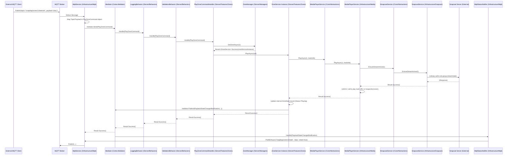

# 3. System Architecture

## 3.1. High-Level Architecture

SnapDog2 employs a **modular, service-oriented architecture** designed for maintainability, testability, and extensibility, contained within a **single .NET project structure** (`SnapDog2.csproj`). Logical separation between concerns is achieved through disciplined use of folders and namespaces (`Core`, `Server`, `Infrastructure`, `Api`, `Worker`). The architecture leverages the **Command Query Responsibility Segregation (CQRS)** pattern, facilitated by the **Cortex.Mediator** library, to decouple command/query dispatch from handling logic. This approach coordinates the various services and infrastructure adapters required to manage multi-zone audio playback via Snapcast and integrate with external systems like Subsonic, MQTT, and KNX.

The key architectural principles guiding the design are:

* **Modularity & Encapsulation**: Components are organized into logical layers (folders/namespaces). Interactions occur primarily through interfaces defined in the `Core` layer and via Cortex.Mediator messages (`ICommand`, `IQuery`, `INotification`), minimizing direct dependencies between concrete implementations in different layers. Infrastructure adapters (MQTT, KNX, API, Snapcast, Subsonic) are designed to be potentially replaceable or removable with minimal impact on the core server logic.
* **Dependency Rule**: Dependencies flow inwards. `Infrastructure`, `Server`, and `Api` layers depend on `Core`. `Server` depends only on `Core` abstractions, not concrete `Infrastructure` implementations. `Api` depends on `Server` (for Cortex.Mediator messages) and `Core`. `Worker` (the composition root) depends on all layers for registration.
* **CQRS Pattern**: Cortex.Mediator is used to separate Commands (actions intended to change state, implementing `IRequest<Result>`) and Queries (requests to retrieve data, implementing `IQuery<Result<T>>`) from their respective Handlers located in the `Server` layer. This simplifies handler logic and promotes separation.
* **Asynchronous Communication**: The system relies heavily on `async`/`await` for I/O operations. Cortex.Mediator facilitates asynchronous command/query handling. Internal eventing and state propagation between loosely coupled components occur via Cortex.Mediator `INotification` messages.
* **Clear State Management**: A distinction is made between SnapDog2's internal application state (`ClientState`, `ZoneState` records managed by `/Server` components) and the raw, last-known state received from the Snapcast server (held in the `SnapcastStateRepository` within `/Infrastructure`). See Section 4 for details.

### 3.1.1. Component Diagram (Logical Layers in Single Project)

This diagram illustrates the logical separation and dependencies between the different parts of the application, even though they reside within a single project.

```mermaid
graph TD
    subgraph "External Systems"
        MQTT[MQTT Broker]:::extern
        KNX[KNX Gateway]:::extern
        SUB[Subsonic Server]:::extern
        SNAP[Snapcast Server]:::extern
        AUDIO[Other Audio Sources]:::extern
    end

    subgraph "Entry/Exit Points (Folders: /Api, /Infrastructure)"
        style EntryPoints fill:#FCE5CD,stroke:#333
        API[Api Layer (/Api)]:::entry
        MQTTAdapter[MqttService (/Infrastructure/Mqtt)]:::entry
        KNXAdapter[KnxService (/Infrastructure/Knx)]:::entry
    end

    subgraph "Server Layer (Folder: /Server)"
        style ServerLayer fill:#C9DAF8,stroke:#333
        MBUS[Cortex.Mediator Bus]:::server
        Pipeline[Pipeline Behaviors (/Server/Behaviors)]:::server
        Handlers[Cmd/Query/Notif Handlers (/Server/Features)]:::server
        CoreManagers[Core Managers (Zone/Client/Playlist) (/Server/Managers)]:::server
    end

     subgraph "Core Layer (Folder: /Core)"
         style CoreLayer fill:#D9EAD3,stroke:#333
         Abstractions[Interfaces (ISnapcastService, etc) (/Core/Abstractions)]:::core
         DomainModels[State Records (ZoneState, etc) (/Core/Models)]:::core
         ResultPattern[Result<T> (/Core/Models)]:::core
         ConfigurationModels[Options Records (KnxOptions, etc) (/Core/Configuration)]:::core
         Enums[Enums (PlaybackStatus, etc) (/Core/Enums)]:::core
     end

    subgraph "Infrastructure Layer (Folder: /Infrastructure)"
        style InfrastructureLayer fill:#FFF2CC,stroke:#333
        InfraServices[Service Implementations (SnapcastService, KnxService, SubsonicService, MediaPlayerService)]:::infra
        StateRepos[State Repositories (SnapcastStateRepository)]:::infra
        ExternalLibs[(Sturd.SnapcastNet, Falcon.KNX, MQTTnet, SubSonicMedia, LibVLCSharp, Polly, Serilog, OTel Libs)]:::infra_lib
        Metrics[Metrics Service Impl]:::infra
        Logging[Logging Sink Config]:::infra
        Resilience[Resilience Policies]:::infra
    end

    %% Flow Definitions
    ExternalSystems -->|Network Protocols| EntryPoints
    EntryPoints -->|Send Cortex.Mediator Request| MBUS
    MBUS -->|Request Handling Pipeline| Pipeline
    Pipeline -->|Dispatch to Handler| Handlers
    Handlers -->|Use Case Logic| CoreManagers
    Handlers -->|Depends on| Abstractions
    Handlers -->|Read State| StateRepos
    CoreManagers -->|Depends on| Abstractions
    InfraServices -- implements --> Abstractions
    InfraServices -->|Uses Libraries| ExternalLibs
    InfraServices -->|Communicates With| ExternalSystems
    StateRepos -->|Uses Library Models| ExternalLibs
    StateRepos -- updated by --> InfraServices %% SnapcastService updates Repo

    %% Notification Flow Definitions
    CoreManagers -- publishes --> MBUS
    MBUS -->|Dispatch Notification| Handlers %% (Notification Handlers)
    Handlers -->|Call Infrastructure Abstraction| Abstractions
    Abstractions -- implemented by --> InfraServices
    InfraServices -->|Sends External Update| EntryPoints

    %% Metrics Flow
    Pipeline -->|Reports Metrics| Metrics

    classDef core fill:#D9EAD3,stroke:#333
    classDef server fill:#C9DAF8,stroke:#333
    classDef entry fill:#FCE5CD,stroke:#333
    classDef infra fill:#FFF2CC,stroke:#333
    classDef infra_lib fill:#EAD1DC,stroke:#333
    classDef extern fill:#EFEFEF,stroke:#666
```

### 3.1.2. Communication Flow Example (MQTT Play Command)

This sequence illustrates how an external command flows through the layers:



## 3.2. Key Components (Roles within Folders)

### 3.2.1. `/Core` Layer

Contains the foundational, dependency-free elements of the application.

* **Abstractions (`/Core/Abstractions`)**: Defines interfaces (`IZoneManager`, `IClientManager`, `ISnapcastService`, `IMqttService`, `IKnxService`, `ISubsonicService`, `IMediaPlayerService`, `ISnapcastStateRepository`, `IMetricsService`) that decouple the `Server` layer from specific `Infrastructure` implementations.
* **Domain Models (`/Core/Models`)**: Defines immutable `record` types representing the application's view of state (`ZoneState`, `ClientState`), data structures (`TrackInfo`, `PlaylistInfo`), and shared patterns (`Result`, `Result<T>`, `ErrorDetails`).
* **Configuration Models (`/Core/Configuration`)**: Defines strongly-typed `record` or `class` structures (`SnapcastOptions`, `KnxOptions`, `ZoneConfig`, etc.) used to load configuration settings (See Section 10).
* **Enums (`/Core/Enums`)**: Defines application-specific enumerations (e.g., `PlaybackStatus`, `CommandSource`, `KnxConnectionType`).

### 3.2.2. `/Server` Layer

Contains the core application logic, orchestration, and features. Depends only on `/Core`.

* **Cortex.Mediator Handlers (`/Server/Features/*`)**: Implement `ICommandHandler<TCommand, TResponse>` and `IQueryHandler<TQuery, TResponse>`. Contain the main business logic for executing commands and fulfilling queries. Orchestrate calls to Managers and Infrastructure Abstractions. Organized by feature/domain area (e.g., `/Zones`, `/Clients`). Includes `ZoneService` implementation.
* **Core Managers (`/Server/Managers`)**: Classes like `ZoneManager`, `ClientManager`, `PlaylistManager` encapsulate logic related to managing collections of core entities, handling lifecycle events, maintaining internal mappings (e.g., SnapDog ID <-> Snapcast ID), and coordinating complex operations. They interact with Infrastructure via abstractions.
* **Cortex.Mediator Messages (`/Server/Features/.../Commands`, `/Server/Features/.../Queries`, `/Server/Notifications`)**: Definitions of the `ICommand`, `IQuery` (Commands/Queries) and `INotification` types used for communication via the Cortex.Mediator bus.
* **Pipeline Behaviors (`/Server/Behaviors`)**: Implement `IPipelineBehavior<,>` for cross-cutting concerns like Logging, Validation, Performance Monitoring applied to Cortex.Mediator requests.
* **Validation (`/Server/Features/.../Validators`)**: Contains FluentValidation `AbstractValidator<T>` classes for specific Cortex.Mediator commands or API request DTOs.

### 3.2.3. `/Infrastructure` Layer

Provides concrete implementations for `/Core` abstractions and handles all external interactions. Depends only on `/Core` and external libraries.

* **Service Implementations (`/Infrastructure/{Snapcast|Knx|Mqtt|Subsonic|Media}`)**: Concrete classes implementing interfaces like `ISnapcastService`, `IKnxService`, etc. These classes contain the specific code to interact with external libraries (`Sturd.SnapcastNet`, `Knx.Falcon.Sdk`, `MQTTnet`, `SubSonicMedia`, `LibVLCSharp`) and external systems. They incorporate resilience policies (Polly) and translate external library exceptions/results into the application's `Result` pattern.
* **State Repositories (`/Infrastructure/Snapcast`)**: Holds the last known state from external systems, like `SnapcastStateRepository` holding raw `Sturd.SnapcastNet` models updated via events from `SnapcastService`.
* **Observability (`/Infrastructure/Observability`)**: Implementation of `IMetricsService` using OpenTelemetry `Meter`, configuration extensions for OpenTelemetry setup (`AddSnapDogObservability`).
* **Resilience (`/Infrastructure/Resilience`)**: Definition of common Polly policies (`ResiliencePolicies`).
* **Logging (`/Infrastructure/Logging`)**: Potentially custom Serilog enrichers or sinks if needed (though configuration is usually in `/Worker`).
* **Helpers (`/Infrastructure`)**: Utility classes like `EnvConfigHelper` for configuration loading.

### 3.2.4. `/Api` Layer

Handles HTTP requests and responses. Depends on `/Server` and `/Core`.

* **Controllers (`/Api/Controllers`)**: ASP.NET Core Controllers defining API endpoints. Keep controllers thin: parse requests, create Cortex.Mediator commands/queries, dispatch via `IMediator`, format `Result` into `ApiResponse<T>`.
* **DTOs (`/Api/Models`)**: Request models specific to API endpoints (if different from Cortex.Mediator commands) and potentially response DTOs (though often `/Core/Models` are used directly).
* **Authentication (`/Api/Auth`)**: Implementation of `ApiKeyAuthenticationHandler`.
* **Middleware/Filters**: Custom ASP.NET Core middleware or filters if needed (e.g., global exception handling formatting errors as `ApiResponse`).

### 3.2.5. `/Worker` Layer

The application's entry point and composition root. Depends on all other layers for setup.

* **`Program.cs`**: Configures and builds the .NET Generic Host (`WebApplication` or `Host`). Sets up logging (Serilog), configuration sources, dependency injection container. Calls DI registration extensions from other layers. Runs configuration validation. Starts the host.
* **Hosted Services (`/Worker/Services`)**: Implementations of `IHostedService` (e.g., a `MainWorker` derived from `BackgroundService`) that orchestrate the application lifecycle, trigger initialization of Infrastructure services, and potentially run background tasks.
* **DI Extensions (`/Worker/DI`)**: Static classes with extension methods (e.g., `AddCoreServices`, `AddInfrastructureServices`, `AddApiServices`, `AddCommandProcessing`) to organize service registration.
* **`GlobalUsings.cs`**: Defines global using directives for common namespaces.
