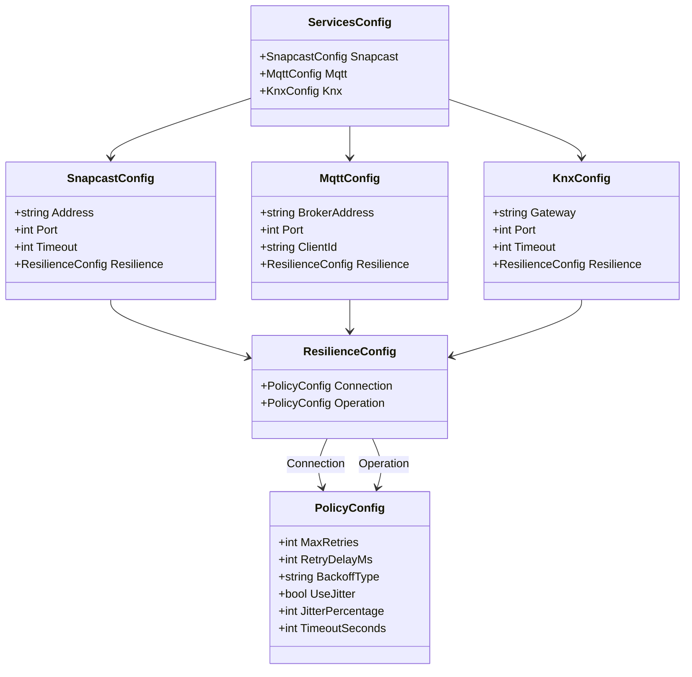

# 6. Resilience Configuration System

## 6.1. Overview

SnapDog2 implements a comprehensive resilience configuration system that allows fine-grained control over Polly resilience policies through environment variables. This system provides configurable retry strategies, timeout policies, and backoff mechanisms for all external service integrations (KNX, MQTT, Snapcast), ensuring robust fault tolerance while maintaining operational flexibility.

The resilience configuration follows the same **unified nested architecture** as the main configuration system, leveraging **EnvoyConfig** for attribute-based environment variable binding and automatic validation. Each service maintains separate policies for connection establishment and individual operations, allowing for optimized resilience strategies based on the specific characteristics of each interaction type.

## 6.2. Architecture Overview

### 6.2.1. Resilience Configuration Structure



### 6.2.2. Policy Types

Each service implements two distinct resilience policies:

- **Connection Policy**: Applied when establishing connections to external services
  - Higher retry counts for connection establishment
  - Exponential backoff with jitter to avoid thundering herd
  - Longer timeouts to accommodate network latency
  
- **Operation Policy**: Applied to individual operations after connection is established
  - Lower retry counts for faster failure detection
  - Linear backoff for predictable timing
  - Shorter timeouts for responsive user experience

### 6.2.3. Resilience Policy Factory

The `ResiliencePolicyFactory` provides a centralized mechanism for creating Polly resilience pipelines from configuration:

```csharp
// Located in /Core/Helpers/ResiliencePolicyFactory.cs
namespace SnapDog2.Core.Helpers;

using System;
using Polly;
using Polly.Retry;
using Polly.Timeout;
using SnapDog2.Core.Configuration;

/// <summary>
/// Factory for creating Polly resilience pipelines from configuration.
/// </summary>
public static class ResiliencePolicyFactory
{
    /// <summary>
    /// Creates a resilience pipeline from policy configuration.
    /// </summary>
    public static ResiliencePipeline CreatePipeline(PolicyConfig config, string serviceName = "Unknown")
    {
        var builder = new ResiliencePipelineBuilder();

        // Add retry policy with configurable parameters
        if (config.MaxRetries > 0)
        {
            builder.AddRetry(new RetryStrategyOptions
            {
                MaxRetryAttempts = config.MaxRetries,
                Delay = TimeSpan.FromMilliseconds(config.RetryDelayMs),
                BackoffType = ParseBackoffType(config.BackoffType),
                UseJitter = config.UseJitter,
                OnRetry = args =>
                {
                    // Logging and telemetry integration
                    return ValueTask.CompletedTask;
                }
            });
        }

        // Add timeout policy
        if (config.TimeoutSeconds > 0)
        {
            builder.AddTimeout(TimeSpan.FromSeconds(config.TimeoutSeconds));
        }

        return builder.Build();
    }

    /// <summary>
    /// Creates connection resilience pipeline from resilience configuration.
    /// </summary>
    public static ResiliencePipeline CreateConnectionPipeline(ResilienceConfig resilience, string serviceName = "Unknown")
    {
        return CreatePipeline(resilience.Connection, $"{serviceName}-Connection");
    }

    /// <summary>
    /// Creates operation resilience pipeline from resilience configuration.
    /// </summary>
    public static ResiliencePipeline CreateOperationPipeline(ResilienceConfig resilience, string serviceName = "Unknown")
    {
        return CreatePipeline(resilience.Operation, $"{serviceName}-Operation");
    }
}
```

## 6.3. Environment Variable Structure

### 6.3.1. Variable Naming Convention

Resilience configuration follows the established environment variable pattern:

```
SNAPDOG_SERVICES_{SERVICE}_RESILIENCE_{POLICY_TYPE}_{SETTING}
```

Where:
- `{SERVICE}`: `KNX`, `MQTT`, or `SNAPCAST`
- `{POLICY_TYPE}`: `CONNECTION` or `OPERATION`
- `{SETTING}`: Specific resilience setting

### 6.3.2. KNX Service Resilience Configuration

#### 6.3.2.1. Connection Policy Environment Variables

```bash
# KNX Connection Resilience Settings
SNAPDOG_SERVICES_KNX_RESILIENCE_CONNECTION_MAX_RETRIES=3
SNAPDOG_SERVICES_KNX_RESILIENCE_CONNECTION_RETRY_DELAY_MS=2000
SNAPDOG_SERVICES_KNX_RESILIENCE_CONNECTION_BACKOFF_TYPE=Exponential
SNAPDOG_SERVICES_KNX_RESILIENCE_CONNECTION_USE_JITTER=true
SNAPDOG_SERVICES_KNX_RESILIENCE_CONNECTION_JITTER_PERCENTAGE=25
SNAPDOG_SERVICES_KNX_RESILIENCE_CONNECTION_TIMEOUT_SECONDS=10
```

#### 6.3.2.2. Operation Policy Environment Variables

```bash
# KNX Operation Resilience Settings
SNAPDOG_SERVICES_KNX_RESILIENCE_OPERATION_MAX_RETRIES=2
SNAPDOG_SERVICES_KNX_RESILIENCE_OPERATION_RETRY_DELAY_MS=500
SNAPDOG_SERVICES_KNX_RESILIENCE_OPERATION_BACKOFF_TYPE=Linear
SNAPDOG_SERVICES_KNX_RESILIENCE_OPERATION_USE_JITTER=false
SNAPDOG_SERVICES_KNX_RESILIENCE_OPERATION_JITTER_PERCENTAGE=25
SNAPDOG_SERVICES_KNX_RESILIENCE_OPERATION_TIMEOUT_SECONDS=5
```

### 6.3.3. MQTT Service Resilience Configuration

#### 6.3.3.1. Connection Policy Environment Variables

```bash
# MQTT Connection Resilience Settings
SNAPDOG_SERVICES_MQTT_RESILIENCE_CONNECTION_MAX_RETRIES=3
SNAPDOG_SERVICES_MQTT_RESILIENCE_CONNECTION_RETRY_DELAY_MS=2000
SNAPDOG_SERVICES_MQTT_RESILIENCE_CONNECTION_BACKOFF_TYPE=Exponential
SNAPDOG_SERVICES_MQTT_RESILIENCE_CONNECTION_USE_JITTER=true
SNAPDOG_SERVICES_MQTT_RESILIENCE_CONNECTION_JITTER_PERCENTAGE=25
SNAPDOG_SERVICES_MQTT_RESILIENCE_CONNECTION_TIMEOUT_SECONDS=30
```

#### 6.3.3.2. Operation Policy Environment Variables

```bash
# MQTT Operation Resilience Settings
SNAPDOG_SERVICES_MQTT_RESILIENCE_OPERATION_MAX_RETRIES=2
SNAPDOG_SERVICES_MQTT_RESILIENCE_OPERATION_RETRY_DELAY_MS=500
SNAPDOG_SERVICES_MQTT_RESILIENCE_OPERATION_BACKOFF_TYPE=Linear
SNAPDOG_SERVICES_MQTT_RESILIENCE_OPERATION_USE_JITTER=false
SNAPDOG_SERVICES_MQTT_RESILIENCE_OPERATION_JITTER_PERCENTAGE=25
SNAPDOG_SERVICES_MQTT_RESILIENCE_OPERATION_TIMEOUT_SECONDS=10
```

### 6.3.4. Snapcast Service Resilience Configuration

#### 6.3.4.1. Connection Policy Environment Variables

```bash
# Snapcast Connection Resilience Settings
SNAPDOG_SERVICES_SNAPCAST_RESILIENCE_CONNECTION_MAX_RETRIES=3
SNAPDOG_SERVICES_SNAPCAST_RESILIENCE_CONNECTION_RETRY_DELAY_MS=2000
SNAPDOG_SERVICES_SNAPCAST_RESILIENCE_CONNECTION_BACKOFF_TYPE=Exponential
SNAPDOG_SERVICES_SNAPCAST_RESILIENCE_CONNECTION_USE_JITTER=true
SNAPDOG_SERVICES_SNAPCAST_RESILIENCE_CONNECTION_JITTER_PERCENTAGE=25
SNAPDOG_SERVICES_SNAPCAST_RESILIENCE_CONNECTION_TIMEOUT_SECONDS=30
```

#### 6.3.4.2. Operation Policy Environment Variables

```bash
# Snapcast Operation Resilience Settings
SNAPDOG_SERVICES_SNAPCAST_RESILIENCE_OPERATION_MAX_RETRIES=2
SNAPDOG_SERVICES_SNAPCAST_RESILIENCE_OPERATION_RETRY_DELAY_MS=500
SNAPDOG_SERVICES_SNAPCAST_RESILIENCE_OPERATION_BACKOFF_TYPE=Linear
SNAPDOG_SERVICES_SNAPCAST_RESILIENCE_OPERATION_USE_JITTER=false
SNAPDOG_SERVICES_SNAPCAST_RESILIENCE_OPERATION_JITTER_PERCENTAGE=25
SNAPDOG_SERVICES_SNAPCAST_RESILIENCE_OPERATION_TIMEOUT_SECONDS=10
```

## 6.4. Configuration Classes

### 6.4.1. ResilienceConfig Class

```csharp
// Located in /Core/Configuration/ResilienceConfig.cs
namespace SnapDog2.Core.Configuration;

using EnvoyConfig.Attributes;

/// <summary>
/// Resilience configuration for Polly policies.
/// Provides configurable retry and timeout settings for connection and operation policies.
/// </summary>
public class ResilienceConfig
{
    /// <summary>
    /// Connection policy configuration for establishing connections.
    /// Maps environment variables with suffix: *_CONNECTION_*
    /// </summary>
    [Env(NestedPrefix = "CONNECTION_")]
    public PolicyConfig Connection { get; set; } = new();

    /// <summary>
    /// Operation policy configuration for individual operations.
    /// Maps environment variables with suffix: *_OPERATION_*
    /// </summary>
    [Env(NestedPrefix = "OPERATION_")]
    public PolicyConfig Operation { get; set; } = new();
}
```

### 6.4.2. PolicyConfig Class

```csharp
/// <summary>
/// Individual policy configuration with retry and timeout settings.
/// </summary>
public class PolicyConfig
{
    /// <summary>
    /// Maximum number of retry attempts.
    /// Maps to: *_MAX_RETRIES
    /// </summary>
    [Env(Key = "MAX_RETRIES", Default = 3)]
    public int MaxRetries { get; set; } = 3;

    /// <summary>
    /// Initial delay between retries in milliseconds.
    /// Maps to: *_RETRY_DELAY_MS
    /// </summary>
    [Env(Key = "RETRY_DELAY_MS", Default = 1000)]
    public int RetryDelayMs { get; set; } = 1000;

    /// <summary>
    /// Backoff type for retry delays.
    /// Options: Linear, Exponential, Constant
    /// Maps to: *_BACKOFF_TYPE
    /// </summary>
    [Env(Key = "BACKOFF_TYPE", Default = "Exponential")]
    public string BackoffType { get; set; } = "Exponential";

    /// <summary>
    /// Whether to use jitter in retry delays to avoid thundering herd.
    /// Maps to: *_USE_JITTER
    /// </summary>
    [Env(Key = "USE_JITTER", Default = true)]
    public bool UseJitter { get; set; } = true;

    /// <summary>
    /// Timeout in seconds for individual operations.
    /// Maps to: *_TIMEOUT_SECONDS
    /// </summary>
    [Env(Key = "TIMEOUT_SECONDS", Default = 30)]
    public int TimeoutSeconds { get; set; } = 30;

    /// <summary>
    /// Maximum jitter percentage (0-100) when UseJitter is true.
    /// Maps to: *_JITTER_PERCENTAGE
    /// </summary>
    [Env(Key = "JITTER_PERCENTAGE", Default = 25)]
    public int JitterPercentage { get; set; } = 25;
}
```

## 6.5. Service Integration

### 6.5.1. Service Implementation Pattern

Each infrastructure service follows a consistent pattern for resilience policy integration:

```csharp
// Example from KnxService.cs
public sealed partial class KnxService : IKnxService, IAsyncDisposable
{
    private readonly ResiliencePipeline _connectionPolicy;
    private readonly ResiliencePipeline _operationPolicy;

    public KnxService(
        IOptions<KnxConfig> config,
        IServiceProvider serviceProvider,
        ILogger<KnxService> logger)
    {
        _config = config.Value;
        _serviceProvider = serviceProvider;
        _logger = logger;

        // Configure resilience policies from configuration
        _connectionPolicy = CreateConnectionPolicy();
        _operationPolicy = CreateOperationPolicy();
    }

    private ResiliencePipeline CreateConnectionPolicy()
    {
        var validatedConfig = ResiliencePolicyFactory.ValidateAndNormalize(_config.Resilience.Connection);
        return ResiliencePolicyFactory.CreatePipeline(validatedConfig, "KNX-Connection");
    }

    private ResiliencePipeline CreateOperationPolicy()
    {
        var validatedConfig = ResiliencePolicyFactory.ValidateAndNormalize(_config.Resilience.Operation);
        return ResiliencePolicyFactory.CreatePipeline(validatedConfig, "KNX-Operation");
    }

    // Usage in connection establishment
    private async Task<Result> ConnectToKnxBusAsync(CancellationToken cancellationToken)
    {
        return await _connectionPolicy.ExecuteAsync(async (ct) =>
        {
            // Connection logic here
            return Result.Success();
        }, cancellationToken);
    }

    // Usage in operations
    public async Task<Result> SendCommandAsync(KnxCommand command, CancellationToken cancellationToken = default)
    {
        return await _operationPolicy.ExecuteAsync(async (ct) =>
        {
            // Operation logic here
            return Result.Success();
        }, cancellationToken);
    }
}
```

### 6.5.2. Configuration Validation

The `ResiliencePolicyFactory` includes automatic validation and normalization:

```csharp
/// <summary>
/// Validates policy configuration and provides defaults for invalid values.
/// </summary>
public static PolicyConfig ValidateAndNormalize(PolicyConfig config)
{
    return new PolicyConfig
    {
        MaxRetries = Math.Max(0, Math.Min(config.MaxRetries, 10)), // Limit to 0-10 retries
        RetryDelayMs = Math.Max(100, Math.Min(config.RetryDelayMs, 60000)), // 100ms to 60s
        BackoffType = IsValidBackoffType(config.BackoffType) ? config.BackoffType : "Exponential",
        UseJitter = config.UseJitter,
        TimeoutSeconds = Math.Max(1, Math.Min(config.TimeoutSeconds, 300)), // 1s to 5min
        JitterPercentage = Math.Max(0, Math.Min(config.JitterPercentage, 100)) // 0-100%
    };
}
```

## 6.6. Backoff Strategies

### 6.6.1. Linear Backoff

- **Pattern**: Fixed delay between retries
- **Example**: 1s, 1s, 1s, 1s...
- **Use Case**: When you want predictable retry intervals
- **Configuration**: `BACKOFF_TYPE=Linear`

### 6.6.2. Exponential Backoff

- **Pattern**: Delay doubles with each retry
- **Example**: 1s, 2s, 4s, 8s...
- **Use Case**: When you want to reduce load on failing services (recommended for connections)
- **Configuration**: `BACKOFF_TYPE=Exponential`

### 6.6.3. Constant Backoff

- **Pattern**: Same delay for all retries
- **Example**: 2s, 2s, 2s, 2s...
- **Use Case**: When you need consistent timing
- **Configuration**: `BACKOFF_TYPE=Constant`

## 6.7. Environment-Specific Configurations

### 6.7.1. Development Environment

```bash
# Faster retries for development
SNAPDOG_SERVICES_KNX_RESILIENCE_CONNECTION_MAX_RETRIES=2
SNAPDOG_SERVICES_KNX_RESILIENCE_CONNECTION_RETRY_DELAY_MS=1000
SNAPDOG_SERVICES_KNX_RESILIENCE_CONNECTION_TIMEOUT_SECONDS=5

SNAPDOG_SERVICES_MQTT_RESILIENCE_CONNECTION_MAX_RETRIES=2
SNAPDOG_SERVICES_MQTT_RESILIENCE_CONNECTION_RETRY_DELAY_MS=1000
SNAPDOG_SERVICES_MQTT_RESILIENCE_CONNECTION_TIMEOUT_SECONDS=10

SNAPDOG_SERVICES_SNAPCAST_RESILIENCE_CONNECTION_MAX_RETRIES=2
SNAPDOG_SERVICES_SNAPCAST_RESILIENCE_CONNECTION_RETRY_DELAY_MS=1000
SNAPDOG_SERVICES_SNAPCAST_RESILIENCE_CONNECTION_TIMEOUT_SECONDS=10
```

### 6.7.2. Production Environment

```bash
# More resilient settings for production
SNAPDOG_SERVICES_KNX_RESILIENCE_CONNECTION_MAX_RETRIES=5
SNAPDOG_SERVICES_KNX_RESILIENCE_CONNECTION_RETRY_DELAY_MS=3000
SNAPDOG_SERVICES_KNX_RESILIENCE_CONNECTION_TIMEOUT_SECONDS=15

SNAPDOG_SERVICES_MQTT_RESILIENCE_CONNECTION_MAX_RETRIES=5
SNAPDOG_SERVICES_MQTT_RESILIENCE_CONNECTION_RETRY_DELAY_MS=3000
SNAPDOG_SERVICES_MQTT_RESILIENCE_CONNECTION_TIMEOUT_SECONDS=45

SNAPDOG_SERVICES_SNAPCAST_RESILIENCE_CONNECTION_MAX_RETRIES=5
SNAPDOG_SERVICES_SNAPCAST_RESILIENCE_CONNECTION_RETRY_DELAY_MS=3000
SNAPDOG_SERVICES_SNAPCAST_RESILIENCE_CONNECTION_TIMEOUT_SECONDS=45
```

### 6.7.3. High-Latency Network Environment

```bash
# Longer timeouts and more retries for high-latency networks
SNAPDOG_SERVICES_KNX_RESILIENCE_CONNECTION_TIMEOUT_SECONDS=30
SNAPDOG_SERVICES_KNX_RESILIENCE_CONNECTION_MAX_RETRIES=7
SNAPDOG_SERVICES_KNX_RESILIENCE_CONNECTION_RETRY_DELAY_MS=5000

SNAPDOG_SERVICES_MQTT_RESILIENCE_CONNECTION_TIMEOUT_SECONDS=60
SNAPDOG_SERVICES_MQTT_RESILIENCE_CONNECTION_MAX_RETRIES=7
SNAPDOG_SERVICES_MQTT_RESILIENCE_CONNECTION_RETRY_DELAY_MS=5000

SNAPDOG_SERVICES_SNAPCAST_RESILIENCE_CONNECTION_TIMEOUT_SECONDS=60
SNAPDOG_SERVICES_SNAPCAST_RESILIENCE_CONNECTION_MAX_RETRIES=7
SNAPDOG_SERVICES_SNAPCAST_RESILIENCE_CONNECTION_RETRY_DELAY_MS=5000
```

## 6.8. Docker Compose Integration

### 6.8.1. Production Docker Compose Example

```yaml
version: '3.8'
services:
  snapdog:
    image: snapdog2:latest
    environment:
      # KNX Resilience - Production Settings
      SNAPDOG_SERVICES_KNX_RESILIENCE_CONNECTION_MAX_RETRIES: 5
      SNAPDOG_SERVICES_KNX_RESILIENCE_CONNECTION_RETRY_DELAY_MS: 3000
      SNAPDOG_SERVICES_KNX_RESILIENCE_CONNECTION_TIMEOUT_SECONDS: 15
      SNAPDOG_SERVICES_KNX_RESILIENCE_OPERATION_MAX_RETRIES: 3
      SNAPDOG_SERVICES_KNX_RESILIENCE_OPERATION_RETRY_DELAY_MS: 1000
      SNAPDOG_SERVICES_KNX_RESILIENCE_OPERATION_TIMEOUT_SECONDS: 8
      
      # MQTT Resilience - High Availability
      SNAPDOG_SERVICES_MQTT_RESILIENCE_CONNECTION_MAX_RETRIES: 7
      SNAPDOG_SERVICES_MQTT_RESILIENCE_CONNECTION_RETRY_DELAY_MS: 2000
      SNAPDOG_SERVICES_MQTT_RESILIENCE_CONNECTION_TIMEOUT_SECONDS: 45
      SNAPDOG_SERVICES_MQTT_RESILIENCE_OPERATION_MAX_RETRIES: 3
      SNAPDOG_SERVICES_MQTT_RESILIENCE_OPERATION_RETRY_DELAY_MS: 750
      SNAPDOG_SERVICES_MQTT_RESILIENCE_OPERATION_TIMEOUT_SECONDS: 15
      
      # Snapcast Resilience - Balanced
      SNAPDOG_SERVICES_SNAPCAST_RESILIENCE_CONNECTION_MAX_RETRIES: 4
      SNAPDOG_SERVICES_SNAPCAST_RESILIENCE_CONNECTION_RETRY_DELAY_MS: 2500
      SNAPDOG_SERVICES_SNAPCAST_RESILIENCE_CONNECTION_TIMEOUT_SECONDS: 30
      SNAPDOG_SERVICES_SNAPCAST_RESILIENCE_OPERATION_MAX_RETRIES: 2
      SNAPDOG_SERVICES_SNAPCAST_RESILIENCE_OPERATION_RETRY_DELAY_MS: 600
      SNAPDOG_SERVICES_SNAPCAST_RESILIENCE_OPERATION_TIMEOUT_SECONDS: 12
```

## 6.9. Monitoring and Observability

### 6.9.1. Resilience Metrics

The resilience system integrates with the telemetry infrastructure to provide comprehensive monitoring:

- **Retry Attempts**: Number of retry attempts per service and policy type
- **Timeout Events**: Frequency of timeout occurrences
- **Circuit Breaker State**: Current state of circuit breakers (if implemented)
- **Success/Failure Rates**: Overall success rates after applying resilience policies

### 6.9.2. Logging Integration

Resilience events are logged with structured logging for operational visibility:

```csharp
[LoggerMessage(EventId = 701, Level = LogLevel.Warning, 
    Message = "[Resilience] {ServiceName} {PolicyType} retry attempt {RetryAttempt}/{MaxRetries} after {Delay}ms delay")]
static partial void LogRetryAttempt(ILogger logger, string serviceName, string policyType, 
    int retryAttempt, int maxRetries, double delay, Exception exception);

[LoggerMessage(EventId = 702, Level = LogLevel.Error, 
    Message = "[Resilience] {ServiceName} {PolicyType} operation timed out after {TimeoutSeconds}s")]
static partial void LogTimeout(ILogger logger, string serviceName, string policyType, 
    int timeoutSeconds, Exception exception);
```

## 6.10. Performance Considerations

### 6.10.1. Impact Analysis

- **Higher retry counts**: Longer startup times but better reliability
- **Exponential backoff**: Better for external services, may increase total retry time
- **Jitter**: Reduces thundering herd but adds unpredictability
- **Longer timeouts**: More resilient but slower failure detection

### 6.10.2. Tuning Guidelines

1. **Connection Policies**: Use higher retry counts and exponential backoff with jitter
2. **Operation Policies**: Use lower retry counts and linear backoff for faster feedback
3. **Timeout Values**: Balance between reliability and responsiveness
4. **Environment-Specific**: Adjust based on network characteristics and SLA requirements

## 6.11. Benefits

### 6.11.1. Operational Flexibility

- **Environment-Specific Tuning**: Different settings for dev/staging/production
- **Runtime Configuration**: No code changes required for resilience adjustments
- **Service-Specific Optimization**: Each service can have tailored resilience strategies

### 6.11.2. Reliability Improvements

- **Transient Fault Handling**: Automatic recovery from temporary failures
- **Thundering Herd Prevention**: Jitter prevents simultaneous retry attempts
- **Graceful Degradation**: Configurable timeouts prevent indefinite blocking

### 6.11.3. Maintainability

- **Centralized Configuration**: All resilience settings in one location
- **Type Safety**: Compile-time validation of configuration structure
- **Validation**: Runtime validation with sensible defaults
- **Documentation**: Self-documenting through environment variable names

This resilience configuration system provides SnapDog2 with enterprise-grade fault tolerance capabilities while maintaining the flexibility needed for diverse deployment scenarios and operational requirements.
