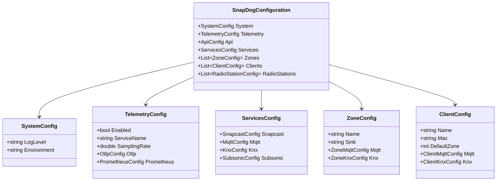

# 9. Configuration System

SnapDog2 is designed for flexible deployment within containerized environments. Its configuration system leverages **EnvoyConfig**, a modern .NET configuration library that provides attribute-based environment variable binding, automatic validation, nested object mapping, and custom type conversion.

The configuration follows a **unified nested architecture** where all settings are organized into a single root [`SnapDogConfiguration`](SnapDogConfiguration.cs:1) class with strongly-typed nested objects for different subsystems. This eliminates configuration fragmentation while providing comprehensive type safety and validation.

## 9.1. Architecture Overview

### 9.1.1. Unified Configuration Structure



### 9.1.2. EnvoyConfig Features Utilized

- **`[Env]` Attribute**: Maps properties to environment variables with options for defaults, validation, and type conversion
- **`NestedListPrefix`**: Enables indexed configurations like `SNAPDOG_ZONE_1_*`, `SNAPDOG_CLIENT_2_*`
- **`NestedPrefix`**: Maps nested objects like `SNAPDOG_ZONE_1_MQTT_*` to sub-configuration classes
- **`MapPrefix`**: Handles key-value configurations like Snapcast settings
- **`ListPrefix`**: Maps numbered environment variables to lists (e.g., API keys)
- **Custom Type Converters**: Handle domain-specific types like [`KnxAddress`](KnxAddress.cs:1)
- **Built-in Validation**: Automatic validation with [`IValidateOptions<T>`](IValidateOptions.cs:1) for business logic

## 9.2. Environment Variable Structure

All environment variables use the global prefix `SNAPDOG_` and follow a hierarchical naming convention that maps directly to the nested configuration classes.

### 9.2.1. System Configuration

```bash
# Basic system settings
SNAPDOG_SYSTEM_LOG_LEVEL=Information                  # Default: Information
SNAPDOG_SYSTEM_ENVIRONMENT=Production                 # Default: Development
SNAPDOG_SYSTEM_DEBUG_ENABLED=true                     # Default: false

# Health Check Configuration
SNAPDOG_SYSTEM_HEALTH_CHECKS_ENABLED=true             # Default: true
SNAPDOG_SYSTEM_HEALTH_CHECKS_TIMEOUT=30               # Default: 30 seconds
SNAPDOG_SYSTEM_HEALTH_CHECKS_TAGS=ready,live          # Default: ready,live

# System-wide MQTT Topics
SNAPDOG_SYSTEM_MQTT_BASE_TOPIC=snapdog                 # Default: snapdog
SNAPDOG_SYSTEM_MQTT_STATUS_TOPIC=status               # Default: status
SNAPDOG_SYSTEM_MQTT_ERROR_TOPIC=error                 # Default: error
SNAPDOG_SYSTEM_MQTT_VERSION_TOPIC=version             # Default: version
SNAPDOG_SYSTEM_MQTT_STATS_TOPIC=stats                 # Default: stats
```

### 9.2.2. Telemetry Configuration

```bash
# Core telemetry settings
SNAPDOG_TELEMETRY_ENABLED=true                        # Default: false
SNAPDOG_TELEMETRY_SERVICE_NAME=snapdog                # Default: SnapDog2
SNAPDOG_TELEMETRY_SAMPLING_RATE=1.0                   # Default: 1.0

# Jaeger exporter configuration (Docker environment)
SNAPDOG_TELEMETRY_OTLP_ENABLED=true                   # Default: false
SNAPDOG_TELEMETRY_OTLP_ENDPOINT=http://jaeger:14268   # Default: http://localhost:14268
SNAPDOG_TELEMETRY_OTLP_AGENT_ADDRESS=jaeger           # Default: localhost
SNAPDOG_TELEMETRY_OTLP_AGENT_PORT=6831                # Default: 6831

# Prometheus metrics configuration
SNAPDOG_TELEMETRY_PROMETHEUS_ENABLED=true             # Default: false
SNAPDOG_TELEMETRY_PROMETHEUS_PORT=9090                # Default: 9090
SNAPDOG_TELEMETRY_PROMETHEUS_PATH=/metrics            # Default: /metrics

# Seq integration (Recommended for Logging)
SNAPDOG_TELEMETRY_SEQ_ENABLED=true                    # Default: true
SNAPDOG_TELEMETRY_SEQ_URL=http://seq:5341             # Required if enabled
```

### 9.2.3. API Configuration

```bash
# API server and authentication
SNAPDOG_API_ENABLED=true                            # Default: true
SNAPDOG_API_PORT=5000                               # Default: 5000
SNAPDOG_API_AUTH_ENABLED=true                       # Default: true
SNAPDOG_API_APIKEY_1=secret-key-1                   # Required if auth enabled
SNAPDOG_API_APIKEY_2=secret-key-2                   # Additional keys as needed
SNAPDOG_API_APIKEY_3=secret-key-3
```

### 9.2.4. Services Configuration

```bash
# Snapcast integration
SNAPDOG_SERVICES_SNAPCAST_ADDRESS=snapcast-server     # Default: localhost
SNAPDOG_SERVICES_SNAPCAST_JSONRPC_PORT=1705                   # Default: 1705 (JSON-RPC port)
SNAPDOG_SERVICES_SNAPCAST_HTTP_PORT=1780              # Default: 1780
SNAPDOG_SERVICES_SNAPCAST_BASE_URL=                   # Default: "" (for reverse proxy support)
SNAPDOG_SERVICES_SNAPCAST_TIMEOUT=30                  # Default: 30 (connection timeout)
SNAPDOG_SERVICES_SNAPCAST_RECONNECT_INTERVAL=5        # Default: 5 (reconnect interval)
SNAPDOG_SERVICES_SNAPCAST_AUTO_RECONNECT=true         # Default: true

# Snapcast server configuration (for container setup)
SNAPDOG_SNAPCAST_CODEC=flac                           # Default: flac (audio codec)
SNAPDOG_SNAPCAST_SAMPLEFORMAT=48000:16:2              # Default: 48000:16:2 (sample rate:bit depth:channels)
SNAPDOG_SNAPCAST_WEBSERVER_PORT=1780                  # Default: 1780 (SnapWeb HTTP port)
SNAPDOG_SNAPCAST_WEBSOCKET_PORT=1705                  # Default: 1705 (JSON-RPC WebSocket port)

# MQTT integration
SNAPDOG_SERVICES_MQTT_ENABLED=true                    # Default: true
SNAPDOG_SERVICES_MQTT_BROKER_ADDRESS=mosquitto        # Default: localhost
SNAPDOG_SERVICES_MQTT_PORT=1883                       # Default: 1883
SNAPDOG_SERVICES_MQTT_SSL_ENABLED=false               # Default: false
SNAPDOG_SERVICES_MQTT_USERNAME=snapdog                # Optional
SNAPDOG_SERVICES_MQTT_PASSWORD=snapdog                # Optional
SNAPDOG_SERVICES_MQTT_CLIENT_ID=snapdog-server        # Default: snapdog-server
SNAPDOG_SERVICES_MQTT_KEEP_ALIVE=60                   # Default: 60

# KNX integration
SNAPDOG_SERVICES_KNX_ENABLED=false                    # Default: false
SNAPDOG_SERVICES_KNX_CONNECTION_TYPE=tunnel           # Default: tunnel (tunnel|router|usb)
SNAPDOG_SERVICES_KNX_GATEWAY=192.168.1.100            # Required for connection
SNAPDOG_SERVICES_KNX_PORT=3671                        # Default: 3671
SNAPDOG_SERVICES_KNX_TIMEOUT=10                       # Default: 10 (seconds)
SNAPDOG_SERVICES_KNX_AUTO_RECONNECT=true              # Default: true

# Subsonic integration
SNAPDOG_SERVICES_SUBSONIC_ENABLED=false               # Default: false
SNAPDOG_SERVICES_SUBSONIC_URL=http://subsonic:4533.   # Required if enabled
SNAPDOG_SERVICES_SUBSONIC_USERNAME=admin              # Required if enabled
SNAPDOG_SERVICES_SUBSONIC_PASSWORD=password           # Required if enabled
SNAPDOG_SERVICES_SUBSONIC_TIMEOUT=10000               # Default: 10000ms

# SoundFlow audio engine integration
SNAPDOG_SOUNDFLOW_SAMPLE_RATE=48000                   # Default: 48000 (target sample rate)
SNAPDOG_SOUNDFLOW_BIT_DEPTH=16                        # Default: 16 (target bit depth)
SNAPDOG_SOUNDFLOW_CHANNELS=2                          # Default: 2 (target channels)
SNAPDOG_SOUNDFLOW_BUFFER_SIZE=1024                    # Default: 1024 (buffer size in samples)
SNAPDOG_SOUNDFLOW_MAX_STREAMS=10                      # Default: 10 (max concurrent streams)
SNAPDOG_SOUNDFLOW_HTTP_TIMEOUT_SECONDS=30             # Default: 30 (HTTP timeout)
SNAPDOG_SOUNDFLOW_AUTO_DETECT_FORMAT=true             # Default: true (auto-detect audio format)
SNAPDOG_SOUNDFLOW_THREAD_PRIORITY=Normal              # Default: Normal (Lowest|BelowNormal|Normal|AboveNormal|Highest)
SNAPDOG_SOUNDFLOW_REALTIME_PROCESSING=true            # Default: true (enable real-time processing)
```

#### 9.2.4.1. Services Resilience Configuration

SnapDog2 provides comprehensive resilience configuration for all external service integrations using Polly policies. Each service supports separate configuration for connection establishment and individual operations.

**KNX Service Resilience:**

```bash
# KNX Connection Policy (for establishing connections)
SNAPDOG_SERVICES_KNX_RESILIENCE_CONNECTION_MAX_RETRIES=3           # Default: 3 (0-10)
SNAPDOG_SERVICES_KNX_RESILIENCE_CONNECTION_RETRY_DELAY_MS=2000     # Default: 2000 (100-60000)
SNAPDOG_SERVICES_KNX_RESILIENCE_CONNECTION_BACKOFF_TYPE=Exponential # Default: Exponential (Linear|Exponential|Constant)
SNAPDOG_SERVICES_KNX_RESILIENCE_CONNECTION_USE_JITTER=true         # Default: true
SNAPDOG_SERVICES_KNX_RESILIENCE_CONNECTION_JITTER_PERCENTAGE=25    # Default: 25 (0-100)
SNAPDOG_SERVICES_KNX_RESILIENCE_CONNECTION_TIMEOUT_SECONDS=10      # Default: 10 (1-300)

# KNX Operation Policy (for individual operations)
SNAPDOG_SERVICES_KNX_RESILIENCE_OPERATION_MAX_RETRIES=2           # Default: 2 (0-10)
SNAPDOG_SERVICES_KNX_RESILIENCE_OPERATION_RETRY_DELAY_MS=500      # Default: 500 (100-60000)
SNAPDOG_SERVICES_KNX_RESILIENCE_OPERATION_BACKOFF_TYPE=Linear     # Default: Linear (Linear|Exponential|Constant)
SNAPDOG_SERVICES_KNX_RESILIENCE_OPERATION_USE_JITTER=false        # Default: false
SNAPDOG_SERVICES_KNX_RESILIENCE_OPERATION_JITTER_PERCENTAGE=25    # Default: 25 (0-100)
SNAPDOG_SERVICES_KNX_RESILIENCE_OPERATION_TIMEOUT_SECONDS=5       # Default: 5 (1-300)
```

**MQTT Service Resilience:**

```bash
# MQTT Connection Policy
SNAPDOG_SERVICES_MQTT_RESILIENCE_CONNECTION_MAX_RETRIES=3          # Default: 3 (0-10)
SNAPDOG_SERVICES_MQTT_RESILIENCE_CONNECTION_RETRY_DELAY_MS=2000    # Default: 2000 (100-60000)
SNAPDOG_SERVICES_MQTT_RESILIENCE_CONNECTION_BACKOFF_TYPE=Exponential # Default: Exponential (Linear|Exponential|Constant)
SNAPDOG_SERVICES_MQTT_RESILIENCE_CONNECTION_USE_JITTER=true        # Default: true
SNAPDOG_SERVICES_MQTT_RESILIENCE_CONNECTION_JITTER_PERCENTAGE=25   # Default: 25 (0-100)
SNAPDOG_SERVICES_MQTT_RESILIENCE_CONNECTION_TIMEOUT_SECONDS=30     # Default: 30 (1-300)

# MQTT Operation Policy
SNAPDOG_SERVICES_MQTT_RESILIENCE_OPERATION_MAX_RETRIES=2          # Default: 2 (0-10)
SNAPDOG_SERVICES_MQTT_RESILIENCE_OPERATION_RETRY_DELAY_MS=500     # Default: 500 (100-60000)
SNAPDOG_SERVICES_MQTT_RESILIENCE_OPERATION_BACKOFF_TYPE=Linear    # Default: Linear (Linear|Exponential|Constant)
SNAPDOG_SERVICES_MQTT_RESILIENCE_OPERATION_USE_JITTER=false       # Default: false
SNAPDOG_SERVICES_MQTT_RESILIENCE_OPERATION_JITTER_PERCENTAGE=25   # Default: 25 (0-100)
SNAPDOG_SERVICES_MQTT_RESILIENCE_OPERATION_TIMEOUT_SECONDS=10     # Default: 10 (1-300)
```

**Snapcast Service Resilience:**

```bash
# Snapcast Connection Policy
SNAPDOG_SERVICES_SNAPCAST_RESILIENCE_CONNECTION_MAX_RETRIES=3         # Default: 3 (0-10)
SNAPDOG_SERVICES_SNAPCAST_RESILIENCE_CONNECTION_RETRY_DELAY_MS=2000   # Default: 2000 (100-60000)
SNAPDOG_SERVICES_SNAPCAST_RESILIENCE_CONNECTION_BACKOFF_TYPE=Exponential # Default: Exponential (Linear|Exponential|Constant)
SNAPDOG_SERVICES_SNAPCAST_RESILIENCE_CONNECTION_USE_JITTER=true       # Default: true
SNAPDOG_SERVICES_SNAPCAST_RESILIENCE_CONNECTION_JITTER_PERCENTAGE=25  # Default: 25 (0-100)
SNAPDOG_SERVICES_SNAPCAST_RESILIENCE_CONNECTION_TIMEOUT_SECONDS=30    # Default: 30 (1-300)

# Snapcast Operation Policy
SNAPDOG_SERVICES_SNAPCAST_RESILIENCE_OPERATION_MAX_RETRIES=2         # Default: 2 (0-10)
SNAPDOG_SERVICES_SNAPCAST_RESILIENCE_OPERATION_RETRY_DELAY_MS=500    # Default: 500 (100-60000)
SNAPDOG_SERVICES_SNAPCAST_RESILIENCE_OPERATION_BACKOFF_TYPE=Linear   # Default: Linear (Linear|Exponential|Constant)
SNAPDOG_SERVICES_SNAPCAST_RESILIENCE_OPERATION_USE_JITTER=false      # Default: false
SNAPDOG_SERVICES_SNAPCAST_RESILIENCE_OPERATION_JITTER_PERCENTAGE=25  # Default: 25 (0-100)
SNAPDOG_SERVICES_SNAPCAST_RESILIENCE_OPERATION_TIMEOUT_SECONDS=10    # Default: 10 (1-300)
```

**Resilience Configuration Notes:**

- **Connection Policies**: Applied when establishing connections to external services. Typically use exponential backoff with jitter to avoid thundering herd effects.
- **Operation Policies**: Applied to individual operations after connection is established. Usually use linear backoff for predictable timing.
- **Validation**: All values are automatically validated and normalized within safe bounds.
- **Environment-Specific**: Different settings can be applied for development, staging, and production environments.

For detailed resilience configuration documentation, see [6. Resilience Configuration System](06-resilience-configuration.md).

### 9.2.5. Zone Configuration (Nested Lists)

```bash
# Zone 1 Configuration
SNAPDOG_ZONE_1_NAME=Living Room                       # Required
SNAPDOG_ZONE_1_SINK=/snapsinks/living-room            # Required

# Zone 1 MQTT Configuration
SNAPDOG_ZONE_1_MQTT_BASE_TOPIC=snapdog/zones/living-room
SNAPDOG_ZONE_1_MQTT_CONTROL_SET_TOPIC=control/set         # Default: control/set
SNAPDOG_ZONE_1_MQTT_TRACK_SET_TOPIC=track/set             # Default: track/set
SNAPDOG_ZONE_1_MQTT_TRACK_REPEAT_SET_TOPIC=track_repeat/set # Default: track_repeat/set
SNAPDOG_ZONE_1_MQTT_PLAYLIST_SET_TOPIC=playlist/set       # Default: playlist/set
SNAPDOG_ZONE_1_MQTT_PLAYLIST_REPEAT_SET_TOPIC=playlist_repeat/set # Default: playlist_repeat/set
SNAPDOG_ZONE_1_MQTT_PLAYLIST_SHUFFLE_SET_TOPIC=playlist_shuffle/set # Default: playlist_shuffle/set
SNAPDOG_ZONE_1_MQTT_VOLUME_SET_TOPIC=volume/set           # Default: volume/set
SNAPDOG_ZONE_1_MQTT_MUTE_SET_TOPIC=mute/set               # Default: mute/set
SNAPDOG_ZONE_1_MQTT_CONTROL_TOPIC=control                 # Default: control
SNAPDOG_ZONE_1_MQTT_TRACK_TOPIC=track                     # Default: track
SNAPDOG_ZONE_1_MQTT_TRACK_INFO_TOPIC=track/info           # Default: track/info
SNAPDOG_ZONE_1_MQTT_TRACK_REPEAT_TOPIC=track_repeat       # Default: track_repeat
SNAPDOG_ZONE_1_MQTT_PLAYLIST_TOPIC=playlist               # Default: playlist
SNAPDOG_ZONE_1_MQTT_PLAYLIST_INFO_TOPIC=playlist/info     # Default: playlist/info
SNAPDOG_ZONE_1_MQTT_PLAYLIST_REPEAT_TOPIC=playlist_repeat # Default: playlist_repeat
SNAPDOG_ZONE_1_MQTT_PLAYLIST_SHUFFLE_TOPIC=playlist_shuffle # Default: playlist_shuffle
SNAPDOG_ZONE_1_MQTT_VOLUME_TOPIC=volume                   # Default: volume
SNAPDOG_ZONE_1_MQTT_MUTE_TOPIC=mute                       # Default: mute
SNAPDOG_ZONE_1_MQTT_STATE_TOPIC=state                     # Default: state

# Zone 1 KNX Configuration
SNAPDOG_ZONE_1_KNX_ENABLED=true                       # Default: false
SNAPDOG_ZONE_1_KNX_PLAY=1/1/1                         # Optional KNX addresses
SNAPDOG_ZONE_1_KNX_PAUSE=1/1/2
SNAPDOG_ZONE_1_KNX_STOP=1/1/3
SNAPDOG_ZONE_1_KNX_CONTROL_STATUS=1/1/10              # Control status feedback
SNAPDOG_ZONE_1_KNX_TRACK_NEXT=1/1/4
SNAPDOG_ZONE_1_KNX_TRACK_PREVIOUS=1/1/5
SNAPDOG_ZONE_1_KNX_TRACK=1/3/1                        # Track selection
SNAPDOG_ZONE_1_KNX_TRACK_STATUS=1/3/2                 # Track status feedback
SNAPDOG_ZONE_1_KNX_TRACK_REPEAT=1/3/3                 # Track repeat control
SNAPDOG_ZONE_1_KNX_TRACK_REPEAT_STATUS=1/3/4          # Track repeat status
SNAPDOG_ZONE_1_KNX_TRACK_REPEAT_TOGGLE=1/3/5          # Track repeat toggle
SNAPDOG_ZONE_1_KNX_PLAYLIST=1/4/1                     # Playlist selection
SNAPDOG_ZONE_1_KNX_PLAYLIST_STATUS=1/4/2              # Playlist status feedback
SNAPDOG_ZONE_1_KNX_PLAYLIST_NEXT=1/4/3                # Next playlist
SNAPDOG_ZONE_1_KNX_PLAYLIST_PREVIOUS=1/4/4            # Previous playlist
SNAPDOG_ZONE_1_KNX_SHUFFLE=1/4/5                      # Shuffle control
SNAPDOG_ZONE_1_KNX_SHUFFLE_TOGGLE=1/4/7               # Shuffle toggle
SNAPDOG_ZONE_1_KNX_SHUFFLE_STATUS=1/4/6               # Shuffle status feedback
SNAPDOG_ZONE_1_KNX_REPEAT=1/4/8                       # Playlist repeat control
SNAPDOG_ZONE_1_KNX_REPEAT_TOGGLE=1/4/10               # Playlist repeat toggle
SNAPDOG_ZONE_1_KNX_REPEAT_STATUS=1/4/9                # Playlist repeat status
SNAPDOG_ZONE_1_KNX_VOLUME=1/2/1
SNAPDOG_ZONE_1_KNX_VOLUME_UP=1/2/3
SNAPDOG_ZONE_1_KNX_VOLUME_DOWN=1/2/4
SNAPDOG_ZONE_1_KNX_VOLUME_STATUS=1/2/2
SNAPDOG_ZONE_1_KNX_MUTE=1/2/5
SNAPDOG_ZONE_1_KNX_MUTE_TOGGLE=1/2/7
SNAPDOG_ZONE_1_KNX_MUTE_STATUS=1/2/6

# Zone 2 Configuration
SNAPDOG_ZONE_2_NAME=Kitchen
SNAPDOG_ZONE_2_SINK=/snapsinks/kitchen
SNAPDOG_ZONE_2_MQTT_BASE_TOPIC=snapdog/zones/kitchen
SNAPDOG_ZONE_2_KNX_ENABLED=false
```

### 9.2.6. Client Configuration (Nested Lists)

```bash
# Client 1 Configuration
SNAPDOG_CLIENT_1_NAME=Living Room Speaker             # Required
SNAPDOG_CLIENT_1_MAC=AA:BB:CC:DD:EE:FF                # Optional
SNAPDOG_CLIENT_1_DEFAULT_ZONE=1                       # Default: 1

# Client 1 MQTT Configuration
SNAPDOG_CLIENT_1_MQTT_BASE_TOPIC=snapdog/clients/living-room
SNAPDOG_CLIENT_1_MQTT_VOLUME_SET_TOPIC=volume/set     # Default: volume/set
SNAPDOG_CLIENT_1_MQTT_MUTE_SET_TOPIC=mute/set         # Default: mute/set
SNAPDOG_CLIENT_1_MQTT_LATENCY_SET_TOPIC=latency/set   # Default: latency/set
SNAPDOG_CLIENT_1_MQTT_ZONE_SET_TOPIC=zone/set         # Default: zone/set
SNAPDOG_CLIENT_1_MQTT_CONNECTED_TOPIC=connected       # Default: connected
SNAPDOG_CLIENT_1_MQTT_VOLUME_TOPIC=volume             # Default: volume
SNAPDOG_CLIENT_1_MQTT_MUTE_TOPIC=mute                 # Default: mute
SNAPDOG_CLIENT_1_MQTT_LATENCY_TOPIC=latency           # Default: latency
SNAPDOG_CLIENT_1_MQTT_ZONE_TOPIC=zone                 # Default: zone
SNAPDOG_CLIENT_1_MQTT_STATE_TOPIC=state               # Default: state

# Client 1 KNX Configuration
SNAPDOG_CLIENT_1_KNX_ENABLED=true                     # Default: false
SNAPDOG_CLIENT_1_KNX_VOLUME=2/1/1                     # Optional KNX addresses
SNAPDOG_CLIENT_1_KNX_VOLUME_STATUS=2/1/2
SNAPDOG_CLIENT_1_KNX_VOLUME_UP=2/1/3
SNAPDOG_CLIENT_1_KNX_VOLUME_DOWN=2/1/4
SNAPDOG_CLIENT_1_KNX_MUTE=2/1/5
SNAPDOG_CLIENT_1_KNX_MUTE_STATUS=2/1/6
SNAPDOG_CLIENT_1_KNX_MUTE_TOGGLE=2/1/7
SNAPDOG_CLIENT_1_KNX_LATENCY=2/1/8
SNAPDOG_CLIENT_1_KNX_ZONE=2/1/9
SNAPDOG_CLIENT_1_KNX_CONNECTED_STATUS=2/1/10

# Client 2 Configuration
SNAPDOG_CLIENT_2_NAME=Kitchen Speaker
SNAPDOG_CLIENT_2_DEFAULT_ZONE=2
SNAPDOG_CLIENT_2_MQTT_BASE_TOPIC=snapdog/clients/kitchen
SNAPDOG_CLIENT_2_KNX_ENABLED=false
```

### 9.2.7. Radio Station Configuration (Nested Lists)

```bash
# Radio Station 1
SNAPDOG_RADIO_1_NAME=BBC Radio 1
SNAPDOG_RADIO_1_URL=http://stream.live.vc.bbcmedia.co.uk/bbc_radio_one

# Radio Station 2
SNAPDOG_RADIO_2_NAME=Jazz FM
SNAPDOG_RADIO_2_URL=http://jazz-wr04.ice.infomaniak.ch/jazz-wr04.mp3

# Radio Station 3
SNAPDOG_RADIO_3_NAME=Classical Radio
SNAPDOG_RADIO_3_URL=https://stream.srg-ssr.ch/rsc_de/aacp_96.m3u
```

## 9.3. Configuration Classes

All configuration classes are located in [`/Core/Configuration`](/Core/Configuration:1) and use EnvoyConfig attributes for automatic environment variable binding.

### 9.3.1. Root Configuration Class

```csharp
// --- /Core/Configuration/SnapDogConfiguration.cs ---
namespace SnapDog2.Core.Configuration;

using System.ComponentModel.DataAnnotations;
using EnvoyConfig.Attributes;

/// <summary>
/// Root configuration class for the SnapDog2 application.
/// Maps all environment variables starting with SNAPDOG_ to nested configuration objects.
/// </summary>
public class SnapDogConfiguration
{
    /// <summary>
    /// Basic system configuration settings.
    /// Maps environment variables with prefix: SNAPDOG_SYSTEM_*
    /// </summary>
    [Env(NestedPrefix = "SYSTEM_")]
    public SystemConfig System { get; set; } = new();

    /// <summary>
    /// Telemetry and observability configuration.
    /// Maps environment variables with prefix: SNAPDOG_TELEMETRY_*
    /// </summary>
    [Env(NestedPrefix = "TELEMETRY_")]
    public TelemetryConfig Telemetry { get; set; } = new();

    /// <summary>
    /// API server and authentication configuration.
    /// Maps environment variables with prefix: SNAPDOG_API_*
    /// </summary>
    [Env(NestedPrefix = "API_")]
    public ApiConfig Api { get; set; } = new();

    /// <summary>
    /// External services configuration (Snapcast, MQTT, KNX, Subsonic).
    /// Maps environment variables with prefix: SNAPDOG_SERVICES_*
    /// </summary>
    [Env(NestedPrefix = "SERVICES_")]
    public ServicesConfig Services { get; set; } = new();

    /// <summary>
    /// List of audio zone configurations.
    /// Maps environment variables with pattern: SNAPDOG_ZONE_X_*
    /// Where X is the zone index (1, 2, 3, etc.)
    /// </summary>
    [Env(NestedListPrefix = "ZONE_", NestedListSuffix = "_")]
    public List<ZoneConfig> Zones { get; set; } = [];

    /// <summary>
    /// List of client device configurations.
    /// Maps environment variables with pattern: SNAPDOG_CLIENT_X_*
    /// Where X is the client index (1, 2, 3, etc.)
    /// </summary>
    [Env(NestedListPrefix = "CLIENT_", NestedListSuffix = "_")]
    public List<ClientConfig> Clients { get; set; } = [];

    /// <summary>
    /// List of radio station configurations.
    /// Maps environment variables with pattern: SNAPDOG_RADIO_X_*
    /// Where X is the radio station index (1, 2, 3, etc.)
    /// </summary>
    [Env(NestedListPrefix = "RADIO_", NestedListSuffix = "_")]
    public List<RadioStationConfig> RadioStations { get; set; } = [];
}
```

### 9.3.2. API Configuration

```csharp
// --- /Core/Configuration/ApiConfig.cs ---
namespace SnapDog2.Core.Configuration;

using EnvoyConfig.Attributes;

/// <summary>
/// API server and authentication configuration.
/// </summary>
public class ApiConfig
{
    /// <summary>
    /// Whether the API server is enabled.
    /// Maps to: SNAPDOG_API_ENABLED
    /// </summary>
    [Env(Key = "ENABLED", Default = true)]
    public bool Enabled { get; set; } = true;

    /// <summary>
    /// Port number for the API server.
    /// Maps to: SNAPDOG_API_PORT
    /// </summary>
    [Env(Key = "PORT", Default = 5000)]
    public int Port { get; set; } = 5000;

    /// <summary>
    /// Whether API authentication is enabled.
    /// Maps to: SNAPDOG_API_AUTH_ENABLED
    /// </summary>
    [Env(Key = "AUTH_ENABLED", Default = true)]
    public bool AuthEnabled { get; set; } = true;

    /// <summary>
    /// List of API keys for authentication.
    /// Maps environment variables with pattern: SNAPDOG_API_APIKEY_X
    /// Where X is the key index (1, 2, 3, etc.)
    /// </summary>
    [Env(ListPrefix = "APIKEY_")]
    public List<string> ApiKeys { get; set; } = [];
}
```

### 9.3.3. System Configuration

```csharp
// --- /Core/Configuration/SystemConfig.cs ---
namespace SnapDog2.Core.Configuration;

using EnvoyConfig.Attributes;

/// <summary>
/// Basic system configuration settings.
/// </summary>
public class SystemConfig
{
    /// <summary>
    /// Logging level for the application.
    /// Maps to: SNAPDOG_SYSTEM_LOG_LEVEL
    /// </summary>
    [Env(Key = "LOG_LEVEL", Default = "Information")]
    public string LogLevel { get; set; } = "Information";

    /// <summary>
    /// Application environment (Development, Staging, Production).
    /// Maps to: SNAPDOG_SYSTEM_ENVIRONMENT
    /// </summary>
    [Env(Key = "ENVIRONMENT", Default = "Development")]
    public string Environment { get; set; } = "Development";

    /// <summary>
    /// Whether debug mode is enabled.
    /// Maps to: SNAPDOG_SYSTEM_DEBUG_ENABLED
    /// </summary>
    [Env(Key = "DEBUG_ENABLED", Default = false)]
    public bool DebugEnabled { get; set; } = false;
}
```

### 9.3.4. Zone Configuration

```csharp
// --- /Core/Configuration/ZoneConfig.cs ---
namespace SnapDog2.Core.Configuration;

using System.ComponentModel.DataAnnotations;
using EnvoyConfig.Attributes;

/// <summary>
/// Configuration for an individual audio zone.
/// Maps environment variables like SNAPDOG_ZONE_X_* to properties.
/// </summary>
public class ZoneConfig
{
    /// <summary>
    /// Display name of the zone.
    /// Maps to: SNAPDOG_ZONE_X_NAME
    /// </summary>
    [Env(Key = "NAME")]
    [Required]
    public string Name { get; set; } = null!;

    /// <summary>
    /// Snapcast sink path for this zone.
    /// Maps to: SNAPDOG_ZONE_X_SINK
    /// </summary>
    [Env(Key = "SINK")]
    [Required]
    public string Sink { get; set; } = null!;

    /// <summary>
    /// MQTT configuration for this zone.
    /// Maps environment variables with prefix: SNAPDOG_ZONE_X_MQTT_*
    /// </summary>
    [Env(NestedPrefix = "MQTT_")]
    public ZoneMqttConfig Mqtt { get; set; } = new();

    /// <summary>
    /// KNX configuration for this zone.
    /// Maps environment variables with prefix: SNAPDOG_ZONE_X_KNX_*
    /// </summary>
    [Env(NestedPrefix = "KNX_")]
    public ZoneKnxConfig Knx { get; set; } = new();
}
```

### 9.3.5. Client Configuration

```csharp
// --- /Core/Configuration/ClientConfig.cs ---
namespace SnapDog2.Core.Configuration;

using System.ComponentModel.DataAnnotations;
using EnvoyConfig.Attributes;

/// <summary>
/// Configuration for an individual client device.
/// Maps environment variables like SNAPDOG_CLIENT_X_* to properties.
/// </summary>
public class ClientConfig
{
    /// <summary>
    /// Display name of the client.
    /// Maps to: SNAPDOG_CLIENT_X_NAME
    /// </summary>
    [Env(Key = "NAME")]
    [Required]
    public string Name { get; set; } = null!;

    /// <summary>
    /// MAC address of the client device.
    /// Maps to: SNAPDOG_CLIENT_X_MAC
    /// </summary>
    [Env(Key = "MAC")]
    [RegularExpression(@"^([0-9A-Fa-f]{2}[:-]){5}([0-9A-Fa-f]{2})$",
        ErrorMessage = "MAC address must be in format XX:XX:XX:XX:XX:XX")]
    public string? Mac { get; set; }

    /// <summary>
    /// Default zone ID for this client (1-based).
    /// Maps to: SNAPDOG_CLIENT_X_DEFAULT_ZONE
    /// </summary>
    [Env(Key = "DEFAULT_ZONE", Default = 1)]
    [Range(1, 100)]
    public int DefaultZone { get; set; } = 1;

    /// <summary>
    /// MQTT configuration for this client.
    /// Maps environment variables with prefix: SNAPDOG_CLIENT_X_MQTT_*
    /// </summary>
    [Env(NestedPrefix = "MQTT_")]
    public ClientMqttConfig Mqtt { get; set; } = new();

    /// <summary>
    /// KNX configuration for this client.
    /// Maps environment variables with prefix: SNAPDOG_CLIENT_X_KNX_*
    /// </summary>
    [Env(NestedPrefix = "KNX_")]
    public ClientKnxConfig Knx { get; set; } = new();
}
```

### 9.3.6. SoundFlow Configuration

```csharp
// --- /Core/Configuration/SoundFlowConfig.cs ---
namespace SnapDog2.Core.Configuration;

using EnvoyConfig.Attributes;

/// <summary>
/// SoundFlow audio engine configuration.
/// Maps environment variables with prefix: SNAPDOG_SOUNDFLOW_*
/// </summary>
public class SoundFlowConfig
{
    /// <summary>
    /// Target sample rate for audio output.
    /// Maps to: SNAPDOG_SOUNDFLOW_SAMPLE_RATE
    /// </summary>
    [Env(Key = "SAMPLE_RATE", Default = 48000)]
    public int SampleRate { get; set; } = 48000;

    /// <summary>
    /// Target bit depth for audio output.
    /// Maps to: SNAPDOG_SOUNDFLOW_BIT_DEPTH
    /// </summary>
    [Env(Key = "BIT_DEPTH", Default = 16)]
    public int BitDepth { get; set; } = 16;

    /// <summary>
    /// Target number of audio channels.
    /// Maps to: SNAPDOG_SOUNDFLOW_CHANNELS
    /// </summary>
    [Env(Key = "CHANNELS", Default = 2)]
    public int Channels { get; set; } = 2;

    /// <summary>
    /// Audio buffer size in samples.
    /// Maps to: SNAPDOG_SOUNDFLOW_BUFFER_SIZE
    /// </summary>
    [Env(Key = "BUFFER_SIZE", Default = 1024)]
    public int BufferSize { get; set; } = 1024;

    /// <summary>
    /// Maximum concurrent audio streams.
    /// Maps to: SNAPDOG_SOUNDFLOW_MAX_STREAMS
    /// </summary>
    [Env(Key = "MAX_STREAMS", Default = 10)]
    public int MaxStreams { get; set; } = 10;

    /// <summary>
    /// HTTP connection timeout in seconds.
    /// Maps to: SNAPDOG_SOUNDFLOW_HTTP_TIMEOUT_SECONDS
    /// </summary>
    [Env(Key = "HTTP_TIMEOUT_SECONDS", Default = 30)]
    public int HttpTimeoutSeconds { get; set; } = 30;

    /// <summary>
    /// Enable audio format auto-detection.
    /// Maps to: SNAPDOG_SOUNDFLOW_AUTO_DETECT_FORMAT
    /// </summary>
    [Env(Key = "AUTO_DETECT_FORMAT", Default = true)]
    public bool AutoDetectFormat { get; set; } = true;

    /// <summary>
    /// Audio processing thread priority.
    /// Maps to: SNAPDOG_SOUNDFLOW_THREAD_PRIORITY
    /// </summary>
    [Env(Key = "THREAD_PRIORITY", Default = "Normal")]
    public string ThreadPriority { get; set; } = "Normal";

    /// <summary>
    /// Enable real-time audio processing.
    /// Maps to: SNAPDOG_SOUNDFLOW_REALTIME_PROCESSING
    /// </summary>
    [Env(Key = "REALTIME_PROCESSING", Default = true)]
    public bool RealtimeProcessing { get; set; } = true;
}
```

## 9.4. Custom Type Converters

### 9.4.1. KNX Address Converter

```csharp
// --- /Core/Configuration/Converters/KnxAddressConverter.cs ---
namespace SnapDog2.Core.Configuration.Converters;

using System;
using EnvoyConfig.Conversion;
using EnvoyConfig.Logging;
using SnapDog2.Core.Models;

/// <summary>
/// Custom type converter for KnxAddress to integrate with EnvoyConfig.
/// Converts between string environment variable values and KnxAddress instances.
/// </summary>
public class KnxAddressConverter : ITypeConverter
{
    /// <summary>
    /// Converts a string value from an environment variable to a KnxAddress.
    /// </summary>
    /// <param name="value">The string value to convert.</param>
    /// <param name="targetType">The target type (KnxAddress or KnxAddress?).</param>
    /// <param name="logger">Optional logger for warnings and errors.</param>
    /// <returns>A KnxAddress instance if conversion is successful; otherwise, null.</returns>
    public object? Convert(string? value, Type targetType, IEnvLogSink? logger)
    {
        if (string.IsNullOrWhiteSpace(value))
        {
            // Handle nullable KnxAddress
            if (targetType == typeof(KnxAddress?))
                return null;

            // For non-nullable, this will be handled by EnvoyConfig's validation
            return null;
        }

        if (KnxAddress.TryParse(value, out var result))
            return result;

        // Log the conversion error if logger is available
        logger?.Log(
            EnvLogLevel.Error,
            $"Failed to parse KNX address '{value}'. Expected format: 'Main/Middle/Sub' (e.g., '2/1/1')."
        );

        // Return null for invalid values - EnvoyConfig will handle the error appropriately
        return null;
    }
}
```

## 9.5. Configuration Validation

### 9.5.1. Business Logic Validation

```csharp
// --- /Core/Configuration/Validation/SnapDogConfigurationValidator.cs ---
namespace SnapDog2.Core.Configuration.Validation;

using Microsoft.Extensions.Options;
using SnapDog2.Core.Configuration;

/// <summary>
/// Validates SnapDogConfiguration for business logic constraints.
/// </summary>
public class SnapDogConfigurationValidator : IValidateOptions<SnapDogConfiguration>
{
    public ValidateOptionsResult Validate(string? name, SnapDogConfiguration options)
    {
        var failures = new List<string>();

        // Validate zone constraints
        ValidateZones(options.Zones, failures);

        // Validate client constraints
        ValidateClients(options.Clients, options.Zones, failures);

        // Validate radio stations
        ValidateRadioStations(options.RadioStations, failures);

        return failures.Count > 0
            ? ValidateOptionsResult.Fail(failures)
            : ValidateOptionsResult.Success;
    }

    private static void ValidateZones(List<ZoneConfig> zones, List<string> failures)
    {
        if (zones.Count == 0)
        {
            failures.Add("At least one zone must be configured.");
            return;
        }

        // Check for unique zone names
        var duplicateNames = zones
            .GroupBy(z => z.Name, StringComparer.OrdinalIgnoreCase)
            .Where(g => g.Count() > 1)
            .Select(g => g.Key);

        foreach (var duplicateName in duplicateNames)
        {
            failures.Add($"Duplicate zone name found: '{duplicateName}'. Zone names must be unique.");
        }

        // Check for unique sinks
        var duplicateSinks = zones
            .GroupBy(z => z.Sink, StringComparer.OrdinalIgnoreCase)
            .Where(g => g.Count() > 1)
            .Select(g => g.Key);

        foreach (var duplicateSink in duplicateSinks)
        {
            failures.Add($"Duplicate zone sink found: '{duplicateSink}'. Zone sinks must be unique.");
        }

        // Validate KNX configuration for each zone
        foreach (var zone in zones.Where(z => z.Knx.Enabled))
        {
            if (zone.Knx.Volume == null && zone.Knx.VolumeStatus == null)
            {
                failures.Add($"Zone '{zone.Name}' has KNX enabled but no volume control addresses configured.");
            }
        }
    }

    private static void ValidateClients(List<ClientConfig> clients, List<ZoneConfig> zones, List<string> failures)
    {
        if (clients.Count == 0)
        {
            failures.Add("At least one client must be configured.");
            return;
        }

        // Check for unique client names
        var duplicateNames = clients
            .GroupBy(c => c.Name, StringComparer.OrdinalIgnoreCase)
            .Where(g => g.Count() > 1)
            .Select(g => g.Key);

        foreach (var duplicateName in duplicateNames)
        {
            failures.Add($"Duplicate client name found: '{duplicateName}'. Client names must be unique.");
        }

        // Check for unique MAC addresses (if provided)
        var duplicateMacs = clients
            .Where(c => !string.IsNullOrEmpty(c.Mac))
            .GroupBy(c => c.Mac!, StringComparer.OrdinalIgnoreCase)
            .Where(g => g.Count() > 1)
            .Select(g => g.Key);

        foreach (var duplicateMac in duplicateMacs)
        {
            failures.Add($"Duplicate client MAC address found: '{duplicateMac}'. MAC addresses must be unique.");
        }

        // Validate default zone references
        var maxZoneIndex = zones.Count;
        var invalidZoneClients = clients.Where(c => c.DefaultZone < 1 || c.DefaultZone > maxZoneIndex);

        foreach (var client in invalidZoneClients)
        {
            failures.Add($"Client '{client.Name}' references invalid default zone {client.DefaultZone}. Valid range: 1-{maxZoneIndex}.");
        }
    }

    private static void ValidateRadioStations(List<RadioStationConfig> stations, List<string> failures)
    {
        // Check for unique radio station names
        var duplicateNames = stations
            .GroupBy(r => r.Name, StringComparer.OrdinalIgnoreCase)
            .Where(g => g.Count() > 1)
            .Select(g => g.Key);

        foreach (var duplicateName in duplicateNames)
        {
            failures.Add($"Duplicate radio station name found: '{duplicateName}'. Radio station names must be unique.");
        }

        // Validate URLs
        foreach (var station in stations)
        {
            if (!Uri.TryCreate(station.Url, UriKind.Absolute, out var uri) ||
                (uri.Scheme != "http" && uri.Scheme != "https"))
            {
                failures.Add($"Radio station '{station.Name}' has invalid URL: '{station.Url}'. Must be a valid HTTP/HTTPS URL.");
            }
        }
    }
}
```

## 9.6. Dependency Injection Setup

### 9.6.1. Configuration Registration

```csharp
// --- /Worker/Program.cs ---
namespace SnapDog2.Worker;

using EnvoyConfig;
using EnvoyConfig.Conversion;
using Microsoft.Extensions.Options;
using SnapDog2.Core.Configuration;
using SnapDog2.Core.Configuration.Converters;
using SnapDog2.Core.Configuration.Validation;

var builder = WebApplication.CreateBuilder(args);

// Set global prefix for all EnvoyConfig environment variables
EnvConfig.GlobalPrefix = "SNAPDOG_";

// Register custom type converters
TypeConverterRegistry.RegisterConverter(typeof(KnxAddress), new KnxAddressConverter());
TypeConverterRegistry.RegisterConverter(typeof(KnxAddress?), new KnxAddressConverter());

// Register the root configuration
var snapDogConfig = EnvConfig.Get<SnapDogConfiguration>();
builder.Services.AddSingleton(snapDogConfig);

// Register individual configuration sections for easier injection
builder.Services.AddSingleton(snapDogConfig.System);
builder.Services.AddSingleton(snapDogConfig.Telemetry);
builder.Services.AddSingleton(snapDogConfig.Api);
builder.Services.AddSingleton(snapDogConfig.Services);

// Register configuration validators
builder.Services.AddSingleton<IValidateOptions<SnapDogConfiguration>, SnapDogConfigurationValidator>();

// Validate configuration at startup
builder.Services.AddOptions<SnapDogConfiguration>()
    .Configure(options =>
    {
        // Copy values from the EnvoyConfig instance
        options.System = snapDogConfig.System;
        options.Telemetry = snapDogConfig.Telemetry;
        options.Api = snapDogConfig.Api;
        options.Services = snapDogConfig.Services;
        options.Zones = snapDogConfig.Zones;
        options.Clients = snapDogConfig.Clients;
        options.RadioStations = snapDogConfig.RadioStations;
    })
    .ValidateDataAnnotations()
    .ValidateOnStart();

var app = builder.Build();

// Additional startup validation
var logger = app.Services.GetRequiredService<ILogger<Program>>();
try
{
    var config = app.Services.GetRequiredService<SnapDogConfiguration>();
    var validator = app.Services.GetRequiredService<IValidateOptions<SnapDogConfiguration>>();

    var validationResult = validator.Validate(null, config);
    if (validationResult.Failed)
    {
        throw new InvalidOperationException($"Configuration validation failed: {string.Join("; ", validationResult.Failures)}");
    }

    logger.LogInformation("Configuration validation completed successfully. Loaded {ZoneCount} zones, {ClientCount} clients, and {RadioStationCount} radio stations.",
        config.Zones.Count, config.Clients.Count, config.RadioStations.Count);
}
catch (Exception ex)
{
    logger.LogCritical(ex, "Configuration validation failed");
    throw;
}

app.Run();
```

## 9.7. Configuration Benefits

### 9.7.1. Type Safety & Validation

- **Compile-time checking**: Configuration properties are strongly typed
- **Automatic validation**: Data annotations and custom validators catch errors early
- **Null safety**: Nullable reference types prevent null reference exceptions
- **Range validation**: Numeric properties have range constraints

### 9.7.2. Developer Experience

- **IntelliSense support**: Full IDE support for configuration properties
- **Self-documenting**: XML documentation on all configuration classes
- **Clear structure**: Hierarchical organization mirrors environment variable structure
- **Easy testing**: Configuration objects can be easily mocked and tested

### 9.7.3. Operational Benefits

- **Fail-fast startup**: Configuration errors are caught immediately during application startup
- **Clear error messages**: Detailed validation messages for troubleshooting
- **Container optimized**: Static configuration perfect for containerized deployments
- **Environment agnostic**: Same configuration structure works across all environments

### 9.7.4. Maintainability

- **Single source of truth**: All configuration in one unified structure
- **Extensible**: Easy to add new configuration properties without breaking existing code
- **Backward compatible**: EnvoyConfig handles missing environment variables gracefully
- **Version controlled**: Configuration schema evolves with the codebase

This modern configuration system provides a robust foundation for SnapDog2's deployment and operational requirements while maintaining developer productivity and system reliability.
