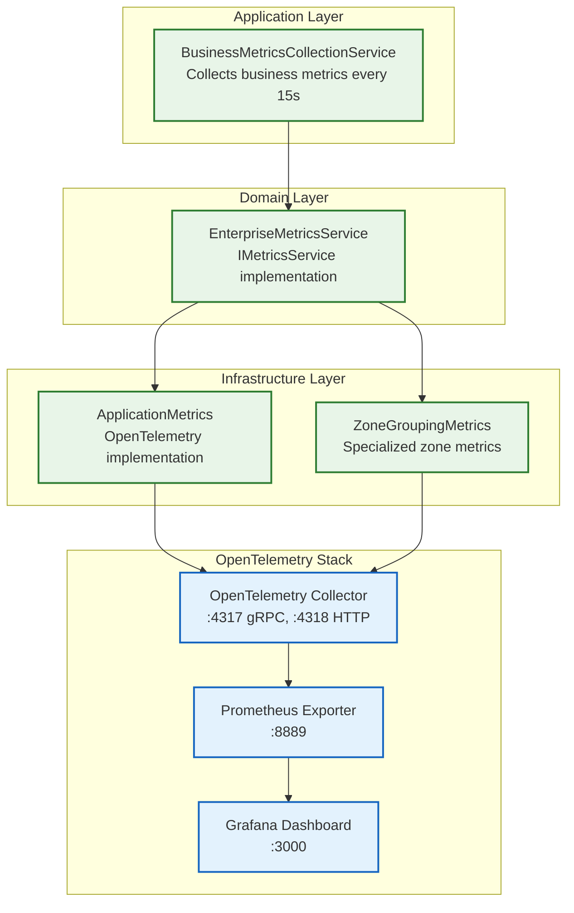

# 13. Metrics and Telemetry Infrastructure Layer

## 13.1. Architecture Overview



## 13.2. Metrics Categories

### 13.2.1. Business Metrics (Real-time)

**Collected every 15 seconds by BusinessMetricsCollectionService**:

| Metric | Description | Implementation |
|--------|-------------|----------------|
| `snapdog_zones_total` | Total configured zones | `IZoneManager.GetAllZoneStatesAsync().Count` |
| `snapdog_zones_active` | Zones not stopped | `zones.Count(z => z.PlaybackState != Stopped)` |
| `snapdog_clients_connected` | Connected Snapcast clients | `clients.Count(c => c.Connected)` |
| `snapdog_tracks_playing` | Currently playing tracks | `zones.Count(z => z.PlaybackState == Playing)` |

### 13.2.2. System Metrics (Real-time)

**Collected every 30 seconds by EnterpriseMetricsService**:

| Metric | Description | Source |
|--------|-------------|--------|
| `snapdog_system_cpu_usage_percent` | CPU usage percentage | Process.TotalProcessorTime |
| `snapdog_system_memory_usage_mb` | Memory usage in MB | Process.WorkingSet64 |
| `snapdog_system_memory_usage_percent` | Memory usage percentage | GC.GetGCMemoryInfo() |
| `snapdog_system_uptime_seconds` | Application uptime | DateTime.UtcNow - startTime |
| `snapdog_system_connections_active` | Active connections | ThreadPool metrics |
| `snapdog_system_threadpool_threads` | Thread pool threads | ThreadPool.GetAvailableThreads() |

### 13.2.3. HTTP Metrics (Per-request)

| Metric | Description | Labels |
|--------|-------------|--------|
| `snapdog_http_requests_total` | Total HTTP requests | method, endpoint, status_code |
| `snapdog_http_request_duration_seconds` | Request duration histogram | method, endpoint, status_code |
| `snapdog_http_requests_errors_total` | HTTP errors (4xx/5xx) | method, endpoint, status_code |

### 13.2.4. Command/Query Metrics (Per-operation)

| Metric | Description | Labels |
|--------|-------------|--------|
| `snapdog_commands_total` | Total commands processed | command, success |
| `snapdog_queries_total` | Total queries processed | query, success |
| `snapdog_command_duration_seconds` | Command duration histogram | command, success |
| `snapdog_query_duration_seconds` | Query duration histogram | query, success |
| `snapdog_command_errors_total` | Command processing errors | command |
| `snapdog_query_errors_total` | Query processing errors | query |

### 13.2.5. Zone Grouping Metrics (Per-operation)

| Metric | Description | Labels |
|--------|-------------|--------|
| `zone_grouping_reconciliations_total` | Zone grouping reconciliations | success |
| `zone_grouping_reconciliation_duration_seconds` | Reconciliation duration | success |
| `zone_grouping_client_updates_total` | Client name updates | - |
| `zone_grouping_errors_total` | Zone grouping errors | error_type, operation |

### 13.2.6. Error Tracking (Per-error)

| Metric | Description | Labels |
|--------|-------------|--------|
| `snapdog_errors_total` | Application errors | error_type, component, operation |
| `snapdog_exceptions_total` | Unhandled exceptions | exception_type, component, operation |
| `snapdog_track_changes_total` | Track changes | zone_id |
| `snapdog_volume_changes_total` | Volume changes | target_id, target_type |

## 13.3. Implementation Details

### 13.3.1. Service Registration (Program.cs)

```csharp
// OpenTelemetry metrics infrastructure
builder.Services.AddSingleton<ApplicationMetrics>();
builder.Services.AddSingleton<IApplicationMetrics>(provider =>
    provider.GetRequiredService<ApplicationMetrics>());

// Enterprise metrics service (implements IMetricsService)
builder.Services.AddSingleton<EnterpriseMetricsService>();
builder.Services.AddSingleton<IMetricsService>(provider =>
    provider.GetRequiredService<EnterpriseMetricsService>());

// Business metrics collection background service
builder.Services.AddHostedService<BusinessMetricsCollectionService>();

// Zone grouping metrics
builder.Services.AddSingleton<ZoneGroupingMetrics>();
```

### 13.3.2. OpenTelemetry Configuration

**Collector Configuration** (`devcontainer/otel/otel-collector-config.yaml`):

```yaml
receivers:
  otlp:
    protocols:
      grpc:
        endpoint: 0.0.0.0:4317
      http:
        endpoint: 0.0.0.0:4318

processors:
  batch:
    timeout: 1s
    send_batch_size: 1024
  resource:
    attributes:
      - key: service.namespace
        value: snapdog
      - key: deployment.environment
        value: development

exporters:
  prometheus:
    endpoint: "0.0.0.0:8889"
    const_labels:
      environment: development
      service: snapdog
  debug:
    verbosity: normal

service:
  pipelines:
    metrics:
      receivers: [otlp]
      processors: [batch, resource]
      exporters: [prometheus, debug]
```

### 13.3.3. Docker Compose Integration

```yaml
# OpenTelemetry Collector
otel-collector:
  image: otel/opentelemetry-collector-contrib:0.112.0
  container_name: snapdog-otel-collector
  command: ["--config=/etc/otel-collector-config.yaml"]
  volumes:
    - ./devcontainer/otel/otel-collector-config.yaml:/etc/otel-collector-config.yaml:ro
  networks:
    snapdog-dev:

# Grafana Dashboard
grafana:
  image: grafana/grafana:latest
  container_name: snapdog-grafana
  environment:
    - GF_SECURITY_ADMIN_PASSWORD=admin
  volumes:
    - grafana-storage:/var/lib/grafana
  networks:
    snapdog-dev:
```

## 13.4. Grafana Dashboard Access

**Development Environment**:

- **URL**: <http://localhost:8000/grafana/>
- **Credentials**: admin/admin
- **Prometheus Data Source**: <http://otel-collector:8889>

**Key Dashboards**:

1. **Business Metrics**: Zones, clients, tracks playing
2. **System Performance**: CPU, memory, uptime, connections
3. **API Performance**: HTTP request rates, durations, errors
4. **Command/Query Performance**: CQRS operation metrics
5. **Error Tracking**: Application errors and exceptions

## 13.5. Metrics Collection Patterns

### 13.5.1. Automatic Collection

```csharp
// Business metrics - collected every 15 seconds
public class BusinessMetricsCollectionService : BackgroundService
{
    protected override async Task ExecuteAsync(CancellationToken stoppingToken)
    {
        while (!stoppingToken.IsCancellationRequested)
        {
            await CollectBusinessMetricsAsync();
            await Task.Delay(TimeSpan.FromSeconds(15), stoppingToken);
        }
    }
}

// System metrics - collected every 30 seconds
private readonly Timer _systemMetricsTimer = new Timer(
    CollectSystemMetrics, null, TimeSpan.Zero, TimeSpan.FromSeconds(30));
```

### 13.5.2. Event-Driven Collection

```csharp
// HTTP requests - collected per request
public void RecordHttpRequest(string method, string endpoint, int statusCode, double durationSeconds)
{
    _httpRequestsTotal.Add(1, new[] {
        new("method", method),
        new("endpoint", endpoint),
        new("status_code", statusCode.ToString())
    });
}

// Commands/Queries - collected per operation
public void RecordCommand(string commandName, double durationSeconds, bool success)
{
    _commandsTotal.Add(1, new[] {
        new("command", commandName),
        new("success", success.ToString().ToLowerInvariant())
    });
}
```

## 13.6. Performance Characteristics

### 13.6.1. Collection Overhead

| Component | Frequency | Overhead | Impact |
|-----------|-----------|----------|---------|
| Business Metrics | 15s | ~5ms | Minimal |
| System Metrics | 30s | ~10ms | Minimal |
| HTTP Metrics | Per-request | ~0.1ms | Negligible |
| Command Metrics | Per-operation | ~0.05ms | Negligible |

### 13.6.2. Storage Requirements

| Metric Type | Cardinality | Storage/Day | Retention |
|-------------|-------------|-------------|-----------|
| Business | ~10 series | ~1MB | 30 days |
| System | ~20 series | ~2MB | 30 days |
| HTTP | ~100 series | ~10MB | 7 days |
| Commands | ~200 series | ~20MB | 7 days |

## 13.7. Monitoring and Alerting

### 13.7.1. Key Performance Indicators (KPIs)

```promql
# Business Health
snapdog_zones_active / snapdog_zones_total * 100  # Zone utilization %
snapdog_clients_connected                          # Client connectivity
snapdog_tracks_playing                             # Active playback

# System Health
snapdog_system_cpu_usage_percent                   # CPU utilization
snapdog_system_memory_usage_percent                # Memory utilization
rate(snapdog_http_requests_errors_total[5m])       # Error rate

# Performance
histogram_quantile(0.95, snapdog_http_request_duration_seconds)  # 95th percentile latency
histogram_quantile(0.95, snapdog_command_duration_seconds)       # Command latency
```

### 13.7.2. Recommended Alerts

| Alert | Condition | Severity |
|-------|-----------|----------|
| High Error Rate | `rate(snapdog_errors_total[5m]) > 10` | Warning |
| High CPU Usage | `snapdog_system_cpu_usage_percent > 80` | Warning |
| High Memory Usage | `snapdog_system_memory_usage_percent > 90` | Critical |
| No Connected Clients | `snapdog_clients_connected == 0` | Warning |
| High Request Latency | `histogram_quantile(0.95, snapdog_http_request_duration_seconds) > 1` | Warning |

## 13.8. Development and Production

### 13.8.1. Development Environment

- **OpenTelemetry Collector**: Standalone container with debug exporters
- **Grafana**: Pre-configured with Prometheus data source
- **Debug Logging**: Detailed metrics logging for development
- **Hot Reload**: Metrics collection continues during code changes

### 13.8.2. Production Considerations

- **Collector Scaling**: Deploy collector as sidecar or dedicated service
- **Storage**: Use persistent Prometheus or cloud metrics service
- **Retention**: Configure appropriate retention policies
- **Security**: Enable authentication and TLS for production
- **Monitoring**: Monitor the monitoring system itself

## 13.9. Future Enhancements

### 13.9.1. Planned Features

- **Distributed Tracing**: Add OpenTelemetry tracing for request flows
- **Custom Dashboards**: Zone-specific and client-specific dashboards
- **Anomaly Detection**: ML-based anomaly detection for metrics
- **SLA Monitoring**: Service level agreement tracking and reporting

### 13.9.2. Integration Opportunities

- **MQTT Metrics**: Publish key metrics via MQTT for external systems
- **KNX Integration**: Expose system health via KNX for building automation
- **Mobile Notifications**: Push critical alerts to mobile devices
- **External APIs**: Expose metrics via REST API for third-party integration

---

**The SnapDog2 metrics and telemetry system provides enterprise-grade observability with minimal overhead and comprehensive coverage of all system components.**
