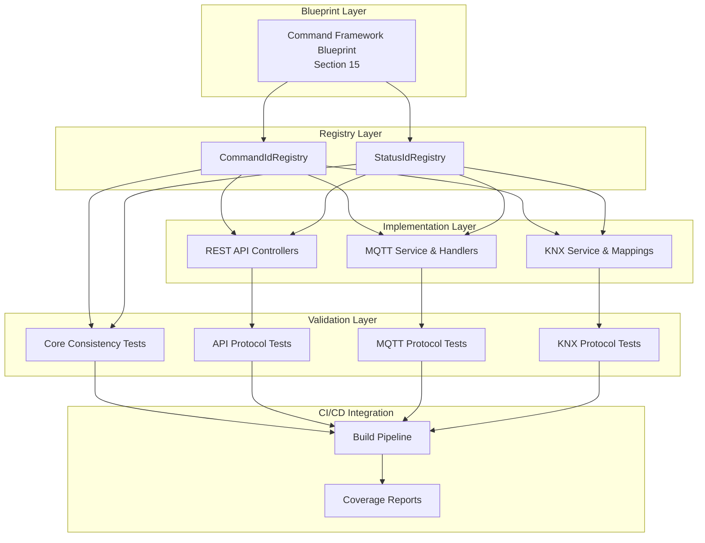

# 16. b. Command Framework Consistency Framework

## 16.1. b.1. Overview

The Command Framework Consistency Framework ensures that all command and status IDs defined in the blueprint (Section 15) are properly implemented across all protocols (API, MQTT, KNX). This framework prevents implementation drift and catches missing features early in the development cycle.

### 16.1.1. b.1.1. Problem Statement

During recent analysis, we discovered that 6 out of 8 newly added command/status IDs were not implemented across protocols:

- **Missing Global Status**: `CLIENTS_INFO`
- **Missing Zone Commands**: `CONTROL_SET` (partial), `ZONE_NAME`
- **Missing Zone Status**: `PLAYLIST_NAME_STATUS`, `PLAYLIST_COUNT_STATUS`, `ZONE_NAME_STATUS`, `CONTROL_STATUS`
- **Missing Client Status**: `CLIENT_NAME_STATUS`

This indicates a gap between blueprint specification and actual implementation that needs systematic prevention.

### 16.1.2. b.1.2. Design Principles

1. **Fail Fast**: Catch inconsistencies at build time, not runtime
2. **Zero Runtime Overhead**: Validation only during testing/CI
3. **Comprehensive Coverage**: Validate all protocols against registries
4. **Developer Friendly**: Clear error messages and actionable feedback
5. **Maintainable**: Self-updating as new commands/status are added

## 16.2. b.2. Architecture

### 16.2.1. b.2.1. Validation Layers



### 16.2.2. b.2.2. Test-Based Validation Strategy

The consistency framework is implemented as **unit tests** rather than runtime services for the following reasons:

**✅ Benefits of Test-Based Approach:**
- **Build-Time Validation**: Prevents inconsistent code from reaching production
- **CI/CD Integration**: Automatic validation on every commit
- **Zero Runtime Cost**: No performance impact on production systems
- **Developer Feedback**: Immediate feedback during development
- **Simple Maintenance**: Standard test lifecycle and tooling

**❌ Why Not Runtime Services:**
- Runtime overhead for development-time issues
- Complex service lifecycle management
- Health check complexity for static validation
- Unnecessary production dependencies

## 16.3. b.3. Consistency Test Categories

### 16.3.1. b.3.1. Core Registry Tests

**Purpose**: Validate the integrity and consistency of the command/status registries themselves.

| Test Name | Description | Validation |
|:----------|:------------|:-----------|
| `CommandIdRegistry_ShouldBeInitialized` | Registry contains expected commands | Count > 0, initialization successful |
| `StatusIdRegistry_ShouldBeInitialized` | Registry contains expected status | Count > 0, initialization successful |
| `AllRegisteredCommands_HaveCorrespondingClasses` | Every registry entry has a class | CommandId → Command class mapping |
| `AllRegisteredStatus_HaveCorrespondingClasses` | Every registry entry has a notification | StatusId → Notification class mapping |
| `AllCommandClasses_AreRegisteredInRegistry` | Every command class is registered | Command class → Registry mapping |
| `AllNotificationClasses_AreRegisteredInRegistry` | Every notification class is registered | Notification class → Registry mapping |
| `CommandIdRegistry_HasNoDuplicateIds` | No duplicate command IDs | Unique ID constraint |
| `StatusIdRegistry_HasNoDuplicateIds` | No duplicate status IDs | Unique ID constraint |
| `AllCommandIds_FollowNamingConvention` | UPPER_CASE_UNDERSCORE format | Naming consistency |
| `AllStatusIds_FollowNamingConvention` | UPPER_CASE_UNDERSCORE format | Naming consistency |

### 16.3.2. b.3.2. Protocol Implementation Tests

**Purpose**: Validate that each protocol properly implements all applicable commands and status notifications.

#### 16.3.2.1. b.3.2.1. API Protocol Tests

| Test Name | Description | Validation |
|:----------|:------------|:-----------|
| `AllCommands_HaveCorrespondingApiEndpoints` | Every command has REST endpoint | Command → HTTP endpoint mapping |
| `AllStatus_HaveCorrespondingApiEndpoints` | Every status has GET endpoint | Status → HTTP GET endpoint mapping |
| `AllApiEndpoints_MapToRegisteredCommands` | No orphaned endpoints | HTTP endpoint → Command mapping |
| `ApiEndpoints_UseCorrectHttpMethods` | Commands use POST/PUT, Status use GET | HTTP method consistency |
| `ApiEndpoints_FollowRestConventions` | RESTful URL patterns | URL structure validation |
| `ApiControllers_HandleAllZoneCommands` | Zone commands in ZonesController | Controller organization |
| `ApiControllers_HandleAllClientCommands` | Client commands in ClientsController | Controller organization |
| `ApiControllers_HandleAllGlobalStatus` | Global status in SystemController | Controller organization |

#### 16.3.2.2. b.3.2.2. MQTT Protocol Tests

| Test Name | Description | Validation |
|:----------|:------------|:-----------|
| `AllCommands_SupportedByMqttCommandFactory` | CommandFactory handles all commands | Command → Factory method mapping |
| `AllStatus_PublishedByMqttHandlers` | Notification handlers publish all status | Status → MQTT publisher mapping |
| `MqttTopics_MapToRegisteredCommands` | Topic structure matches commands | Topic → Command mapping |
| `MqttPayloads_SupportAllCommandVariants` | Payload parsing handles all formats | Payload format validation |
| `MqttNotificationHandlers_CoverAllStatus` | All status have notification handlers | Status → Handler mapping |
| `MqttTopicStructure_FollowsConventions` | Hierarchical topic naming | Topic naming consistency |
| `MqttRetainedMessages_ConfiguredCorrectly` | Status topics use retained messages | Retention policy validation |

#### 16.3.2.3. b.3.2.3. KNX Protocol Tests

| Test Name | Description | Validation |
|:----------|:------------|:-----------|
| `KnxSuitableCommands_HaveGroupAddressMappings` | KNX-appropriate commands mapped | Command → Group Address mapping |
| `KnxSuitableStatus_HaveGroupAddressMappings` | KNX-appropriate status mapped | Status → Group Address mapping |
| `KnxDataPointTypes_AreCorrectlyMapped` | DPT mappings match data types | DPT validation |
| `KnxUnsuitableFeatures_AreIntentionallyExcluded` | Complex features properly excluded | Exclusion validation |
| `KnxConfiguration_CoversAllSuitableFeatures` | Config classes have all mappings | Configuration completeness |
| `KnxGroupAddresses_AreUnique` | No duplicate group addresses | Address uniqueness |
| `KnxCommandHandling_SupportsAllMappedCommands` | KNX service handles mapped commands | Command processing validation |

### 16.3.3. b.3.3. Cross-Protocol Consistency Tests

**Purpose**: Validate consistency across all protocols and identify gaps.

| Test Name | Description | Validation |
|:----------|:------------|:-----------|
| `AllProtocols_SupportSameCommandSet` | Consistent command support | Cross-protocol command parity |
| `AllProtocols_PublishSameStatusSet` | Consistent status publishing | Cross-protocol status parity |
| `ProtocolExclusions_AreDocumented` | Intentional exclusions documented | Exclusion documentation |
| `NewlyAddedFeatures_AreTracked` | Recent additions identified | Implementation tracking |
| `ImplementationGaps_AreReported` | Missing implementations listed | Gap reporting |

## 16.4. b.4. Implementation Strategy

### 16.4.1. b.4.1. Test Organization

```
SnapDog2.Tests/
├── Core/
│   └── Validation/
│       ├── CommandFrameworkConsistencyTests.cs      # Core registry tests
│       ├── ApiProtocolConsistencyTests.cs           # API-specific tests
│       ├── MqttProtocolConsistencyTests.cs          # MQTT-specific tests
│       ├── KnxProtocolConsistencyTests.cs           # KNX-specific tests
│       └── CrossProtocolConsistencyTests.cs         # Cross-protocol tests
└── Helpers/
    └── ConsistencyTestHelpers.cs                    # Shared test utilities
```

### 16.4.2. b.4.2. Test Execution Strategy

#### 16.4.2.1. b.4.2.1. Local Development
```bash
# Run all consistency tests
dotnet test --filter "Category=Consistency"

# Run protocol-specific tests
dotnet test --filter "Category=ApiConsistency"
dotnet test --filter "Category=MqttConsistency"
dotnet test --filter "Category=KnxConsistency"

# Generate consistency report
dotnet test --logger "trx;LogFileName=consistency-report.trx"
```

#### 16.4.2.2. b.4.2.2. CI/CD Integration
```yaml
# GitHub Actions / Azure DevOps
- name: Run Consistency Tests
  run: |
    dotnet test --filter "Category=Consistency" \
      --logger "trx;LogFileName=consistency-report.trx" \
      --logger "console;verbosity=detailed"
    
- name: Upload Consistency Report
  uses: actions/upload-artifact@v3
  with:
    name: consistency-report
    path: consistency-report.trx
```

### 16.4.3. b.4.3. Error Reporting Strategy

#### 16.4.3.1. b.4.3.1. Test Failure Messages
```csharp
Assert.That(missingCommands, Is.Empty,
    $"Missing API endpoints for commands: {string.Join(", ", missingCommands)}\n" +
    $"Add these endpoints to the appropriate controllers:\n" +
    $"{GenerateEndpointSuggestions(missingCommands)}");
```

#### 16.4.3.2. b.4.3.2. Implementation Suggestions
```csharp
private string GenerateEndpointSuggestions(IEnumerable<string> missingCommands)
{
    return string.Join("\n", missingCommands.Select(cmd => 
        $"  - {cmd}: POST /api/v1/{GetControllerPath(cmd)}/{GetEndpointPath(cmd)}"));
}
```

### 16.4.4. b.4.4. Tolerance for New Features

The framework includes tolerance for recently added features that may not be fully implemented:

```csharp
private bool IsRecentlyAddedFeature(string featureId)
{
    var recentlyAdded = new[]
    {
        "CONTROL_SET", "ZONE_NAME", "CLIENTS_INFO", 
        "PLAYLIST_NAME_STATUS", "CLIENT_NAME_STATUS"
    };
    return recentlyAdded.Contains(featureId);
}
```

**Tolerance Strategy:**
- **Warning**: Recently added features generate warnings, not failures
- **Grace Period**: 2-week implementation window for new features
- **Tracking**: Progress tracking for incomplete implementations
- **Documentation**: Clear TODO items for missing implementations

## 16.5. b.5. Reporting and Metrics

### 16.5.1. b.5.1. Consistency Metrics

| Metric | Description | Target |
|:-------|:------------|:-------|
| **Overall Completion** | (Implemented Features / Total Features) × 100 | ≥ 95% |
| **API Coverage** | (API Endpoints / Total Commands+Status) × 100 | ≥ 95% |
| **MQTT Coverage** | (MQTT Support / Total Commands+Status) × 100 | ≥ 95% |
| **KNX Coverage** | (KNX Support / KNX-Suitable Features) × 100 | ≥ 90% |
| **Registry Integrity** | All registered features have implementations | 100% |

### 16.5.2. b.5.2. Report Generation

#### 16.5.2.1. b.5.2.1. Console Output
```
Command Framework Consistency Report
====================================
Generated: 2025-08-22 13:16:21 UTC

Overall Completion: 92.3% (72/78 features)
├── API Coverage: 92.3% (72/78 endpoints)
├── MQTT Coverage: 92.3% (72/78 features)
└── KNX Coverage: 94.0% (47/50 suitable features)

Missing Implementations (6):
├── API: CLIENTS_INFO, CONTROL_SET, ZONE_NAME, PLAYLIST_NAME_STATUS, CLIENT_NAME_STATUS
├── MQTT: CLIENTS_INFO, CONTROL_SET, ZONE_NAME, PLAYLIST_NAME_STATUS, CLIENT_NAME_STATUS  
└── KNX: CONTROL_SET, ZONE_NAME, PLAYLIST_NAME_STATUS, CLIENT_NAME_STATUS

Recently Added Features (Grace Period):
└── All missing items are from recent blueprint additions (commit ff7db9d)
```

#### 16.5.2.2. b.5.2.2. Markdown Report Generation
```csharp
public string GenerateMarkdownReport()
{
    return $"""
        # Command Framework Consistency Report
        
        **Generated**: {DateTime.UtcNow:yyyy-MM-dd HH:mm:ss} UTC
        
        ## Summary
        - **Overall Completion**: {OverallPercentage:F1}%
        - **Total Features**: {TotalFeatures}
        - **Missing**: {MissingCount}
        
        ## Protocol Breakdown
        {GenerateProtocolTable()}
        
        ## Missing Implementations
        {GenerateMissingItemsList()}
        """;
}
```

### 16.5.3. b.5.3. Integration with Implementation Status Document

The consistency framework automatically updates the implementation status document:

```csharp
[Test]
public void ImplementationStatusDocument_ShouldReflectActualState()
{
    // Generate current consistency report
    var report = GenerateConsistencyReport();
    
    // Read existing implementation status document
    var statusDoc = File.ReadAllText("docs/implementation/command-implementation-status.md");
    
    // Validate that documented percentages match actual implementation
    Assert.That(ExtractDocumentedPercentage(statusDoc), 
        Is.EqualTo(report.OverallPercentage).Within(1.0),
        "Implementation status document should reflect actual implementation state");
}
```

## 16.6. b.6. Maintenance and Evolution

### 16.6.1. b.6.1. Adding New Commands/Status

When new commands or status are added to the blueprint:

1. **Registry Update**: Add `[CommandId]` or `[StatusId]` attribute to new classes
2. **Test Execution**: Consistency tests automatically detect new registrations
3. **Implementation Tracking**: Tests identify missing protocol implementations
4. **Grace Period**: New features get 2-week implementation window
5. **Documentation Update**: Implementation status document reflects changes

### 16.6.2. b.6.2. Protocol Evolution

When protocols evolve (new endpoints, topics, group addresses):

1. **Test Updates**: Update protocol-specific tests to reflect new patterns
2. **Mapping Updates**: Update command/status mapping logic
3. **Validation Rules**: Adjust validation rules for new protocol features
4. **Backward Compatibility**: Ensure existing implementations remain valid

### 16.6.3. b.6.3. Continuous Improvement

The consistency framework itself evolves based on:

- **False Positives**: Refine detection logic to reduce noise
- **Coverage Gaps**: Add new validation categories as needed
- **Developer Feedback**: Improve error messages and suggestions
- **Performance**: Optimize test execution time

## 16.7. b.7. Benefits and ROI

### 16.7.1. b.7.1. Immediate Benefits

- **Catch Missing Implementations**: Automatically detect the 6 missing items found manually
- **Prevent Regression**: Ensure new features don't break existing consistency
- **Developer Productivity**: Clear guidance on what needs implementation
- **Quality Assurance**: Systematic validation of blueprint adherence

### 16.7.2. b.7.2. Long-term Benefits

- **Reduced Maintenance**: Automatic detection prevents manual audits
- **Faster Development**: Clear implementation requirements
- **Better Documentation**: Always up-to-date implementation status
- **Architectural Integrity**: Maintain clean separation between protocols

### 16.7.3. b.7.3. Risk Mitigation

- **Implementation Drift**: Prevent protocols from diverging
- **Feature Gaps**: Catch missing functionality early
- **Documentation Staleness**: Keep implementation docs current
- **Integration Issues**: Validate cross-protocol consistency

This consistency framework ensures that the SnapDog2 command framework remains robust, complete, and maintainable as it evolves.
