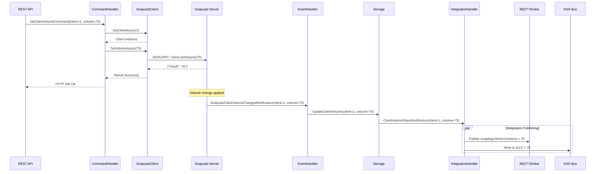
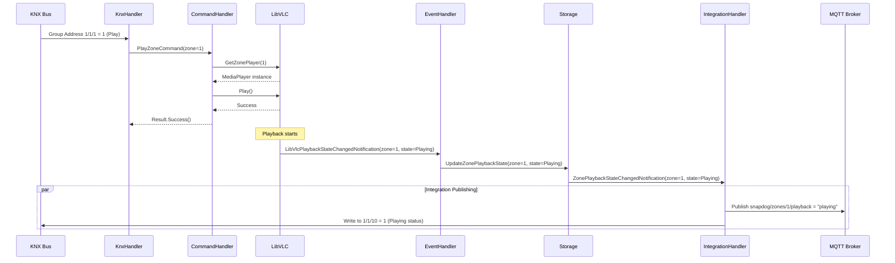
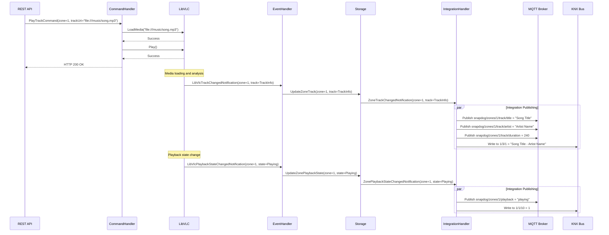

# 24. Command-Status Flow Pattern -- Updating State Values

## 24.1. Overview

The Command-Status Flow Pattern is a robust, event-driven architectural pattern that ensures eventual consistency and single-source-of-truth semantics across distributed systems. This pattern decouples command execution from state management and integration publishing, creating a resilient system that accurately reflects the real state of external systems.

## 24.2. Pattern Definition

### 24.2.1. Core Flow

```plaintext
Command → Service Action → External System → Notification → Storage Update → Integration Publishing
```

### 24.2.2. Detailed Breakdown

#### 24.2.2.1. Command (Input Layer)

**Definition**: A request to change system state, originating from any integration point.

**Characteristics**:

- Represents user intent or automated system action
- Contains target entity and desired state
- Source-agnostic (API, MQTT, KNX, UI, scheduled tasks)
- Immutable once created
- May fail without affecting system state

**Examples**:

- `SetClientVolumeCommand(clientIndex=1, volume=75)`
- `SetZoneMuteCommand(zoneIndex=2, muted=true)`
- `PlayTrackCommand(zoneIndex=1, trackIndex=2)`

#### 24.2.2.2. Service Action (Command Processing)

**Definition**: The business logic that translates commands into external system operations.

**Characteristics**:

- Validates command parameters
- Retrieves necessary entities (clients, zones, etc.)
- Calls external system APIs
- Does NOT update internal storage
- Does NOT publish to integrations
- Returns success/failure result

**Responsibilities**:

- Parameter validation and sanitization
- Entity existence verification
- External system communication
- Error handling and logging
- Result reporting

#### 24.2.2.3. External System (State Authority)

**Definition**: The authoritative source of truth for specific domain state.

**Characteristics**:

- Maintains actual system state (volume, playback, etc.)
- Processes requests asynchronously
- May reject or modify requests
- Sends notifications when state changes
- Independent of our application lifecycle

**Examples**:

- Snapcast Server (audio client state)
- LibVLC (media playback state)

#### 24.2.2.4. Notification (Event Layer)

**Definition**: Asynchronous events emitted by external systems when state changes occur.

**Characteristics**:

- Represents confirmed state changes
- Contains actual (not requested) values
- May differ from original command values
- Triggers internal state synchronization
- Source of truth for storage updates

**Event Types**:

- State change confirmations
- Unsolicited state updates
- Error notifications
- Connection status changes

#### 24.2.2.5. Storage Update (State Synchronization)

**Definition**: The process of updating internal storage to reflect confirmed external system state.

**Characteristics**:

- Only source of internal state changes
- Triggered exclusively by external notifications
- Maintains single source of truth
- Atomic and consistent updates
- Triggers integration publishing

**Storage Entities**:

- Client state (volume, mute, connection status)
- Zone state (playback, track, playlist)
- System state (connection status, errors)

#### 24.2.2.6. Integration Publishing (Output Layer)

**Definition**: Broadcasting confirmed state changes to all integration endpoints.

**Characteristics**:

- Triggered only by storage updates
- Publishes to all integrations simultaneously
- Uses confirmed, consistent state
- Handles integration-specific formatting
- Resilient to individual integration failures

**Integration Targets**:

- MQTT topics
- KNX group addresses
- REST API caches
- Metrics systems

## 24.3. Architectural Benefits

### 24.3.1. Single Source of Truth

- Internal storage reflects only confirmed external state
- All integrations receive identical, consistent data
- No phantom states or race conditions
- Clear audit trail of actual vs requested changes

### 24.3.2. Eventually Consistent

- System converges to correct state regardless of command failures
- Handles network partitions and temporary failures gracefully
- Self-healing through external system notifications
- Resilient to integration endpoint failures

### 24.3.3. Decoupled Architecture

- Commands don't directly affect integrations
- External systems operate independently
- Integration changes don't affect core logic
- Easy to add/remove integration endpoints

### 24.3.4. Error Resilience

- Failed commands don't pollute integration state
- External system rejections are handled naturally
- Integration failures don't affect core functionality
- Clear separation of concerns for debugging

## 24.4. Implementation Examples

### 24.4.1. Example 1: Snapcast Server Integration

#### 24.4.1.1. Scenario: User sets client volume via API



#### 24.4.1.2. Code Implementation

**Command Handler**:

```csharp
public class SetClientVolumeCommandHandler : ICommandHandler<SetClientVolumeCommand>
{
    public async Task<Result> Handle(SetClientVolumeCommand request, CancellationToken cancellationToken)
    {
        // 1. Validate and get client
        var clientResult = await _clientManager.GetClientAsync(request.ClientIndex);
        if (clientResult.IsFailure)
            return clientResult;

        // 2. Instruct external system (Snapcast Server)
        var result = await clientResult.Value.SetVolumeAsync(request.Volume);

        // 3. Return result - NO storage update, NO integration publishing
        return result;
    }
}
```

**Event Handler**:

```csharp
public class SnapcastEventNotificationHandler : INotificationHandler<SnapcastClientVolumeChangedNotification>
{
    public async Task Handle(SnapcastClientVolumeChangedNotification notification, CancellationToken cancellationToken)
    {
        // 1. Parse and validate notification
        if (!int.TryParse(notification.ClientIndex, out var clientIndex))
            return;

        // 2. Update storage (single source of truth)
        await _clientStorage.UpdateVolumeAsync(clientIndex, notification.Volume.Percent);

        // 3. Trigger integration publishing
        await _mediator.PublishAsync(new ClientVolumeStatusNotification(clientIndex, notification.Volume.Percent));
    }
}
```

**Integration Handler**:

```csharp
public class SmartMqttNotificationHandlers : INotificationHandler<ClientVolumeStatusNotification>
{
    public async Task Handle(ClientVolumeStatusNotification notification, CancellationToken cancellationToken)
    {
        // 1. Publish to MQTT
        await _mqttService.PublishClientVolumeAsync(notification.ClientIndex, notification.Volume);

        // 2. Publish to KNX
        await _mediator.PublishAsync(new StatusChangedNotification
        {
            StatusType = StatusIds.ClientVolumeStatus,
            TargetId = notification.ClientIndex.ToString(),
            Value = notification.Volume
        });
    }
}
```

#### 24.4.1.3. Edge Cases Handled

**Volume Clamping**:

```
Command: SetClientVolumeCommand(client=1, volume=150)
Snapcast: Clamps to maximum (100)
Notification: SnapcastClientVolumeChangedNotification(client=1, volume=100)
Storage: client.volume = 100 (actual value)
Integrations: Publish volume=100 (not 150)
```

**Command Rejection**:

```
Command: SetClientVolumeCommand(client=999, volume=50)
Snapcast: Client not found error
Result: Command fails, no notification sent
Storage: Unchanged
Integrations: No updates (correct behavior)
```

### 24.4.2. Example 2: LibVLC Integration

#### 24.4.2.1. Scenario: Zone playback control via KNX



#### 24.4.2.2. Code Implementation

**Command Handler**:

```csharp
public class PlayZoneCommandHandler : ICommandHandler<PlayZoneCommand>
{
    public async Task<Result> Handle(PlayZoneCommand request, CancellationToken cancellationToken)
    {
        // 1. Get zone media player
        var playerResult = await _zoneManager.GetMediaPlayerAsync(request.ZoneIndex);
        if (playerResult.IsFailure)
            return playerResult;

        // 2. Instruct external system (LibVLC)
        var result = await playerResult.Value.PlayAsync();

        // 3. Return result - NO storage update, NO integration publishing
        return result;
    }
}
```

**Event Handler**:

```csharp
public class LibVlcEventNotificationHandler : INotificationHandler<LibVlcPlaybackStateChangedNotification>
{
    public async Task Handle(LibVlcPlaybackStateChangedNotification notification, CancellationToken cancellationToken)
    {
        // 1. Update storage (single source of truth)
        await _zoneStorage.UpdatePlaybackStateAsync(notification.ZoneIndex, notification.State);

        // 2. Trigger integration publishing
        await _mediator.PublishAsync(new ZonePlaybackStateChangedNotification
        {
            ZoneIndex = notification.ZoneIndex,
            State = notification.State,
            TimestampUtc = DateTime.UtcNow
        });
    }
}
```

#### 24.4.2.3. Complex Scenario: Track Change with Metadata



## 24.5. Pattern Variations

### 24.5.1. Immediate Response Pattern

For commands requiring immediate feedback (UI responsiveness):

```csharp
public async Task<Result> Handle(SetClientVolumeCommand request, CancellationToken cancellationToken)
{
    // 1. Execute command
    var result = await client.SetVolumeAsync(request.Volume);

    // 2. For immediate UI feedback, return optimistic result
    if (result.IsSuccess)
    {
        // Optional: Publish optimistic update with TTL
        await _mediator.PublishAsync(new ClientVolumeOptimisticNotification(
            clientIndex: request.ClientIndex,
            volume: request.Volume,
            ttl: TimeSpan.FromSeconds(5)
        ));
    }

    return result;
}
```

### 24.5.2. Batch Operation Pattern

For operations affecting multiple entities:

```csharp
public async Task<Result> Handle(SetZoneVolumeCommand request, CancellationToken cancellationToken)
{
    var results = new List<Result>();

    // 1. Get all clients in zone
    var clients = await _zoneManager.GetClientsAsync(request.ZoneIndex);

    // 2. Execute commands in parallel
    var tasks = clients.Select(client => client.SetVolumeAsync(request.Volume));
    var commandResults = await Task.WhenAll(tasks);

    // 3. Individual notifications will trigger storage updates
    // No direct integration publishing needed

    return Result.Combine(commandResults);
}
```

### 24.5.3. Compensation Pattern

For operations requiring rollback:

```csharp
public async Task<Result> Handle(SynchronizeZoneCommand request, CancellationToken cancellationToken)
{
    var originalStates = new Dictionary<int, int>();

    try
    {
        // 1. Capture current states
        foreach (var client in zone.Clients)
        {
            originalStates[client.Id] = client.Volume;
        }

        // 2. Execute synchronization
        var results = await ExecuteSynchronizationAsync(request);

        if (results.Any(r => r.IsFailure))
        {
            // 3. Compensate on partial failure
            await CompensateAsync(originalStates);
        }

        return Result.Combine(results);
    }
    catch (Exception ex)
    {
        // 4. Compensate on exception
        await CompensateAsync(originalStates);
        throw;
    }
}
```

## 24.6. Testing Strategies

### 24.6.1. Unit Testing Commands

```csharp
[Test]
public async Task SetClientVolumeCommand_Should_CallSnapcastClient()
{
    // Arrange
    var command = new SetClientVolumeCommand { ClientIndex = 1, Volume = 75 };
    var mockClient = new Mock<ISnapcastClient>();
    mockClient.Setup(c => c.SetVolumeAsync(75)).ReturnsAsync(Result.Success());

    // Act
    var result = await _handler.Handle(command, CancellationToken.None);

    // Assert
    Assert.That(result.IsSuccess, Is.True);
    mockClient.Verify(c => c.SetVolumeAsync(75), Times.Once);
    // Verify NO storage updates or integration publishing
}
```

### 24.6.2. Integration Testing Flow

```csharp
[Test]
public async Task VolumeChangeFlow_Should_UpdateStorageAndPublishToIntegrations()
{
    // Arrange
    var notification = new SnapcastClientVolumeChangedNotification("1", new ClientVolume { Percent = 75 });

    // Act
    await _eventHandler.Handle(notification, CancellationToken.None);

    // Assert
    var storedVolume = await _storage.GetClientVolumeAsync(1);
    Assert.That(storedVolume, Is.EqualTo(75));

    _mockMediator.Verify(m => m.PublishAsync(
        It.Is<ClientVolumeStatusNotification>(n => n.ClientIndex == 1 && n.Volume == 75),
        It.IsAny<CancellationToken>()
    ), Times.Once);
}
```

### 24.6.3. End-to-End Testing

```csharp
[Test]
public async Task CompleteVolumeChangeFlow_Should_PropagateToAllIntegrations()
{
    // Arrange
    var command = new SetClientVolumeCommand { ClientIndex = 1, Volume = 75 };

    // Act
    var result = await _mediator.SendAsync(command);

    // Simulate external system notification
    await _snapcastSimulator.TriggerVolumeChangeAsync(1, 75);

    // Wait for eventual consistency
    await Task.Delay(100);

    // Assert
    Assert.That(result.IsSuccess, Is.True);

    // Verify storage
    var storedVolume = await _storage.GetClientVolumeAsync(1);
    Assert.That(storedVolume, Is.EqualTo(75));

    // Verify MQTT
    _mqttTestClient.AssertMessageReceived("snapdog/clients/1/volume", "75");

    // Verify KNX
    _knxTestClient.AssertGroupAddressWritten("3/1/2", 75);
}
```

## 24.7. Migration Strategy

### 24.7.1. Phase 1: Identify Command Handlers

1. Audit existing command handlers
2. Identify handlers that directly update storage
3. Identify handlers that directly publish to integrations
4. Create migration priority list

### 24.7.2. Phase 2: Implement Event Handlers

1. Create notification handlers for external system events
2. Implement storage update logic
3. Add integration publishing triggers
4. Test event flow independently

### 24.7.3. Phase 3: Refactor Command Handlers

1. Remove storage updates from command handlers
2. Remove integration publishing from command handlers
3. Ensure commands only interact with external systems
4. Update unit tests

### 24.7.4. Phase 4: Validation and Cleanup

1. End-to-end testing of complete flows
2. Performance testing of event-driven architecture
3. Remove obsolete direct integration code
4. Update documentation and training materials

## 24.8. Monitoring and Observability

### 24.8.1. Key Metrics

- **Command Success Rate**: Percentage of commands successfully executed
- **Event Processing Latency**: Time from external notification to storage update
- **Integration Publishing Latency**: Time from storage update to integration delivery
- **Storage Consistency**: Comparison between external system state and internal storage

### 24.8.2. Logging Strategy

```csharp
// Command execution
_logger.LogInformation("Executing {CommandType} for {EntityType} {EntityId}",
    typeof(TCommand).Name, entityType, entityId);

// External system interaction
_logger.LogInformation("Instructing {ExternalSystem} to {Action} for {EntityType} {EntityId}",
    externalSystem, action, entityType, entityId);

// Event processing
_logger.LogInformation("Processing {EventType} for {EntityType} {EntityId}: {State}",
    typeof(TEvent).Name, entityType, entityId, newState);

// Storage updates
_logger.LogInformation("Updated {EntityType} {EntityId} {Property} from {OldValue} to {NewValue}",
    entityType, entityId, property, oldValue, newValue);

// Integration publishing
_logger.LogInformation("Published {EntityType} {EntityId} {Property} change to {IntegrationType}",
    entityType, entityId, property, integrationType);
```

### 24.8.3. Health Checks

```csharp
public class CommandStatusFlowHealthCheck : IHealthCheck
{
    public async Task<HealthCheckResult> CheckHealthAsync(HealthCheckContext context, CancellationToken cancellationToken)
    {
        // Check external system connectivity
        var externalSystemsHealthy = await CheckExternalSystemsAsync();

        // Check event processing pipeline
        var eventPipelineHealthy = await CheckEventPipelineAsync();

        // Check storage consistency
        var storageConsistent = await CheckStorageConsistencyAsync();

        // Check integration endpoints
        var integrationsHealthy = await CheckIntegrationsAsync();

        if (externalSystemsHealthy && eventPipelineHealthy && storageConsistent && integrationsHealthy)
        {
            return HealthCheckResult.Healthy("Command-Status flow is operating normally");
        }

        return HealthCheckResult.Degraded("Some components of Command-Status flow are experiencing issues");
    }
}
```

## 24.9. Conclusion

The Command-Status Flow Pattern provides a robust, scalable, and maintainable architecture for managing state changes across distributed systems. By decoupling command execution from state management and integration publishing, this pattern ensures eventual consistency, improves error resilience, and simplifies system maintenance.

Key benefits include:

- **Single Source of Truth**: Storage reflects only confirmed external state
- **Eventually Consistent**: System converges to correct state regardless of failures
- **Decoupled Architecture**: Easy to modify and extend integrations
- **Error Resilient**: Failed commands don't pollute system state
- **Testable**: Clear separation of concerns enables comprehensive testing

This pattern should be applied to all operations that interact with external systems, ensuring consistent behavior and reliable state management across the entire SnapDog2 platform.
