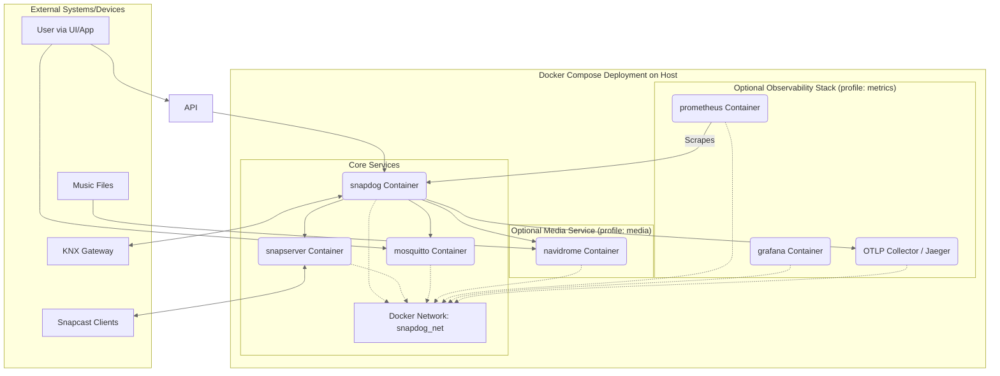

# 23. Deployment and Operations

This section outlines the recommended deployment strategies for SnapDog2, along with approaches for ongoing monitoring, maintenance, and operational procedures necessary for running the system reliably.

## 23.1. Deployment Options

SnapDog2 is designed primarily for containerized deployment using Docker, but other options are possible.

### 23.1.1. Docker Deployment (Recommended)

This is the preferred method, offering consistency, isolation, and simplified dependency management. It typically involves using Docker Compose to orchestrate the necessary containers.

**Core Components:**

* **`snapdog` Container:** Runs the main SnapDog2 .NET application built from the `/docker/snapdog/Dockerfile`. Requires environment variables for configuration.
* **`snapserver` Container:** Runs the Snapcast server. Uses a custom image (built from `/docker/snapserver/Dockerfile` or similar) configured with named pipe sinks corresponding to SnapDog2 zones (`SNAPDOG_ZONE_n_SINK`) and potentially Shairport Sync for AirPlay. Requires environment variables for zone configuration.
* **`mosquitto` Container:** Runs the MQTT broker (e.g., `eclipse-mosquitto:2.0`). Requires configuration file (`mosquitto.conf`) and potentially volumes for data/logs/passwords.

**Optional Components (Activated via Profiles):**

* **`navidrome` Container:** Runs a Subsonic-compatible media server (`deluan/navidrome:latest`). Requires volumes for data and music library access. (Profile: `media`)
* **`jaeger` / OTLP Collector Container:** Runs Jaeger (`jaegertracing/all-in-one`) or a general OTLP collector (like Grafana Agent, OpenTelemetry Collector) for receiving traces. (Profile: `metrics`)
* **`prometheus` Container:** Runs Prometheus (`prom/prometheus`) for scraping metrics. Requires configuration (`prometheus.yml`) defining scrape targets (SnapDog2 `/metrics` endpoint). (Profile: `metrics`)
* **`grafana` Container:** Runs Grafana (`grafana/grafana`) for visualizing metrics and potentially logs/traces. Requires configuration for datasources (Prometheus, Jaeger/Tempo) and dashboards. (Profile: `metrics`)

**Deployment Structure:**

*(See Section 17.4 for a detailed production `docker-compose.yml` example)*

### 23.1.2. Kubernetes Deployment

For larger scale or more managed environments, SnapDog2 can be deployed to Kubernetes using Helm charts or standard manifests (Deployment, Service, ConfigMap, Secret, PersistentVolumeClaim). The core components (SnapDog2, Snapcast, MQTT, Subsonic) would run as distinct Deployments/StatefulSets with associated Services and Persistent Volumes. Observability tools can also be deployed within the cluster or use external managed services. This requires creating appropriate Kubernetes manifests or a Helm chart.

### 23.1.3. Bare Metal / Virtual Machine Deployment

Direct deployment onto a Linux or Windows host is possible but requires manual installation and configuration of all dependencies:

1. .NET 9 Runtime.
2. Native LibVLC libraries.
3. Snapcast Server (compiled or packaged).
4. MQTT Broker (e.g., Mosquitto service).
5. Subsonic-compatible Server (e.g., Navidrome service).
6. KNX Interface drivers/dependencies (if using USB/serial).
7. Configuration via system environment variables or configuration files read by the application.
8. Running SnapDog2 as a system service (e.g., using `systemd` on Linux, Windows Service).

This approach offers less isolation and requires more platform-specific setup.

## 23.2. Monitoring and Observability

Comprehensive monitoring is crucial for ensuring reliable operation.

### 23.2.1. Logging

* **Strategy:** Structured logging using Serilog.
* **Backend:** Configured via `appsettings.json` or environment variables (Sec 10).
* **Sinks (Outputs):**
  * **Console:** Essential for Docker container logs (`docker logs snapdog`). Formatted for readability.
  * **File:** Rotated daily, stored in a configurable path (e.g., mounted volume `/app/logs`). Retain logs for a defined period (e.g., 31 days). Include detailed information like timestamps, levels, source context, **TraceId**, **SpanId**.
  * **Seq (Optional):** Centralized structured log server (`http://seq:5341` if running containerized). Highly recommended for easier searching and analysis.
* **Enrichment:** Logs are enriched with `TraceId` and `SpanId` via OpenTelemetry integration, `SourceContext`, `ThreadId`, `MachineName`, etc.
* **Levels:** Configurable via `SNAPDOG_LOG_LEVEL` (Default: `Information`). Use `Debug` or `Trace` for troubleshooting.

### 23.2.2. Metrics

* **Strategy:** Expose metrics using OpenTelemetry Metrics API (`System.Diagnostics.Metrics.Meter`).
* **Exporter:** Prometheus exporter enabled via `SNAPDOG_PROMETHEUS_ENABLED=true`.
* **Endpoint:** Scrape endpoint available at `http://<snapdog_host>:<port>/metrics` (Path configurable via `SNAPDOG_PROMETHEUS_PATH`).
* **Key Metrics (Examples - See Section 13.5):**
  * `snapdog_cortex_mediator_requests_duration_ms` (Histogram, tags: request_type, request_name, success)
  * `snapdog_cortex_mediator_requests_count_total` (Counter, tags: request_type, request_name, success)
  * `snapdog_zone_playback_events_count_total` (Counter, tags: zone_id, event_type)
  * `snapdog_client_connections_count_total` (Counter, tags: event_type)
  * ASP.NET Core request duration/rate/failures (via instrumentation).
  * HttpClient request duration/failures (via instrumentation).
  * .NET Runtime metrics (GC counts, heap size, thread pool stats, etc. via instrumentation).
* **Visualization:** Use Grafana connected to Prometheus datasource to build dashboards monitoring key metrics.

### 23.2.3. Distributed Tracing

* **Strategy:** Use OpenTelemetry Tracing (`System.Diagnostics.ActivitySource`).
* **Exporter:** OTLP Exporter configured via environment variables (`SNAPDOG_TELEMETRY_OTLP_*`) sending traces to Jaeger or another compatible backend (e.g., Tempo, Grafana Agent). Enabled via `SNAPDOG_TELEMETRY_ENABLED=true`.
* **Instrumentation:** Automatic for ASP.NET Core & HttpClient. Manual (`ActivitySource.StartActivity`) for Cortex.Mediator handlers, key service methods, and resilience policy execution.
* **Sampling:** Configurable via `SNAPDOG_TELEMETRY_SAMPLING_RATE` (Default: 1.0 - sample all traces).
* **Visualization:** Use Jaeger UI or Grafana (with Tempo/Jaeger datasource) to visualize request flows and identify bottlenecks.

### 23.2.4. Health Checks

* **Strategy:** Implement ASP.NET Core Health Checks exposed via HTTP endpoints.
* **Endpoints:**
  * `/health/live`: Basic liveness check (application is running). Returns 200 OK or 503 Service Unavailable.
  * `/health/ready`: Readiness check (application is ready to serve requests, dependencies are connected). Returns 200 OK or 503 Service Unavailable.
* **Checks:**
  * Self-check (always healthy if endpoint responds).
  * MQTT Broker connectivity check (attempt basic connection/ping).
  * Snapcast Server connectivity check (attempt control connection or simple RPC call).
  * Subsonic Server connectivity check (attempt basic API call, e.g., ping).
  * KNX Gateway connectivity check (check connection status of `KnxBus`).
* **Integration:** Used by container orchestrators (Docker Swarm, Kubernetes) for automated restarts and rolling updates.

## 23.3. Operational Procedures

### 23.3.1. Deployment/Update Process (Docker Compose Example)

1. **Build Images:**
    * `docker build -t your-registry/snapdog:new-version -f docker/snapdog/Dockerfile .`
    * `docker build -t your-registry/snapserver:new-version -f docker/snapserver/Dockerfile ./docker/snapserver` (if custom image used)
2. **Push Images:**
    * `docker push your-registry/snapdog:new-version`
    * `docker push your-registry/snapserver:new-version`
3. **Update Configuration:** Modify `.env` file or `docker-compose.yml` with new image tags and any configuration changes.
4. **Deploy Update:**
    * Navigate to the directory containing `docker-compose.yml`.
    * `docker compose pull` (pulls new images specified in compose file)
    * `docker compose up -d` (recreates containers using new images/config, preserving volumes)
5. **Verify:** Check container logs (`docker logs snapdog`), health endpoints (`curl http://localhost:8080/health/ready`), and metrics/traces.

### 23.3.2. Configuration Updates

* **Environment Variables:** Modify the `.env` file (or relevant configuration source) and redeploy containers (`docker compose up -d`).
* **External Config Files (e.g., `mosquitto.conf`, `prometheus.yml`):** Modify the mounted configuration files on the host and restart the *specific* affected container (`docker compose restart mosquitto`).
* **Runtime (API):** If specific configurations are exposed via API endpoints (not currently planned for core items), use those endpoints.

### 23.3.3. Backup and Restore

* **Configuration:** Regularly back up the `.env` file and any mounted configuration files (e.g., `mosquitto.conf`, `prometheus.yml`).
* **Persistent Data:** Back up Docker named volumes using standard Docker volume backup procedures (e.g., run a temporary container mounting the volume and creating a tarball). This applies mainly to:
  * `mosquitto_data` (if persistence enabled in `mosquitto.conf`)
  * `navidrome_data`
  * `grafana_data`
* **Restore:** Stop containers (`docker compose down`), restore configuration files and volume data from backups, restart containers (`docker compose up -d`).

### 23.3.4. Troubleshooting

1. **Check Container Status:** `docker compose ps` - Are all required containers running?
2. **Check Logs:** `docker logs <container_name>` (e.g., `docker logs snapdog`) - Look for errors or warnings. Increase log level via `SNAPDOG_LOG_LEVEL=Debug` and restart if necessary.
3. **Check Health Endpoints:** `curl http://<snapdog_host>:8080/health/ready` - Check readiness and specific failing checks.
4. **Check External Dependencies:** Verify Snapcast Server, MQTT Broker, Subsonic Server, KNX Gateway are running and accessible from the SnapDog2 container (`docker exec -it snapdog ping <service_host>`).
5. **Check Configuration:** Double-check environment variables in `.env` or compose file against Section 10.
6. **Check Observability Tools:** Examine logs in Seq, traces in Jaeger, metrics in Grafana/Prometheus for anomalies.
7. **Restart Service:** Restart the problematic container (`docker compose restart <service_name>`).
8. **Restart Stack:** Restart the entire stack (`docker compose down && docker compose up -d`).

### 23.3.5. Scaling

* **Stateless Design:** The core SnapDog2 service aims to be largely stateless, relying on the external Snapcast server and potentially MQTT for shared state/events. This allows for horizontal scaling.
* **Horizontal Scaling:** Deploy multiple replicas of the `snapdog` container behind a load balancer (using Docker Swarm services or Kubernetes Deployments). Ensure all instances connect to the *same* Snapcast server and MQTT broker. The `SnapcastStateRepository` is in-memory per instance; consistent state relies on timely updates from Snapcast events broadcast via `SnapcastService` notifications (potential for minor eventual consistency issues between scaled instances needs consideration if actions depend on immediate cross-instance state).
* **Dependencies:** Ensure external dependencies (Snapcast, MQTT, Subsonic) can handle the load from multiple SnapDog2 instances.

## 23.4. Security Considerations

### 23.4.1. Network Security

* **Exposure:** Expose only necessary ports externally (typically the API port, maybe Snapweb). Use a reverse proxy (Nginx, Traefik, Caddy) in front of the API.
* **Firewall/Network Policies:** Restrict network access between containers and from external sources to only necessary ports/protocols.

### 23.4.2. Authentication and Authorization

* **API:** Use strong, unique API keys (`SNAPDOG_API_APIKEY_*`) as configured. Ensure API Key authentication is enabled (`SNAPDOG_API_AUTH_ENABLED=true`).
* **MQTT:** Configure username/password authentication on the Mosquitto broker and set `SNAPDOG_SYSTEM_MQTT_USERNAME`/`PASSWORD` accordingly. Use ACLs on the broker to restrict SnapDog2's topic access if needed.
* **Subsonic:** Use strong credentials (`SNAPDOG_SUBSONIC_USERNAME`/`PASSWORD`).
* **KNX:** KNX security features (IP Secure, Data Secure) are handled by the Falcon SDK and gateway configuration, outside the scope of SnapDog2's direct implementation, but ensure the gateway is secured appropriately.

### 23.4.3. Secrets Management

* **Environment Variables:** Primary mechanism for passing secrets (API Keys, passwords). Load from `.env` file (ensure `.env` is not committed to Git) or orchestration platform secrets (Docker Swarm Secrets, Kubernetes Secrets).
* **Avoid Hardcoding:** Never store secrets directly in configuration files (`stylecop.json`, `appsettings.json`, `docker-compose.yml`) or source code.
