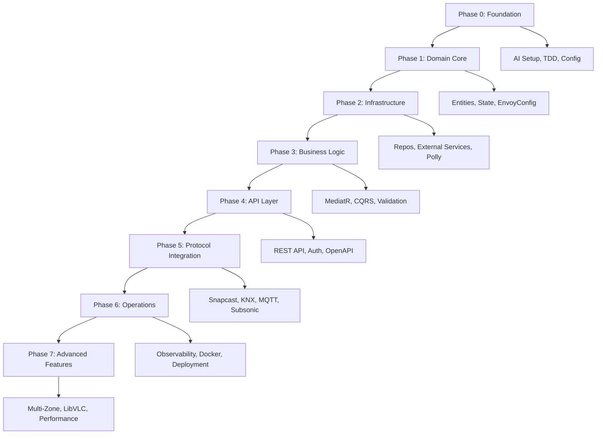

# Implementation Overview & Strategy

## Executive Summary

This document outlines the complete implementation strategy for SnapDog - a production-ready, multi-room audio streaming system. Built upon 20+ comprehensive blueprint documents, this strategy leverages AI-human collaboration to deliver an award-worthy software system that meets the highest standards of code quality, architectural integrity, and operational excellence.

## Project Vision & Scope

### Core Mission

Transform multi-room audio streaming by providing a comprehensive solution that seamlessly integrates with existing home automation and audio infrastructure while maintaining professional-grade reliability and performance.

### Key Capabilities

- **Multi-Protocol Integration**: Snapcast server control, KNX building automation, MQTT smart home systems, Subsonic music servers
- **Real-Time Audio Processing**: Low-latency streaming with LibVLC media player integration
- **Production-Grade Architecture**: Layered design with comprehensive observability, fault tolerance, and security
- **Container-First Deployment**: Docker-based infrastructure with complete monitoring and alerting

## Implementation Philosophy

### Test-Driven Excellence

Every feature begins with failing tests, ensuring robust quality gates and 90%+ code coverage across all components.

### AI-Enhanced Development

Structured AI collaboration templates accelerate development while maintaining strict architectural consistency and code quality standards.

### Incremental Value Delivery

Eight distinct phases, each culminating in a fully functional, tested system that builds incrementally toward the complete solution.

### Production-First Mindset

Full observability with OpenTelemetry, comprehensive error handling, security implementation, and scalable deployment from day one.

## 8-Phase Implementation Strategy

### Phase Overview

### Phase 0: Foundation & AI Setup

**Objective**: Establish development environment, AI collaboration framework, and TDD infrastructure
**Deliverable**: Console application that loads and validates configuration
**Key Components**:

- AI collaboration templates and context management
- Test infrastructure setup with xUnit and Moq
- EnvoyConfig integration for environment-based configuration
- Basic project structure following blueprint architecture

### Phase 1: Core Domain & Configuration

**Objective**: Implement all domain entities, value objects, and state management
**Deliverable**: Domain-rich console application with complete configuration system
**Key Components**:

- Domain entities (AudioStream, Client, Zone, etc.)
- Value objects and enumerations
- State management with immutable records
- Configuration validation and error handling

### Phase 2: Infrastructure & External Services

**Objective**: Build infrastructure layer with repository pattern and fault tolerance
**Deliverable**: Service-integrated application with external system abstractions
**Key Components**:

- Repository implementations with proper abstractions
- Polly-based fault tolerance policies
- External service client interfaces

### Phase 3: Server Layer & Business Logic

**Objective**: Implement complete MediatR CQRS pattern with business logic
**Deliverable**: Business logic application with command/query processing
**Key Components**:

- All MediatR command and query handlers
- Business rule validation with FluentValidation
- Domain event system implementation
- Cross-cutting concerns with pipeline behaviors

### Phase 4: API Layer & Security

**Objective**: Build complete REST API with authentication and documentation
**Deliverable**: Full REST API with security and OpenAPI documentation
**Key Components**:

- RESTful API controllers following OpenAPI specification
- Authentication and authorization implementation
- Comprehensive API documentation with Swagger
- Request/response validation and error handling

### Phase 5: Integration & Protocols

**Objective**: Integrate all external protocols and services
**Deliverable**: Multi-protocol system with real external integrations
**Key Components**:

- Snapcast server integration with RPC calls
- KNX protocol implementation with DPT mappings
- MQTT command framework with topic management
- Subsonic API integration for music streaming

### Phase 6: Observability & Operations

**Objective**: Implement production-grade observability and deployment
**Deliverable**: Production-ready system with full monitoring
**Key Components**:

- Complete OpenTelemetry integration (traces, metrics, logs)
- Docker infrastructure with compose orchestration
- Production deployment configuration
- Monitoring, alerting, and health checks

### Phase 7: Advanced Features & Optimization

**Objective**: Complete system with advanced audio features and optimization
**Deliverable**: Full SnapDog system with all advanced capabilities
**Key Components**:

- Multi-zone audio logic with client mapping
- LibVLC media player integration with FIFO pipes
- Performance optimization for real-time audio
- Advanced error handling and recovery

## AI-Human Collaboration Framework

### Structured Prompting System

Each implementation phase includes specific AI collaboration templates designed for:

- **Domain-Specific Context**: Audio streaming, real-time processing, protocol integration
- **Architecture Compliance**: Validation against blueprint specifications
- **Code Quality**: Consistent with established coding standards
- **Testing Strategy**: TDD approach with comprehensive test coverage

### Context Management

- **Blueprint Integration**: All 20+ documents integrated into AI context templates
- **Progressive Context Building**: Systematic approach for large codebase development
- **Quality Gates**: Automated validation against architectural decisions

### AI Collaboration Patterns

- **Iterative Refinement**: Start simple, progressively add complexity
- **Test-First Development**: AI assists in creating tests before implementation
- **Code Review Partnership**: AI as collaborative reviewer for quality assurance
- **Documentation Generation**: Automated documentation from code and comments

## Quality Assurance Framework

### Testing Strategy

- **Unit Tests**: 90%+ coverage with comprehensive edge case testing
- **Integration Tests**: external service, and cross-layer testing
- **End-to-End Tests**: Complete workflow validation with real protocols
- **Performance Tests**: Real-time audio processing benchmarks

### Code Quality Standards

- **Architectural Compliance**: Validation against blueprint specifications
- **Code Standards**: Consistent with established coding conventions
- **Security Implementation**: Comprehensive threat modeling and mitigation
- **Performance Requirements**: Real-time audio processing constraints

### Validation Gates

- **Phase Completion**: Working system with all tests passing
- **Architecture Review**: Compliance with layered architecture principles
- **Performance Benchmarks**: Meeting real-time audio streaming requirements
- **Security Audit**: Comprehensive security review and testing

## Technology Stack Integration

### Core Technologies

- **.NET 9**: Latest framework with performance optimizations
- **ASP.NET Core**: Web API with built-in dependency injection
- **MediatR**: CQRS implementation with pipeline behaviors
- **FluentValidation**: Comprehensive input validation
- **Polly**: Resilience and fault tolerance policies

### External Integrations

- **Snapcast**: Sturd.SnapcastNet library for server communication
- **KNX**: Knx.Falcon.Sdk for building automation integration
- **MQTT**: MQTTnet for smart home system communication
- **Subsonic**: SubSonicMedia for music server integration
- **LibVLC**: LibVLCSharp for audio processing and streaming

### Infrastructure & Operations

- **Docker**: Containerized deployment with compose orchestration
- **OpenTelemetry**: Distributed tracing, metrics, and logging
- **Prometheus**: Metrics collection and alerting
- **Jaeger**: Distributed tracing backend
- **Entity Framework Core**: Database abstraction and migrations

## Success Metrics & Validation

### Technical Excellence

- **Code Coverage**: Minimum 90% line coverage, 95% branch coverage
- **Performance**: Audio processing latency < 10ms, API response < 100ms
- **Reliability**: 99.9% uptime with comprehensive error handling
- **Security**: Zero critical vulnerabilities, comprehensive authentication

### Architectural Integrity

- **Blueprint Compliance**: 100% alignment with architectural decisions
- **Layer Separation**: Clean boundaries between all architectural layers
- **Dependency Management**: Proper inversion of control throughout
- **Testability**: All components fully unit testable

### Operational Excellence

- **Observability**: Complete visibility into system behavior
- **Deployment**: Automated, reproducible deployment process
- **Monitoring**: Proactive alerting on system health and performance
- **Documentation**: Comprehensive, up-to-date technical documentation

## Risk Mitigation

### Technical Risks

- **Real-Time Performance**: Comprehensive performance testing throughout development
- **Protocol Complexity**: Incremental integration with extensive testing
- **External Dependencies**: Robust fault tolerance and circuit breaker patterns
- **State Management**: Immutable state with comprehensive validation

### Implementation Risks

- **Scope Creep**: Strict phase boundaries with clear deliverables
- **Quality Degradation**: Continuous testing and validation at each phase
- **Architecture Drift**: Regular compliance validation against blueprint
- **Performance Regression**: Continuous performance monitoring and benchmarking

## Getting Started

### Prerequisites

- Development environment setup per Blueprint 15
- Understanding of all blueprint documents
- AI collaboration tools configured
- Testing infrastructure prepared

### Initial Steps

1. **Review Complete Strategy**: Understand all phases and their interdependencies
2. **Setup Development Environment**: Configure tools, IDE, and infrastructure
3. **Establish AI Collaboration**: Configure templates and context management
4. **Begin Phase 0**: Start with foundation and AI setup
5. **Follow Sequential Progression**: Complete each phase before advancing

This comprehensive strategy provides the foundation for transforming the SnapDog blueprint into a production-ready, award-worthy software system through effective AI-human collaboration.
